# Lesson 01: Introduction to Python

## Table of Contents
1. [Python Overview](#python-overview)
2. [Python in Agentic AI](#python-in-agentic-ai)
3. [Practical Applications](#practical-applications)
4. [Code Execution Continuum](#code-execution-continuum)
5. [Python Bytecode](#python-bytecode)
6. [Indentation in Python](#indentation-in-python)
7. [Dynamic Typing](#dynamic-typing)
8. [Useful Links](#useful-links)

---

## Python Overview

### Theory
Python is a high-level, interpreted, and versatile programming language known for its simplicity and readability. Created by Guido van Rossum, it emphasizes code clarity and supports multiple programming paradigms like procedural, object-oriented, and functional programming. Python's extensive standard library and community support make it ideal for web development, data analysis, AI, automation, and more. Its cross-platform compatibility and beginner-friendly syntax have made it one of the most popular languages worldwide.

### Python Language Characteristics Diagram
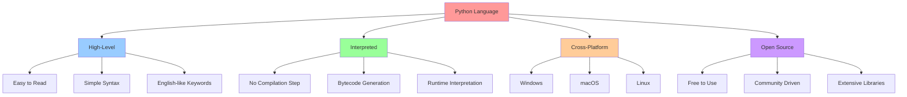

### Programming Paradigms Support
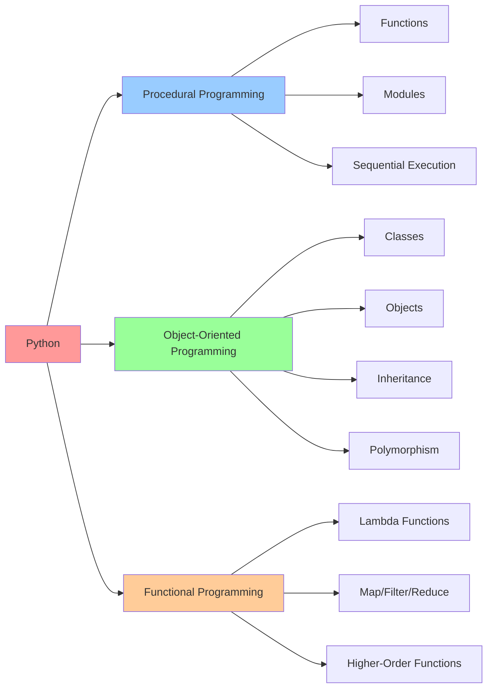

---

## Python in Agentic AI

### Theory
Python plays a crucial role in Agentic AI, enabling autonomous agents to perceive, reason, and act. With frameworks like LangChain, CrewAI, Microsoft AutoGen, Auto-GPT, and OpenAI's APIs, Python facilitates LLM-driven workflows, decision-making, and self-improving AI. Its rich ecosystem supports seamless integration of NLP (Natural Language Processing), reinforcement learning, and automation for building intelligent, agentic systems.

### Agentic AI Architecture with Python
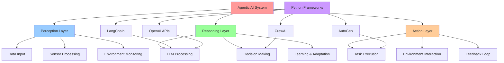

### Python AI Ecosystem
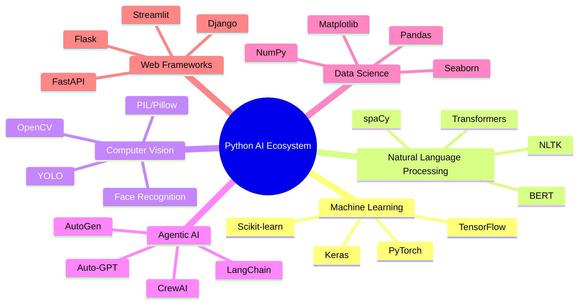

---

## Practical Applications

### Theory
Python has numerous practical applications across various industries. The language's versatility and extensive library ecosystem make it suitable for a wide range of domains, from data science and web development to artificial intelligence and automation.

### Python Applications Overview
```mermaid
graph TD
    A[Python Applications] --> B[Data Science & Analytics]
    A --> C[Web Development]
    A --> D[Artificial Intelligence]
    A --> E[Automation & Scripting]
    A --> F[Game Development]
    A --> G[Desktop Applications]
    
    B --> B1[Data Analysis]
    B --> B2[Machine Learning]
    B --> B3[Data Visualization]
    B --> B4[Statistical Computing]
    
    C --> C1[Backend Development]
    C --> C2[API Development]
    C --> C3[Web Scraping]
    C --> C4[Full-Stack Applications]
    
    D --> D1[Natural Language Processing]
    D --> D2[Computer Vision]
    D --> D3[Deep Learning]
    D --> D4[Robotics]
    
    E --> E1[System Administration]
    E --> E2[Task Automation]
    E --> E3[DevOps Tools]
    E --> E4[Testing Frameworks]
    
    F --> F1[2D Games]
    F --> F2[Game Prototyping]
    F --> F3[Game AI]
    
    G --> G1[GUI Applications]
    G --> G2[Cross-Platform Apps]
    G --> G3[Productivity Tools]
    
    style A fill:#ff9999
    style B fill:#99ccff
    style C fill:#99ff99
    style D fill:#ffcc99
    style E fill:#cc99ff
    style F fill:#ff99cc
    style G fill:#99ffcc
```

### Industry Applications
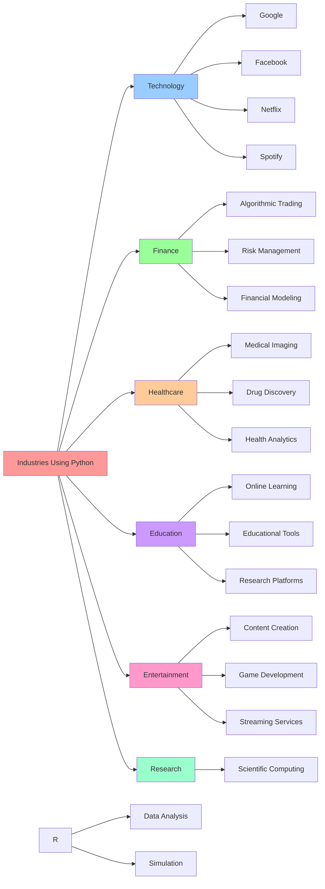

---

## Code Execution Continuum

### Theory
The code execution continuum represents the journey from writing source code to producing output. This process involves multiple stages including compilation, interpretation, and execution, each playing a crucial role in transforming human-readable code into machine-executable instructions.

### Code Execution Flow
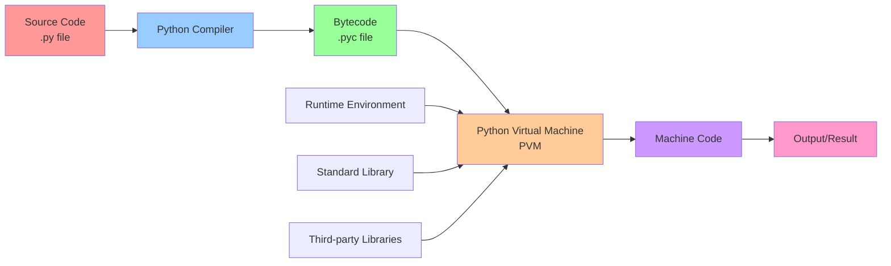

### Detailed Execution Process
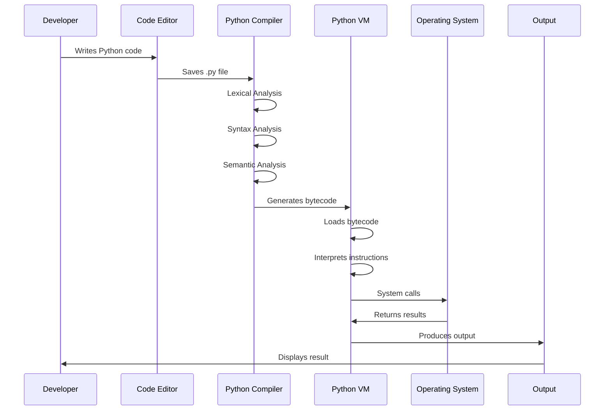

---

## Python Bytecode

### Theory
Python bytecode is the intermediate representation of Python code that is generated by the Python compiler. When you write Python code, it is first compiled into bytecode, which is then executed by the Python interpreter. Bytecode serves as a platform-independent representation that can be executed on any system with a compatible Python interpreter.

### Bytecode Generation Process
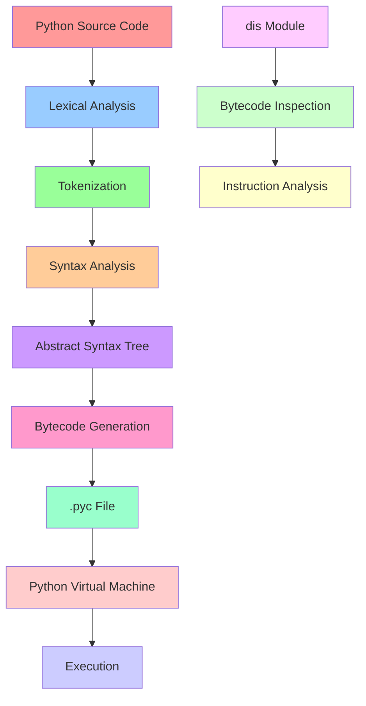

### Bytecode Characteristics
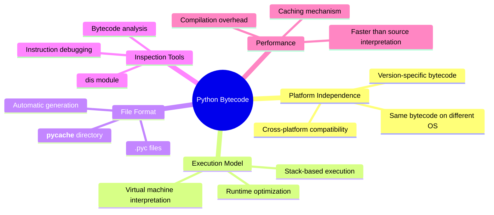

### Bytecode vs Machine Code
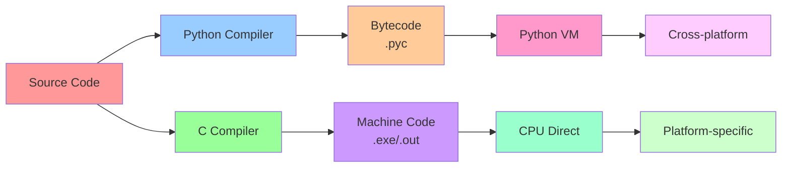

---

## Indentation in Python

### Theory
Indentation in Python is not just a matter of style—it's a fundamental part of the language syntax. Python uses indentation to define code blocks, making it unique among programming languages. This approach enforces clean, readable code and eliminates the need for braces or other delimiters to define code blocks.

### Indentation Rules and Structure
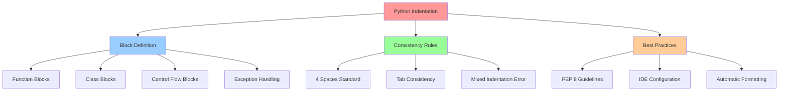

### Indentation Levels Example
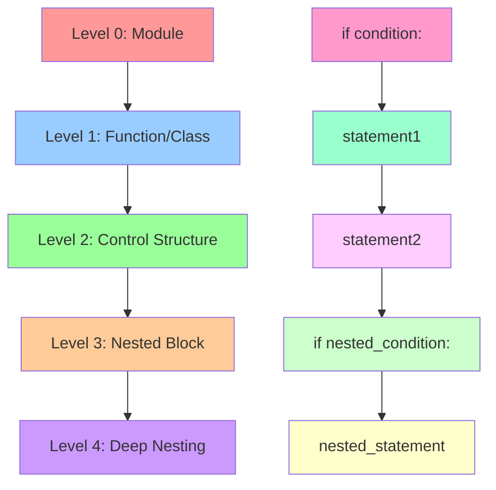

### Indentation Error Types
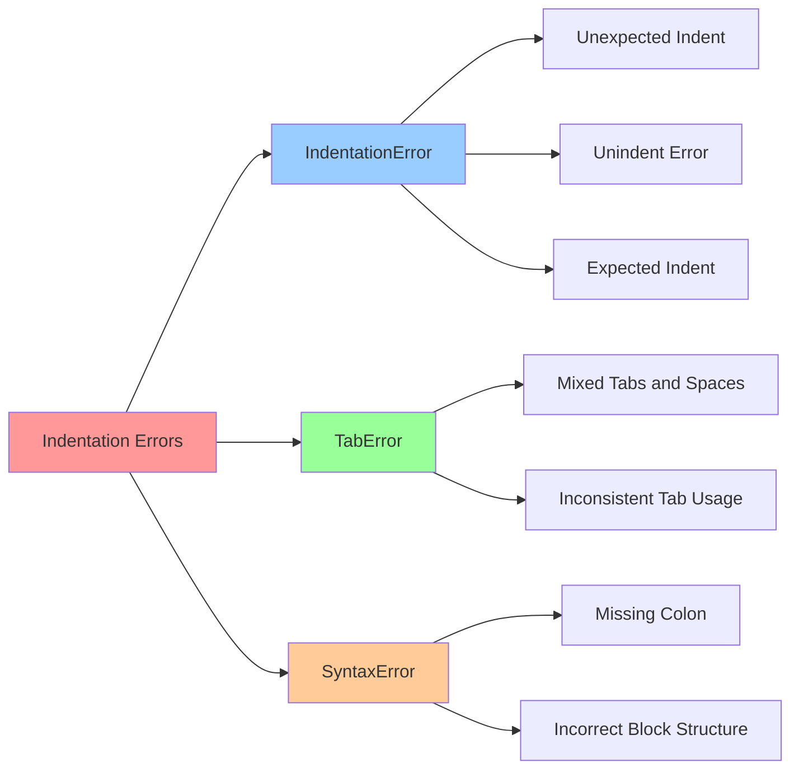

---

## Dynamic Typing

### Theory
Python is a dynamically-typed language, which means that it does not enforce the data type of a variable at compile time. Instead, the data type is determined at runtime. This provides flexibility but also requires careful attention to type handling. Python also supports optional type hinting for better code documentation and IDE support.

### Dynamic Typing vs Static Typing
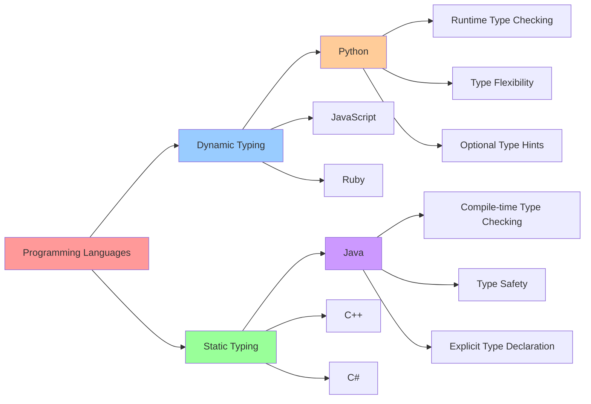

### Python Type System Evolution
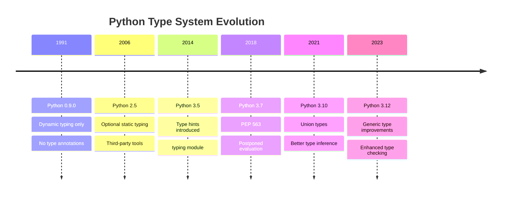

### Type Hinting in Python
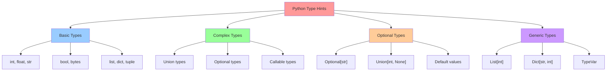

### Type Checking Tools
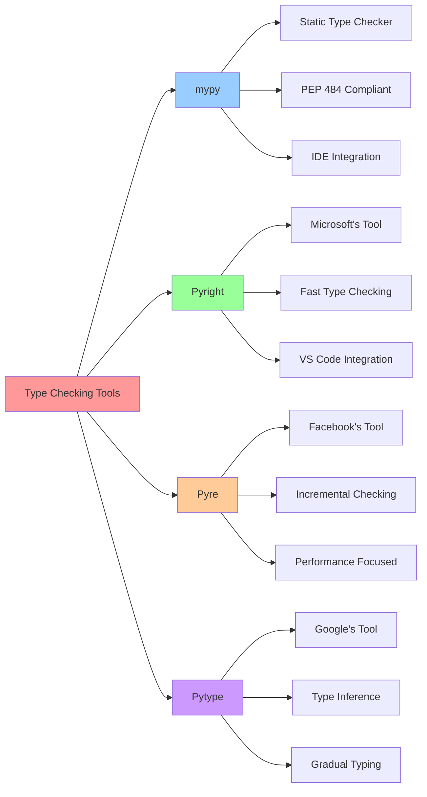

---

## Useful Links

### Essential Python Resources
- [Download Python](https://www.python.org/downloads/)
- [Python 3.13.2 documentation](https://docs.python.org/3/index.html)
- [W3Schools Python Tutorial](https://www.w3schools.com/python/default.asp)
- [TutorialsPoint Python Guide](https://www.tutorialspoint.com/python/index.htm)

### Development Environments
- [Visual Studio Code](https://code.visualstudio.com/download)
- [Cursor IDE](https://www.cursor.com/downloads)
- [PyCharm](https://www.jetbrains.com/pycharm/)
- [Jupyter Notebook](https://jupyter.org/)

### Learning Resources
- [Python.org Tutorial](https://docs.python.org/3/tutorial/)
- [Real Python](https://realpython.com/)
- [Python for Beginners](https://www.pythonforbeginners.com/)
- [Codecademy Python Course](https://www.codecademy.com/learn/learn-python-3)

### Community and Support
- [Python Discord](https://pythondiscord.com/)
- [Stack Overflow Python Tag](https://stackoverflow.com/questions/tagged/python)
- [Reddit r/Python](https://www.reddit.com/r/Python/)
- [Python Weekly Newsletter](https://www.pythonweekly.com/)

---

## Summary

This lesson provides a comprehensive introduction to Python, covering its fundamental characteristics, role in modern AI applications, practical uses, and technical aspects like bytecode execution and dynamic typing. The diagrams and explanations help visualize complex concepts and provide a solid foundation for further Python learning.

### Key Takeaways
1. **Python's Versatility**: High-level, interpreted language with multiple programming paradigms
2. **AI Integration**: Essential role in Agentic AI and modern AI applications
3. **Wide Applications**: From web development to data science and automation
4. **Technical Foundation**: Understanding bytecode, indentation, and dynamic typing
5. **Learning Path**: Comprehensive resources and tools for continued learning

---

*Author: Arif Kasim Rozani - (Team Operation Badar)*
