# Lesson 02: Data Types

## Table of Contents
1. [Introduction to Data Types](#introduction-to-data-types)
2. [Numeric Types](#numeric-types)
3. [Boolean Type](#boolean-type)
4. [Sequence Types](#sequence-types)
5. [Set Types](#set-types)
6. [Mapping Type](#mapping-type)
7. [Binary Types](#binary-types)
8. [Number Systems](#number-systems)
9. [Type Checking and Conversion](#type-checking-and-conversion)
10. [Useful Links](#useful-links)

---

## Introduction to Data Types

### Theory
Data types determine the type of value a variable can hold and the operations that can be performed on it. They define the format, structure, size, range, and behavior of data, controlling how it's stored and used in a program. This helps ensure data is used correctly and efficiently, providing type safety and enabling the Python interpreter to optimize memory usage and operations.

### Python Data Types Overview
```mermaid
graph TD
    A["Python Data Types"] --> B["Numeric Types"]
    A --> C["Boolean Type"]
    A --> D["Sequence Types"]
    A --> E["Set Types"]
    A --> F["Mapping Type"]
    A --> G["Binary Types"]
    
    B --> B1["int - Integer"]
    B --> B2["float - Floating Point"]
    B --> B3["complex - Complex Number"]
    
    C --> C1["bool - True/False"]
    
    D --> D1["str - String"]
    D --> D2["list - Mutable List"]
    D --> D3["tuple - Immutable Tuple"]
    D --> D4["range - Number Range"]
    
    E --> E1["set - Mutable Set"]
    E --> E2["frozenset - Immutable Set"]
    
    F --> F1["dict - Dictionary"]
    
    G --> G1["bytes - Immutable Bytes"]
    G --> G2["bytearray - Mutable Bytes"]
    G --> G3["memoryview - Memory View"]
    
    style A fill:#ff9999
    style B fill:#99ccff
    style C fill:#99ff99
    style D fill:#ffcc99
    style E fill:#cc99ff
    style F fill:#ff99cc
    style G fill:#99ffcc
```

**Diagram Explanation**: This hierarchical diagram shows the complete taxonomy of Python's built-in data types. The root node represents all Python data types, which are then categorized into six main groups. Each category contains specific data types with their key characteristics. The color coding helps distinguish between different categories, making it easy to understand the relationships and groupings of Python's data type system.

### Data Type Characteristics
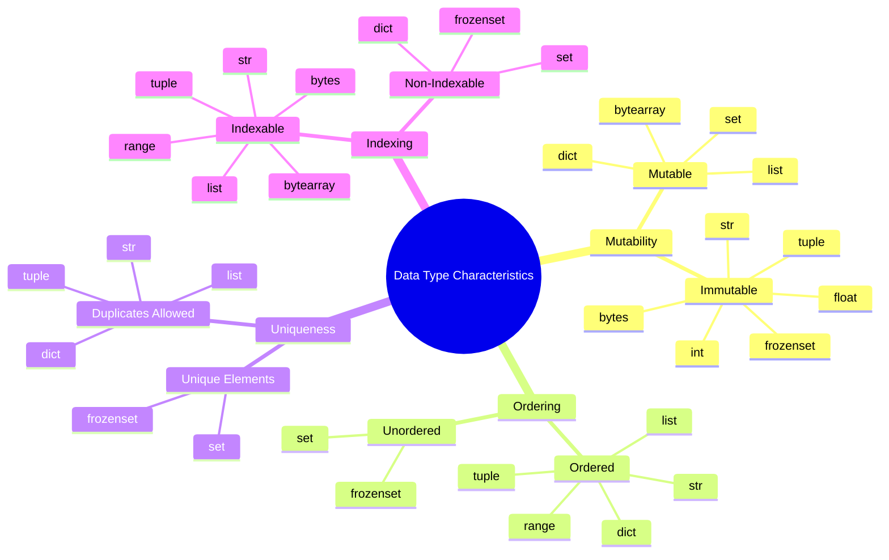

**Diagram Explanation**: This mind map categorizes Python data types based on four key characteristics that determine their behavior and usage. **Mutability** shows which types can be modified after creation (mutable) versus those that cannot (immutable). **Ordering** indicates whether elements maintain their insertion order. **Uniqueness** shows which types enforce unique elements versus allowing duplicates. **Indexing** reveals which types support accessing elements by position. Understanding these characteristics helps you choose the right data type for your specific needs.

---

## Numeric Types

### Theory
Python provides three main numeric types to handle different kinds of numbers. These types support various mathematical operations and are essential for calculations, scientific computing, and data analysis. Each numeric type has specific characteristics regarding precision, range, and use cases.

### Numeric Types Overview
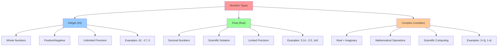

**Diagram Explanation**: This diagram illustrates the three main numeric types in Python and their key characteristics. **Integers** represent whole numbers with unlimited precision, making them ideal for counting and exact calculations. **Floats** handle decimal numbers with limited precision, suitable for scientific calculations and approximations. **Complex numbers** combine real and imaginary parts, essential for advanced mathematical and scientific computing. Each type has specific use cases and limitations that determine when to use them.

### Integer Type Details
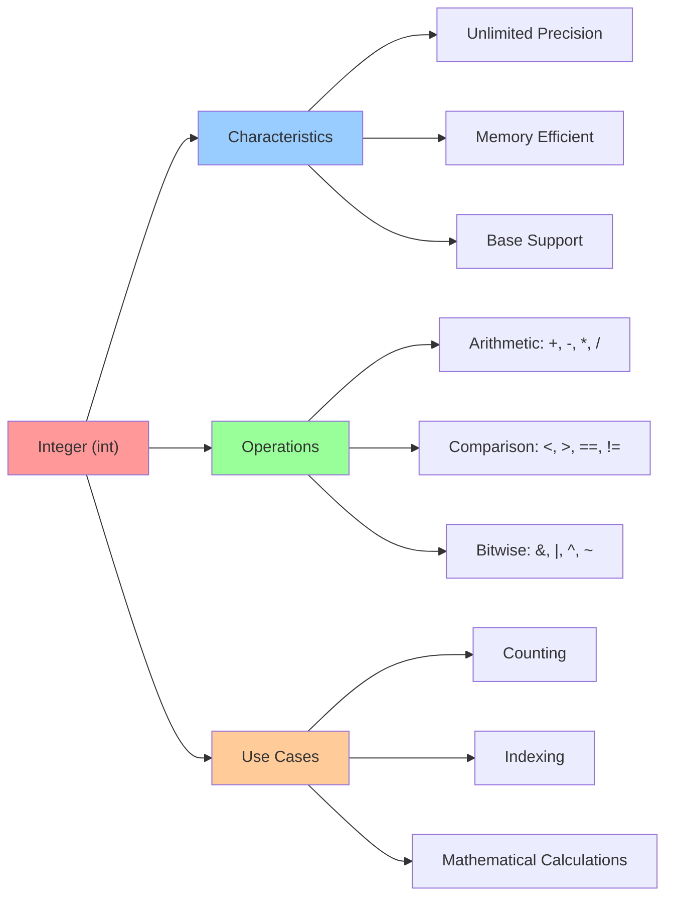

**Diagram Explanation**: This diagram breaks down the integer type into three key aspects. **Characteristics** highlight Python's unique unlimited precision for integers, unlike many other languages that have fixed-size integers. **Operations** show the mathematical and logical operations you can perform on integers, including bitwise operations for low-level programming. **Use Cases** demonstrate the practical applications of integers in programming, from simple counting to complex mathematical computations.

### Float Type Details
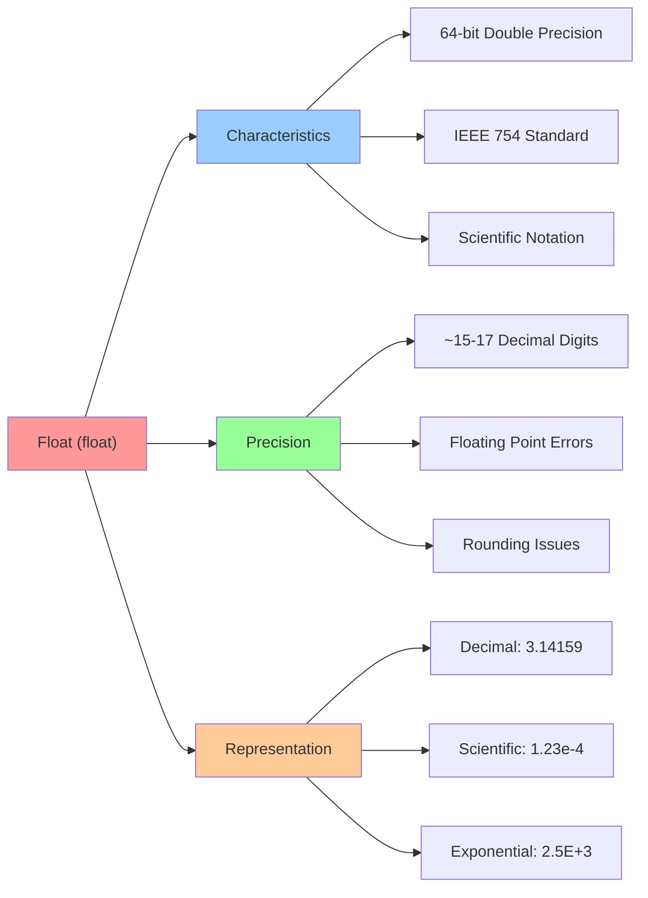

**Diagram Explanation**: This diagram explains the float type's technical specifications and limitations. **Characteristics** show that Python uses the IEEE 754 standard for 64-bit double precision floating-point numbers, which is the industry standard. **Precision** highlights the important limitation that floats have finite precision (~15-17 decimal digits) and can introduce rounding errors, which is crucial to understand for financial calculations. **Representation** shows the different ways you can write float literals in Python, from simple decimals to scientific notation.

### Complex Number Details
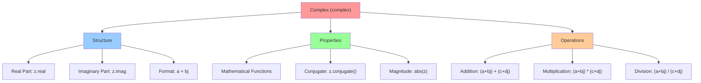

**Diagram Explanation**: This diagram explains complex numbers in Python, which are essential for advanced mathematical and scientific computing. **Structure** shows how complex numbers are composed of real and imaginary parts, accessible through `.real` and `.imag` attributes. **Properties** highlight built-in mathematical functions like conjugate and magnitude calculations. **Operations** demonstrate how complex arithmetic works, following standard mathematical rules for complex number algebra. Note that Python uses 'j' instead of 'i' for the imaginary unit.

---

## Boolean Type

### Theory
The Boolean type in Python represents truth values and is fundamental to control flow and logical operations. It has only two possible values: `True` and `False`. Booleans are essential for conditional statements, loops, and logical operations that control program execution.

### Boolean Type Overview
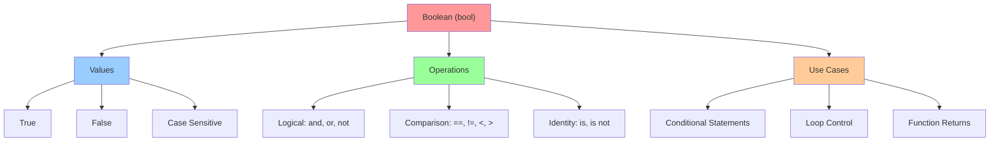

**Diagram Explanation**: This diagram shows the fundamental Boolean type in Python, which is the foundation of all logical operations and control flow. **Values** emphasizes that Python has exactly two Boolean values: `True` and `False` (case-sensitive). **Operations** categorizes the three types of operations you can perform: logical operations for combining Boolean values, comparison operations for evaluating conditions, and identity operations for checking object identity. **Use Cases** demonstrates the critical role Booleans play in controlling program flow through conditionals, loops, and function returns.

### Boolean Operations
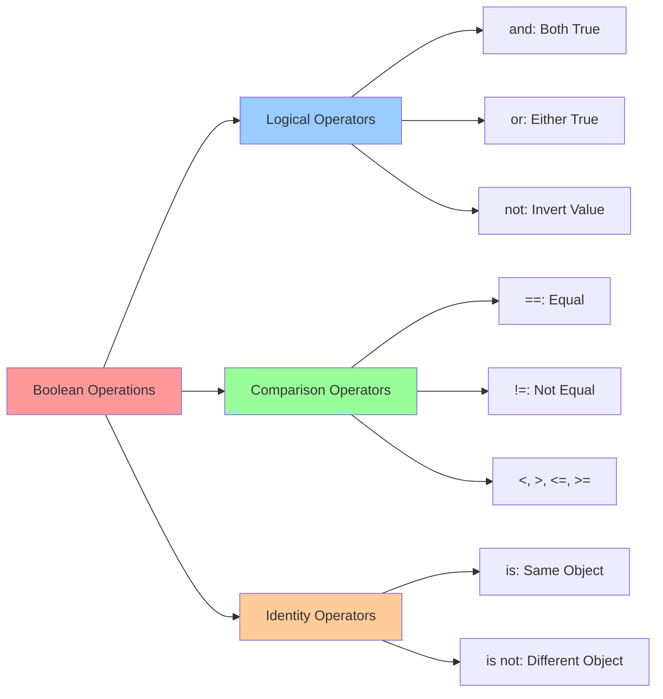

**Diagram Explanation**: This diagram categorizes the different types of Boolean operations in Python. **Logical Operators** (`and`, `or`, `not`) are used to combine and manipulate Boolean values, following standard logical rules. **Comparison Operators** evaluate relationships between values and return Boolean results. **Identity Operators** (`is`, `is not`) check if two variables refer to the same object in memory, which is different from equality comparison. Understanding these distinctions is crucial for writing correct conditional logic.

---

## Sequence Types

### Theory
Sequence types in Python are ordered collections that can contain multiple items. They support indexing, slicing, and iteration. Python provides several built-in sequence types, each with different characteristics regarding mutability and use cases.

### Sequence Types Overview
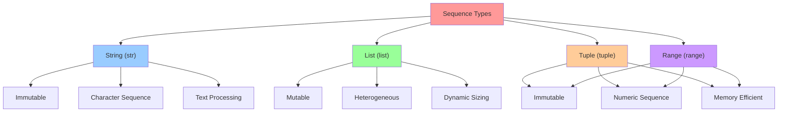

**Diagram Explanation**: This diagram shows the four main sequence types in Python, each with distinct characteristics. **Strings** are immutable sequences of characters, perfect for text processing. **Lists** are mutable, heterogeneous collections that can grow and shrink dynamically. **Tuples** are immutable, heterogeneous collections with fixed size, ideal for representing records or coordinates. **Ranges** are immutable, memory-efficient sequences of numbers, commonly used in loops. The key distinction is mutability: strings, tuples, and ranges cannot be modified after creation, while lists can be changed.

### String Type Details
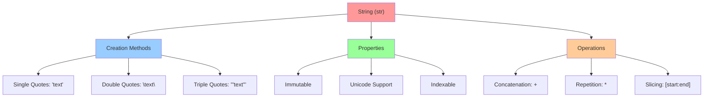

**Diagram Explanation**: This diagram breaks down the string type into its key aspects. **Creation Methods** show the three ways to create string literals in Python, each useful for different scenarios (single quotes for simple text, double quotes when the text contains single quotes, triple quotes for multi-line strings). **Properties** highlight that strings are immutable (cannot be changed after creation), support Unicode for international characters, and are indexable (you can access individual characters by position). **Operations** demonstrate the basic string operations: concatenation for joining strings, repetition for creating multiple copies, and slicing for extracting substrings.

### List vs Tuple Comparison
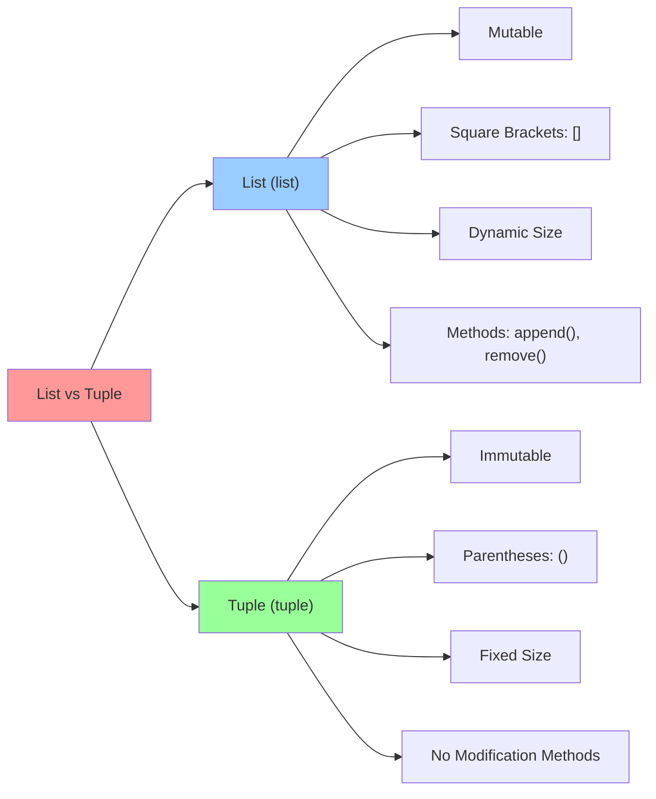

**Diagram Explanation**: This side-by-side comparison highlights the key differences between lists and tuples, which are often confused by beginners. **Lists** are mutable (can be changed after creation), use square brackets for syntax, can grow and shrink dynamically, and have methods for modification. **Tuples** are immutable (cannot be changed after creation), use parentheses for syntax, have fixed size, and lack modification methods. The choice between them depends on whether you need to modify the collection: use lists for dynamic data that changes, and tuples for fixed data that shouldn't change (like coordinates or database records).

---

## Set Types

### Theory
Set types in Python represent unordered collections of unique elements. They are useful for mathematical set operations, removing duplicates, and testing membership. Python provides both mutable (`set`) and immutable (`frozenset`) versions.

### Set Types Overview
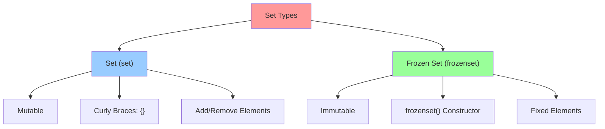

**Diagram Explanation**: This diagram shows the two set types in Python, both designed for collections of unique elements. **Sets** are mutable collections that can be modified after creation, use curly braces for syntax (like dictionaries but without key-value pairs), and support adding/removing elements. **Frozen sets** are immutable versions of sets, created using the `frozenset()` constructor, and cannot be modified after creation. Both types automatically eliminate duplicates and are unordered, making them perfect for mathematical set operations and membership testing.

### Set Operations
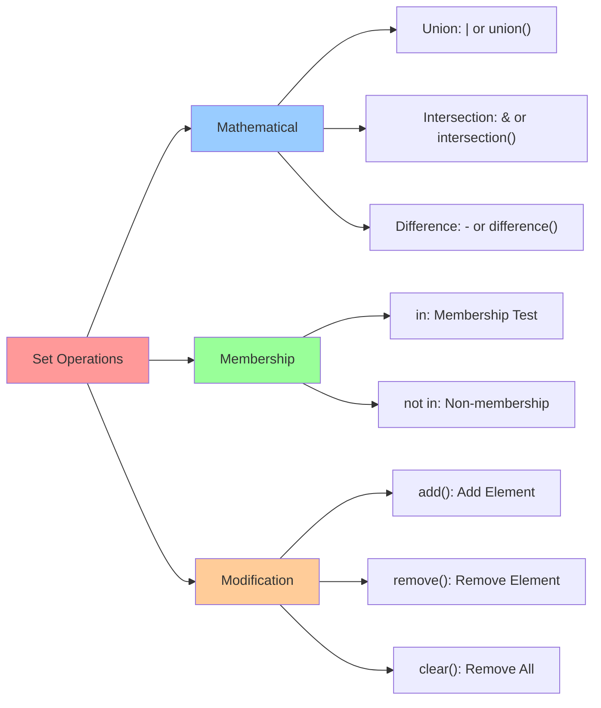

**Diagram Explanation**: This diagram categorizes the operations you can perform on sets in Python. **Mathematical Operations** include union (combining sets), intersection (finding common elements), and difference (finding elements in one set but not another). These operations can be performed using either operators (`|`, `&`, `-`) or methods (`union()`, `intersection()`, `difference()`). **Membership Operations** test whether an element belongs to a set using `in` and `not in` operators. **Modification Operations** are only available for mutable sets and include adding elements, removing elements, and clearing the entire set.

---

## Mapping Type

### Theory
The mapping type in Python is represented by dictionaries (`dict`), which store key-value pairs. Dictionaries are mutable, unordered collections that provide fast lookup, insertion, and deletion operations. They are essential for representing structured data and implementing hash tables.

### Dictionary Type Details
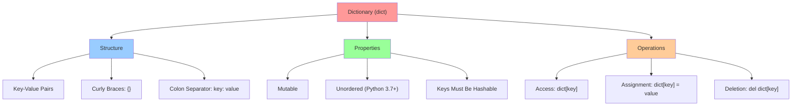

**Diagram Explanation**: This diagram explains the dictionary type, which is Python's implementation of hash tables. **Structure** shows that dictionaries store key-value pairs using curly braces and colon separators. **Properties** highlight that dictionaries are mutable (can be changed after creation), maintain insertion order since Python 3.7, and require keys to be hashable (immutable types like strings, numbers, and tuples). **Operations** demonstrate the basic dictionary operations: accessing values by key, assigning new key-value pairs, and deleting entries. Dictionaries are essential for representing structured data and providing fast lookup operations.

### Dictionary Methods
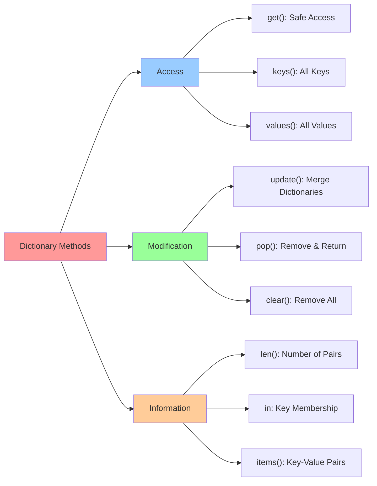

**Diagram Explanation**: This diagram categorizes the built-in methods and operations available for dictionaries. **Access Methods** include `get()` for safe key access (returns None if key doesn't exist), `keys()` for getting all keys, and `values()` for getting all values. **Modification Methods** include `update()` for merging dictionaries, `pop()` for removing and returning a key-value pair, and `clear()` for removing all entries. **Information Methods** include `len()` for counting key-value pairs, `in` operator for checking key membership, and `items()` for getting all key-value pairs as tuples. These methods make dictionaries very powerful for data manipulation.

---

## Binary Types

### Theory
Binary types in Python handle raw binary data, which is essential for file I/O, network communication, and working with non-text data. Python provides three binary types: `bytes` (immutable), `bytearray` (mutable), and `memoryview` (memory-efficient access).

### Binary Types Overview
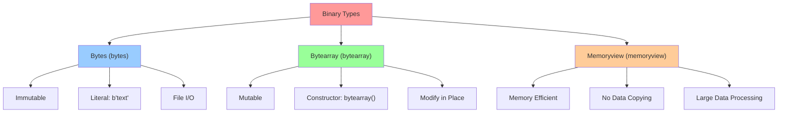

**Diagram Explanation**: This diagram shows the three binary types in Python for handling raw binary data. **Bytes** are immutable sequences of bytes, created using the `b'text'` literal syntax, and are commonly used for file I/O operations. **Bytearray** are mutable versions of bytes, created using the `bytearray()` constructor, and can be modified in place. **Memoryview** provides a memory-efficient way to access binary data without copying it, making it ideal for processing large datasets. These types are essential for working with files, network protocols, and any data that isn't text-based.

### Binary Data Operations
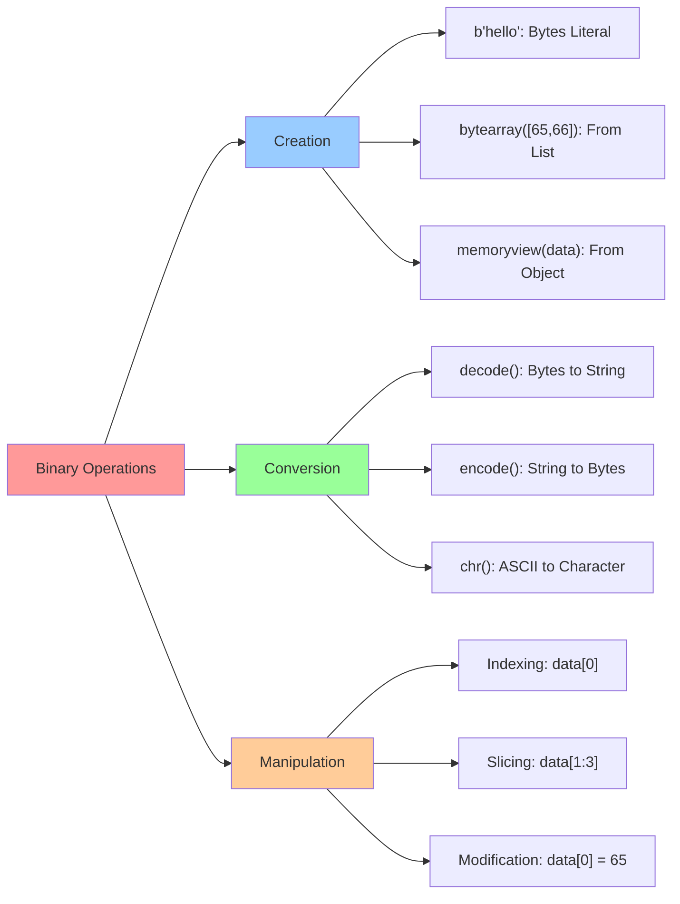

**Diagram Explanation**: This diagram shows the operations you can perform on binary data types. **Creation** demonstrates different ways to create binary objects: bytes literals, bytearray from lists, and memoryview from existing objects. **Conversion** shows how to convert between binary data and text using `decode()` and `encode()` methods, plus the `chr()` function for ASCII character conversion. **Manipulation** illustrates that binary types support indexing (accessing individual bytes), slicing (extracting byte ranges), and modification (for mutable types like bytearray). These operations are essential for working with binary files, network data, and encoding/decoding operations.

---

## Number Systems

### Theory
Number systems are fundamental to understanding how computers represent and process data. Different number systems (binary, decimal, hexadecimal, octal) are used in various computing contexts, from low-level programming to data representation.

### Number Systems Overview
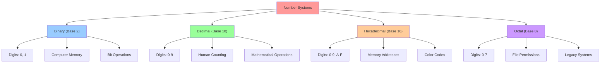

**Diagram Explanation**: This diagram shows the four main number systems used in computing and programming. **Binary (Base 2)** uses only 0 and 1, representing the fundamental language of computers and memory storage. **Decimal (Base 10)** is the familiar human counting system using digits 0-9. **Hexadecimal (Base 16)** uses digits 0-9 and letters A-F, commonly used for memory addresses and color codes. **Octal (Base 8)** uses digits 0-7, historically used for file permissions and legacy systems. Understanding these number systems is crucial for low-level programming, debugging, and working with binary data.

### Number System Conversions
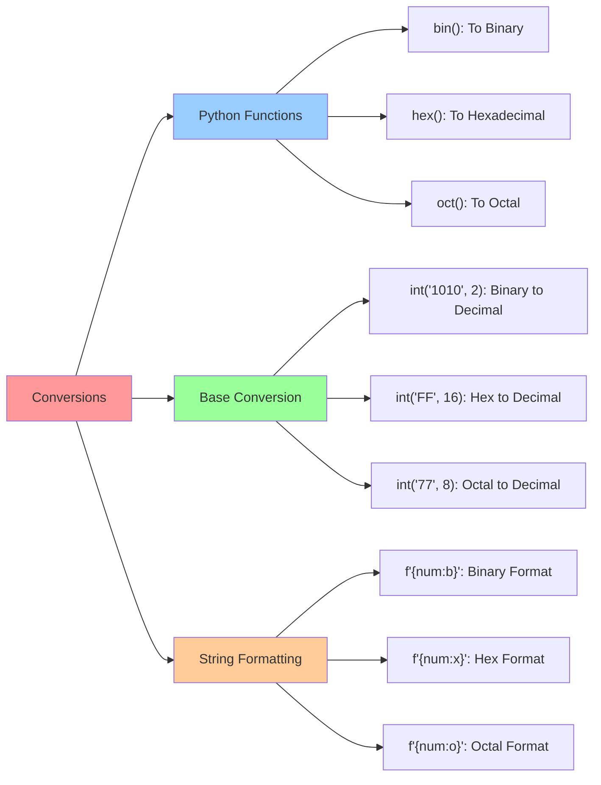

**Diagram Explanation**: This diagram shows the different ways to convert between number systems in Python. **Python Functions** (`bin()`, `hex()`, `oct()`) convert decimal numbers to their string representations in other bases. **Base Conversion** using `int()` with a base parameter converts string representations of numbers in any base back to decimal integers. **String Formatting** using f-strings with format specifiers (`:b`, `:x`, `:o`) provides a modern way to format numbers in different bases. These conversion methods are essential for working with binary data, memory addresses, and debugging low-level operations.

### ASCII and Unicode
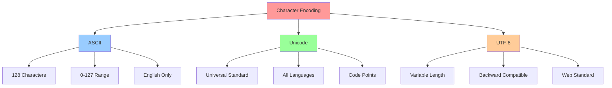

**Diagram Explanation**: This diagram explains the evolution of character encoding systems. **ASCII** is the original 7-bit encoding with 128 characters (0-127), limited to English letters, digits, and basic symbols. **Unicode** is the universal character encoding standard that supports all languages and scripts worldwide, using code points to represent characters. **UTF-8** is a variable-length encoding of Unicode that's backward compatible with ASCII and is the de facto standard for web and text processing. Understanding these encoding systems is crucial for handling international text and avoiding encoding-related bugs in your programs.

---

## Type Checking and Conversion

### Theory
Python's dynamic typing system allows variables to change types during runtime, but sometimes you need to explicitly convert between types or check the type of a variable. Understanding type checking and conversion is crucial for robust programming.

### Type Checking
```mermaid
graph TD
    A["Type Checking"] --> B["type() Function"]
    A --> C["isinstance() Function"]
    A --> D["Type Hints"]
    
    B --> B1["Returns Type Object"]
    B --> B2["Exact Type Match"]
    B --> B3["type(var) == int"]
    
    C --> C1["Inheritance Aware"]
    C --> C2["Multiple Types"]
    C --> C3["isinstance(var, (int, float))"]
    
    D --> D1["Static Type Hints"]
    D --> D2["IDE Support"]
    D --> D3["Documentation"]
    
    style A fill:#ff9999
    style B fill:#99ccff
    style C fill:#99ff99
    style D fill:#ffcc99
```

**Diagram Explanation**: This diagram shows the different approaches to type checking in Python. **type() Function** returns the exact type object and is used for precise type matching, but doesn't consider inheritance relationships. **isinstance() Function** is more flexible, considering inheritance (a subclass is considered an instance of its parent class) and allowing multiple type checking. **Type Hints** are annotations that provide static type information for better IDE support, documentation, and optional static type checking with tools like mypy. Understanding these different approaches helps you write more robust and maintainable code.

### Type Conversion
```mermaid
graph LR
    A["Type Conversion"] --> B["Implicit"]
    A --> C["Explicit"]
    A --> D["Functions"]
    
    B --> B1["Automatic Promotion"]
    B --> B2["int + float = float"]
    B --> B3["Safe Conversions"]
    
    C --> C1["Manual Conversion"]
    C --> C2["int(), float(), str()"]
    C --> C3["May Raise Errors"]
    
    D --> D1["int(): To Integer"]
    D --> D2["float(): To Float"]
    D --> D3["str(): To String"]
    D --> D4["list(): To List"]
    
    style A fill:#ff9999
    style B fill:#99ccff
    style C fill:#99ff99
    style D fill:#ffcc99
```

**Diagram Explanation**: This diagram shows the different ways Python handles type conversion. **Implicit Conversion** happens automatically when Python promotes types to maintain compatibility (e.g., int + float = float), and these conversions are generally safe. **Explicit Conversion** requires manual intervention using constructor functions like `int()`, `float()`, and `str()`, but may raise errors if the conversion isn't possible. **Functions** lists the main conversion functions available in Python for converting between different data types. Understanding when and how to use these conversions is essential for working with different data types and avoiding type-related errors.

### Type Conversion Examples
```mermaid
graph TD
    A["Conversion Examples"] --> B["Numeric Conversions"]
    A --> C["String Conversions"]
    A --> D["Collection Conversions"]
    
    B --> B1["int(3.14) → 3"]
    B --> B2["float(42) → 42.0"]
    B --> B3["complex(2, 3) → 2+3j"]
    
    C --> C1["str(123) → '123'"]
    C --> C2["int('456') → 456"]
    C --> C3["float('3.14') → 3.14"]
    
    D --> D1["list('hello') → ['h','e','l','l','o']"]
    D --> D2["tuple([1,2,3]) → (1,2,3)"]
    D --> D3["set([1,1,2,3]) → {1,2,3}"]
    
    style A fill:#ff9999
    style B fill:#99ccff
    style C fill:#99ff99
    style D fill:#ffcc99
```

**Diagram Explanation**: This diagram provides concrete examples of type conversions in Python, showing the input and expected output. **Numeric Conversions** demonstrate how to convert between different numeric types, including truncating floats to integers and creating complex numbers. **String Conversions** show how to convert between strings and numbers, which is common when processing user input or file data. **Collection Conversions** illustrate how to convert between different collection types, including converting strings to lists (character by character) and lists to tuples or sets (with automatic duplicate removal). These examples help you understand the practical applications of type conversion in real programming scenarios.

---

## Useful Links

### Essential Python Resources
- [Python 3.13.2 Documentation - Built-in Types](https://docs.python.org/3/library/stdtypes.html)
- [Python Data Types Tutorial](https://www.w3schools.com/python/python_datatypes.asp)
- [Real Python - Python Data Types](https://realpython.com/python-data-types/)

### Number Systems and Encoding
- [ASCII Table](https://www.ascii-code.com/)
- [Unicode Standard](https://unicode.org/)
- [UTF-8 Encoding](https://en.wikipedia.org/wiki/UTF-8)

### Type Checking and Validation
- [Python Type Hints](https://docs.python.org/3/library/typing.html)
- [mypy - Static Type Checker](https://mypy.readthedocs.io/)
- [Pydantic - Data Validation](https://pydantic-docs.helpmanual.io/)

### Learning Resources
- [Python.org Tutorial - Data Types](https://docs.python.org/3/tutorial/introduction.html#using-python-as-a-calculator)
- [Codecademy - Python Data Types](https://www.codecademy.com/learn/learn-python-3/modules/learn-python3-data-types)
- [Python for Beginners - Data Types](https://www.pythonforbeginners.com/basics/python-data-types)

---

## Summary

This lesson provides a comprehensive overview of Python's built-in data types, covering their characteristics, use cases, and operations. Understanding data types is fundamental to writing effective Python code and choosing the right data structure for your specific needs.

### Key Takeaways
1. **Numeric Types**: `int`, `float`, and `complex` for mathematical operations
2. **Boolean Type**: `bool` for logical operations and control flow
3. **Sequence Types**: `str`, `list`, `tuple`, and `range` for ordered collections
4. **Set Types**: `set` and `frozenset` for unique element collections
5. **Mapping Type**: `dict` for key-value pair storage
6. **Binary Types**: `bytes`, `bytearray`, and `memoryview` for binary data
7. **Type System**: Understanding mutability, ordering, and uniqueness
8. **Number Systems**: Binary, decimal, hexadecimal, and octal representations
9. **Type Operations**: Checking types and converting between them

### Best Practices
- Choose appropriate data types for your use case
- Understand mutability implications
- Use type hints for better code documentation
- Be aware of floating-point precision limitations
- Leverage set operations for unique element handling
- Use dictionaries for structured data representation

---

*Author: Arif Kasim Rozani - (Team Operation Badar)*
