# Lesson 02: Data Types

## Table of Contents
1. [Introduction to Data Types](#introduction-to-data-types)
2. [Numeric Types](#numeric-types)
3. [Boolean Type](#boolean-type)
4. [Sequence Types](#sequence-types)
5. [Set Types](#set-types)
6. [Mapping Type](#mapping-type)
7. [Binary Types](#binary-types)
8. [Number Systems](#number-systems)
9. [Type Checking and Conversion](#type-checking-and-conversion)
10. [Useful Links](#useful-links)

---

## Introduction to Data Types

### Theory
Data types determine the type of value a variable can hold and the operations that can be performed on it. They define the format, structure, size, range, and behavior of data, controlling how it's stored and used in a program. This helps ensure data is used correctly and efficiently, providing type safety and enabling the Python interpreter to optimize memory usage and operations.

### Python Data Types Overview
```mermaid
graph TD
    A["Python Data Types"] --> B["Numeric Types"]
    A --> C["Boolean Type"]
    A --> D["Sequence Types"]
    A --> E["Set Types"]
    A --> F["Mapping Type"]
    A --> G["Binary Types"]
    
    B --> B1["int - Integer"]
    B --> B2["float - Floating Point"]
    B --> B3["complex - Complex Number"]
    
    C --> C1["bool - True/False"]
    
    D --> D1["str - String"]
    D --> D2["list - Mutable List"]
    D --> D3["tuple - Immutable Tuple"]
    D --> D4["range - Number Range"]
    
    E --> E1["set - Mutable Set"]
    E --> E2["frozenset - Immutable Set"]
    
    F --> F1["dict - Dictionary"]
    
    G --> G1["bytes - Immutable Bytes"]
    G --> G2["bytearray - Mutable Bytes"]
    G --> G3["memoryview - Memory View"]
    
    style A fill:#ff9999
    style B fill:#99ccff
    style C fill:#99ff99
    style D fill:#ffcc99
    style E fill:#cc99ff
    style F fill:#ff99cc
    style G fill:#99ffcc
```

### Data Type Characteristics
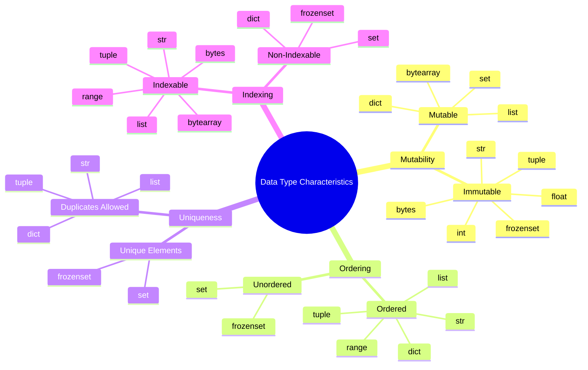

---

## Numeric Types

### Theory
Python provides three main numeric types to handle different kinds of numbers. These types support various mathematical operations and are essential for calculations, scientific computing, and data analysis. Each numeric type has specific characteristics regarding precision, range, and use cases.

### Numeric Types Overview
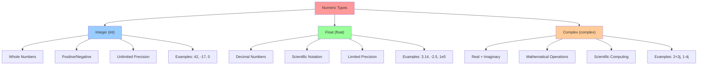

### Integer Type Details
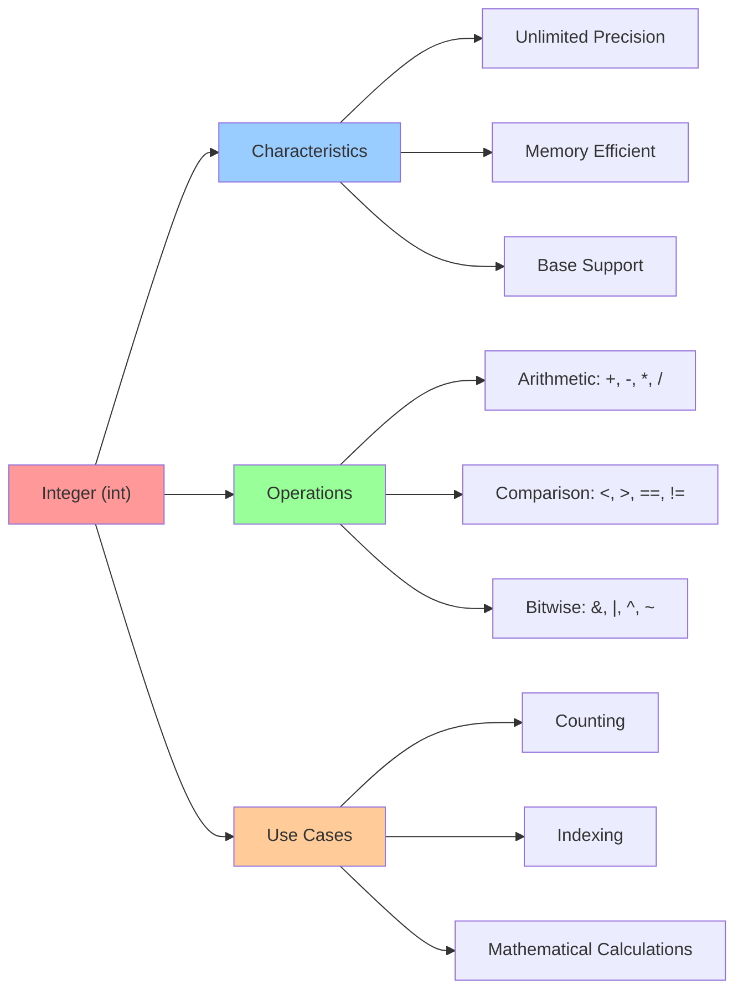

### Float Type Details
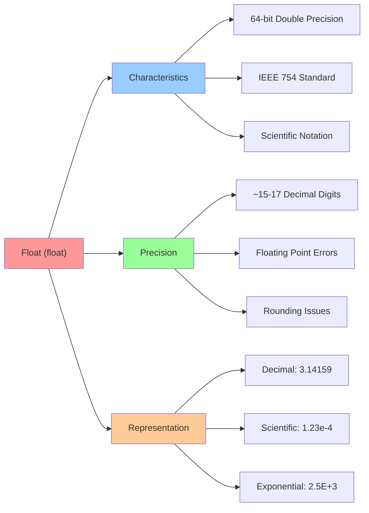

### Complex Number Details
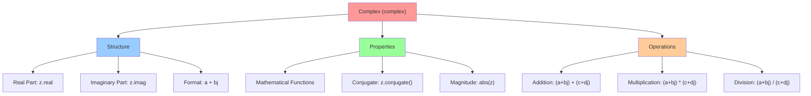

---

## Boolean Type

### Theory
The Boolean type in Python represents truth values and is fundamental to control flow and logical operations. It has only two possible values: `True` and `False`. Booleans are essential for conditional statements, loops, and logical operations that control program execution.

### Boolean Type Overview
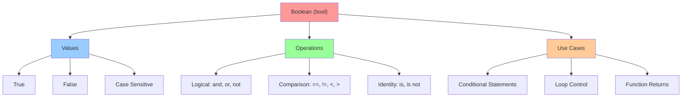

### Boolean Operations
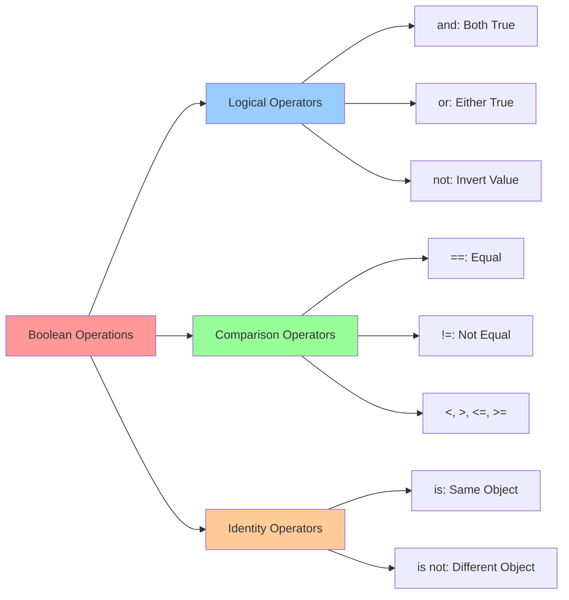

---

## Sequence Types

### Theory
Sequence types in Python are ordered collections that can contain multiple items. They support indexing, slicing, and iteration. Python provides several built-in sequence types, each with different characteristics regarding mutability and use cases.

### Sequence Types Overview
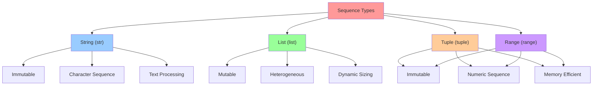

### String Type Details
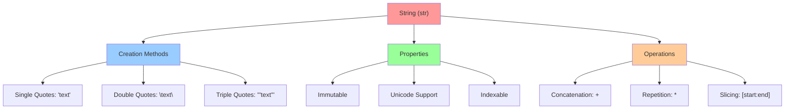

### List vs Tuple Comparison
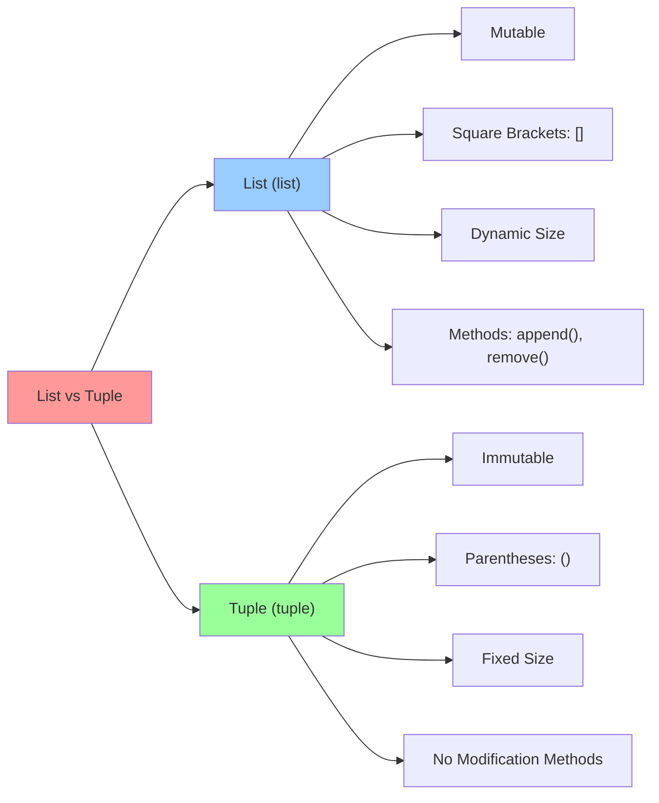

---

## Set Types

### Theory
Set types in Python represent unordered collections of unique elements. They are useful for mathematical set operations, removing duplicates, and testing membership. Python provides both mutable (`set`) and immutable (`frozenset`) versions.

### Set Types Overview
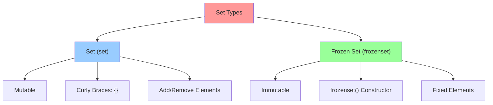

### Set Operations
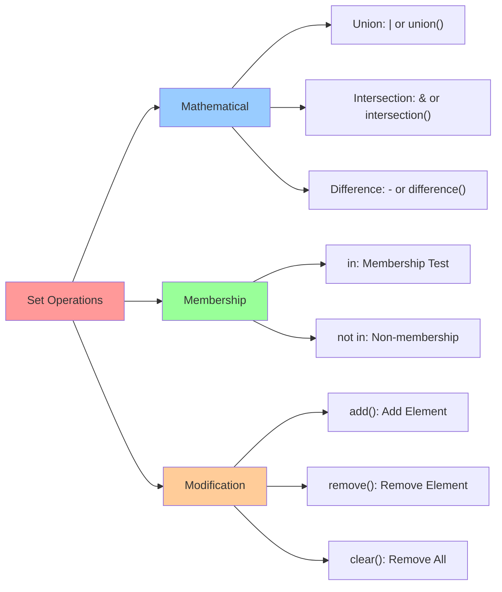

---

## Mapping Type

### Theory
The mapping type in Python is represented by dictionaries (`dict`), which store key-value pairs. Dictionaries are mutable, unordered collections that provide fast lookup, insertion, and deletion operations. They are essential for representing structured data and implementing hash tables.

### Dictionary Type Details
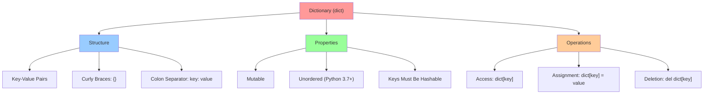

### Dictionary Methods
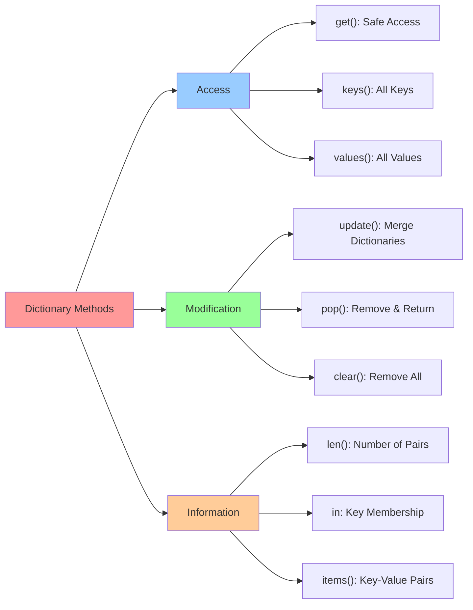

---

## Binary Types

### Theory
Binary types in Python handle raw binary data, which is essential for file I/O, network communication, and working with non-text data. Python provides three binary types: `bytes` (immutable), `bytearray` (mutable), and `memoryview` (memory-efficient access).

### Binary Types Overview
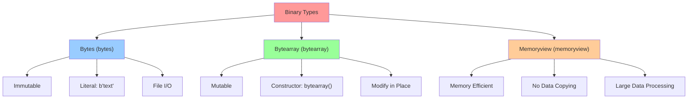

### Binary Data Operations
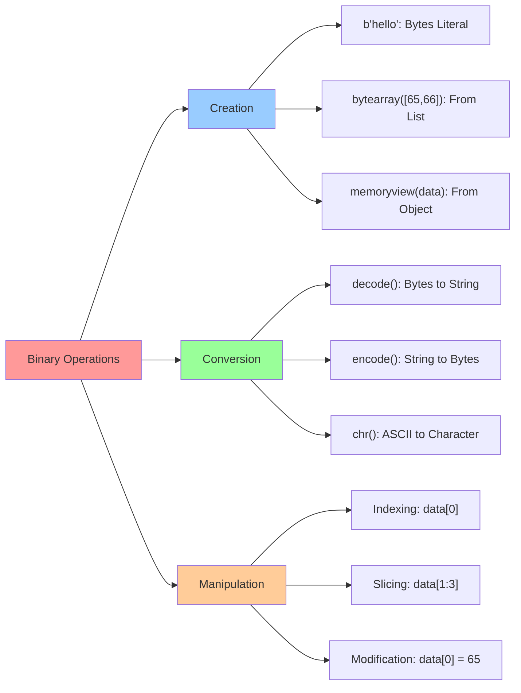

---

## Number Systems

### Theory
Number systems are fundamental to understanding how computers represent and process data. Different number systems (binary, decimal, hexadecimal, octal) are used in various computing contexts, from low-level programming to data representation.

### Number Systems Overview
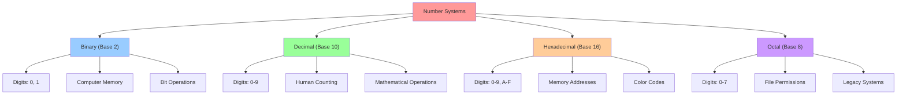

### Number System Conversions
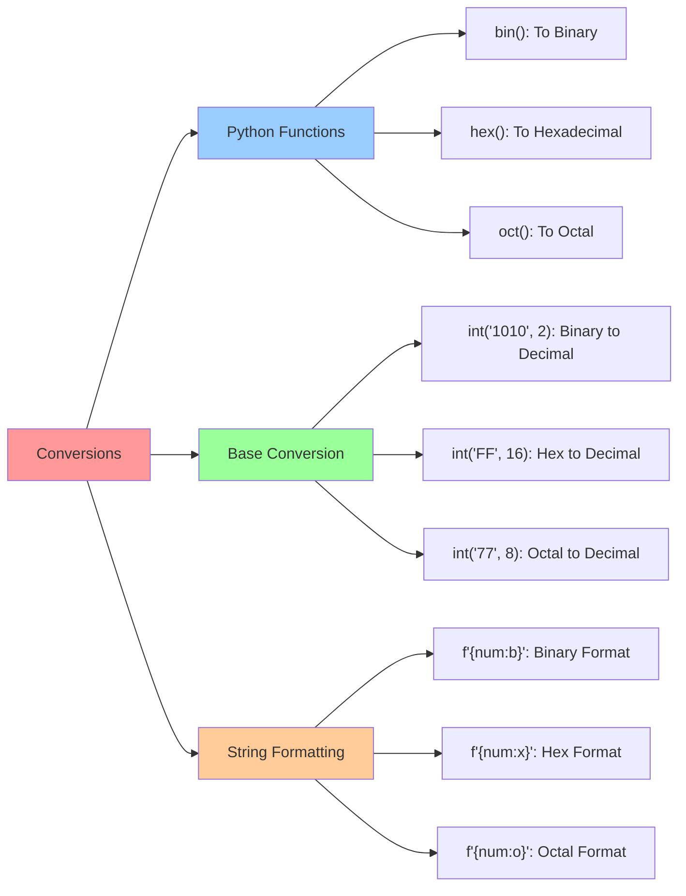

### ASCII and Unicode
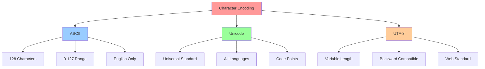

---

## Type Checking and Conversion

### Theory
Python's dynamic typing system allows variables to change types during runtime, but sometimes you need to explicitly convert between types or check the type of a variable. Understanding type checking and conversion is crucial for robust programming.

### Type Checking
```mermaid
graph TD
    A["Type Checking"] --> B["type() Function"]
    A --> C["isinstance() Function"]
    A --> D["Type Hints"]
    
    B --> B1["Returns Type Object"]
    B --> B2["Exact Type Match"]
    B --> B3["type(var) == int"]
    
    C --> C1["Inheritance Aware"]
    C --> C2["Multiple Types"]
    C --> C3["isinstance(var, (int, float))"]
    
    D --> D1["Static Type Hints"]
    D --> D2["IDE Support"]
    D --> D3["Documentation"]
    
    style A fill:#ff9999
    style B fill:#99ccff
    style C fill:#99ff99
    style D fill:#ffcc99
```

### Type Conversion
```mermaid
graph LR
    A["Type Conversion"] --> B["Implicit"]
    A --> C["Explicit"]
    A --> D["Functions"]
    
    B --> B1["Automatic Promotion"]
    B --> B2["int + float = float"]
    B --> B3["Safe Conversions"]
    
    C --> C1["Manual Conversion"]
    C --> C2["int(), float(), str()"]
    C --> C3["May Raise Errors"]
    
    D --> D1["int(): To Integer"]
    D --> D2["float(): To Float"]
    D --> D3["str(): To String"]
    D --> D4["list(): To List"]
    
    style A fill:#ff9999
    style B fill:#99ccff
    style C fill:#99ff99
    style D fill:#ffcc99
```

### Type Conversion Examples
```mermaid
graph TD
    A["Conversion Examples"] --> B["Numeric Conversions"]
    A --> C["String Conversions"]
    A --> D["Collection Conversions"]
    
    B --> B1["int(3.14) → 3"]
    B --> B2["float(42) → 42.0"]
    B --> B3["complex(2, 3) → 2+3j"]
    
    C --> C1["str(123) → '123'"]
    C --> C2["int('456') → 456"]
    C --> C3["float('3.14') → 3.14"]
    
    D --> D1["list('hello') → ['h','e','l','l','o']"]
    D --> D2["tuple([1,2,3]) → (1,2,3)"]
    D --> D3["set([1,1,2,3]) → {1,2,3}"]
    
    style A fill:#ff9999
    style B fill:#99ccff
    style C fill:#99ff99
    style D fill:#ffcc99
```

---

## Useful Links

### Essential Python Resources
- [Python 3.13.2 Documentation - Built-in Types](https://docs.python.org/3/library/stdtypes.html)
- [Python Data Types Tutorial](https://www.w3schools.com/python/python_datatypes.asp)
- [Real Python - Python Data Types](https://realpython.com/python-data-types/)

### Number Systems and Encoding
- [ASCII Table](https://www.ascii-code.com/)
- [Unicode Standard](https://unicode.org/)
- [UTF-8 Encoding](https://en.wikipedia.org/wiki/UTF-8)

### Type Checking and Validation
- [Python Type Hints](https://docs.python.org/3/library/typing.html)
- [mypy - Static Type Checker](https://mypy.readthedocs.io/)
- [Pydantic - Data Validation](https://pydantic-docs.helpmanual.io/)

### Learning Resources
- [Python.org Tutorial - Data Types](https://docs.python.org/3/tutorial/introduction.html#using-python-as-a-calculator)
- [Codecademy - Python Data Types](https://www.codecademy.com/learn/learn-python-3/modules/learn-python3-data-types)
- [Python for Beginners - Data Types](https://www.pythonforbeginners.com/basics/python-data-types)

---

## Summary

This lesson provides a comprehensive overview of Python's built-in data types, covering their characteristics, use cases, and operations. Understanding data types is fundamental to writing effective Python code and choosing the right data structure for your specific needs.

### Key Takeaways
1. **Numeric Types**: `int`, `float`, and `complex` for mathematical operations
2. **Boolean Type**: `bool` for logical operations and control flow
3. **Sequence Types**: `str`, `list`, `tuple`, and `range` for ordered collections
4. **Set Types**: `set` and `frozenset` for unique element collections
5. **Mapping Type**: `dict` for key-value pair storage
6. **Binary Types**: `bytes`, `bytearray`, and `memoryview` for binary data
7. **Type System**: Understanding mutability, ordering, and uniqueness
8. **Number Systems**: Binary, decimal, hexadecimal, and octal representations
9. **Type Operations**: Checking types and converting between them

### Best Practices
- Choose appropriate data types for your use case
- Understand mutability implications
- Use type hints for better code documentation
- Be aware of floating-point precision limitations
- Leverage set operations for unique element handling
- Use dictionaries for structured data representation

---

*Author: Arif Kasim Rozani - (Team Operation Badar)*
