# Lesson 03: Operators, Keywords & Variables

## Table of Contents
1. [Operators and Operands](#operators-and-operands)
2. [Unary Operators](#unary-operators)
3. [Binary Operators](#binary-operators)
4. [Chained Comparison Operators](#chained-comparison-operators)
5. [Walrus Operator](#walrus-operator)
6. [Identity Operators](#identity-operators)
7. [Membership Operators](#membership-operators)
8. [Python Keywords](#python-keywords)
9. [Python Variables](#python-variables)
10. [Summary](#summary)

---

## Operators and Operands

### What are Operators and Operands?

**Operators** are special symbols that perform operations on values (operands). They are the building blocks of expressions in Python, allowing us to manipulate data and perform calculations.

**Operands** are the values that operators act upon. In the expression `5 + 3`, the `+` is the operator, and `5` and `3` are the operands.

### Python Operator Categories

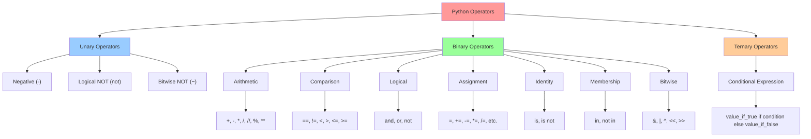

**Diagram Explanation**: This comprehensive diagram shows the complete hierarchy of Python operators. Unary operators work on a single operand, binary operators work on two operands, and ternary operators work on three operands. Each category contains specific operators with their symbols, making it easy to understand the operator taxonomy in Python.

---

## Unary Operators

Unary operators work on a single operand, performing operations like negation, logical inversion, or bitwise complement.

### Types of Unary Operators

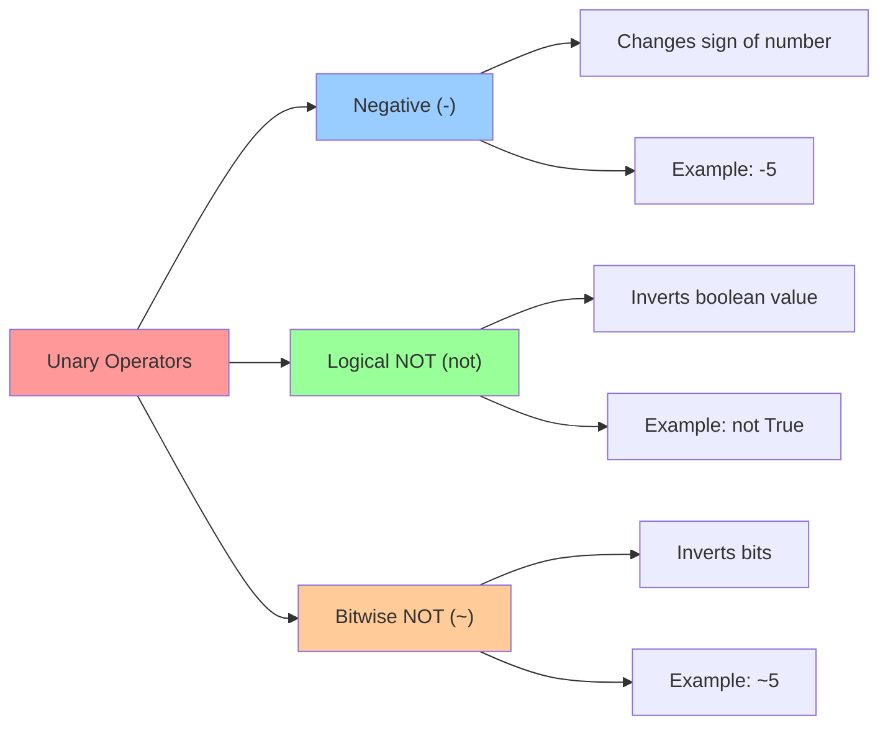

**Diagram Explanation**: This diagram illustrates the three main unary operators in Python. The negative operator changes the sign of a number, logical NOT inverts boolean values, and bitwise NOT performs bitwise complement operations. Each operator has specific use cases and examples.

### 1. Negative Operator (-)

The negative operator changes the sign of a number.

```python
# Examples
x = 5
negative_x = -x  # Result: -5

y = -10
positive_y = -y  # Result: 10 (double negative)
```

### 2. Logical NOT Operator (not)

The logical NOT operator inverts boolean values.

```python
# Examples
is_raining = True
is_not_raining = not is_raining  # Result: False

is_sunny = False
is_not_sunny = not is_sunny  # Result: True
```

### 3. Bitwise NOT Operator (~)

The bitwise NOT operator inverts all bits in a number.

```python
# Examples
x = 5  # Binary: 101
result = ~x  # Result: -6 (binary: ...11111010)
```

---

## Binary Operators

Binary operators work on two operands and are the most commonly used operators in Python.

### Arithmetic Operators

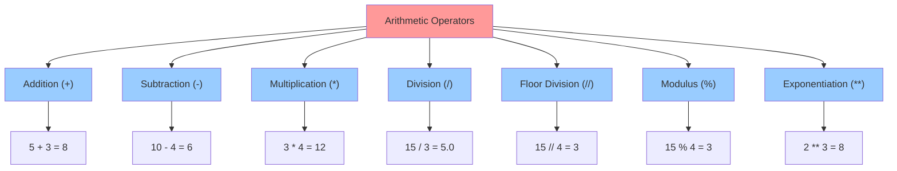

**Diagram Explanation**: This diagram shows all arithmetic operators in Python with their symbols and examples. Each operator performs a specific mathematical operation, from basic addition and subtraction to more advanced operations like floor division and exponentiation.

### Comparison Operators

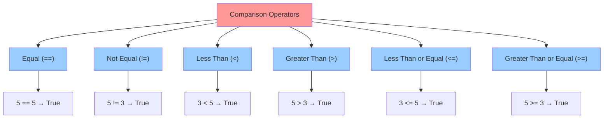

**Diagram Explanation**: This diagram illustrates all comparison operators used to compare values in Python. These operators return boolean values (True or False) and are essential for conditional statements and logical flow control.

### Logical Operators

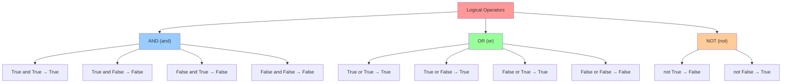

**Diagram Explanation**: This diagram shows the logical operators and their truth tables. The AND operator returns True only when both operands are True, OR returns True when at least one operand is True, and NOT inverts the boolean value.

### Assignment Operators

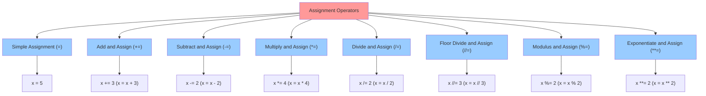

**Diagram Explanation**: This diagram shows all assignment operators in Python. The simple assignment operator (=) assigns a value, while compound assignment operators perform an operation and assign the result back to the variable, making code more concise.

---

## Chained Comparison Operators

Python allows chaining comparison operators for more readable and concise code.

### Chained Comparison Concept

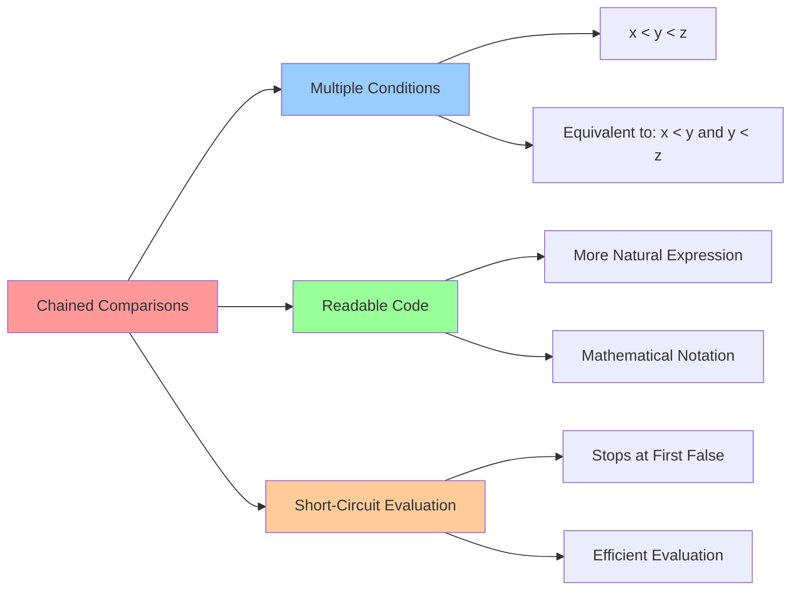

**Diagram Explanation**: This diagram illustrates the concept of chained comparisons in Python. Chained comparisons allow multiple conditions to be expressed in a more natural, mathematical way, and Python evaluates them efficiently using short-circuit evaluation.

### Examples

```python
# Chained comparisons
x = 5
y = 10
z = 15

# These are equivalent:
result1 = x < y < z  # True
result2 = x < y and y < z  # True

# More complex chained comparisons
age = 25
result = 18 <= age <= 65  # True (age is between 18 and 65)
```

---

## Walrus Operator

The walrus operator (:=) was introduced in Python 3.8 and allows assignment and expression evaluation in a single statement.

### Walrus Operator Concept

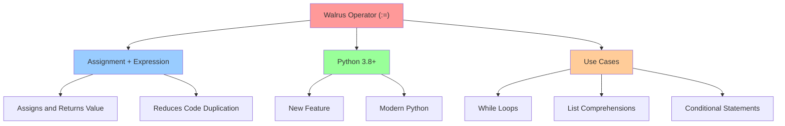

**Diagram Explanation**: This diagram shows the walrus operator's key characteristics and use cases. It's a modern Python feature that combines assignment and expression evaluation, making code more concise and readable in specific scenarios.

### Examples

```python
# Traditional approach
user_input = input("Enter a number: ")
while user_input != "quit":
    print(f"You entered: {user_input}")
    user_input = input("Enter a number: ")

# Using walrus operator
while (user_input := input("Enter a number: ")) != "quit":
    print(f"You entered: {user_input}")

# In list comprehensions
numbers = [1, 2, 3, 4, 5]
squares = [square := x**2 for x in numbers if (square := x**2) > 10]
```

---

## Identity Operators

Identity operators compare the memory locations of objects, not their values.

### Identity Operators Overview

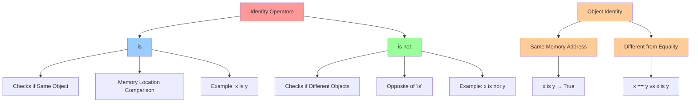

**Diagram Explanation**: This diagram illustrates identity operators and their relationship to object identity. The 'is' operator checks if two variables refer to the same object in memory, while 'is not' checks if they refer to different objects. This is different from equality comparison which checks values.

### Examples

```python
# Identity vs Equality
a = [1, 2, 3]
b = [1, 2, 3]
c = a

# Equality comparison (values)
print(a == b)  # True (same values)
print(a == c)  # True (same values)

# Identity comparison (objects)
print(a is b)  # False (different objects)
print(a is c)  # True (same object)

# Special case with small integers
x = 5
y = 5
print(x is y)  # True (Python optimizes small integers)
```

---

## Membership Operators

Membership operators test whether a value is a member of a sequence (like a list, tuple, or string).

### Membership Operators Overview

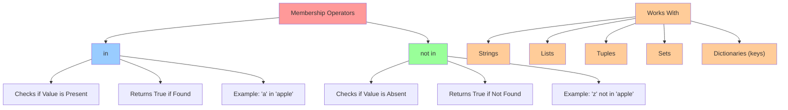

**Diagram Explanation**: This diagram shows membership operators and the data types they work with. The 'in' operator checks if a value exists in a sequence, while 'not in' checks if it doesn't exist. These operators work with various Python data structures.

### Examples

```python
# String membership
text = "Hello, World!"
print('H' in text)      # True
print('hello' in text)  # False (case-sensitive)
print('z' not in text)  # True

# List membership
numbers = [1, 2, 3, 4, 5]
print(3 in numbers)     # True
print(6 not in numbers) # True

# Dictionary membership (checks keys)
person = {'name': 'Alice', 'age': 30}
print('name' in person)    # True
print('salary' not in person)  # True
```

---

## Python Keywords

Keywords are reserved words in Python that have special meanings and cannot be used as variable names.

### Python Keywords Categories

```mermaid
graph TD
    A["Python Keywords"] --> B["Control Flow"]
    A --> C["Data Types"]
    A --> D["Functions & Classes"]
    A --> E["Exception Handling"]
    A --> F["Import & Modules"]
    A --> G["Logical Operations"]
    A --> H["Other"]
    
    B --> B1["if, elif, else"]
    B --> B2["for, while"]
    B --> B3["break, continue"]
    B --> B4["pass"]
    
    C --> C1["True, False"]
    C --> C2["None"]
    C --> C3["and, or, not"]
    
    D --> D1["def, class"]
    D --> D2["return, yield"]
    D --> D3["lambda"]
    
    E --> E1["try, except"]
    E --> E2["finally, raise"]
    E --> E3["assert"]
    
    F --> F1["import, from"]
    F --> F2["as"]
    
    G --> G1["and, or, not"]
    G --> G2["in, is"]
    
    H --> H1["del"]
    H --> H2["global, nonlocal"]
    H --> H3["with"]
    
    style A fill:#ff9999
    style B fill:#99ccff
    style C fill:#99ff99
    style D fill:#ffcc99
    style E fill:#cc99ff
    style F fill:#99ffcc
    style G fill:#ff99cc
    style H fill:#ffff99
```

**Diagram Explanation**: This comprehensive diagram categorizes Python keywords by their functionality. Keywords are organized into logical groups like control flow, data types, functions, exception handling, and more, making it easier to understand their purposes and usage.

### Complete List of Python Keywords

```python
# Python 3.11 keywords
keywords = [
    'False', 'None', 'True', 'and', 'as', 'assert', 'async', 'await',
    'break', 'class', 'continue', 'def', 'del', 'elif', 'else', 'except',
    'finally', 'for', 'from', 'global', 'if', 'import', 'in', 'is',
    'lambda', 'nonlocal', 'not', 'or', 'pass', 'raise', 'return',
    'try', 'while', 'with', 'yield'
]

# Check if a word is a keyword
import keyword
print(keyword.iskeyword('if'))    # True
print(keyword.iskeyword('hello')) # False
```

### Important Keyword Examples

```python
# Control flow keywords
if True:
    print("This will execute")
elif False:
    print("This won't execute")
else:
    print("This won't execute either")

# Loop keywords
for i in range(5):
    if i == 3:
        break  # Exit loop
    if i == 1:
        continue  # Skip iteration
    print(i)

# Function and class keywords
def my_function():
    return "Hello"

class MyClass:
    pass  # Placeholder

# Exception handling keywords
try:
    risky_operation()
except ValueError:
    print("Value error occurred")
finally:
    print("This always executes")
```

---

## Python Variables

Variables are containers that store data values. Understanding variable naming rules and conventions is crucial for writing clean, maintainable Python code.

### Variable Naming Rules

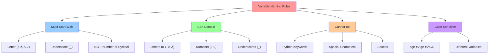

**Diagram Explanation**: This diagram outlines the fundamental rules for naming variables in Python. Variables must start with a letter or underscore, can contain letters, numbers, and underscores, cannot be keywords or contain special characters, and are case-sensitive.

### Naming Conventions

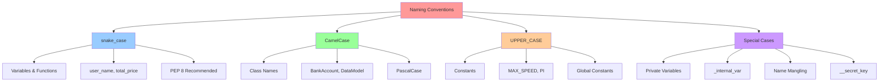

**Diagram Explanation**: This diagram shows the different naming conventions used in Python. snake_case is used for variables and functions, CamelCase for classes, UPPER_CASE for constants, and special prefixes for private variables and name mangling.

### Variable Assignment and Operations

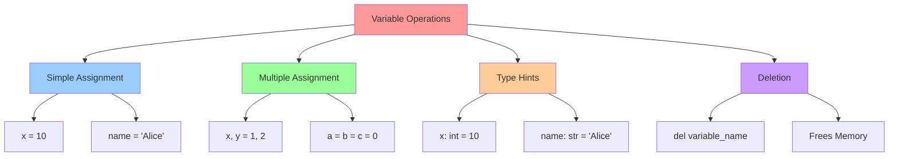

**Diagram Explanation**: This diagram illustrates different ways to work with variables in Python, from simple assignment to multiple assignments, type hints, and variable deletion. Each method serves specific purposes in Python programming.

### Examples

```python
# Simple assignment
age = 25
name = "Alice"
is_student = True

# Multiple assignment
x, y, z = 1, 2, 3
a = b = c = 0  # All variables get the same value

# Type hints
age: int = 25
name: str = "Alice"
scores: list[int] = [85, 90, 78]

# Variable deletion
temp_var = "temporary"
del temp_var
# print(temp_var)  # This would raise NameError

# Valid variable names
user_name = "john_doe"
total_price = 99.99
MAX_ATTEMPTS = 3
_internal_var = "private"

# Invalid variable names (would cause SyntaxError)
# 2name = "invalid"     # Starts with number
# class = "invalid"     # Python keyword
# user-name = "invalid" # Contains hyphen
```

---

## Summary

This lesson covered the fundamental building blocks of Python programming:

### Key Concepts Covered

```mermaid
mindmap
  root((Python Fundamentals))
    Operators
      Unary
        "Negative (-)"
        "Logical NOT (not)"
        "Bitwise NOT (~)"
      Binary
        "Arithmetic (+, -, *, /, //, %, **)"
        "Comparison (==, !=, <, >, <=, >=)"
        "Logical (and, or, not)"
        "Assignment (=, +=, -=, etc.)"
      Special
        "Identity (is, is not)"
        "Membership (in, not in)"
        "Walrus (:=)"
    Keywords
      "Control Flow"
      "Data Types"
      "Functions & Classes"
      "Exception Handling"
    Variables
      "Naming Rules"
      "Conventions"
      "Assignment"
      "Type Hints"
      "Deletion"
```

**Diagram Explanation**: This mind map provides a comprehensive overview of all the topics covered in this lesson. It shows the hierarchical relationship between operators, keywords, and variables, making it easy to see how these fundamental concepts interconnect in Python programming.

### Best Practices

1. **Use descriptive variable names** that clearly indicate their purpose
2. **Follow PEP 8 naming conventions** for consistency
3. **Use type hints** to improve code readability and maintainability
4. **Understand operator precedence** to avoid unexpected results
5. **Use appropriate operators** for the task at hand
6. **Avoid using keywords** as variable names

### Next Steps

With a solid understanding of operators, keywords, and variables, you're ready to move on to more advanced Python concepts like:
- Control flow structures (if/else, loops)
- Functions and classes
- Data structures (lists, dictionaries, sets)
- File handling and modules

Remember: Practice is key to mastering these fundamental concepts. Try writing small programs that use different operators and variable types to reinforce your learning!
