# [Lesson 04: Strings & Type Casting](https://colab.research.google.com/drive/1Ho_ZEbgOB_Y3YjtPWqoJwjVXgpmM5fQS?usp=sharing)

## Table of Contents
1. [Introduction to Strings](#introduction-to-strings)
2. [String Creation Methods](#string-creation-methods)
3. [Escape Sequence Characters](#escape-sequence-characters)
4. [String Operations](#string-operations)
5. [String Methods](#string-methods)
6. [String Formatting](#string-formatting)
7. [String Interning & Memory Management](#string-interning--memory-management)
8. [String Repetition](#string-repetition)
9. [String Comparison](#string-comparison)
10. [Type Casting Overview](#type-casting-overview)
11. [Implicit Type Casting](#implicit-type-casting)
12. [Explicit Type Casting](#explicit-type-casting)
13. [Key Concepts Covered](#key-concepts-covered)
14. [Best Practices](#best-practices)
15. [Useful Links](#useful-links)

---

## Introduction to Strings

Strings in Python are sequences of characters enclosed in quotes. They are **immutable**, meaning they cannot be changed after creation. Strings are fundamental data types used for text processing, data manipulation, and user interaction.

### String Fundamentals

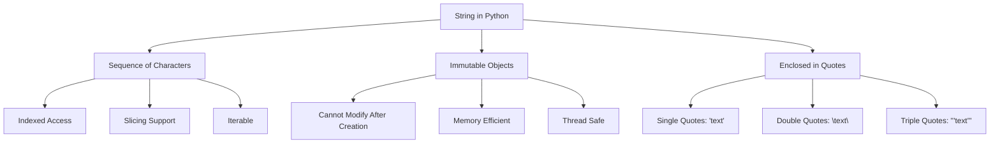

**Diagram Explanation**: This diagram illustrates the fundamental characteristics of strings in Python, showing how they are sequences of characters that are immutable and can be created using different quote styles.

---

## String Creation Methods

Python provides multiple ways to create strings, each with specific use cases and advantages.

### String Creation Techniques

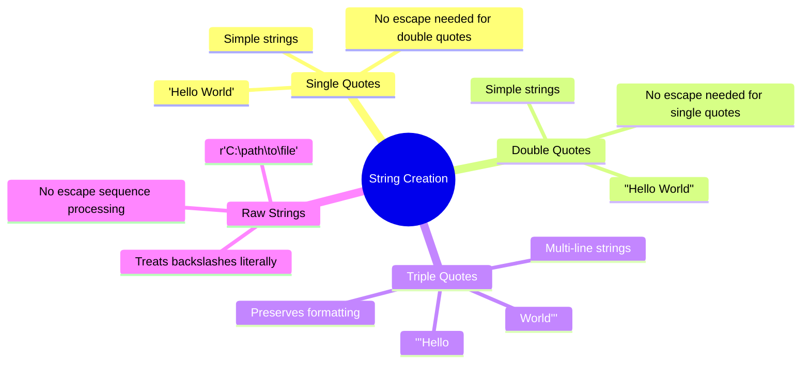

**Diagram Explanation**: This mind map shows the different methods for creating strings in Python, highlighting the specific use cases and benefits of each approach.

### String Creation Examples

**Single Quotes**: Used for simple strings without embedded quotes
```python
my_string = 'Hello, World!'
```

**Double Quotes**: Used when the string contains single quotes
```python
my_string = "He said 'Hello' to me"
```

**Triple Quotes**: Used for multi-line strings and documentation
```python
my_string = '''Hello,
World!
This is a multi-line string.'''
```

**Raw Strings**: Used when you want to treat backslashes literally
```python
my_string = r'Hello\t,\n World!'  # Backslashes are literal
```

---

## Escape Sequence Characters

Escape sequences are special character combinations that represent non-printable or special characters in strings.

### Escape Sequence Types

```mermaid
graph LR
    A["Escape Sequences"] --> B["Common Sequences"]
    A --> C["Unicode Sequences"]
    
    B --> B1["New Line - \\n"]
    B --> B2["Tab - \\t"]
    B --> B3["Backspace - \\b"]
    B --> B4["Carriage Return - \\r"]
    B --> B5["Single Quote - \\'"]
    B --> B6["Double Quote - \\\""]
    B --> B7["Backslash - \\\\"]
    
    C --> C1["Unicode A - \\u0041"]
    C --> C2["Unicode B - \\u0042"]
    C --> C3["Unicode C - \\u0043"]
```

**Diagram Explanation**: This diagram categorizes escape sequences into common sequences (for formatting and special characters) and Unicode sequences (for international characters).

### Common Escape Sequences

| Escape Sequence | Description | Example |
|----------------|-------------|---------|
| `\n` | New line | `"Hello\nWorld"` |
| `\t` | Tab | `"Hello\tWorld"` |
| `\b` | Backspace | `"Hello\bWorld"` |
| `\r` | Carriage return | `"Hello\rWorld"` |
| `\'` | Single quote | `"He said \'Hello\'"` |
| `\"` | Double quote | `'He said "Hello"'` |
| `\\` | Backslash | `"C:\\path"` |

### Unicode Escape Sequences

Unicode escape sequences allow you to include international characters:
```python
print("\u0041")  # Output: A
print("\u0042")  # Output: B
print("\u0043")  # Output: C
```

---

## String Operations

Python provides various operations for manipulating strings, including concatenation, indexing, slicing, and length calculation.

### String Operations Overview

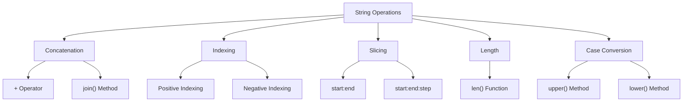

**Diagram Explanation**: This diagram shows the main categories of string operations available in Python, from basic concatenation to advanced slicing techniques.

### String Operations Examples

**Concatenation**: Combining strings using the `+` operator
```python
my_string = 'Hello, ' + 'World!'
print(my_string)  # Output: Hello, World!
```

**Indexing**: Accessing individual characters by position
```python
my_string = 'Hello, World!'
print(my_string[0])  # Output: H
print(my_string[1])  # Output: e
```

**Slicing**: Extracting substrings using start and end indices
```python
my_string = 'Hello, World!'
print(my_string[7:])    # Output: World!
print(my_string[0:5])   # Output: Hello
```

**Length**: Getting the number of characters in a string
```python
print(len("Hello, World!"))  # Output: 13
```

**Case Conversion**: Changing the case of characters
```python
my_string = 'Hello, World!'
print(my_string.upper())  # Output: HELLO, WORLD!
print(my_string.lower())  # Output: hello, world!
```

---

## String Methods

Python provides numerous built-in methods for string manipulation, making text processing efficient and powerful.

### Essential String Methods

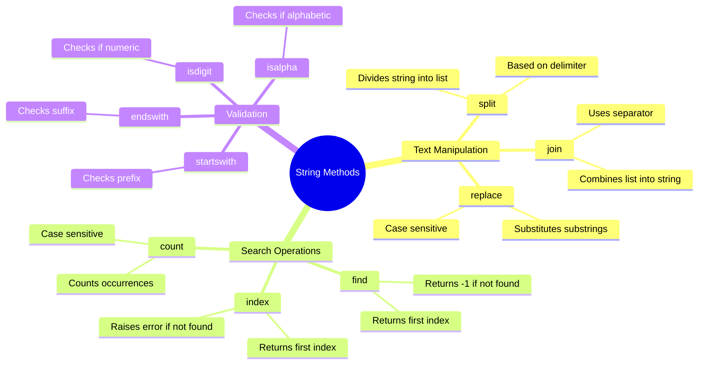

**Diagram Explanation**: This mind map categorizes string methods into text manipulation, search operations, and validation methods, showing their specific purposes and behaviors.

### String Methods Examples

**split()**: Divides a string into a list based on a delimiter
```python
my_string = 'Hello! World'
words = my_string.split()      # ['Hello!', 'World']
words = my_string.split(' ')   # ['Hello!', 'World']
words = my_string.split('l')   # ['He', '', 'o! Wor', 'd']
```

**join()**: Combines a list of strings into a single string
```python
my_string = ', '
joined = my_string.join(['Pakistan', 'USA', 'Canada'])
print(joined)  # Output: Pakistan, USA, Canada
```

**replace()**: Substitutes one substring with another
```python
my_string = "Hello, World! Hello, Pakistan"
new_string = my_string.replace('Hello', 'Salam Walikum')
print(new_string)  # Output: Salam Walikum, World! Salam Walikum, Pakistan
```

**find()**: Locates the first occurrence of a substring
```python
my_string = "Hello, World! Hello, Pakistan"
index = my_string.find('Hello')
print(index)  # Output: 0
```

**count()**: Counts occurrences of a substring
```python
my_string = "Hello, World! Hello, Pakistan"
count = my_string.count('Hello')
print(count)  # Output: 2
```

---

## String Formatting

String formatting allows you to insert values into strings dynamically. Python provides multiple formatting methods, each with specific advantages.

### String Formatting Methods

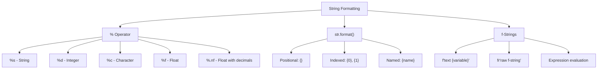

**Diagram Explanation**: This diagram shows the evolution of string formatting in Python, from the older % operator to modern f-strings, highlighting the features of each method.

### String Formatting Examples

**% Operator**: Traditional formatting with placeholders
```python
name = 'John'
age = 20
my_string = 'My name is %s and I am %d years old.' % (name, age)
print(my_string)  # Output: My name is John and I am 20 years old.
```

**str.format()**: More flexible formatting with positional and named arguments
```python
name = 'John'
age = 20
my_string = 'My name is {} and I am {} years old.'.format(name, age)
print(my_string)  # Output: My name is John and I am 20 years old.

# Using indexed placeholders
my_string = 'My name is {1} and I am {0} years old.'.format(age, name)
print(my_string)  # Output: My name is John and I am 20 years old.
```

**f-Strings**: Modern, readable formatting with expression evaluation
```python
name = 'John'
age = 20
my_string = f'My name is {name} and I am {age} years old.'
print(my_string)  # Output: My name is John and I am 20 years old.

# Raw f-string
my_string = fr'My \name is {name} and I am {age}\n years old.'
print(my_string)  # Output: My \name is John and I am 20\n years old.
```

### Formatting Placeholders

| Placeholder | Type | Example | Output |
|-------------|------|---------|---------|
| `%s` | String | `"Hello, %s" % "World"` | `"Hello, World"` |
| `%d` | Integer | `"Age: %d" % 25` | `"Age: 25"` |
| `%c` | Character | `"Letter: %c" % 'A'` | `"Letter: A"` |
| `%f` | Float | `"Pi: %f" % 3.14159` | `"Pi: 3.141590"` |
| `%.2f` | Float (2 decimals) | `"Pi: %.2f" % 3.14159` | `"Pi: 3.14"` |

---

## String Interning & Memory Management

Python uses string interning and string literal pools to optimize memory usage and improve performance for string operations.

### String Memory Management

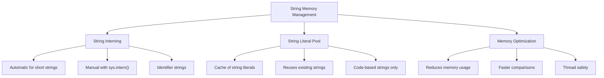

**Diagram Explanation**: This diagram illustrates how Python manages string memory through interning and literal pools, showing the benefits and mechanisms of each approach.

### String Interning Process

**Automatic Interning**: Python automatically interns certain strings
```python
a = "hello"
b = "hello"
print(a is b)  # Output: True (same memory location)
print(id(a))   # Same ID
print(id(b))   # Same ID
```

**Manual Interning**: You can manually intern strings using `sys.intern()`
```python
import sys
a = sys.intern("hello world!")
b = sys.intern("hello world!")
print(a is b)  # Output: True (manually interned)
```

### When Strings Are NOT Interned

**Long Strings**: Strings longer than 20 characters are usually not interned
```python
a = "this is a very long string"
b = "this is a very long string"
print(a is b)  # Output: False (not interned)
```

**Dynamically Created Strings**: Strings created at runtime are not interned
```python
a = "hello"
b = "world"
c = a + b  # Dynamically created
d = "helloworld"
print(c is d)  # Output: False (not interned)
```

### String Interning vs String Pool

| Aspect | String Interning | String Pool |
|--------|------------------|-------------|
| **Scope** | Any type of object | Strings only |
| **Purpose** | Optimize memory usage | Manage string memory |
| **Implementation** | Hash table/dictionary | Contiguous memory block |
| **Behavior** | Can be enabled/disabled | Always enabled |

---

## String Repetition

String repetition allows you to create new strings by repeating existing strings multiple times using the `*` operator.

### String Repetition Concepts

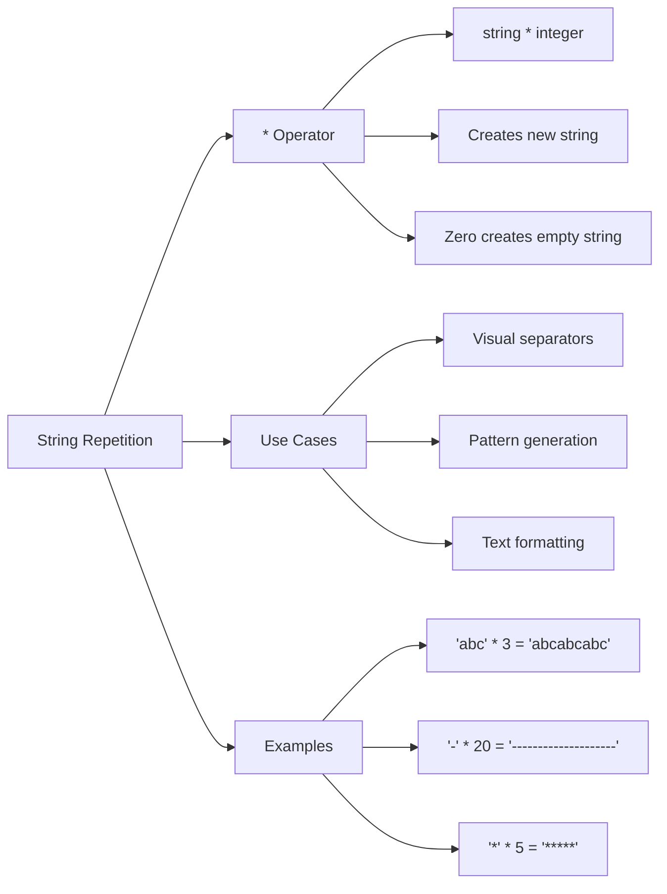

**Diagram Explanation**: This diagram shows how string repetition works using the multiplication operator, its common use cases, and practical examples.

### String Repetition Examples

**Basic Repetition**: Multiplying a string by an integer
```python
base_string = "Hello"
repeated_string = base_string * 3
print(repeated_string)  # Output: HelloHelloHello
```

**Visual Separators**: Creating lines and borders
```python
separator = "-" * 30
print(separator)  # Output: ------------------------------
```

**Pattern Generation**: Creating repeating patterns
```python
pattern = "* "
repeated_pattern = pattern * 5
print(repeated_pattern)  # Output: * * * * * 
```

**Zero Repetition**: Multiplying by zero creates an empty string
```python
empty_string = "Test" * 0
print(f"Empty string: '{empty_string}'")  # Output: Empty string: ''
```

**Loop Example**: Creating patterns with loops
```python
for i in range(1, 6):
    print("*" * i)
# Output:
# *
# **
# ***
# ****
# *****
```

---

## String Comparison

String comparison in Python is based on lexicographical (dictionary) order, using Unicode values of characters for comparison.

### String Comparison Process

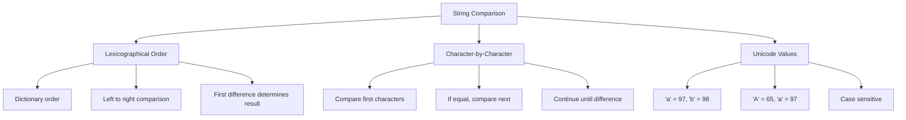

**Diagram Explanation**: This diagram illustrates how Python compares strings using lexicographical order, showing the step-by-step process of character-by-character comparison based on Unicode values.

### String Comparison Examples

**Basic Comparisons**: Using comparison operators
```python
str1 = "apple"
str2 = "banana"

print(str1 == str2)  # Output: False
print(str1 != str2)  # Output: True
print(str1 > str2)   # Output: False (apple comes before banana)
print(str1 < str2)   # Output: True (apple comes before banana)
```

**Case Sensitivity**: Uppercase and lowercase letters have different Unicode values
```python
print("Apple" > "apple")    # Output: False ('A' = 65, 'a' = 97)
print("apple" == "APPLE")   # Output: False (case-sensitive)
print("abc" < "abd")        # Output: True ('c' < 'd')
```

**Practical Application**: Using comparisons in conditional statements
```python
word = "mango"

if word > "apple":
    print(f"{word} comes after apple in alphabetical order")
else:
    print(f"{word} comes before apple in alphabetical order")
# Output: mango comes after apple in alphabetical order
```

### Unicode Values for Common Characters

| Character | Unicode Value | Character | Unicode Value |
|-----------|---------------|-----------|---------------|
| 'A' | 65 | 'a' | 97 |
| 'B' | 66 | 'b' | 98 |
| 'C' | 67 | 'c' | 99 |
| '0' | 48 | '1' | 49 |
| ' ' | 32 | '!' | 33 |

---

## Type Casting Overview

Type casting (type conversion) is the process of converting one data type into another. Python supports both implicit (automatic) and explicit (manual) type casting.

### Type Casting Categories

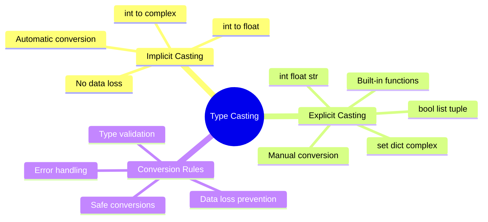

**Diagram Explanation**: This mind map categorizes type casting into implicit (automatic) and explicit (manual) conversions, showing the key functions and rules for each type.

### Type Casting Functions

| Function | Converts To | Example |
|----------|-------------|---------|
| `int(x)` | Integer | `int(3.14)` → `3` |
| `float(x)` | Float | `float(5)` → `5.0` |
| `str(x)` | String | `str(123)` → `"123"` |
| `bool(x)` | Boolean | `bool(1)` → `True` |
| `list(x)` | List | `list((1,2,3))` → `[1,2,3]` |
| `tuple(x)` | Tuple | `tuple([1,2,3])` → `(1,2,3)` |
| `set(x)` | Set | `set([1,2,2,3])` → `{1,2,3}` |
| `dict(x)` | Dictionary | `dict([('a',1)])` → `{'a':1}` |
| `complex(x)` | Complex | `complex(5)` → `(5+0j)` |

---

## Implicit Type Casting

Implicit type casting occurs automatically when Python converts one data type to another without data loss. This happens during arithmetic operations and assignments.

### Implicit Conversion Rules

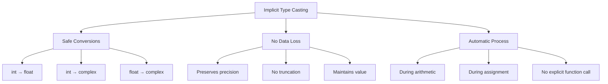

**Diagram Explanation**: This diagram shows the rules and characteristics of implicit type casting, highlighting that it only occurs for safe conversions that don't result in data loss.

### Implicit Conversion Examples

**int to float**: Automatic promotion during arithmetic
```python
num_int = 10
num_float = num_int + 5.5  # int + float = float
print(num_float, type(num_float))  # Output: 15.5 <class 'float'>
```

**int to complex**: Automatic promotion to complex numbers
```python
num_int = 7
num_complex = num_int + 3j  # int + complex → complex
print(num_complex, type(num_complex))  # Output: (7+3j) <class 'complex'>
```

**No Implicit str to int**: Python doesn't automatically convert strings to numbers
```python
num_str = "100"
num_int = 5
# print(num_str + num_int)  # ❌ TypeError: can only concatenate str to str

# Must use explicit conversion
print(int(num_str) + num_int)  # ✅ Output: 105
print(num_str + str(num_int))  # ✅ Output: 1005
```

---

## Explicit Type Casting

Explicit type casting requires manual conversion using built-in functions. This gives you control over the conversion process and allows handling of potential errors.

### Explicit Conversion Functions

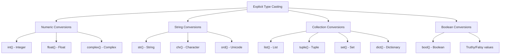

**Diagram Explanation**: This diagram categorizes explicit type casting functions into numeric, string, collection, and boolean conversions, showing the specific functions available for each category.

### Integer Conversion (int())

**Float to Integer**: Truncates decimal part (doesn't round)
```python
num_float = 9.8
num_int = int(num_float)
print(num_int)  # Output: 9 (truncated, not rounded)
```

**String to Integer**: Converts valid numeric strings
```python
num_str = "123"
num_int = int(num_str)
print(num_int, type(num_int))  # Output: 123 <class 'int'>

# num_str = "123abc"  # ❌ ValueError: invalid literal for int()
```

**Boolean to Integer**: Converts boolean values
```python
print(int(True))   # Output: 1
print(int(False))  # Output: 0
```

### Float Conversion (float())

**Integer to Float**: Adds decimal point
```python
num_int = 5
num_float = float(num_int)
print(num_float, type(num_float))  # Output: 5.0 <class 'float'>
```

**String to Float**: Converts valid numeric strings
```python
num_str = "3.14"
num_float = float(num_str)
print(num_float, type(num_float))  # Output: 3.14 <class 'float'>
```

### String Conversion (str())

**Number to String**: Converts any value to string representation
```python
num = 100
num_str = str(num)
print(num_str, type(num_str))  # Output: 100 <class 'str'>
```

**Boolean to String**: Converts boolean values
```python
print(str(True))   # Output: "True"
print(str(False))  # Output: "False"
```

### Boolean Conversion (bool())

**Truthy and Falsy Values**: Converts values based on truthiness
```python
print(bool(1))        # Output: True
print(bool(0))        # Output: False
print(bool(-10))      # Output: True (non-zero numbers are True)
print(bool(""))       # Output: False (empty string)
print(bool("Hello"))  # Output: True (non-empty string)
print(bool([]))       # Output: False (empty list)
print(bool([1, 2]))   # Output: True (non-empty list)
```

### Collection Conversions

**List, Tuple, Set Conversions**: Converting between different collection types
```python
# Tuple to List
tup = (1, 2.7, 3, 'OB')
lst = list(tup)
print(lst, type(lst))  # Output: [1, 2.7, 3, 'OB'] <class 'list'>

# List to Set (removes duplicates)
lst = [1, 2, 2, 3, 4, 4, 5, "Agentic AI"]
s = set(lst)
print(s, type(s))  # Output: {1, 2, 3, 4, 5, 'Agentic AI'} <class 'set'>

# List of Tuples to Dictionary
lst = [("name", "Alice"), ("age", 25)]
d = dict(lst)
print(d, type(d))  # Output: {'name': 'Alice', 'age': 25} <class 'dict'>
```

### Complex Number Conversion (complex())

**Number to Complex**: Converts numbers to complex numbers
```python
num = 5
comp = complex(num)
print(comp, type(comp))  # Output: (5+0j) <class 'complex'>

# Complex to String
num = str(comp)
print(num)  # Output: "(5+0j)"

# Complex to Integer (❌ Error)
# num = int(comp)  # TypeError: can't convert complex to int
```

---

## Key Concepts Covered

This lesson covered the fundamental aspects of strings and type casting in Python:

### Key Concepts Overview

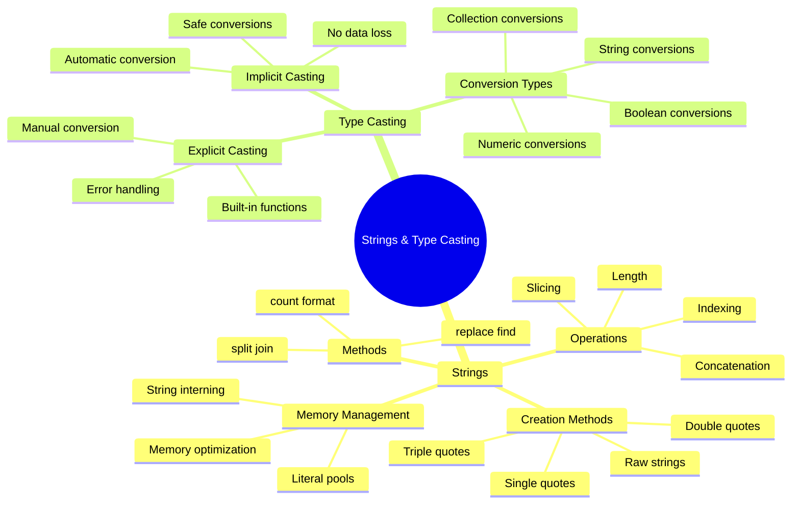

**Diagram Explanation**: This mind map provides a comprehensive overview of all the topics covered in this lesson, showing the hierarchical relationship between string concepts and type casting methods.

### Best Practices

1. **String Creation**: Use appropriate quote styles for your use case
2. **String Formatting**: Prefer f-strings for readability and performance
3. **Memory Management**: Understand when strings are interned for optimization
4. **Type Casting**: Use explicit casting when you need control over the conversion
5. **Error Handling**: Always handle potential conversion errors
6. **String Methods**: Use built-in methods for efficient string manipulation
7. **Comparison**: Remember that string comparison is case-sensitive and based on Unicode values

### Common Pitfalls

1. **Immutability**: Strings cannot be modified after creation
2. **Case Sensitivity**: String comparisons are case-sensitive
3. **Type Errors**: Mixing strings and numbers without explicit conversion
4. **Memory**: Long strings and dynamic strings are not automatically interned
5. **Formatting Order**: Order matters in string formatting with % operator

---

## Useful Links

- [Python String Documentation](https://docs.python.org/3/library/stdtypes.html#text-sequence-type-str)
- [String Methods Reference](https://docs.python.org/3/library/stdtypes.html#string-methods)
- [String Formatting Guide](https://docs.python.org/3/tutorial/inputoutput.html#fancier-output-formatting)
- [Type Conversion Functions](https://docs.python.org/3/library/functions.html#built-in-functions)
- [Unicode in Python](https://docs.python.org/3/howto/unicode.html)
- [String Interning](https://docs.python.org/3/library/sys.html#sys.intern)
- [PEP 498 - Literal String Interpolation](https://peps.python.org/pep-0498/)
- [Python String Interning Deep Dive](https://docs.python.org/3/reference/lexical_analysis.html#string-literal-concatenation)

---

*This lesson provides a comprehensive understanding of strings and type casting in Python, essential for text processing, data manipulation, and type conversion in Python programming.*