# [Lesson 05: Control Flow & Loops](https://colab.research.google.com/drive/19CfIJYDVeQJAeGw-L2MuPuxAhMJGA8Cm?usp=sharing)

## Table of Contents
1. [Introduction to Control Flow](#introduction-to-control-flow)
2. [Comparison Operators](#comparison-operators)
3. [Logical Operators](#logical-operators)
4. [Conditional Statements](#conditional-statements)
5. [Nested Conditional Statements](#nested-conditional-statements)
6. [Match-Case Statement](#match-case-statement)
7. [Introduction to Loops](#introduction-to-loops)
8. [For Loops](#for-loops)
9. [While Loops](#while-loops)
10. [Loop Control Statements](#loop-control-statements)
11. [Nested Loops](#nested-loops)
12. [Practical Examples](#practical-examples)
13. [Key Concepts Covered](#key-concepts-covered)
14. [Best Practices](#best-practices)
15. [Useful Links](#useful-links)

---

## Introduction to Control Flow

Control flow refers to the order in which statements are executed in a program. In Python, decision-making is achieved using conditional statements (if, elif, else) along with comparison and logical operators. Control flow allows programs to make decisions and execute different code paths based on conditions.

### Control Flow Fundamentals

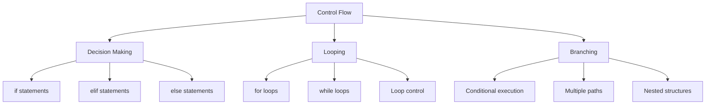

**Diagram Explanation**: This diagram illustrates the three main aspects of control flow in Python: decision making through conditional statements, looping for repetition, and branching for multiple execution paths.

---

## Comparison Operators

Comparison operators are used to compare values and return Boolean results (True or False). They form the foundation of conditional statements and decision-making in Python.

### Comparison Operators Overview

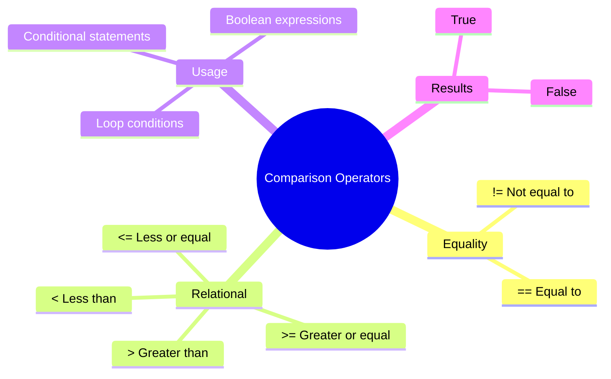

**Diagram Explanation**: This mind map categorizes comparison operators into equality and relational operators, showing their usage in conditional statements and the Boolean results they produce.

### Comparison Operators Examples

**Basic Comparisons**: Using different comparison operators
```python
x = 10
y = 20

print("x == y =", x == y)  # False
print("x != y =", x != y)  # True
print("x > y  =", x > y)   # False
print("x < y  =", x < y)   # True
print("x >= y =", x >= y)  # False
print("x <= y =", x <= y)  # True
```

**Comparison Operators Table**:

| Operator | Description | Example | Result |
|----------|-------------|---------|---------|
| `==` | Equal to | `5 == 5` | `True` |
| `!=` | Not equal to | `5 != 3` | `True` |
| `>` | Greater than | `5 > 3` | `True` |
| `<` | Less than | `5 < 3` | `False` |
| `>=` | Greater than or equal to | `5 >= 5` | `True` |
| `<=` | Less than or equal to | `5 <= 3` | `False` |

---

## Logical Operators

Logical operators combine multiple conditions to create complex Boolean expressions. They allow you to test multiple conditions simultaneously and control the flow of execution based on combined results.

### Logical Operators Types

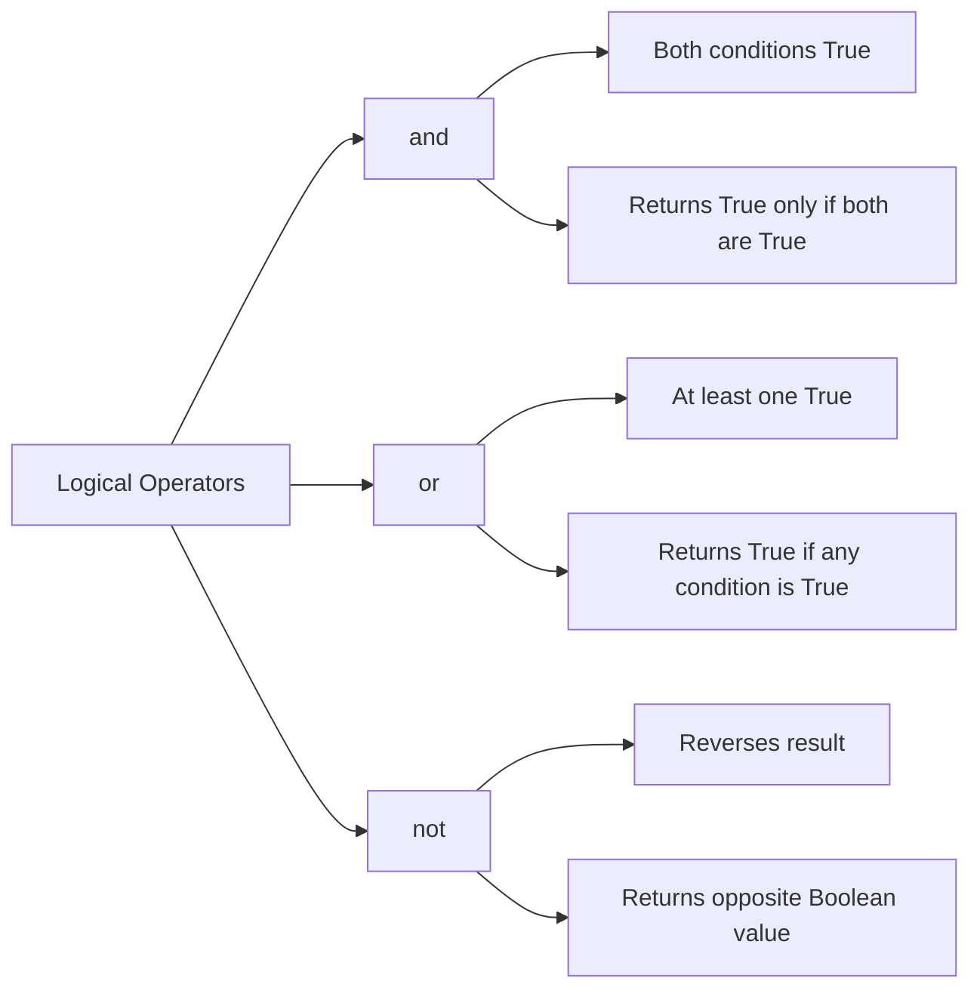

**Diagram Explanation**: This diagram shows the three logical operators in Python, their behavior, and the conditions under which they return True or False.

### Logical Operators Examples

**and Operator**: Returns True only if both conditions are True
```python
age = 25
is_student = True

# Check if age is greater than 18 AND is_student is True
if age > 18 and is_student:
    print("You are eligible for a student discount.")
# Output: You are eligible for a student discount.
```

**or Operator**: Returns True if at least one condition is True
```python
age = 25

# Check if age is less than 12 OR greater than 60
if age < 12 or age > 60:
    print("You qualify for a special discount.")
# No output (both conditions are False)
```

**not Operator**: Reverses the result of a condition
```python
is_student = True

# Check if the person is NOT a student
if not is_student:
    print("You are not a student.")
# No output (not True = False)
```

### Logical Operators Truth Table

| A | B | A and B | A or B | not A |
|---|---|---------|--------|-------|
| True | True | True | True | False |
| True | False | False | True | False |
| False | True | False | True | True |
| False | False | False | False | True |

---

## Conditional Statements

Conditional statements allow programs to make decisions and execute different code blocks based on whether conditions are True or False. Python provides three main conditional statements: if, elif, and else.

### Conditional Statement Flow

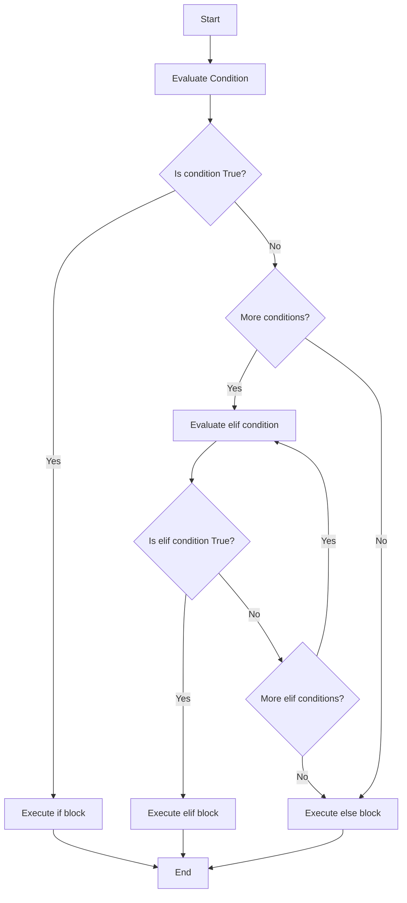

**Diagram Explanation**: This flowchart shows the decision-making process in conditional statements, illustrating how Python evaluates conditions sequentially and executes the appropriate code block.

### if Statement

The if statement executes a block of code only if a condition is True.

**Basic if Statement**:
```python
num = 10

if num > 0:
    print("The number is positive.")
# Output: The number is positive.
```

### else Statement

The else statement executes a block of code if the if condition is False.

**if-else Statement**:
```python
num = -5

if num > 0:
    print("The number is positive.")
else:
    print("The number is not positive.")
# Output: The number is not positive.
```

### elif Statement

The elif statement allows you to check multiple conditions sequentially. It stands for "else if."

**if-elif-else Statement**:
```python
num = 0

if num > 0:        # Program execution step 1: condition = False
    print("The number is positive.")
elif num < 0:      # Program execution step 2: condition = False
    print("The number is negative.")
else:              # Program execution step 3: execute else block
    print("The number is zero.")
# Output: The number is zero.
```

### Conditional Statement Examples

**Grading System**: Using multiple conditions to determine grades
```python
def grading_system(marks):
    if marks >= 90:
        grade = "A+"
    elif marks >= 80:
        grade = "A"
    elif marks >= 70:
        grade = "B"
    elif marks >= 60:
        grade = "C"
    elif marks >= 50:
        grade = "D"
    else:
        grade = "F"
    return grade

# Example usage
marks = 85
grade = grading_system(marks)
print(f"Grade for {marks} marks: {grade}")
# Output: Grade for 85 marks: A
```

---

## Nested Conditional Statements

Nested conditional statements are if statements placed inside other if statements. They allow for complex decision-making by checking multiple conditions in a hierarchical manner.

### Nested Conditional Structure

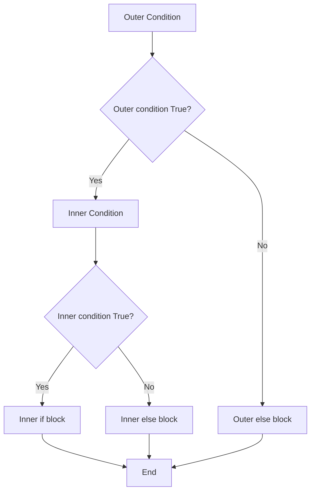

**Diagram Explanation**: This diagram illustrates the structure of nested conditional statements, showing how inner conditions are evaluated only when outer conditions are True.

### Nested Conditional Examples

**Number Classification**: Checking if a number is positive and then whether it's even or odd
```python
num = 10

if num > 0:  # Check whether the number is positive or negative
    if num % 2 == 0:  # Modulus operator, remainder 0 = even number
        print("The number is positive and even.")
    else:  # remainder 1 = odd number
        print("The number is positive and odd.")
else:
    print("The number is negative.")
# Output: The number is positive and even.
```

**Calculator with Error Handling**: Nested conditions for division by zero
```python
operation = input("Enter the operation (+, -, *, /): ")
num1 = float(input("Enter the first number: "))
num2 = float(input("Enter the second number: "))

if operation == '+':
    result = num1 + num2
elif operation == '-':
    result = num1 - num2
elif operation == '*':
    result = num1 * num2
elif operation == '/':
    if num2 != 0:  # Nested condition
        result = num1 / num2
    else:
        result = "Error: Division by zero."
else:
    result = "Invalid operation."

print("Result:", result)
```

### Best Practices for Nested Conditionals

1. **Limit Nesting Depth**: Avoid more than 3-4 levels of nesting
2. **Use elif Chains**: Prefer elif over nested if statements when possible
3. **Early Returns**: Use early returns to reduce nesting
4. **Clear Variable Names**: Use descriptive names for conditions
5. **Comments**: Add comments for complex logic

---

## Match-Case Statement

The match-case statement was introduced in Python 3.10 as a way to implement structural pattern matching. It provides a cleaner and more readable alternative to traditional if-elif-else chains for certain use cases.

### Match-Case Structure

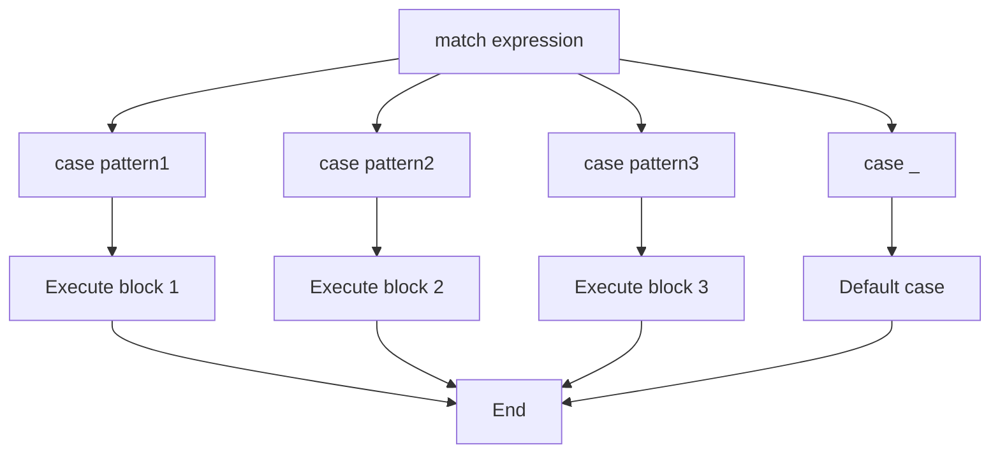

**Diagram Explanation**: This diagram shows the structure of match-case statements, illustrating how different patterns are matched and the corresponding code blocks are executed.

### Match-Case Examples

**HTTP Status Code Checker**: Using match-case for status code handling
```python
def check_status(code):
    match code:
        case 200:
            print("OK")
        case 400:
            print("Bad Request")
        case 404:
            print("Not Found")
        case _:  # Default case (wildcard)
            print("Unknown Status")

check_status(200)  # Output: OK
check_status(404)  # Output: Not Found
check_status(500)  # Output: Unknown Status
```

**Pattern Matching with Values**: Matching specific values
```python
def process_command(command):
    match command:
        case "start":
            print("Starting the application...")
        case "stop":
            print("Stopping the application...")
        case "restart":
            print("Restarting the application...")
        case _:
            print("Unknown command")

process_command("start")  # Output: Starting the application...
```

### Match-Case vs if-elif-else

| Aspect | match-case | if-elif-else |
|--------|------------|--------------|
| **Readability** | More readable for pattern matching | More flexible for complex conditions |
| **Performance** | Optimized for pattern matching | General purpose |
| **Python Version** | Python 3.10+ | All Python versions |
| **Use Case** | Pattern matching, value comparison | Complex boolean logic |

---

## Introduction to Loops

Loops are used to repeat a block of code multiple times. Python supports two main types of loops: for loops and while loops. Each type has specific use cases and advantages.

### Loop Types Overview

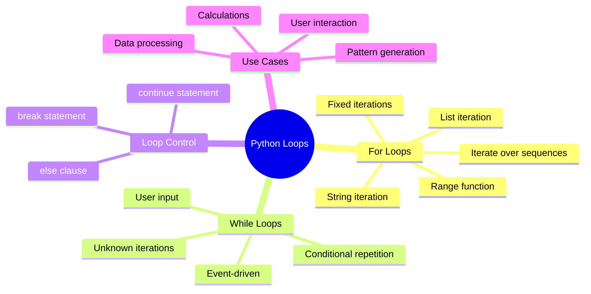

**Diagram Explanation**: This mind map categorizes Python loops into for loops (for fixed iterations) and while loops (for conditional repetition), showing their characteristics and use cases.

### When to Use Each Loop Type

**For Loops** - Use when you know the number of iterations:
- **Grading a class of students**: You have a list of 30 students and want to calculate the average score for each student
- **Washing Machine**: Number of spins is predetermined
- **Microwave Oven**: Cooking time is set

**While Loops** - Use when you don't know the number of iterations:
- **Filling up a gas tank**: You want to fill up your gas tank until it's full
- **Air Conditioner**: Runs until desired temperature is reached
- **Washing Machine**: Filling water until the tank is full

---

## For Loops

For loops are used to iterate over a sequence (like a list, string, or range) and execute a block of code for each item. They are ideal when you know the number of iterations in advance.

### For Loop Structure

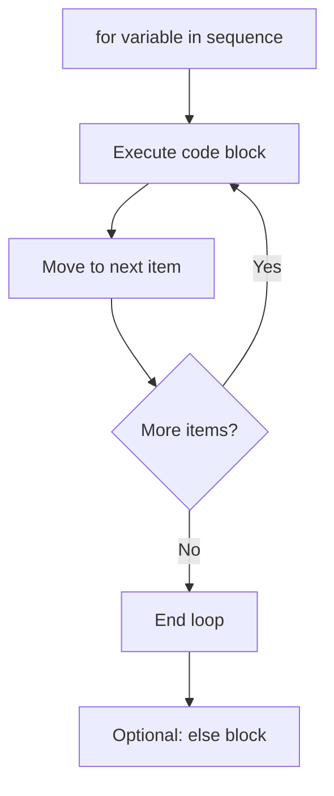

**Diagram Explanation**: This diagram shows the flow of a for loop, illustrating how it iterates through a sequence and executes the code block for each item.

### For Loop Examples

**Iterating over a List**: Processing each item in a list
```python
fruits = ["apple", "banana", "cherry"]
for fruit in fruits:
    print(fruit)
# Output:
# apple
# banana
# cherry
```

**Iterating over a String**: Processing each character in a string
```python
word = "Python"
for letter in word:
    print(letter)
# Output:
# P
# y
# t
# h
# o
# n
```

**Using range() Function**: Generating sequences of numbers
```python
# Print numbers from 0 to 4
for i in range(5):
    print(i)
# Output: 0, 1, 2, 3, 4

# Print even numbers from 2 to 10
for i in range(2, 11, 2):
    print(i)
# Output: 2, 4, 6, 8, 10
```

### For Loop with else

In Python, a for loop can have an else block. The else block runs only if the loop completes without a break statement.

**For Loop with else (No break)**:
```python
numbers = [1, 2, 3, 4, 5]

for num in numbers:
    print(num)
else:
    print("Loop completed successfully!")
# Output:
# 1
# 2
# 3
# 4
# 5
# Loop completed successfully!
```

**For Loop with break (Skipping else)**:
```python
numbers = [1, 2, 3, 4, 5]

for num in numbers:
    print(num)
    if num == 3:
        print("Breaking the loop!")
        break
else:
    print("Loop completed successfully!")  # This will NOT run
# Output:
# 1
# 2
# 3
# Breaking the loop!
```

**Searching with else**:
```python
numbers = [1, 2, 3, 4, 5]

for num in numbers:
    if num == 6:
        print("Number found!")
        break
else:
    print("Number not found!")  # Runs because 6 is not in the list
# Output: Number not found!
```

### Throwaway Variable

The underscore (`_`) is a common Python convention for a variable that you don't plan to use:

```python
for _ in range(10):  # Just to show that _ is a loop variable, but it's a throwaway variable
    print("Hello, World!")
# Output: "Hello, World!" printed 10 times
```

---

## While Loops

While loops repeat a block of code as long as a condition is True. They are ideal when you don't know the number of iterations in advance and need to continue until a specific condition is met.

### While Loop Structure

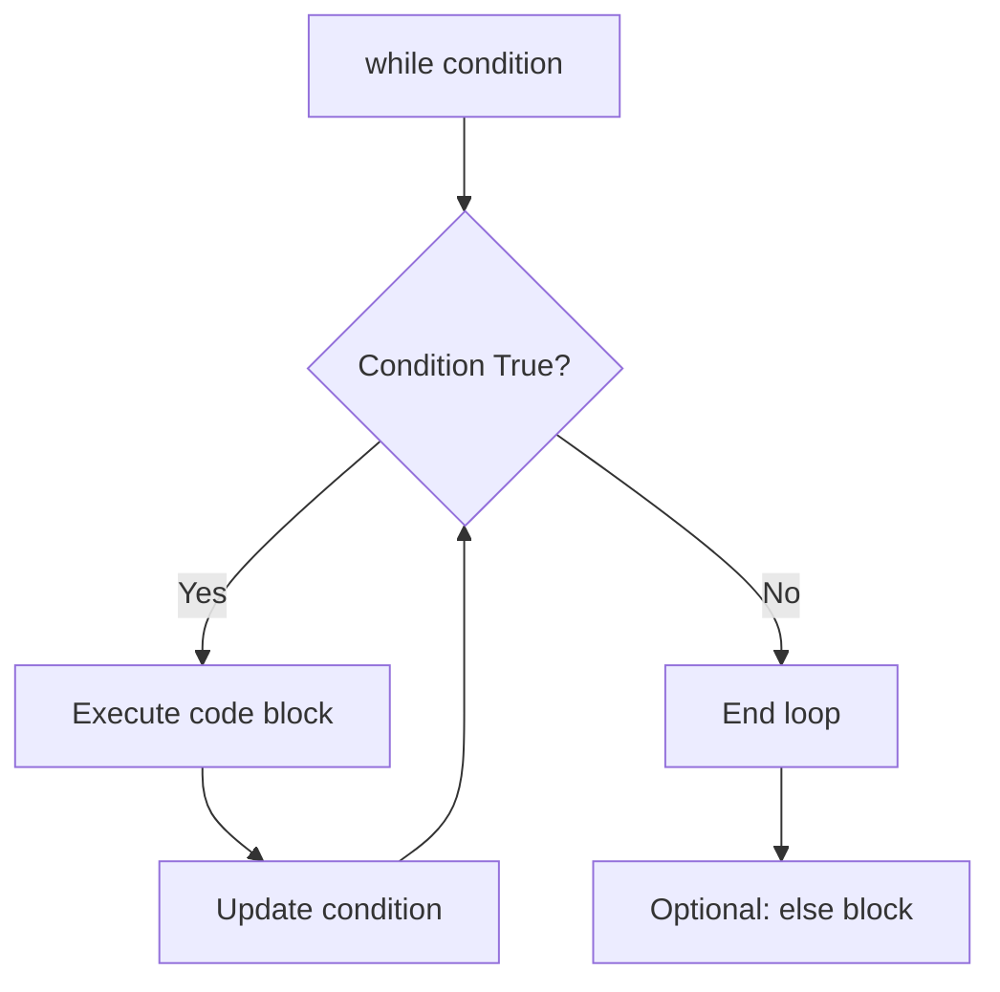

**Diagram Explanation**: This diagram illustrates the flow of a while loop, showing how it continues executing as long as the condition remains True.

### While Loop Examples

**Basic While Loop**: Counting from 1 to 5
```python
count = 1
while count <= 5:
    print(count)
    count += 1
# Output: 1, 2, 3, 4, 5
```

**User Input Loop**: Continuing until user enters 'quit'
```python
while True:
    user_input = input("Enter a command (or 'quit' to exit): ")
    if user_input.lower() == 'quit':
        break
    print(f"You entered: {user_input}")
```

**Conditional While Loop**: Processing until a condition is met
```python
number = 1
while number < 100:
    print(number)
    number *= 2
# Output: 1, 2, 4, 8, 16, 32, 64
```

### While Loop with else

Similar to for loops, while loops can also have an else block:

```python
count = 1
while count <= 3:
    print(f"Count: {count}")
    count += 1
else:
    print("While loop completed successfully!")
# Output:
# Count: 1
# Count: 2
# Count: 3
# While loop completed successfully!
```

---

## Loop Control Statements

Python provides two keywords to control the flow of loops: `break` and `continue`. These statements allow you to modify the normal execution flow of loops.

### Loop Control Flow

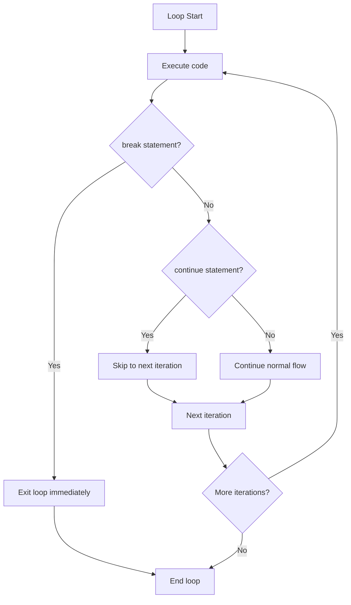

**Diagram Explanation**: This diagram shows how break and continue statements affect the flow of loops, with break exiting the loop and continue skipping to the next iteration.

### break Statement

The break statement exits the loop immediately, regardless of the loop condition.

**Break Example**:
```python
for i in range(10):
    if i == 5:
        break
    print(i)  # Prints 0, 1, 2, 3, 4
# Output: 0, 1, 2, 3, 4
```

**Break in While Loop**:
```python
count = 0
while count < 10:
    if count == 5:
        break
    print(count)
    count += 1
# Output: 0, 1, 2, 3, 4
```

### continue Statement

The continue statement skips the rest of the code in the current iteration and moves to the next iteration.

**Continue Example**:
```python
for i in range(5):
    if i == 3:
        continue
    print(i)  # Prints 0, 1, 2, 4
# Output: 0, 1, 2, 4
```

**Continue in While Loop**:
```python
count = 0
while count < 5:
    count += 1
    if count == 3:
        continue
    print(count)
# Output: 1, 2, 4, 5
```

### Practical Examples

**Finding First Even Number**:
```python
numbers = [1, 3, 5, 8, 9, 12]
for num in numbers:
    if num % 2 == 0:
        print(f"First even number found: {num}")
        break
# Output: First even number found: 8
```

**Skipping Negative Numbers**:
```python
numbers = [-2, 1, -3, 4, -5, 6]
for num in numbers:
    if num < 0:
        continue
    print(num)
# Output: 1, 4, 6
```

---

## Nested Loops

Nested loops are loops placed inside other loops. The inner loop will iterate through its entire cycle for each iteration of the outer loop. They are useful for working with multi-dimensional data and complex patterns.

### Nested Loop Structure

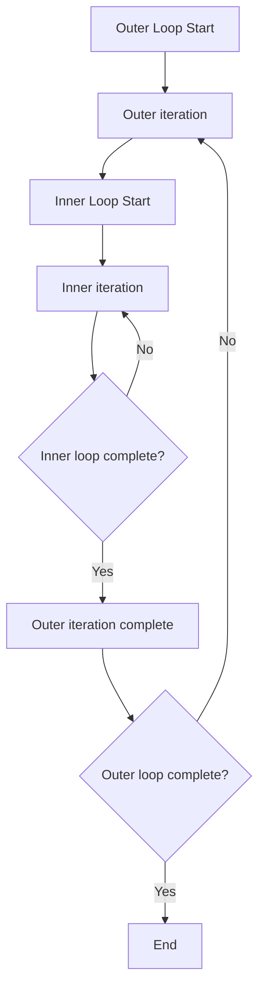

**Diagram Explanation**: This diagram illustrates how nested loops work, showing that the inner loop completes all its iterations for each iteration of the outer loop.

### Nested Loop Examples

**Multiplication Table**: Creating a multiplication table using nested loops
```python
for outer in range(1, 6):  # outer loop
    print(f"Multiplication table for {outer}:")
    for inner in range(1, 6):  # nested inner loop
        print(f"{outer} * {inner} = {outer * inner}")
    print()  # Add a blank line after each row
# Output:
# Multiplication table for 1:
# 1 * 1 = 1
# 1 * 2 = 2
# 1 * 3 = 3
# 1 * 4 = 4
# 1 * 5 = 5
# 
# Multiplication table for 2:
# 2 * 1 = 2
# 2 * 2 = 4
# ... and so on
```

**Pattern Generation**: Creating patterns with nested loops
```python
# Triangle pattern
for i in range(1, 6):
    for j in range(i):
        print("*", end="")
    print()
# Output:
# *
# **
# ***
# ****
# *****
```

**Matrix Operations**: Working with 2D data
```python
matrix = [[1, 2, 3], [4, 5, 6], [7, 8, 9]]

for row in matrix:
    for element in row:
        print(element, end=" ")
    print()
# Output:
# 1 2 3
# 4 5 6
# 7 8 9
```

### Use Cases for Nested Loops

1. **Matrix Operations**: When working with matrices, you often need to iterate over each element in a two-dimensional array
2. **Iterating over Multiple Lists**: If you have multiple lists and want to perform operations on each combination of elements
3. **Games and Simulations**: Nested loops can be used to create game boards, simulate complex systems, or iterate over multiple levels of data
4. **Data Processing**: When dealing with large datasets, nested loops can help you process and analyze the data by iterating over each element and performing operations

### Best Practices for Nested Loops

1. **Minimize Nesting**: Try to limit the number of nested loops to three levels or less, as excessive nesting can lead to performance degradation and decreased readability
2. **Use Meaningful Variable Names**: Use clear and descriptive variable names to help distinguish between the outer and inner loops
3. **Optimize Loop Conditions**: Ensure that the loop conditions are optimized to minimize unnecessary iterations
4. **Consider Alternatives**: Sometimes list comprehensions or built-in functions can replace nested loops for better performance

---

## Practical Examples

Here are comprehensive practical examples that demonstrate the concepts covered in this lesson.

### Example 1: Advanced Calculator

**Enhanced Calculator with Multiple Operations**:
```python
def calculator():
    """
    A calculator function that takes user input for numbers and operations,
    including modulus, floor division, and exponentiation.
    """
    while True:
        operation = input("Enter the operation (+, -, *, /, %, //, ** or 'q' to quit): ")
        if operation.lower() == 'q':
            break
        if operation not in ('+', '-', '*', '/', '%', '//', '**'):
            print("Invalid operation.")
            continue

        try:
            num1 = float(input("Enter the first number: "))
            num2 = float(input("Enter the second number: "))
        except ValueError:
            print("Invalid input. Please enter numbers only.")
            continue

        if operation == '+':
            result = num1 + num2
        elif operation == '-':
            result = num1 - num2
        elif operation == '*':
            result = num1 * num2
        elif operation == '/':
            if num2 != 0:
                result = num1 / num2
            else:
                result = "Error: Division by zero."
                print(result)
                continue
        elif operation == '%':
            result = num1 % num2
        elif operation == '//':
            if num2 != 0:
                result = num1 // num2
            else:
                result = "Error: Division by zero."
                print(result)
                continue
        elif operation == '**':
            result = num1 ** num2

        print("Result:", result)

calculator()
```

### Example 2: Sum of Numbers

**Calculating Sum from 1 to 100**:
```python
# Sum numbers from 1 to 100
total = 0
for i in range(1, 101):
    total += i
print("Sum of numbers from 1 to 100:", total)
# Output: Sum of numbers from 1 to 100: 5050
```

### Example 3: Finding Factors

**Finding All Factors of a Number**:
```python
# Find factors of a number
num = 24
factors = []
for i in range(1, num + 1):
    if num % i == 0:
        factors.append(i)
print(f"Factors of {num}: {factors}")
# Output: Factors of 24: [1, 2, 3, 4, 6, 8, 12, 24]
```

### Example 4: Number Guessing Game

**Interactive Number Guessing Game**:
```python
import random

def number_guessing_game():
    secret_number = random.randint(1, 100)
    attempts = 0
    max_attempts = 7
    
    print("Welcome to the Number Guessing Game!")
    print("I'm thinking of a number between 1 and 100.")
    print(f"You have {max_attempts} attempts to guess it.")
    
    while attempts < max_attempts:
        try:
            guess = int(input(f"Attempt {attempts + 1}: Enter your guess: "))
            attempts += 1
            
            if guess == secret_number:
                print(f"Congratulations! You guessed it in {attempts} attempts!")
                break
            elif guess < secret_number:
                print("Too low! Try again.")
            else:
                print("Too high! Try again.")
                
        except ValueError:
            print("Please enter a valid number.")
            attempts -= 1  # Don't count invalid attempts
    
    else:
        print(f"Game over! The secret number was {secret_number}.")

number_guessing_game()
```

---

## Key Concepts Covered

This lesson covered the fundamental aspects of control flow and loops in Python:

### Key Concepts Overview

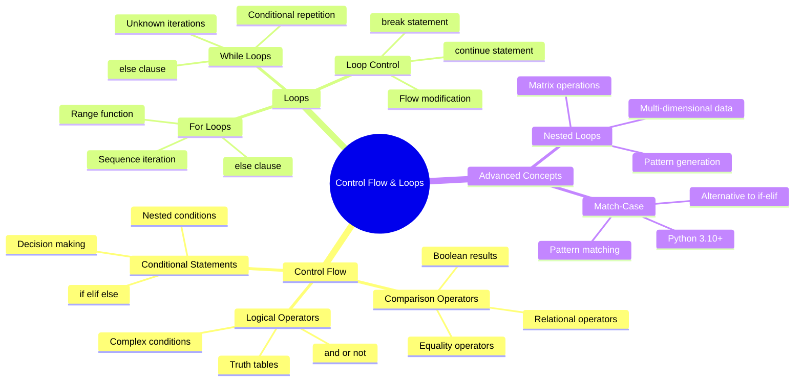

**Diagram Explanation**: This mind map provides a comprehensive overview of all the topics covered in this lesson, showing the hierarchical relationship between control flow concepts and loop structures.

### Best Practices

1. **Conditional Statements**:
   - Use clear and descriptive condition names
   - Limit nesting depth to 3-4 levels
   - Prefer elif chains over nested if statements
   - Use early returns to reduce complexity

2. **For Loops**:
   - Use for loops when you know the number of iterations
   - Use meaningful variable names for loop variables
   - Consider using enumerate() for index and value
   - Use range() for numeric sequences

3. **While Loops**:
   - Use while loops for unknown iterations
   - Always ensure the condition will eventually become False
   - Use break statements to exit infinite loops safely
   - Update loop variables to prevent infinite loops

4. **Nested Loops**:
   - Limit nesting to 3 levels maximum
   - Use descriptive variable names for outer and inner loops
   - Consider alternatives like list comprehensions
   - Optimize loop conditions for performance

5. **General**:
   - Use comments to explain complex logic
   - Test edge cases and boundary conditions
   - Handle exceptions appropriately
   - Choose the right loop type for your use case

### Common Pitfalls

1. **Infinite Loops**: Forgetting to update loop variables in while loops
2. **Off-by-One Errors**: Incorrect range boundaries in for loops
3. **Indentation Errors**: Incorrect indentation in conditional statements and loops
4. **Logic Errors**: Incorrect use of logical operators (and vs or)
5. **Performance Issues**: Excessive nesting or inefficient loop conditions

---

## Useful Links

- [Python Control Flow Documentation](https://docs.python.org/3/tutorial/controlflow.html)
- [Python Loops Documentation](https://docs.python.org/3/tutorial/controlflow.html#for-statements)
- [Comparison Operators](https://docs.python.org/3/library/stdtypes.html#comparisons)
- [Logical Operators](https://docs.python.org/3/library/stdtypes.html#boolean-operations-and-or-not)
- [Match-Case Statement](https://docs.python.org/3/tutorial/controlflow.html#match-statements)
- [Range Function](https://docs.python.org/3/library/stdtypes.html#range)
- [Break and Continue](https://docs.python.org/3/tutorial/controlflow.html#break-and-continue-statements-and-else-clauses-on-loops)
- [Python Style Guide (PEP 8)](https://peps.python.org/pep-0008/)

---

*This lesson provides a comprehensive understanding of control flow and loops in Python, essential for creating dynamic and interactive programs that can make decisions and repeat operations efficiently.*