# [Lesson 06: Lists, Tuples & Dictionary](https://colab.research.google.com/drive/1yPH2ErmQWlOli9HZR1l2EBUB5FIGY-tZ?usp=sharing)

## Table of Contents
1. [Introduction to Data Structures](#introduction-to-data-structures)
2. [Lists in Python](#lists-in-python)
3. [List Operations](#list-operations)
4. [List Methods](#list-methods)
5. [List Iteration and Comprehension](#list-iteration-and-comprehension)
6. [Tuples in Python](#tuples-in-python)
7. [Tuple Operations](#tuple-operations)
8. [Type Hinting](#type-hinting)
9. [Dictionaries in Python](#dictionaries-in-python)
10. [Dictionary Operations](#dictionary-operations)
11. [Dictionary Methods](#dictionary-methods)
12. [Dictionary Iteration](#dictionary-iteration)
13. [Dictionary Comprehensions](#dictionary-comprehensions)
14. [Practical Examples](#practical-examples)
15. [Key Concepts Covered](#key-concepts-covered)
16. [Best Practices](#best-practices)
17. [Useful Links](#useful-links)

---

## Introduction to Data Structures

Python provides powerful built-in data structures for storing and managing collections of data. The three main sequence types are lists, tuples, and dictionaries, each with unique characteristics and use cases.

### Data Structure Overview

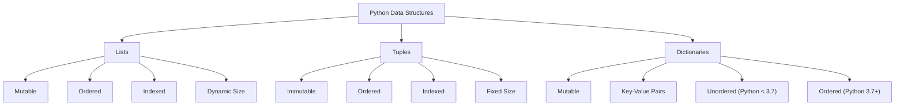

**Diagram Explanation**: This diagram illustrates the three main Python data structures and their key characteristics, showing the differences between mutable/immutable, ordered/unordered, and indexed/key-value structures.

---

## Lists in Python

Lists are ordered, mutable collections that can store elements of different data types. They are one of the most versatile and commonly used data structures in Python.

### List Characteristics

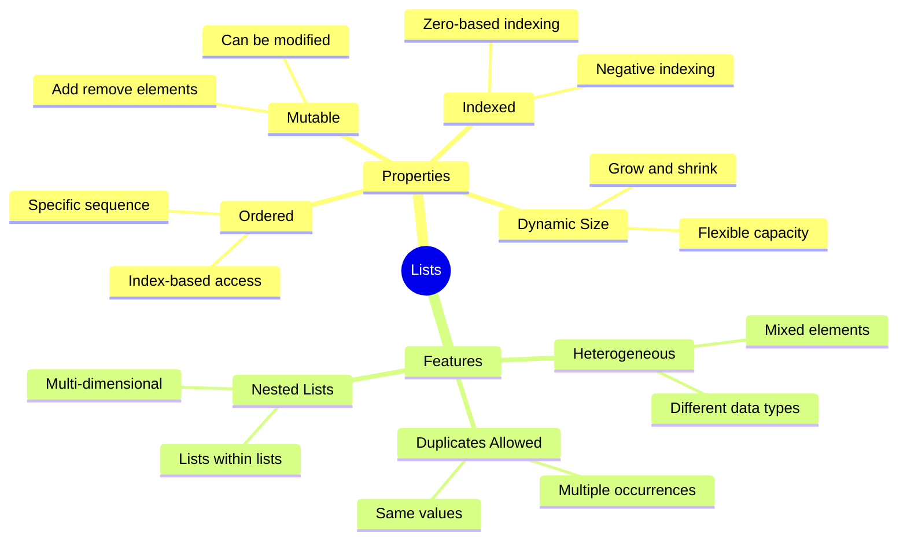

**Diagram Explanation**: This mind map shows the key characteristics and features of lists in Python, highlighting their flexibility and versatility as a data structure.

### Creating Lists

**Basic List Creation**: Creating lists with different data types
```python
# Creating lists with different data types
fruits = ["apple", "banana", "cherry"]
numbers = [10, 20, 30, 40]
mixed = ["hello", 42, 3.14, True]

print("fruits  =", fruits)   # ['apple', 'banana', 'cherry']
print("numbers =", numbers)  # [10, 20, 30, 40]
print("mixed   =", mixed)    # ['hello', 42, 3.14, True]
```

**List Characteristics**:
1. **Ordered**: Items have a specific order and can be accessed by index
2. **Mutable**: Can be modified after creation
3. **Indexed**: Each item has a specific index (starting from 0)
4. **Dynamic Size**: Can grow or shrink as elements are added/removed
5. **Heterogeneous**: Can contain different data types
6. **Supports Duplicates**: Can contain duplicate values

---

## List Operations

Lists support various operations for accessing, modifying, and manipulating elements.

### List Access and Modification

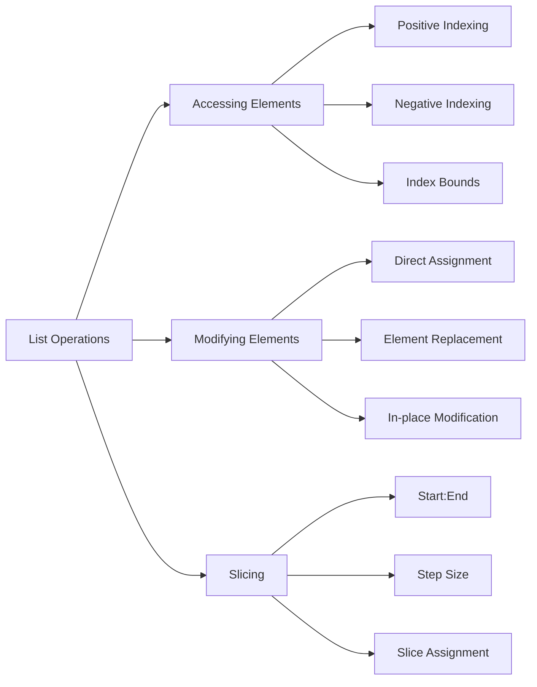

**Diagram Explanation**: This diagram categorizes list operations into accessing elements, modifying elements, and slicing, showing the different methods available for each category.

### List Access Examples

**Indexing**: Accessing elements using positive and negative indices
```python
fruits = ["apple", "banana", "cherry"]
print(fruits[0])    # Output: apple (first element)
print(fruits[-3])   # Output: apple (accessing element in reverse order)
print(fruits[1])    # Output: banana (second element)
print(fruits[-1])   # Output: cherry (last element)
```

**Modifying Elements**: Changing list elements
```python
fruits = ["apple", "banana", "cherry"]
fruits[-3] = "watermelon"  # replacing "apple" with "watermelon"
print(fruits)  # Output: ['watermelon', 'banana', 'cherry']
```

**Slicing**: Extracting multiple elements
```python
fruits = ["watermelon", "banana", "cherry"]
print(fruits[0:2])  # Output: ['watermelon', 'banana'] (elements 0 and 1)
print(fruits[:2])   # Output: ['watermelon', 'banana'] (from start to index 1)
print(fruits[1:])   # Output: ['banana', 'cherry'] (from index 1 to end)
```

---

## List Methods

Lists provide numerous built-in methods for efficient data manipulation, including adding, removing, and organizing elements.

### List Methods Categories

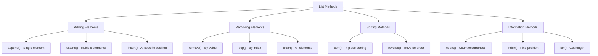

**Diagram Explanation**: This diagram categorizes list methods into adding elements, removing elements, sorting methods, and information methods, showing the specific functions available for each category.

### Adding Elements

**append() Method**: Adds a single element to the end
```python
fruits = ["watermelon", "banana", "cherry"]
fruits.append("mango")  # Adds a single element 'mango' to the end
print(fruits)  # Output: ['watermelon', 'banana', 'cherry', 'mango']
```

**extend() Method**: Adds multiple elements
```python
fruits = ["watermelon", "banana", "cherry", "mango"]
fruits.extend(["grape", "kiwi"])  # Adds multiple elements
print(fruits)  # Output: ['watermelon', 'banana', 'cherry', 'mango', 'grape', 'kiwi']
```

### Removing Elements

**remove() vs pop() Methods**: Different approaches to removing elements

**remove() Method**: Removes by value
```python
fruits = ["watermelon", "banana", "cherry", "mango", "grape", "kiwi"]
fruits.remove("banana")  # Removes 'banana' by value
print(fruits)  # Output: ['watermelon', 'cherry', 'mango', 'grape', 'kiwi']
```

**Key aspects of remove()**:
- **Value-based**: Searches for a specific value in the list
- **Returns None**: Does not return any value
- **Raises ValueError**: If the value is not found

**pop() Method**: Removes by index
```python
fruits = ["watermelon", "cherry", "mango", "grape", "kiwi"]
deleted = fruits.pop(1)  # Removes and returns the element at index 1
print("deleted element =", deleted)  # Output: 'cherry'
print(fruits)  # Output: ['watermelon', 'mango', 'grape', 'kiwi']
```

**Key aspects of pop()**:
- **Index-based**: Searches for an item at a specific index
- **Returns the removed item**: Returns the item that was removed
- **Raises IndexError**: If the index is out of range

### Sorting Methods

**Default Sorting (Ascending Order)**:
```python
numbers = [3, 1, 4, 1, 5, 9]  # unsorted list
numbers.sort()
print(numbers)  # Output: [1, 1, 3, 4, 5, 9]
```

**Sorting in Descending Order**:
```python
numbers = [4, 2, 9, 1]
numbers.sort(reverse=True)
print(numbers)  # Output: [9, 4, 2, 1]
```

**Sorting by String Length**:
```python
words = ["apple", "kiwi", "banana"]
words.sort(key=len)
print(words)  # Output: ['kiwi', 'apple', 'banana']
```

**Sorting by Last Character**:
```python
words = ["apple", "kiwi", "banana"]
words.sort(key=lambda word: word[-1])
print(words)  # Output: ['banana', 'apple', 'kiwi']  # Sorted by last letter
```

**Reverse Order**:
```python
numbers = [1, 2, 5, 7, 10]
numbers.reverse()
print(numbers)  # Output: [10, 7, 5, 2, 1]
```

---

## List Iteration and Comprehension

Lists can be iterated using loops and created efficiently using list comprehensions, which provide a concise and readable way to generate new lists.

### List Iteration Methods

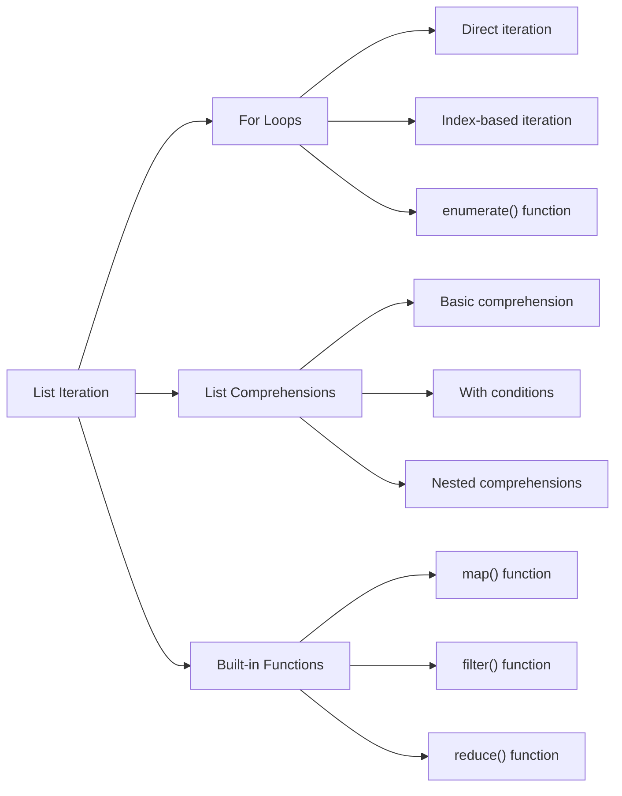

**Diagram Explanation**: This diagram shows the different methods for iterating over lists, including traditional loops, list comprehensions, and built-in functions.

### For Loop Iteration

**Basic For Loop**: Iterating through list elements
```python
fruits = ["watermelon", "mango", "grape", "kiwi"]
for fruit in fruits:
    print(fruit)
# Output:
# watermelon
# mango
# grape
# kiwi
```

### List Comprehensions

List comprehension is a powerful feature that allows you to create new lists in a concise and readable way.

**Basic Syntax**:
```python
new_list = [expression for element in iterable if condition]
```

**Basic List Comprehension**:
```python
# Without if condition
squared = [x**2 for x in [1, 2, 3, 4, 5]]
print(squared, ":", type(squared))  # Output: [1, 4, 9, 16, 25] : <class 'list'>
```

**List Comprehension with Condition**:
```python
# With if condition
squared = [x**2 for x in [1, 2, 3, 4, 5] if x > 3]
print(squared, ":", type(squared))  # Output: [16, 25] : <class 'list'>
```

**List Comprehension Use Cases**:
- **Transforming data**: Convert data from one format to another
- **Filtering data**: Remove unwanted data based on conditions
- **Creating new data**: Generate new data by combining existing data

---

## Tuples in Python

Tuples are ordered, immutable sequences of elements. They are useful for storing fixed data collections that should not be modified after creation.

### Tuple Characteristics

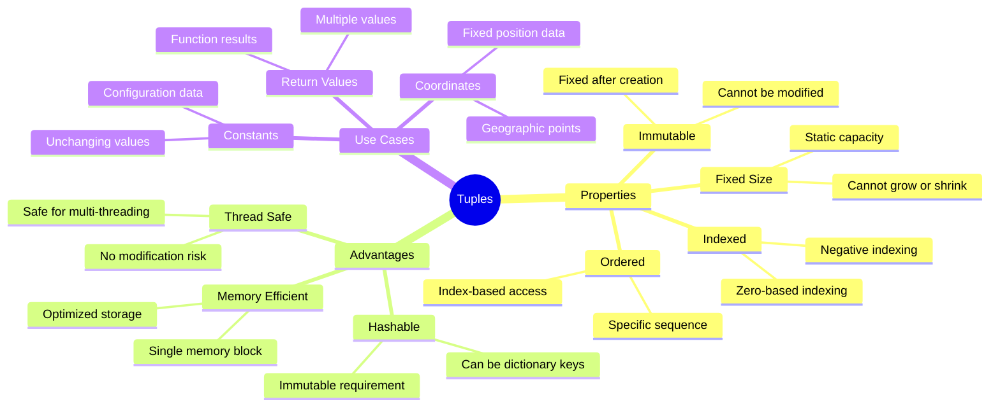

**Diagram Explanation**: This mind map illustrates the characteristics, advantages, and use cases of tuples, highlighting why they are preferred for fixed data collections.

### Creating Tuples

**Basic Tuple Creation**: Different ways to create tuples
```python
# Creating tuples with different methods
tuple1 = tuple(["apple", "banana", "cherry"])  # cast a list into tuple
tuple2 = (10, 20, 30)  # tuple literal
mixed_tuple = ("hello", 42, 3.14, True)  # mixed data types

print("tuple1      =", tuple1)      # ('apple', 'banana', 'cherry')
print("tuple2      =", tuple2)      # (10, 20, 30)
print("mixed_tuple =", mixed_tuple)  # ('hello', 42, 3.14, True)
```

### Why Use Tuples?

1. **Immutable**: Since tuples cannot be changed, they are safer to use when you want to ensure that the data remains constant
2. **Hashable**: Tuples can be used as keys in dictionaries because they are immutable
3. **Performance**: Tuples are generally faster than lists because of their immutability

### When to Use Tuples vs Lists

- **Use tuples** when you want to store data that should not change (e.g., coordinates, constants)
- **Use lists** when you need a collection that can be modified (e.g., adding or removing elements)

---

## Tuple Operations

Tuples support various operations for accessing and manipulating elements, though they cannot be modified after creation.

### Tuple Operations Overview

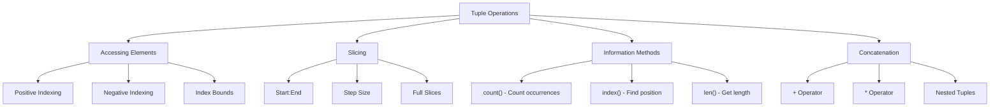

**Diagram Explanation**: This diagram shows the operations available for tuples, including accessing elements, slicing, information methods, and concatenation operations.

### Tuple Access and Information

**Accessing Elements**: Using indexing and slicing
```python
tuple1 = ("apple", "banana", "cherry")
print(tuple1[0])    # Output: apple
print(tuple1[-3])   # Output: apple
print(tuple1[1:])   # Output: ('banana', 'cherry')
print("Length of tuple1:", len(tuple1))  # Output: 3
```

**Tuple Methods**: Only two methods available
```python
tuple1 = ("apple", "banana", "cherry")
print(tuple1.count("apple"))  # Output: 1
print(tuple1.index("apple"))  # Output: 0
```

**Tuple Concatenation and Repetition**:
```python
tuple1 = ("apple", "banana", "cherry")
tuple2 = (10, 20, 30)

# Concatenating tuples
tuple3 = tuple1 + tuple2
print("tuple1 + tuple2 =", tuple3)  # Output: ('apple', 'banana', 'cherry', 10, 20, 30)

# Repeating tuples
tuple4 = tuple2 * 2
print("tuple2 * 2 =", tuple4)  # Output: (10, 20, 30, 10, 20, 30)
```

**Tuple Unpacking**: Assigning tuple elements to variables
```python
tuple1 = ("apple", "banana", "cherry")
a, b, c = tuple1
print("Unpacking tuple1:", a, b, c)  # Output: Unpacking tuple1: apple banana cherry
```

**Using Tuples as Dictionary Keys**: Because tuples are immutable
```python
my_dict = {tuple1: "This is a tuple key", tuple2: "Another tuple key"}
print("Dictionary with tuple keys:", my_dict)
```

### Why Tuples Are Immutable

1. **Memory Efficiency**: Immutable tuples can be stored in a single block of memory, making them more memory-efficient than lists
2. **Thread Safety**: Immutable tuples are thread-safe, meaning they can be safely accessed and shared between multiple threads without fear of modification
3. **Hashability**: Immutable tuples are hashable, meaning they can be used as keys in dictionaries

---

## Type Hinting

Type hinting in Python allows you to specify the expected data type of variables, function parameters, and return values. While not enforced at runtime, they provide documentation and help with code analysis tools.

### Type Hinting Concepts

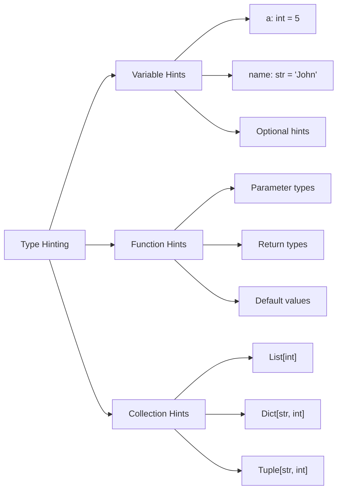

**Diagram Explanation**: This diagram shows the different types of type hints available in Python, including variable hints, function hints, and collection hints.

### Type Hinting Examples

**Variable Type Hints**: Specifying expected types
```python
# Type hints for variables
a: int = 5
name: str = "John"
is_active: bool = True
```

**Important Note**: Type hints are not enforced at runtime
```python
a: int = input("Enter your name: ")  # Type hint suggests int, but input() returns str
print(a, type(a))  # Output: Arif Rozani <class 'str'>
```

**Collection Type Hints**: Specifying types for collections
```python
# List type hints
numbers: list[int] = [1, 2, 3, 4, 5]
fruits: list[str] = ["apple", "banana", "cherry"]

# Tuple type hints
coordinates: tuple[int, int] = (10, 20)
mixed_tuple: tuple[str, int, float] = ("hello", 42, 3.14)
```

---

## Dictionaries in Python

Dictionaries are collections of key-value pairs that provide efficient data storage and retrieval. They are ordered (since Python 3.7), mutable, and use keys for accessing values instead of indices.

### Dictionary Characteristics

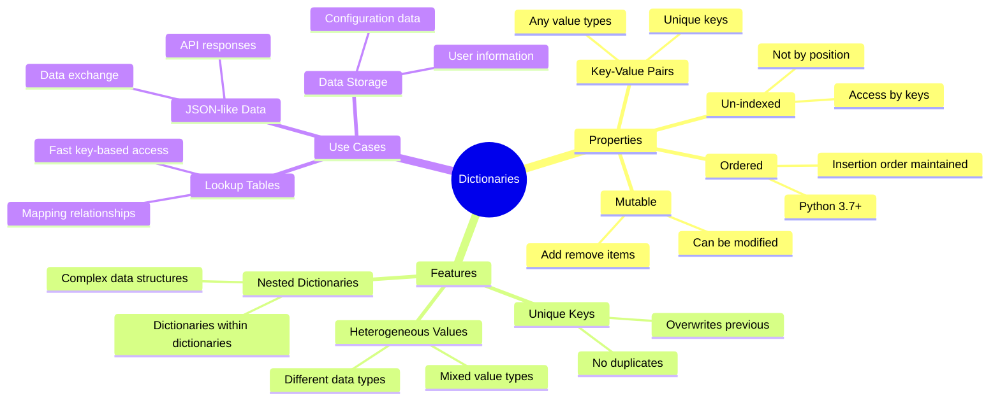

**Diagram Explanation**: This mind map illustrates the characteristics, features, and use cases of dictionaries, showing why they are essential for key-value data storage.

### Creating Dictionaries

**Basic Dictionary Creation**: Different methods to create dictionaries
```python
# Create a dictionary to store a person's details
person = {
    "name": "Alice",
    "age": 25,
    "visited_cities": ["New York", "Los Angeles", "Chicago", "Houston", "Phoenix"]
}
print(person)  # Output: {'name': 'Alice', 'age': 25, 'visited_cities': [...]}

# Using dict() constructor
thisdict = dict(name="John", age=36, country="Norway")
print(type(thisdict), "-", thisdict)  # Output: <class 'dict'> - {'name': 'John', 'age': 36, 'country': 'Norway'}
```

**Dictionary Characteristics**:
- **Ordered (since Python 3.7)**: Items are stored in the order they were inserted
- **Mutable**: Items can be added, removed, or modified after creation
- **Un-indexed**: Items are accessed using keys, not indices
- **Without duplicates**: Keys must be unique, but values can be duplicated

---

## Dictionary Operations

Dictionaries support various operations for accessing, modifying, and manipulating key-value pairs.

### Dictionary Operations Overview

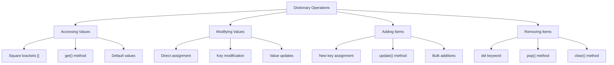

**Diagram Explanation**: This diagram categorizes dictionary operations into accessing values, modifying values, adding items, and removing items, showing the different methods available for each category.

### Accessing Values

**Square Bracket Access**: Direct key access
```python
person = {"name": "Alice", "age": 25, "visited_cities": ["New York", "Los Angeles"]}
print(person["name"])  # Output: Alice
```

**get() Method**: Safe access with default values
```python
print(person.get("age", "99"))  # Output: 25, if not found it will return 99 (default value)
print(person.get("country", "my_default_value_if_key_not_found"))  # Output: my_default_value_if_key_not_found
```

### Modifying and Adding Items

**Adding New Key-Value Pairs**:
```python
person["email"] = "alice@example.com"
print(person)  # Output: {'name': 'Alice', 'age': 25, 'visited_cities': [...], 'email': 'alice@example.com'}
```

**Modifying Existing Values**:
```python
person["age"] = 26
print(person)  # Output: {'name': 'Alice', 'age': 26, 'visited_cities': [...], 'email': 'alice@example.com'}
```

### Removing Items

**Using del Keyword**: Remove key-value pairs
```python
person = {'name': 'Alice', 'age': 25, 'email': 'alice@example.com', 'visited_cities': [...]}
del person["visited_cities"]
print(person)  # Output: {'name': 'Alice', 'age': 25, 'email': 'alice@example.com'}
```

**Using pop() Method**: Remove and return values
```python
age = person.pop("age", -1)
print("Removed age:", age)  # Output: Removed age: 25
print(person)  # Output: {'name': 'Alice', 'email': 'alice@example.com'}

# Remove non-existent key with default value
age = person.pop("age", -1)
print("key 'age' not found in dict so returning default value:", age)  # Output: key 'age' not found in dict so returning default value: -1
```

**Duplicate Keys**: Later keys overwrite previous ones
```python
thisdict = {
    "brand": "Ford",
    "model": "Mustang",
    "year": 1964,
    "year": 2020  # this will overwrite the previous key:value
}
print(thisdict)  # Output: {'brand': 'Ford', 'model': 'Mustang', 'year': 2020}
```

---

## Dictionary Methods

Python provides several useful methods for working with dictionaries, including accessing keys, values, and items, as well as updating and clearing dictionaries.

### Dictionary Methods Overview

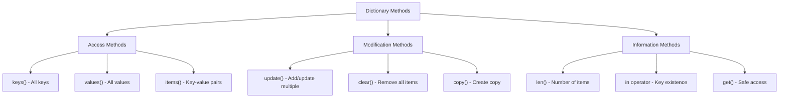

**Diagram Explanation**: This diagram categorizes dictionary methods into access methods, modification methods, and information methods, showing the specific functions available for each category.

### Dictionary Methods Examples

**Access Methods**: Getting keys, values, and items
```python
person = {'name': 'Alice', 'email': 'alice@example.com'}

# Get all keys
print("person.keys() =", person.keys())  # Output: dict_keys(['name', 'email'])

# Get all values
print("person.values() =", person.values())  # Output: dict_values(['Alice', 'alice@example.com'])

# Get all key-value pairs
print("person.items() =", person.items())  # Output: dict_items([('name', 'Alice'), ('email', 'alice@example.com')])
```

**Modification Methods**: Updating and clearing
```python
# Update the dictionary
person.update({"city": "Los Angeles", "age": 27})
print("After: person.update =", person)  # Output: {'name': 'Alice', 'email': 'alice@example.com', 'city': 'Los Angeles', 'age': 27}

# Clear the dictionary
person.clear()
print("After: person.clear() =", person)  # Output: {}
```

**Information Methods**: Checking existence and length
```python
person = {'name': 'Alice', 'age': 25, 'city': 'New York', 'country': 'USA'}

# Check if key exists
if "name" in person:
    print("Name exists")

# Get dictionary length
print("Length of the dictionary:", len(person))  # Output: 4
```

---

## Dictionary Iteration

Dictionaries can be iterated in several ways, allowing you to access keys, values, or both key-value pairs.

### Dictionary Iteration Methods

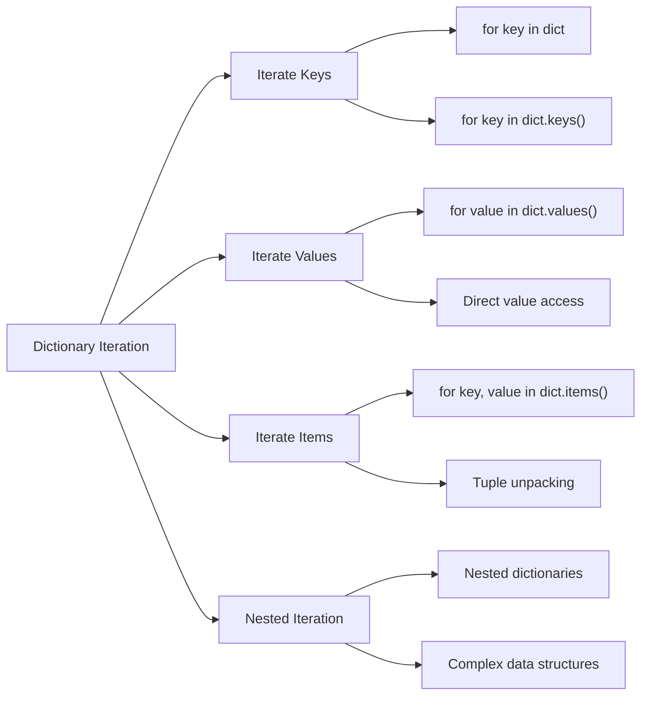

**Diagram Explanation**: This diagram shows the different methods for iterating over dictionaries, including iterating through keys, values, items, and nested structures.

### Dictionary Iteration Examples

**Iterating Through Keys**:
```python
thisdict = {"brand": "Ford", "model": "Mustang", "year": 2020}

for key in thisdict:
    print(key)
# Output:
# brand
# model
# year
```

**Iterating Through Key-Value Pairs**:
```python
for key, value in thisdict.items():
    print(key, ":", value)
# Output:
# brand : Ford
# model : Mustang
# year : 2020
```

**Iterating Through Values**:
```python
for value in thisdict.values():
    print(value)
# Output:
# Ford
# Mustang
# 2020
```

---

## Dictionary Comprehensions

Dictionary comprehensions provide a concise way to create dictionaries in Python, similar to list comprehensions but for key-value pairs.

### Dictionary Comprehension Structure

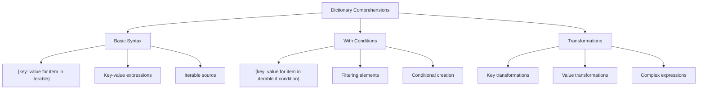

**Diagram Explanation**: This diagram illustrates the structure of dictionary comprehensions, showing basic syntax, conditional filtering, and transformation capabilities.

### Dictionary Comprehension Examples

**Basic Dictionary Comprehension**: Transforming existing dictionary
```python
original_dict = {'a': 1, 'b': 2, 'c': 3}
print("original_dict =", original_dict)

doubled_dict = {k: v*2 for k, v in original_dict.items()}
print("doubled_dict  =", doubled_dict)  # Output: {'a': 2, 'b': 4, 'c': 6}
```

**Temperature Conversion Example**: Converting Celsius to Fahrenheit
```python
celsius_temps = [0, 10, 20, 30, 40]
fahrenheit_temps = {str(c)+"c": str((c * 9/5) + 32)+"f" for c in celsius_temps}
print(fahrenheit_temps)  # Output: {'0c': '32.0f', '10c': '50.0f', '20c': '68.0f', '30c': '86.0f', '40c': '104.0f'}
```

**Dictionary Comprehension with Condition**:
```python
# Create dictionary with only even numbers
numbers = [1, 2, 3, 4, 5, 6, 7, 8, 9, 10]
even_squares = {x: x**2 for x in numbers if x % 2 == 0}
print(even_squares)  # Output: {2: 4, 4: 16, 6: 36, 8: 64, 10: 100}
```

---

## Practical Examples

Here are comprehensive practical examples that demonstrate the concepts covered in this lesson.

### Example 1: Phonebook Application

**Building a Phonebook**: Creating and managing a contact system
```python
# Create a phonebook
phonebook = {
    "Alice": "123-456-7890",
    "Bob": "987-654-3210",
    "Charlie": "555-555-5555"
}

# Add a new contact
phonebook["David"] = "111-222-3333"

# Search for a contact
name = input("Enter a name to search: ")
if name in phonebook:
    print(f"{name}'s phone number is {phonebook[name]}.")
else:
    print(f"{name} is not in the phonebook.")
```

### Example 2: Word Frequency Counter

**Counting Word Frequencies**: Analyzing text data
```python
sentence = """
The projected economy size of AI is significant, with estimates varying depending on the source and methodology. 
Here are some notable projections for AI market size and economic impact.
"""

# Count the frequency of words in a sentence
words = sentence.split()
word_count = {}

for word in words:
    if word in word_count:
        word_count[word] += 1
    else:
        word_count[word] = 1

print("Word frequencies:", word_count)

# Sort the word count by value in descending order
sorted_word_count = dict(sorted(word_count.items(), key=lambda item: item[1], reverse=True))
print("Sorted word frequencies:", sorted_word_count)
```

### Example 3: Student Grade Management

**Managing Student Grades**: Using nested data structures
```python
# Student grade management system
students = {
    "Alice": {
        "grades": [85, 92, 78, 96],
        "subjects": ["Math", "Science", "English", "History"]
    },
    "Bob": {
        "grades": [78, 85, 82, 90],
        "subjects": ["Math", "Science", "English", "History"]
    },
    "Charlie": {
        "grades": [92, 88, 95, 87],
        "subjects": ["Math", "Science", "English", "History"]
    }
}

# Calculate average grades for each student
for student_name, student_data in students.items():
    grades = student_data["grades"]
    average = sum(grades) / len(grades)
    print(f"{student_name}'s average grade: {average:.2f}")

# Find the student with the highest average
best_student = max(students.items(), key=lambda x: sum(x[1]["grades"]) / len(x[1]["grades"]))
print(f"Best performing student: {best_student[0]} with average {sum(best_student[1]['grades']) / len(best_student[1]['grades']):.2f}")
```

### Example 4: Shopping Cart System

**E-commerce Shopping Cart**: Managing product inventory and cart
```python
# Product inventory
inventory = {
    "laptop": {"price": 999.99, "stock": 10},
    "mouse": {"price": 29.99, "stock": 50},
    "keyboard": {"price": 79.99, "stock": 25},
    "monitor": {"price": 299.99, "stock": 15}
}

# Shopping cart
cart = {}

def add_to_cart(product, quantity):
    if product in inventory and inventory[product]["stock"] >= quantity:
        if product in cart:
            cart[product] += quantity
        else:
            cart[product] = quantity
        inventory[product]["stock"] -= quantity
        print(f"Added {quantity} {product}(s) to cart")
    else:
        print(f"Cannot add {product} - insufficient stock or product not found")

def calculate_total():
    total = 0
    for product, quantity in cart.items():
        total += inventory[product]["price"] * quantity
    return total

# Example usage
add_to_cart("laptop", 1)
add_to_cart("mouse", 2)
add_to_cart("keyboard", 1)

print("Cart contents:", cart)
print("Total cost: $", calculate_total())
print("Remaining inventory:", {k: v["stock"] for k, v in inventory.items()})
```

---

## Key Concepts Covered

This lesson covered the fundamental aspects of Python's main data structures:

### Key Concepts Overview

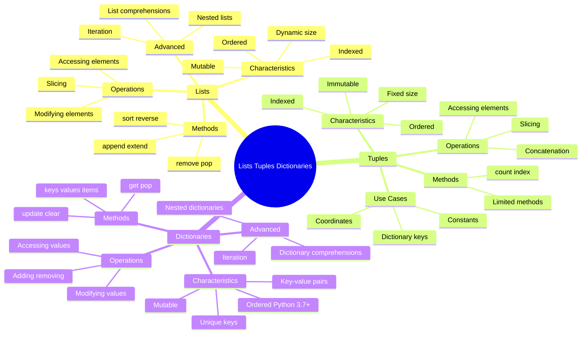

**Diagram Explanation**: This mind map provides a comprehensive overview of all the topics covered in this lesson, showing the characteristics, operations, methods, and advanced features of each data structure.

### Best Practices

1. **Lists**:
   - Use lists when you need a mutable, ordered collection
   - Prefer list comprehensions for creating new lists
   - Use appropriate methods (append vs extend) for adding elements
   - Consider performance implications of frequent modifications

2. **Tuples**:
   - Use tuples for fixed data that shouldn't change
   - Use tuples as dictionary keys when needed
   - Prefer tuples for function return values with multiple items
   - Use tuple unpacking for clean variable assignment

3. **Dictionaries**:
   - Use dictionaries for key-value data relationships
   - Use get() method for safe key access
   - Prefer dictionary comprehensions for creating new dictionaries
   - Use meaningful, immutable keys

4. **General**:
   - Choose the right data structure for your use case
   - Use type hints for better code documentation
   - Handle edge cases (empty collections, missing keys)
   - Consider memory usage for large datasets

### Common Pitfalls

1. **Lists**:
   - Modifying lists while iterating over them
   - Using wrong indexing (off-by-one errors)
   - Confusing append() and extend() methods
   - Not handling empty lists

2. **Tuples**:
   - Trying to modify tuple elements (immutability)
   - Forgetting the comma in single-element tuples
   - Confusing tuples with lists

3. **Dictionaries**:
   - Using non-existent keys without checking
   - Forgetting that keys must be immutable
   - Assuming dictionaries are ordered in older Python versions
   - Using mutable objects as keys

---

## Useful Links

- [Python Lists Documentation](https://docs.python.org/3/tutorial/introduction.html#lists)
- [Python Tuples Documentation](https://docs.python.org/3/tutorial/datastructures.html#tuples-and-sequences)
- [Python Dictionaries Documentation](https://docs.python.org/3/tutorial/datastructures.html#dictionaries)
- [List Methods Reference](https://docs.python.org/3/tutorial/datastructures.html#more-on-lists)
- [Dictionary Methods Reference](https://docs.python.org/3/tutorial/datastructures.html#dictionaries)
- [Type Hints Documentation](https://docs.python.org/3/library/typing.html)
- [List Comprehensions](https://docs.python.org/3/tutorial/datastructures.html#list-comprehensions)
- [Dictionary Comprehensions](https://docs.python.org/3/tutorial/datastructures.html#dictionaries)

---

*This lesson provides a comprehensive understanding of Python's main data structures - lists, tuples, and dictionaries - essential for effective data manipulation and storage in Python programming.*