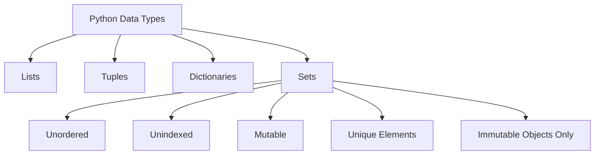
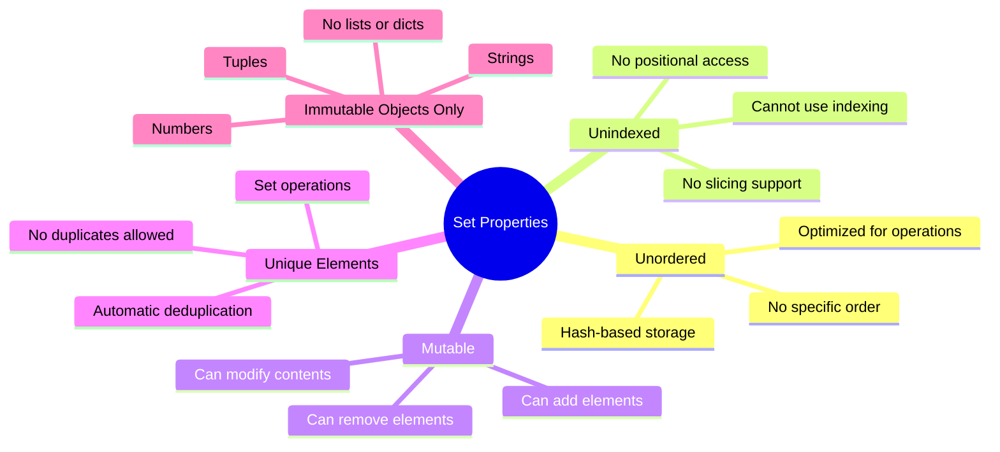
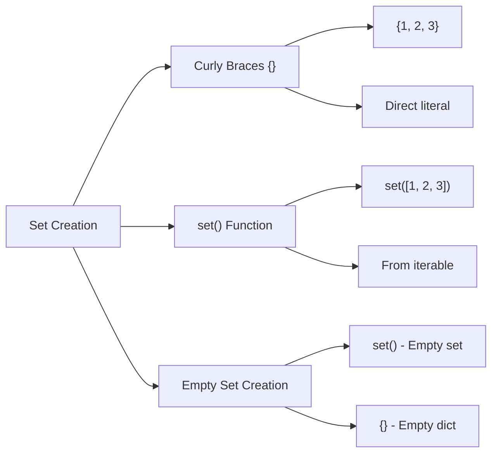
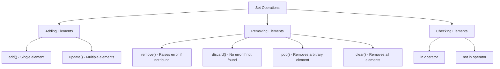
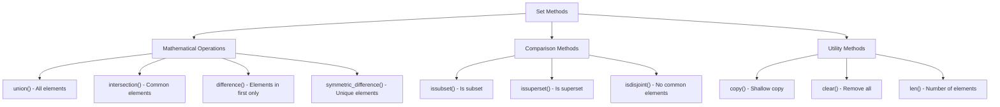
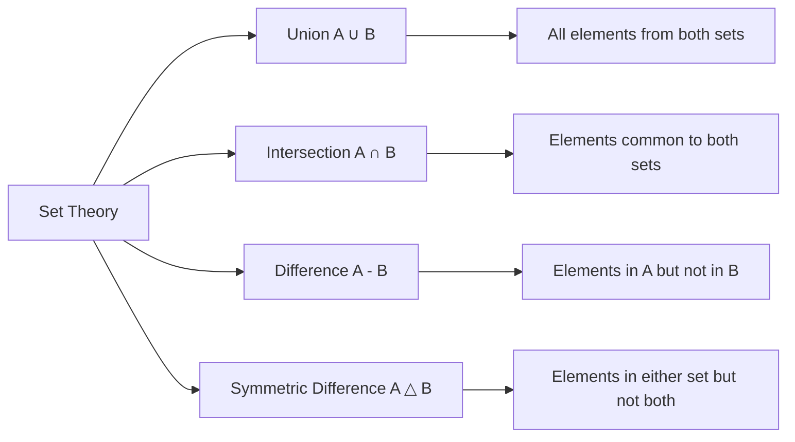
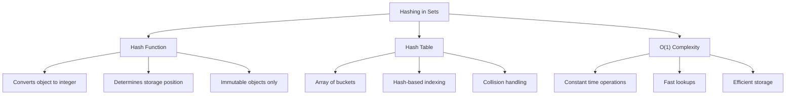
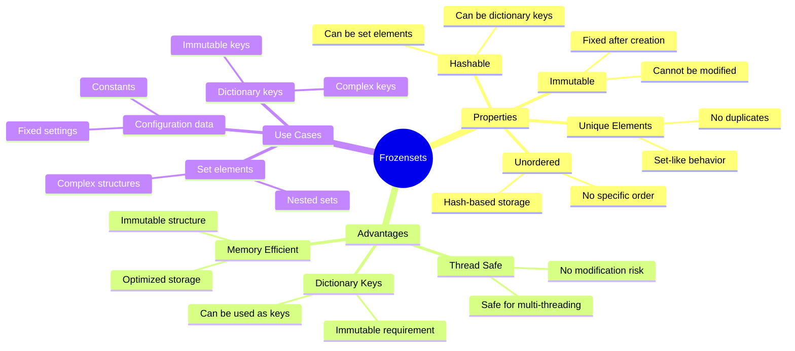
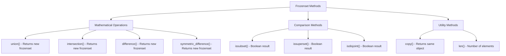
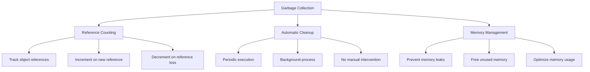

# [Lesson 07: The Set & Frozenset](https://colab.research.google.com/drive/1qsMQMYeeu-XpOEDW2s4JgQ24AwqVcuoW?usp=sharing)

## Table of Contents
1. [Introduction to Sets](#introduction-to-sets)
2. [Set Characteristics](#set-characteristics)
3. [Creating Sets](#creating-sets)
4. [Set Operations](#set-operations)
5. [Set Methods](#set-methods)
6. [Set Mathematical Operations](#set-mathematical-operations)
7. [Hashing and Internal Working](#hashing-and-internal-working)
8. [Frozensets](#frozensets)
9. [Frozenset Methods](#frozenset-methods)
10. [Garbage Collection](#garbage-collection)
11. [Key Concepts Covered](#key-concepts-covered)
12. [Best Practices](#best-practices)
13. [Useful Links](#useful-links)

---

## Introduction to Sets

Sets are one of the 4 built-in data types in Python used to store collections of data, alongside Lists, Tuples, and Dictionaries. Sets are unordered, unindexed, and mutable collections that contain only unique elements.

### Set Overview



**Diagram Explanation**: This diagram shows sets as one of the four main Python data types, highlighting their key characteristics of being unordered, unindexed, mutable collections with unique elements.

---

## Set Characteristics

Sets have specific characteristics that distinguish them from other data structures in Python.

### Set Properties



**Diagram Explanation**: This mind map illustrates the key properties of sets, showing how they differ from other data structures in terms of ordering, indexing, mutability, and element requirements.

### Key Set Characteristics

1. **Unordered**: Items in sets don't follow insertion order
2. **Unindexed**: Cannot access elements by position
3. **Mutable**: Can add, remove, or modify elements
4. **Unique Elements**: No duplicate values allowed
5. **Immutable Objects Only**: Can only contain hashable objects

---

## Creating Sets

Sets can be created using curly braces `{}` or the `set()` function. Understanding the difference between empty set creation is crucial.

### Set Creation Methods



**Diagram Explanation**: This diagram shows the different methods for creating sets, highlighting the important distinction between creating empty sets and empty dictionaries.

### Set Creation Examples

**Basic Set Creation**:
```python
# Creating sets with different methods
my_set = {123, 452, 5, 6}
my_set2 = set([123, 452, 5, 6])
unknown = {}  # This creates a dictionary, not a set!
empty_set = set()

print("my_set =", my_set)           # {123, 452, 5, 6}
print("my_set2 =", my_set2)         # {123, 452, 5, 6}
print("type(unknown) =", type(unknown))    # <class 'dict'>
print("type(empty_set) =", type(empty_set)) # <class 'set'>
print("my_set == my_set2 =", my_set == my_set2)  # True
```

**Multi-type Sets**:
```python
# Sets can hold multiple data types
multi_type_set = {7, 9.0, False, True, "Hello! World", (1, 5, 9, 'hi')}
print(multi_type_set)  # {False, True, 7, 9.0, 'Hello! World', (1, 5, 9, 'hi')}
```

**Immutable Objects Only**:
```python
# Sets can only contain immutable objects
# This will raise a TypeError:
# my_set = {[123, 452, 5, 6]}  # TypeError: unhashable type: 'list'
```

---

## Set Operations

Sets support various operations for adding, removing, and modifying elements, though they cannot be accessed by index.

### Set Modification Operations



**Diagram Explanation**: This diagram categorizes set operations into adding elements, removing elements, and checking for element existence, showing the specific methods available for each category.

### Adding Elements

**add() Method**: Adds a single element
```python
my_set = {1, 2, 3, 4, 5, 'A', 'a'}
my_set.add(6)
print(my_set)  # {1, 2, 3, 4, 5, 6, 'A', 'a'}
```

**update() Method**: Adds multiple elements
```python
my_set = {2, 4, 'a'}
my_set.update([7, 8, 9, "Hello"])
print(my_set)  # {2, 4, 'Hello', 7, 8, 9, 'a'}
```

### Removing Elements

**remove() vs discard() Methods**:

**remove() Method**: Raises KeyError if element not found
```python
my_set = {1, 2, 3, 4, 5, 'A', 'a'}
my_set.remove(3)
my_set.remove('A')
print(my_set)  # {1, 2, 4, 5, 'a'}

# This will raise KeyError:
# my_set.remove(4)  # KeyError: 4
```

**discard() Method**: No error if element not found
```python
my_set = {1, 2, 3}
my_set.discard(4)  # No error, does nothing
print(my_set)  # {1, 2, 3}
```

**pop() Method**: Removes and returns arbitrary element
```python
my_set = {1, 2, 3}
print("Before pop() =", my_set)
removed = my_set.pop()
print("Removed element:", removed)
print("After pop() =", my_set)
```

**difference_update() Method**: Remove multiple elements at once
```python
my_set = {1, 2, 3, 4, 5, 'A', 'a'}
print("Before:", my_set)
my_set.difference_update({1, 5, 3, 'A'})
print("After:", my_set)  # {2, 4, 'a'}
```

### Unique Elements Property

Sets automatically handle duplicates:
```python
my_set = {1, 2, 3, 4, 5, "Hello! World"}
print("Before:", my_set)

my_set.add(2)  # Duplicate, ignored
my_set.add("Hello! World")  # Duplicate, ignored

print("After:", my_set)  # Same as before
```

---

## Set Methods

Python provides numerous built-in methods for set operations, including mathematical set operations and utility methods.

### Set Methods Overview



**Diagram Explanation**: This diagram categorizes set methods into mathematical operations, comparison methods, and utility methods, showing the specific functions available for each category.

### Mathematical Set Operations

**Union Operation**: Combining sets
```python
set1 = {1, 2, 3, 5}
set2 = {1, 5, 6, 7}

# Using union() method
set3 = set1.union(set2)
print("union():", set3)  # {1, 2, 3, 5, 6, 7}

# Using | operator
set3 = set1 | set2
print("| operator:", set3)  # {1, 2, 3, 5, 6, 7}
```

**Intersection Operation**: Common elements
```python
set1 = {1, 2, 3, 4, 5, 6}
set2 = {1, 2, 3, "Hello! World", 8, 9}
set3 = {1, 2, 3, "Hello! World", 77}

intersection = set1.intersection(set2, set3)
print("intersection():", intersection)  # {1, 2, 3, "Hello! World"}
```

**Difference Operation**: Elements in first set only
```python
difference = set1.difference(set2, set3)
print("difference():", difference)  # {4, 5, 6}
```

**Symmetric Difference**: Elements in either set but not both
```python
symmetric_diff = set1.symmetric_difference(set2)
print("symmetric_difference():", symmetric_diff)  # {4, 5, 6, 8, 9}
```

### Comparison Methods

**Subset and Superset Checks**:
```python
set1 = {1, 2, 3, 4, 5, 6, "Hello! World"}
set2 = {1, 2, 3, "Hello! World"}

print("isdisjoint():", set1.isdisjoint(set2))  # False
print("issuperset():", set1.issuperset(set2))  # True
print("issubset():", set2.issubset(set1))      # True
```

---

## Set Mathematical Operations

Sets support mathematical operations that mirror set theory, making them powerful for data analysis and manipulation.

### Set Theory Operations



**Diagram Explanation**: This diagram illustrates the four main mathematical set operations, showing their symbolic notation and descriptions.

### Practical Set Operations Examples

**Union with Multiple Sets**:
```python
set1 = {1, 2, 3, 4, 5, 6, "Hello! World"}
set2 = {1, 2, 3, "Hello! World", 8, 9}
set3 = {1, 2, 3, "Hello! World", 77}

union_result = set1.union(set2, set3)
print("union():", union_result)  # {1, 2, 3, 4, 5, 6, 8, 9, 77, "Hello! World"}
```

**Set Operations with Operators**:
```python
set1 = {1, 2, 3, 4}
set2 = {3, 4, 5, 6}

# Union
union = set1 | set2  # {1, 2, 3, 4, 5, 6}

# Intersection
intersection = set1 & set2  # {3, 4}

# Difference
difference = set1 - set2  # {1, 2}

# Symmetric difference
symmetric = set1 ^ set2  # {1, 2, 5, 6}
```

---

## Hashing and Internal Working

Understanding how sets work internally helps explain their behavior, including why they're unordered and why they only accept immutable objects.

### Hashing Concept



**Diagram Explanation**: This diagram illustrates how hashing works in sets, showing the relationship between hash functions, hash tables, and the resulting O(1) time complexity.

### Hashing Examples

**Hash Values**:
```python
a = "Hello! World"
b = "Hello! World"

print("id(a) =", id(a))      # Different memory addresses
print("id(b) =", id(b))      # Different memory addresses
print("hash(a) =", hash(a))  # Same hash values
print("hash(b) =", hash(b))  # Same hash values
print("a.__hash__() =", a.__hash__())  # Same as hash(a)
```

### Why Sets Are Unordered

**Rehashing and Order Changes**:
```python
# Initial set
my_set = {10, 3, 5, 8}
print(my_set)  # Output may be {8, 10, 3, 5} or another order

# Adding an element
my_set.add(20)
print(my_set)  # The order might change unpredictably

# Removing an element
my_set.remove(10)
print(my_set)  # Again, the order can change
```

**Key Points About Hashing in Sets**:
1. Each element is hashed to determine storage position
2. Internal order is based on hash values, not insertion order
3. Order can change dynamically when elements are added or removed
4. Rehashing occurs when the hash table needs to expand
5. This makes sets unordered and unpredictable in terms of element order

---

## Frozensets

Frozensets are immutable versions of sets. They share the same properties as sets but cannot be modified after creation, making them hashable and suitable for use as dictionary keys.

### Frozenset Characteristics



**Diagram Explanation**: This mind map illustrates the characteristics, advantages, and use cases of frozensets, highlighting their immutability and hashability.

### Frozenset vs Set Comparison

| Feature | Set | Frozenset |
|---------|-----|-----------|
| **Immutability** | Mutable | Immutable |
| **Modification methods** | Yes (add, remove, etc.) | No |
| **Hashability** | No | Yes |
| **Thread safety** | No | Yes |
| **Syntax** | `set()` or `{}` | `frozenset()` |
| **Use cases** | Frequent modifications | Immutable collection |

### Creating Frozensets

**Basic Frozenset Creation**:
```python
# Creating frozensets
my_frozenset = frozenset([1, 2, 3, "Hello! World"])
print("my_frozenset =", my_frozenset)  # frozenset({1, 2, 3, 'Hello! World'})

# From existing set
my_set = {1, 2, 3, "Hello! World"}
my_frozenset2 = frozenset(my_set)
print("my_frozenset2 =", my_frozenset2)  # frozenset({1, 2, 3, 'Hello! World'})
```

**Using Frozensets as Dictionary Keys**:
```python
# Frozensets can be used as dictionary keys
frozen_key = frozenset([1, 2, 3])
my_dict = {frozen_key: "This is a frozenset key"}
print("Dictionary with frozenset key:", my_dict)
```

---

## Frozenset Methods

Frozensets support the same mathematical and comparison methods as sets, but not the modification methods since they are immutable.

### Frozenset Methods Overview



**Diagram Explanation**: This diagram shows the methods available for frozensets, emphasizing that they return new frozensets or boolean values rather than modifying the original.

### Frozenset Methods Examples

**Mathematical Operations**:
```python
frozen_set1 = frozenset([1, 2, 3, 4])
frozen_set2 = frozenset([3, 4, 5, 6])
frozen_set3 = frozenset([1, 2])

# Union
union_set = frozen_set1.union(frozen_set2)
print("union():", union_set)  # frozenset({1, 2, 3, 4, 5, 6})

# Intersection
intersection_set = frozen_set1.intersection(frozen_set2)
print("intersection():", intersection_set)  # frozenset({3, 4})

# Difference
difference_set = frozen_set1.difference(frozen_set2)
print("difference():", difference_set)  # frozenset({1, 2})

# Symmetric difference
symmetric_set = frozen_set1.symmetric_difference(frozen_set2)
print("symmetric_difference():", symmetric_set)  # frozenset({1, 2, 5, 6})
```

**Comparison Methods**:
```python
# Subset and superset checks
print("isdisjoint():", frozen_set1.isdisjoint(frozen_set2))  # False
print("issubset():", frozen_set3.issubset(frozen_set1))      # True
print("issuperset():", frozen_set1.issuperset(frozen_set3))  # True
```

**Copy Method**:
```python
# Copy returns the same object (since frozensets are immutable)
copy_set = frozen_set1.copy()
print("copy():", copy_set)
print("copy() is same object?:", copy_set is frozen_set1)  # True
```

---

## Garbage Collection

Python's garbage collection is an automatic memory management system that frees up memory occupied by objects that are no longer needed.

### Garbage Collection Process



**Diagram Explanation**: This diagram illustrates how Python's garbage collection works, showing the reference counting mechanism and automatic memory management process.

### Garbage Collection Features

**Automatic Memory Management**:
```python
import gc

# Manual garbage collection trigger
gc.collect()
print("Garbage collection stats:", gc.get_count())  # (43, 0, 0)
```

**Key Benefits**:
1. **Memory Safety**: Prevents memory leaks
2. **Convenience**: No manual memory management needed
3. **Efficiency**: Optimizes memory usage automatically
4. **Reference-based**: Uses reference counting to determine unused objects

**How It Works**:
1. **Reference Counting**: Tracks references to each object
2. **Automatic Cleanup**: When reference count reaches 0, object is eligible for garbage collection
3. **Periodic Execution**: Runs automatically in the background
4. **Memory Optimization**: Frees up memory for new objects

---

## Key Concepts Covered

This lesson covered the fundamental aspects of sets and frozensets in Python:

### Key Concepts Overview

```mermaid
mindmap
  root((Sets & Frozensets))
    Sets
      Characteristics
        Unordered
        Unindexed
        Mutable
        Unique elements
      Operations
        Adding elements
        Removing elements
        Mathematical operations
        Set theory
      Internal Working
        Hashing
        Hash tables
        O(1) complexity
        Rehashing
    Frozensets
      Characteristics
        Immutable
        Unordered
        Unique elements
        Hashable
      Methods
        Mathematical operations
        Comparison methods
        No modification methods
      Use Cases
        Dictionary keys
        Set elements
        Configuration data
    Memory Management
      Garbage Collection
        Reference counting
        Automatic cleanup
        Memory optimization
        Background process
```

**Diagram Explanation**: This mind map provides a comprehensive overview of all topics covered in this lesson, showing the relationship between sets, frozensets, and memory management concepts.

### Best Practices

1. **Sets**:
   - Use sets for unique element collections
   - Leverage set operations for data analysis
   - Use sets for fast membership testing
   - Remember that sets are unordered

2. **Frozensets**:
   - Use frozensets when immutability is required
   - Use frozensets as dictionary keys
   - Use frozensets in sets when needed
   - Prefer frozensets for configuration data

3. **Memory Management**:
   - Trust Python's automatic garbage collection
   - Avoid circular references when possible
   - Use `gc.collect()` only when necessary
   - Monitor memory usage in large applications

4. **General**:
   - Choose the right data structure for your use case
   - Understand the trade-offs between mutability and immutability
   - Use set operations for efficient data manipulation
   - Consider performance implications of different operations

### Common Pitfalls

1. **Sets**:
   - Trying to access elements by index
   - Expecting elements to maintain insertion order
   - Adding mutable objects to sets
   - Confusing `{}` for empty sets (creates empty dict)

2. **Frozensets**:
   - Trying to modify frozensets after creation
   - Using regular sets as dictionary keys
   - Expecting frozensets to have modification methods

3. **Memory Management**:
   - Creating circular references
   - Not understanding reference counting
   - Manually calling garbage collection unnecessarily

---

## Useful Links

- [Python Sets Documentation](https://docs.python.org/3/tutorial/datastructures.html#sets)
- [Python Frozensets Documentation](https://docs.python.org/3/library/stdtypes.html#frozenset)
- [Set Methods Reference](https://docs.python.org/3/library/stdtypes.html#set)
- [Garbage Collection Documentation](https://docs.python.org/3/library/gc.html)
- [Hash Function Documentation](https://docs.python.org/3/library/functions.html#hash)
- [Set Theory in Python](https://docs.python.org/3/tutorial/datastructures.html#sets)
- [Memory Management in Python](https://docs.python.org/3/c-api/memory.html)
- [Python Data Structures](https://docs.python.org/3/tutorial/datastructures.html)

---

*This lesson provides a comprehensive understanding of sets and frozensets in Python, essential for efficient data manipulation, mathematical operations, and memory management in Python programming.*