# [Lesson 08: Modules & Functions](https://colab.research.google.com/drive/1hK73zQXY_qO9xZYxpX2zVtemBWM0Rq6O?usp=sharing)

## Table of Contents
1. [Introduction to Modules](#introduction-to-modules)
2. [Types of Modules](#types-of-modules)
3. [Module Import Methods](#module-import-methods)
4. [Module Advantages](#module-advantages)
5. [Introduction to Functions](#introduction-to-functions)
6. [Types of Functions](#types-of-functions)
7. [Function Syntax and Definition](#function-syntax-and-definition)
8. [Function Arguments](#function-arguments)
9. [Function Return Values](#function-return-values)
10. [Lambda Functions](#lambda-functions)
11. [Variable Scope](#variable-scope)
12. [Generator Functions](#generator-functions)
13. [Recursive Functions](#recursive-functions)
14. [Multi-type Returns](#multi-type-returns)
15. [Key Concepts Covered](#key-concepts-covered)
16. [Best Practices](#best-practices)
17. [Useful Links](#useful-links)

---

## Introduction to Modules

A module in Python is a file that contains Python code (functions, classes, variables, or even runnable code) and is used to organize and reuse code efficiently. Modules help keep code modular, readable, and maintainable.

### Module Overview

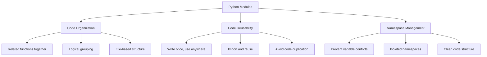

**Diagram Explanation**: This diagram illustrates the main purposes of Python modules, showing how they organize code, enable reusability, and manage namespaces effectively.

### Key Module Characteristics

- **File-based**: A module is simply a `.py` file that can be imported and used in other Python programs
- **Code Organization**: Modules help keep code modular, readable, and maintainable
- **Reusability**: Write once, use anywhere in your program or other programs
- **Namespace Management**: Prevents variable conflicts and provides clean code structure

---

## Types of Modules

Python supports three main types of modules, each serving different purposes in software development.

### Module Types Overview

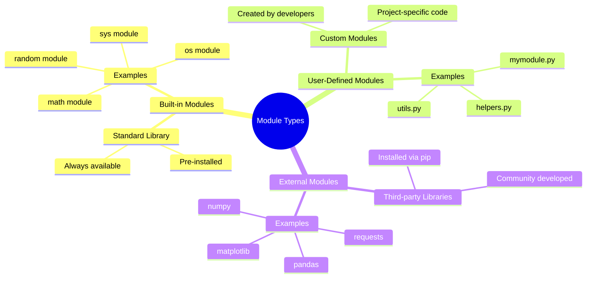

**Diagram Explanation**: This mind map categorizes Python modules into three main types: built-in modules from the standard library, user-defined custom modules, and external third-party modules.

### Built-in Modules (Standard Library)

Built-in modules are pre-installed modules in Python that are always available.

**Example Usage**:
```python
import math
print(math.sqrt(25))  # Output: 5.0
```

**Common Built-in Modules**:
- `math`: Mathematical functions
- `random`: Random number generation
- `os`: Operating system interface
- `sys`: System-specific parameters
- `datetime`: Date and time handling

### User-Defined Modules (Custom Modules)

Any Python file (`.py`) you create can be used as a module.

**Creating a Custom Module**:
```python
# mymodule.py
def add(a, b):
    return a + b
```

**Using a Custom Module**:
```python
import mymodule
print(mymodule.add(5, 3))  # Output: 8
```

### External Modules (Third-party Libraries)

External modules are installed via pip and provide additional functionality.

**Installing External Modules**:
```bash
pip install requests
```

**Using External Modules**:
```python
import requests
response = requests.get("https://www.example.com")
print(response.status_code)  # Output: 200
```

**Popular External Modules**:
- `numpy`: Numerical computing
- `pandas`: Data manipulation
- `requests`: HTTP library
- `matplotlib`: Plotting library

---

## Module Import Methods

Python provides several ways to import modules, each with specific use cases and advantages.

### Import Methods Overview

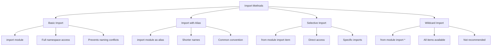

**Diagram Explanation**: This diagram shows the different methods for importing modules in Python, highlighting their characteristics and use cases.

### Basic Import

**Syntax**: `import module_name`

```python
import math
print(math.pi)  # Output: 3.141592653589793
print(math.sqrt(16))  # Output: 4.0
```

**Advantages**:
- Full namespace access
- Prevents naming conflicts
- Clear module origin

### Import with Alias

**Syntax**: `import module_name as alias`

```python
import numpy as np
print(np.array([1, 2, 3]))  # Output: [1 2 3]
```

**Advantages**:
- Shorter, more convenient names
- Common convention (np for numpy, pd for pandas)
- Maintains namespace clarity

### Selective Import

**Syntax**: `from module import item`

```python
from math import sqrt, pi
print(sqrt(16))  # Output: 4.0
print(pi)        # Output: 3.141592653589793
```

**With Aliases**:
```python
from math import sqrt as s, pi as p
print(s(16))  # Output: 4.0
print(p)      # Output: 3.141592653589793
```

**Advantages**:
- Direct access to specific functions
- Cleaner code
- No module prefix needed

### Wildcard Import

**Syntax**: `from module import *`

```python
from math import *  # wildcard
print(sin(0))  # Output: 0.0
```

**Disadvantages**:
- Not recommended for large modules
- Can cause naming conflicts
- Makes code less readable
- Pollutes namespace

---

## Module Advantages

Using modules provides several significant advantages in Python development.

### Module Benefits

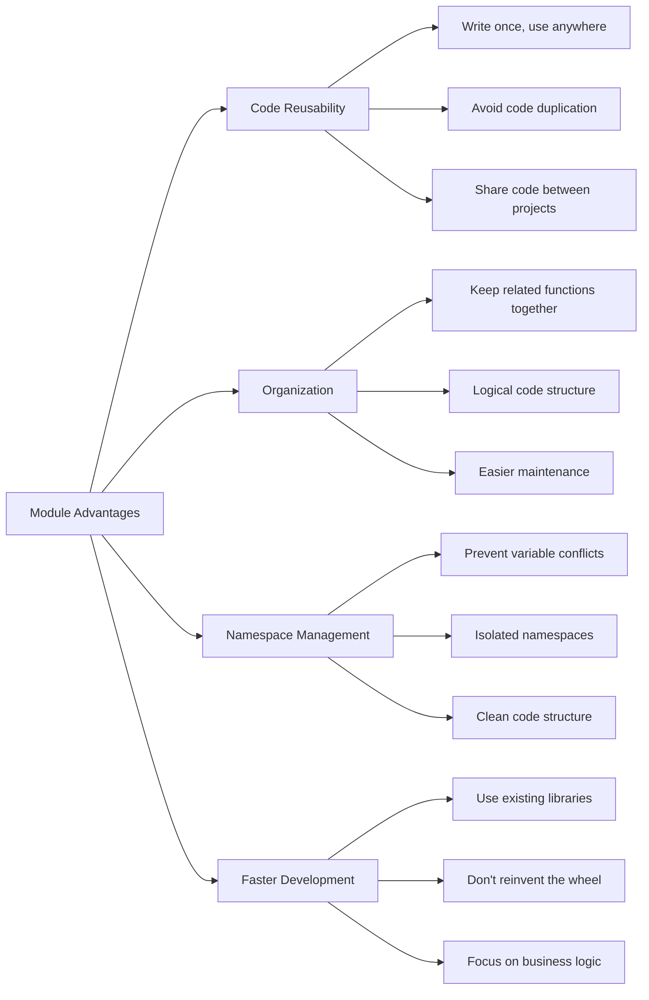

**Diagram Explanation**: This diagram illustrates the key advantages of using modules in Python, showing how they improve code organization, reusability, and development efficiency.

### Key Advantages

1. **Code Reusability**: Write once, use anywhere
2. **Organization**: Keep related functions together
3. **Namespace Management**: Prevent variable conflicts
4. **Faster Development**: Use existing libraries instead of writing everything from scratch

---

## Introduction to Functions

A Python function is a block of organized, reusable code that performs a single, related action. Functions provide better modularity for applications and a high degree of code reusing.

### Function Overview

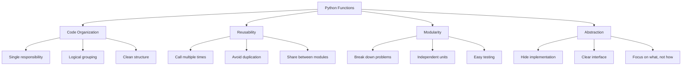

**Diagram Explanation**: This diagram shows the main benefits of using functions in Python, illustrating how they improve code organization, reusability, modularity, and abstraction.

### Global Functions

A global function in Python is a function defined in the main body of a module, rather than inside another function or class.

**Example**:
```python
# This is a global function because it's defined at the top level of the module
def my_function():
    print("Hello! World")

# The function can be called from anywhere in the module
my_function()  # Output: Hello! World
```

**Key Points**:
- **Scope**: Global functions have module-level scope
- **Usage**: Can be called by any code within that module
- **Import**: If imported, can be used in other modules
- **Purpose**: Ideal for utility functions, helper functions, or reusable code

---

## Types of Functions

Python provides three main types of functions, each serving different purposes in programming.

### Function Types Overview

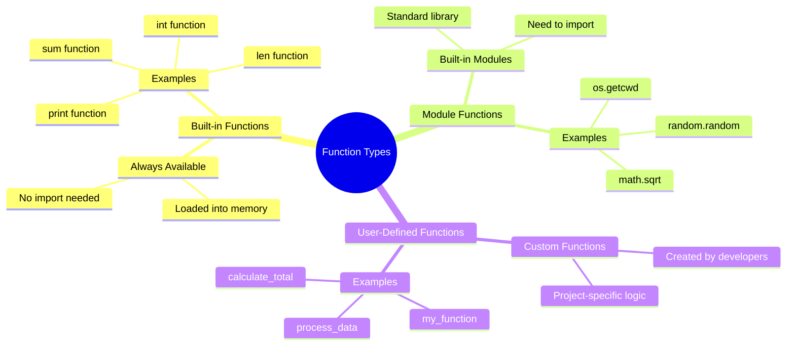

**Diagram Explanation**: This mind map categorizes Python functions into three types: built-in functions that are always available, functions from built-in modules that need importing, and user-defined custom functions.

### Built-in Functions

Python's standard library includes numerous built-in functions that are always available.

**Example**:
```python
# Built-in functions
print("Hello! World")  # Output: Hello! World
```

**Common Built-in Functions**:
- `print()`: Output to console
- `int()`: Convert to integer
- `len()`: Get length of sequence
- `sum()`: Sum of iterable
- `type()`: Get object type

### Functions from Built-in Modules

Functions defined in built-in modules need to be imported before use.

**Example**:
```python
# Functions defined in built-in modules
import random
print(random.random())  # Output: 0.8194296546403051
```

**Common Module Functions**:
- `random.random()`: Random float between 0 and 1
- `math.sqrt()`: Square root
- `os.getcwd()`: Current working directory
- `datetime.now()`: Current date and time

### User-Defined Functions

Custom functions created by developers for specific purposes.

**Example**:
```python
# User-defined functions
def my_function():
    print("Hello! Operation Badar")

my_function()  # Output: Hello! Operation Badar
```

**Characteristics**:
- Created using `def` keyword
- Can accept parameters
- Can return values
- Can be called multiple times

---

## Function Syntax and Definition

Understanding the proper syntax for defining functions is crucial for writing clean, maintainable Python code.

### Function Definition Syntax

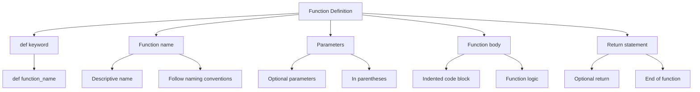

**Diagram Explanation**: This diagram breaks down the components of a Python function definition, showing the required and optional elements.

### Basic Function Syntax

```python
def function_name(parameters):
    "function_docstring"
    function_suite
    return [expression]
```

### Function Definition Example

```python
def greetings():
    "This is docstring of greetings function"
    greet = 'Hello World!'
    return greet

message = greetings()
print(message)  # Output: Hello World!
```

### Function Components

1. **def keyword**: Indicates function definition
2. **Function name**: Descriptive identifier
3. **Parameters**: Optional input values in parentheses
4. **Docstring**: Optional documentation string
5. **Function body**: Indented code block
6. **Return statement**: Optional return value

---

## Function Arguments

Function arguments are the values or variables passed into a function when it is called. Python supports various types of arguments for flexible function design.

### Function Arguments Overview

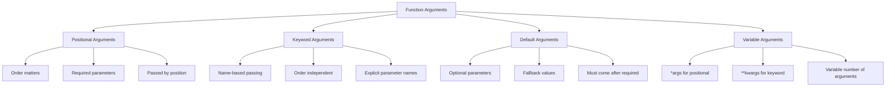

**Diagram Explanation**: This diagram categorizes Python function arguments into different types, showing their characteristics and use cases.

### Positional Arguments

Arguments passed to a function in the order they are defined.

**Example**:
```python
def greetings(name):
    "This is docstring of greetings function"
    print("Hello {}".format(name))
    return

greetings("Ali")    # Output: Hello Ali
greetings("Omar")   # Output: Hello Omar
greetings("Usman")  # Output: Hello Usman
```

### Keyword Arguments

Arguments identified by parameter name, allowing order independence.

**Example**:
```python
def printinfo(name, age):
    "This prints a passed info into this function"
    print("Name:", name)
    print("Age", age)
    return

# Using keyword arguments
printinfo(age=50, name="Arif")
# Output:
# Name: Arif
# Age 50
```

### Default Arguments

Arguments with default values that are used when no value is provided.

**Example**:
```python
def printinfo(name, age=35):
    "This prints a passed info into this function"
    print("Name:", name)
    print("Age", age)
    return

printinfo(age=50, name="Arif")  # Output: Name: Arif, Age 50
printinfo(name="Arif")          # Output: Name: Arif, Age 35
```

### Type Hints with Default Arguments

```python
def add(x: int, y: int=0) -> float:
    return float(x + y)

print(float(add(10, 20)))  # Output: 30.0
print(add(y=50.0, x=2.0))  # Output: 52.0
print(add(x=5))            # Output: 5.0
```

### Unpacking Iterables

The `*` operator unpacks iterables into individual elements.

**Example**:
```python
def my_sum(*nums):
    print(type(nums), ", ", nums)
    return sum(nums)

print("Sum =", my_sum(1, 2, 3, 4, 5, 8, 5))  # Output: Sum = 28
print("Sum *[] =", my_sum(*[1, 2, 3, 4, 5, 8, 5]))  # Output: Sum *[] = 28
print("Sum *() =", my_sum(*(1, 2, 3, 4, 5, 8, 5)))  # Output: Sum *() = 28
```

### Positional-only Arguments

Arguments that can only be specified by position, defined using `/`.

**Example**:
```python
def posFun(x, y, /, z):
    print(x + y + z)

print("Evaluating positional-only arguments:")
posFun(1, 2, z=3)  # Output: 6

# This would cause an error:
# posFun(x=1, y=2, z=3)  # TypeError
```

### Keyword-only Arguments

Arguments that must be specified by name, defined using `*`.

**Example**:
```python
def posFun(*, num1, num2, num3):
    print(num1 * num2 * num3)

print("Evaluating keyword-only arguments:")
posFun(num1=6, num2=8, num3=5)  # Output: 240
posFun(num3=6, num1=8, num2=5)  # Output: 240

# This would cause an error:
# posFun(6, 8, 5)  # TypeError
```

### Variable-length Arguments

Functions that can accept a variable number of arguments.

**Example**:
```python
def printinfo(arg1, *vartuple):
    "This prints a variable passed arguments"
    print("Output is:")
    print(arg1)
    for var in vartuple:
        print("*", var)
    return

printinfo(10)                    # Output: 10
printinfo(70, 60, 50, 70, 90)   # Output: 70, * 60, * 50, * 70, * 90
```

### Arbitrary Keyword Arguments

Functions that accept any number of keyword arguments using `**kwargs`.

**Example**:
```python
def my_function(**student):
    print("\nHis last name is " + student["lname"])
    
    for key, value in student.items():
        print(key, value)
    
    print(student)

my_function(fname="Ali", lname="Osman")
# Output:
# His last name is Osman
# fname Ali
# lname Osman
# {'fname': 'Ali', 'lname': 'Osman'}

# Using dictionary unpacking
my_dict = {"fname": "Arif", "lname": "Rozani", "course": "101 - 201"}
my_function(**my_dict)
```

---

## Function Return Values

Functions can return values to the calling code, allowing for data flow and result processing.

### Return Statement Overview

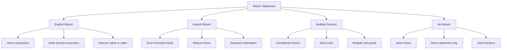

**Diagram Explanation**: This diagram illustrates the different ways functions can return values, showing explicit and implicit return mechanisms.

### Function with Return Value

```python
def add(x, y):
    z = x + y
    return z

a = 10
b = 20
result = add(a, b)
print("a = {} b = {} a+b = {}".format(a, b, result))  # Output: a = 10 b = 20 a+b = 30
```

### Return Statement Characteristics

- **Explicit Return**: Using `return` keyword is good practice
- **Function End**: Return indicates end of function block
- **Value Passing**: Returns expression value to calling function
- **Variable Storage**: Returned value can be stored in variables

---

## Lambda Functions

Lambda functions are anonymous functions defined using the `lambda` keyword. They are useful for simple, one-line functions.

### Lambda Function Overview

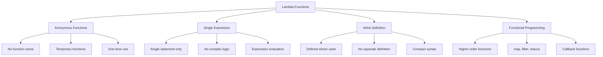

**Diagram Explanation**: This diagram shows the characteristics and use cases of lambda functions in Python, highlighting their anonymous nature and functional programming applications.

### Lambda Function Syntax

```python
lambda [arg1 [,arg2,.....argn]]: expression
```

### Lambda Function Examples

**Basic Lambda Function**:
```python
def add_two(x, y):
    return x + y

my_lambda = lambda x, y: x + y

print(my_lambda(1, 2))  # Output: 3
```

**Lambda with Multiple Arguments**:
```python
# Function definition
sum = lambda arg1, arg2: arg1 + arg2

# Now you can call sum as a function
print("Value of total:", sum(10, 20))  # Output: Value of total: 30
print("Value of total:", sum(50, 20))  # Output: Value of total: 70
```

**Lambda in Sorting**:
```python
# Sort dictionary by value using lambda
my_dict = {"apple": 5, "banana": 2, "cherry": 8, "date": 1}
sorted_dict = dict(sorted(my_dict.items(), key=lambda item: item[1]))
print(sorted_dict)  # Output: {'date': 1, 'banana': 2, 'apple': 5, 'cherry': 8}
```

### Lambda Function Use Cases

- **Sorting**: Custom sort keys
- **Filtering**: Conditional filtering
- **Mapping**: Element transformation
- **Callback Functions**: Event handlers
- **Functional Programming**: Higher-order functions

---

## Variable Scope

Variable scope determines where variables can be accessed in a program. Understanding scope is crucial for avoiding naming conflicts and managing variable lifetime.

### Variable Scope Overview

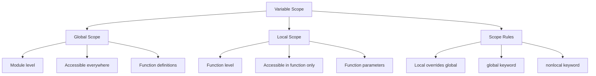

**Diagram Explanation**: This diagram illustrates the two main types of variable scope in Python and the rules that govern variable access.

### Global vs Local Variables

**Global Variables**: Defined outside functions, accessible throughout the program.

**Local Variables**: Defined inside functions, accessible only within that function.

**Example**:
```python
total = 0  # This is global variable

def sum(arg1, arg2):
    # Add both the parameters and return them
    total = arg1 + arg2  # Here total is local variable
    print("Inside the function local total:", total)
    return total

# Now you can call sum function
sum(10, 20)  # Output: Inside the function local total: 30
print("Outside the function global total:", total)  # Output: Outside the function global total: 0
```

### Scope Rules

1. **Local variables** can only be accessed within the function where they are defined
2. **Global variables** can be accessed throughout the program
3. **Local variables** override global variables with the same name
4. **Function parameters** are local variables
5. **Variables defined in functions** are local unless declared as global

---

## Generator Functions

Generator functions are special functions that use the `yield` keyword to produce a series of values one at a time, making them memory-efficient for large sequences.

### Generator Function Overview

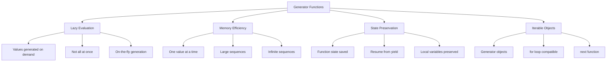

**Diagram Explanation**: This diagram shows the key features of generator functions, highlighting their lazy evaluation, memory efficiency, and state preservation capabilities.

### Generator Function Key Features

1. **Lazy Evaluation**: Values are generated only when needed
2. **Memory Efficiency**: Only one value is stored in memory at a time
3. **Iterable**: Returns generator objects that can be iterated
4. **Resumable**: Function state is saved between yield calls

### Generator Function Syntax

```python
def generator_function():
    yield value
```

### Simple Generator Function

```python
def simple_generator():
    yield 1
    yield 2
    yield 3

# Create a generator object
gen = simple_generator()
print(gen, ":", type(gen))  # Output: <generator object simple_generator at 0x...> : <class 'generator'>

# Iterate over the generator
for value in gen:
    print(value, ":", type(value))
# Output:
# 1 : <class 'int'>
# 2 : <class 'int'>
# 3 : <class 'int'>
```

### Infinite Sequence Generator

```python
def infinite_sequence():
    num = 0
    while True:
        yield num  # Pauses execution and remembers state
        num += 1

# Create a generator object
gen = infinite_sequence()

# Print the first 5 numbers
for _ in range(5):
    print(next(gen))
# Output:
# 0
# 1
# 2
# 3
# 4
```

### Generator Expressions

Generator expressions are a concise way to create generators, similar to list comprehensions.

**Example**:
```python
# Generator expression
gen = (x * x for x in range(5))
print(type(gen))  # Output: <class 'generator'>

# Iterate over the generator
for value in gen:
    print(value, ":", type(value))
# Output:
# 0 : <class 'int'>
# 1 : <class 'int'>
# 4 : <class 'int'>
# 9 : <class 'int'>
# 16 : <class 'int'>
```

### Generator vs Regular Function

**Regular Function (Infinite Loop)**:
```python
def infinite_loop():  # without yield it becomes infinite
    num = 0
    while True:
        # yield num   # with yield it becomes generator
        num += 1
        print("infinite_loop(): num =", num)

# This would run forever and consume resources
# infinite_loop()
```

**Generator Function**:
```python
def infinite_sequence():
    num = 0
    while True:
        yield num  # with yield it becomes generator
        num += 1

# This is memory efficient and controllable
gen = infinite_sequence()
print(next(gen))  # Output: 0
print(next(gen))  # Output: 1
```

---

## Recursive Functions

Recursive functions are functions that call themselves during execution. They break down problems into smaller subproblems until a base case is reached.

### Recursive Function Overview

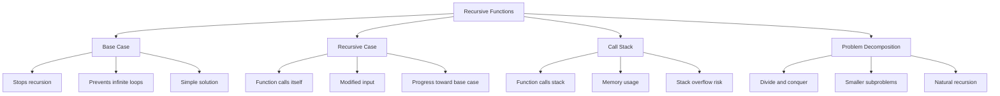

**Diagram Explanation**: This diagram illustrates the key components of recursive functions, showing how they work through base cases, recursive cases, and problem decomposition.

### Key Components of Recursive Functions

- **Base Case**: The condition that stops the recursion
- **Recursive Case**: The part where the function calls itself with modified input

### Factorial Example

The factorial of a number n (n!) is the product of all positive integers from 1 to n.

**Mathematical Definition**:
- n! = n * (n-1)! (Recursive Case)
- 0! = 1 (Base Case)

**Python Implementation**:
```python
def factorial(n):
    # Base case
    if n == 0:
        return 1
    # Recursive case
    else:
        return n * factorial(n - 1)

# Example usage
print(factorial(5))  # Output: 120
```

**How It Works**:
1. factorial(5) calls factorial(4)
2. factorial(4) calls factorial(3)
3. This continues until factorial(0) is called, which returns 1
4. Results propagate back: 1 * 1 = 1, 2 * 1 = 2, 3 * 2 = 6, 4 * 6 = 24, 5 * 24 = 120

### Fibonacci Sequence Example

The Fibonacci sequence: 0, 1, 1, 2, 3, 5, 8, 13, ... where each number is the sum of the two preceding ones.

```python
def fibonacci(n):
    # Base cases
    if n == 0:
        return 0
    elif n == 1:
        return 1
    # Recursive case
    else:
        return fibonacci(n - 1) + fibonacci(n - 2)

# Example usage
print(fibonacci(6))  # Output: 8
```

### Recursive Function Advantages

1. **Simplifies Code**: Breaks complex problems into smaller, easier-to-understand parts
2. **Elegant Solutions**: Often provides clean and concise solutions
3. **Natural Fit**: Works well for problems with recursive structures (factorial, Fibonacci, tree traversals)

### Recursive Function Disadvantages

1. **Stack Overflow**: Deep recursion can lead to stack overflow
2. **Performance Issues**: Can be slower and use more memory than iterative solutions
3. **Debugging Complexity**: Recursive logic can be harder to debug and trace

### When to Use Recursive Functions

- When the problem can be naturally divided into smaller subproblems
- When the depth of recursion is limited and won't cause stack overflow
- For problems like tree traversals, divide-and-conquer algorithms, or mathematical sequences

---

## Multi-type Returns

Python functions can return multiple values of different types by packaging them into tuples, lists, dictionaries, or custom objects.

### Multi-type Return Overview

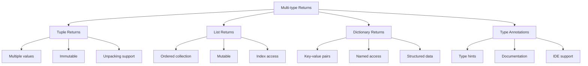

**Diagram Explanation**: This diagram shows the different ways functions can return multiple values of different types, highlighting the benefits of each approach.

### Multi-type Return Example

```python
def example_function(a: int, b: int = 0, *args: float, **kwargs: str) -> Tuple[int, List[float], Dict[str, str]]:
    """Example function demonstrating various parameter types.
    Args:
        a: An integer.
        b: An integer with a default value of 0.
        *args: Variable-length positional arguments of type float.
        **kwargs: Variable-length keyword arguments of type string.
    Returns:
        A tuple containing:
        - The sum of 'a' and 'b'.
        - A list of the variable-length positional arguments ('args').
        - A dictionary of the variable-length keyword arguments ('kwargs').
    """
    sum_ab = a + b
    args_list = list(args)  # Convert tuple to a list
    return sum_ab, args_list, kwargs

# Example usage
result = example_function(1, 2, 3.14, 2.71, name="Alice", city="New York")
print(result)  # Output: (3, [3.14, 2.71], {'name': 'Alice', 'city': 'New York'})

result = example_function(10, *[1.0, 2.0, 3.0], **{"country": "USA", "language": "English"})
print(result)  # Output: (11, [1.0, 2.0, 3.0], {'country': 'USA', 'language': 'English'})
```

### Benefits of Multi-type Returns

1. **Flexibility**: Return diverse data types in a single call
2. **Efficiency**: Single function call for multiple results
3. **Structured Data**: Organized return values
4. **Type Safety**: Type annotations for better code documentation
5. **IDE Support**: Better autocomplete and error detection

---

## Key Concepts Covered

This lesson covered the fundamental aspects of modules and functions in Python:

### Key Concepts Overview

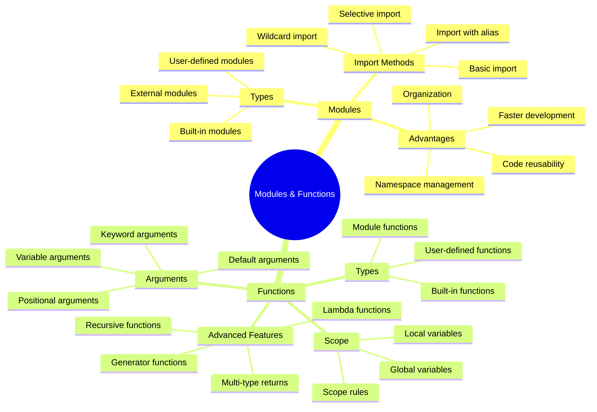

**Diagram Explanation**: This mind map provides a comprehensive overview of all topics covered in this lesson, showing the relationship between modules and functions and their various features.

### Best Practices

1. **Modules**:
   - Use descriptive module names
   - Organize related functions together
   - Use proper import statements
   - Avoid wildcard imports for large modules
   - Document your modules with docstrings

2. **Functions**:
   - Use descriptive function names
   - Keep functions focused on single responsibility
   - Use type hints for better documentation
   - Handle edge cases appropriately
   - Use appropriate argument types

3. **Lambda Functions**:
   - Use for simple, one-line functions
   - Avoid complex logic in lambdas
   - Use with higher-order functions
   - Keep lambda expressions readable

4. **Generator Functions**:
   - Use for memory-efficient iteration
   - Ideal for large or infinite sequences
   - Use generator expressions when appropriate
   - Understand lazy evaluation benefits

5. **Recursive Functions**:
   - Always define a base case
   - Ensure progress toward base case
   - Consider stack overflow risks
   - Use for naturally recursive problems

### Common Pitfalls

1. **Modules**:
   - Circular imports
   - Importing unused modules
   - Namespace pollution with wildcard imports
   - Missing module dependencies

2. **Functions**:
   - Mutable default arguments
   - Forgetting return statements
   - Incorrect argument order
   - Variable scope confusion

3. **Lambda Functions**:
   - Overusing lambda functions
   - Complex logic in lambdas
   - Readability issues
   - Debugging difficulties

4. **Generator Functions**:
   - Consuming generator multiple times
   - Not understanding lazy evaluation
   - Memory leaks with infinite generators
   - State management issues

5. **Recursive Functions**:
   - Missing base cases
   - Infinite recursion
   - Stack overflow
   - Performance issues

---

## Useful Links

- [Python Modules Documentation](https://docs.python.org/3/tutorial/modules.html)
- [Python Functions Documentation](https://docs.python.org/3/tutorial/controlflow.html#defining-functions)
- [Lambda Functions](https://docs.python.org/3/tutorial/controlflow.html#lambda-expressions)
- [Generator Functions](https://docs.python.org/3/tutorial/classes.html#generators)
- [Recursive Functions](https://docs.python.org/3/tutorial/controlflow.html#defining-functions)
- [Variable Scope](https://docs.python.org/3/tutorial/classes.html#python-scopes-and-namespaces)
- [Type Hints](https://docs.python.org/3/library/typing.html)
- [Python Standard Library](https://docs.python.org/3/library/)

---

*This lesson provides a comprehensive understanding of modules and functions in Python, essential for writing organized, reusable, and maintainable code in Python programming.*