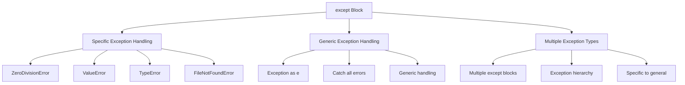

# [Lesson 09: Exception Handling](https://colab.research.google.com/drive/16hWNFjSPRhZIOQKUmuw672Md-m9aCgOi?usp=sharing)

## Table of Contents
1. [Introduction to Exception Handling](#introduction-to-exception-handling)
2. [Importance of Exception Handling](#importance-of-exception-handling)
3. [Exception Handling Blocks](#exception-handling-blocks)
4. [The try Block](#the-try-block)
5. [The except Block](#the-except-block)
6. [The else Block](#the-else-block)
7. [The finally Block](#the-finally-block)
8. [Complete Exception Handling Example](#complete-exception-handling-example)
9. [Throwing Exceptions](#throwing-exceptions)
10. [Custom Exceptions](#custom-exceptions)
11. [NoReturn Type Hint](#noreturn-type-hint)
12. [Comprehensive Error Handling Example](#comprehensive-error-handling-example)
13. [Key Concepts Covered](#key-concepts-covered)
14. [Best Practices](#best-practices)
15. [Useful Links](#useful-links)

---

## Introduction to Exception Handling

Exception handling is a crucial part of writing robust Python programs. It allows you to handle errors gracefully and ensure your program doesn't crash unexpectedly. Python provides four main blocks for exception handling: `try`, `except`, `else`, and `finally`.

### Exception Handling Overview


**Diagram Explanation**: This diagram illustrates the main purposes of exception handling in Python, showing how it prevents crashes, enables graceful recovery, manages resources, and improves user experience.

### Key Concepts

- **Exception**: An error that occurs during program execution
- **Exception Handling**: The process of catching and managing exceptions
- **Graceful Degradation**: Handling errors without crashing the program
- **Resource Cleanup**: Ensuring resources are properly released

---

## Importance of Exception Handling

Exception handling is essential for creating robust and reliable Python programs. Understanding its importance helps developers write better, more maintainable code.

### Why Use Exception Handling?


**Diagram Explanation**: This mind map shows the key benefits of exception handling, categorizing them into crash prevention, graceful recovery, clean code structure, and resource management.

### Key Benefits

1. **Prevents Program Crashes**: Ensures your program doesn't terminate abruptly due to unexpected errors
2. **Graceful Error Recovery**: Allows you to handle errors gracefully and provide meaningful feedback to users
3. **Clean Code**: Separates error-handling logic from the main program flow, making code more readable and maintainable
4. **Resource Management**: Ensures resources (files, connections) are properly released, even if an error occurs

### What Happens Without Exception Handling?


**Diagram Explanation**: This diagram shows the negative consequences of not using exception handling, illustrating how it leads to crashes, data loss, security risks, and unpredictable behavior.

### Critical Scenarios

- **File Operations**: Handling missing files or permission errors during file access
- **User Input**: Validating and handling invalid or unexpected input from users
- **Network Operations**: Managing connection errors or timeouts in network requests
- **Mathematical Operations**: Preventing division by zero or invalid calculations

### Consequences of Not Handling Exceptions

- **User Frustration**: Users see cryptic error messages instead of helpful feedback
- **Increased Debugging Effort**: Developers spend more time tracing and fixing errors
- **System Instability**: Unhandled errors can cause cascading failures in larger systems
- **Loss of Trust**: Frequent crashes or errors can damage the program's credibility

---

## Exception Handling Blocks

Python provides four main blocks for comprehensive exception handling, each serving a specific purpose in the error handling workflow.

### Exception Handling Block Structure


**Diagram Explanation**: This diagram shows the four main exception handling blocks in Python and their specific purposes in the error handling workflow.

### Block Execution Flow


**Diagram Explanation**: This flowchart illustrates the execution flow of exception handling blocks, showing how the program flows through try, except, else, and finally blocks based on whether an error occurs.

---

## The try Block

The `try` block is used to test a block of code for errors. If an error occurs within the try block, the program will immediately jump to the except block (if provided).

### Try Block Overview


**Diagram Explanation**: This diagram shows the purpose and characteristics of the try block, illustrating how it wraps risky code and monitors execution for errors.

### Basic Try Block Example

```python
try:
    result = 10 / 0  # This will raise a ZeroDivisionError
except:
    print("An error occurred!")
# Output: An error occurred!
```

### Try Block Characteristics

- **Error Testing**: Wraps code that might raise exceptions
- **Immediate Detection**: Stops execution when an error occurs
- **Exception Propagation**: Passes exceptions to except blocks
- **Main Logic**: Contains the primary business logic

---

## The except Block

The `except` block is used to handle specific errors that occur in the try block. You can specify the type of error to catch, or use a generic except to catch all errors.

### Except Block Overview



**Diagram Explanation**: This diagram categorizes different types of except blocks, showing how they can handle specific exceptions, generic exceptions, or multiple exception types.

### Specific Exception Handling

```python
try:
    result = 10 / 0
except ZeroDivisionError:
    print("Cannot divide by zero!")
except Exception as e:
    print(f"An unexpected error occurred: {e}")
# Output: Cannot divide by zero!
```

### Multiple Exception Types

```python
def divide_numbers(a, b):
    try:
        result = a / b
    except ZeroDivisionError:
        print("Error: Cannot divide by zero!")
    except TypeError:
        print("Error: Invalid input type. Numbers required.")
    except Exception as e:
        print(f"Unexpected error: {e}")
    else:
        print(f"Division successful. Result: {result}")
    finally:
        print("Operation complete.")

# Test cases
divide_numbers(10, 2)    # Output: Division successful. Result: 5.0, Operation complete.
divide_numbers(10, 0)    # Output: Error: Cannot divide by zero!, Operation complete.
divide_numbers(10, "2")  # Output: Error: Invalid input type. Numbers required., Operation complete.
```

### Exception Handling Best Practices

1. **Specific First**: Handle specific exceptions before generic ones
2. **Meaningful Messages**: Provide clear, user-friendly error messages
3. **Logging**: Log errors for debugging purposes
4. **Recovery**: Implement appropriate recovery mechanisms

---

## The else Block

The `else` block is executed if no errors occur in the try block. It is optional and is used for code that should only run when the try block is successful.

### Else Block Overview


**Diagram Explanation**: This diagram shows the purpose and characteristics of the else block, illustrating how it executes only when the try block succeeds without errors.

### Else Block Example

```python
try:
    result = 10 / 2
except ZeroDivisionError:
    print("Cannot divide by zero!")
else:
    print(f"Division successful. Result: {result}")
# Output: Division successful. Result: 5.0
```

### When to Use the else Block

- **Success Confirmation**: Confirm that the operation completed successfully
- **Result Processing**: Process results only when no errors occurred
- **Success Logging**: Log successful operations
- **Alternative Paths**: Provide alternative execution paths for success

### Else Block vs. Code After try

```python
# Using else block
try:
    result = 10 / 2
except ZeroDivisionError:
    print("Cannot divide by zero!")
else:
    print(f"Success: {result}")  # Only runs on success

# Without else block
try:
    result = 10 / 2
except ZeroDivisionError:
    print("Cannot divide by zero!")
print(f"Result: {result}")  # Always runs, even after exceptions
```

---

## The finally Block

The `finally` block is executed regardless of whether an error occurred or not. It is often used for cleanup operations, such as closing files or releasing resources.

### Finally Block Overview


**Diagram Explanation**: This diagram illustrates the key characteristics of the finally block, showing how it always executes and is used for cleanup operations and resource management.

### Finally Block Example

```python
try:
    result = 10 / 0
except ZeroDivisionError:
    print("Cannot divide by zero!")
finally:
    print("This will always execute.")
# Output: 
# Cannot divide by zero!
# This will always execute.
```

### Finally Block Use Cases

1. **File Operations**: Always close files, regardless of success or failure
2. **Database Connections**: Ensure connections are properly closed
3. **Network Resources**: Clean up network connections and sockets
4. **Temporary Files**: Remove temporary files and directories
5. **Logging**: Log completion of operations

### Finally Block with File Operations

```python
def read_file(filename):
    file = None
    try:
        file = open(filename, 'r')
        content = file.read()
        return content
    except FileNotFoundError:
        print(f"File {filename} not found!")
        return None
    except PermissionError:
        print(f"Permission denied to read {filename}")
        return None
    finally:
        if file:
            file.close()
            print("File closed successfully")
```

---

## Complete Exception Handling Example

Here's a comprehensive example that combines all four exception handling blocks to demonstrate their interaction and proper usage.

### Complete Exception Handling Flow

```mermaid
sequenceDiagram
    participant Program
    participant Try
    participant Except
    participant Else
    participant Finally
    
    Program->>Try: Execute try block
    Try->>Try: Perform operation
    
    alt Operation Successful
        Try->>Else: No exception raised
        Else->>Else: Execute success logic
        Else->>Finally: Continue to finally
    else Operation Failed
        Try->>Except: Exception raised
        Except->>Except: Handle exception
        Except->>Finally: Continue to finally
    end
    
    Finally->>Finally: Execute cleanup
    Finally->>Program: Return control
```

**Diagram Explanation**: This sequence diagram shows the complete flow of exception handling, illustrating how the program flows through try, except, else, and finally blocks based on the operation outcome.

### Comprehensive Example

```python
def divide_numbers(a, b):
    try:
        result = a / b  # Test this block for errors
    except ZeroDivisionError:
        print("Error: Cannot divide by zero!")
    except TypeError:
        print("Error: Invalid input type. Numbers required.")
    else:
        print(f"Division successful. Result: {result}")
    finally:
        print("Operation complete.")

# Test cases
divide_numbers(10, 2)    # Output: Division successful. Result: 5.0, Operation complete.
divide_numbers(10, 0)    # Output: Error: Cannot divide by zero!, Operation complete.
divide_numbers(10, "2")  # Output: Error: Invalid input type. Numbers required., Operation complete.
```

### Key Points Covered

1. **try Block**: Used to test a block of code for errors
2. **except Block**: Used to handle specific or generic errors
3. **else Block**: Executes when no errors occur in the try block
4. **finally Block**: Executes regardless of whether an error occurred

---

## Throwing Exceptions

In Python, a function can throw an exception using the `raise` keyword. This is used to indicate that an error has occurred, and it interrupts the normal flow of the program.

### Exception Throwing Overview


**Diagram Explanation**: This diagram shows the key aspects of throwing exceptions in Python, illustrating how the raise keyword works and how exceptions propagate through the program.

### Basic Exception Throwing

```python
def divide(a, b):
    if b == 0:
        raise ValueError("Division by zero is not allowed!")  # Raising an exception
    return a / b

print(divide(10, 2))  # Output: 5.0
print(divide(5, 0))   # Raises: ValueError: Division by zero is not allowed!
```

### When an Exception is Raised

1. Python immediately stops executing the function
2. The error message is displayed unless the exception is handled using try-except
3. The exception propagates up the call stack until caught or the program terminates

### Handling Thrown Exceptions

```python
def divide(a, b):
    if b == 0:
        raise ValueError("Division by zero is not allowed!")
    return a / b

try:
    result = divide(5, 0)  # This will raise an exception
    print(result)  # This line won't run if exception occurs
except ValueError as e:
    print(f"Error: {e}")  # Output: Error: Division by zero is not allowed!

print("Program continues...")  # This line will always execute
# Output: Error: Division by zero is not allowed!, Program continues...
```

### Common Built-in Exceptions

- **ValueError**: Raised when a function receives an argument of correct type but inappropriate value
- **TypeError**: Raised when an operation or function is applied to an object of inappropriate type
- **ZeroDivisionError**: Raised when the second argument of a division or modulo operation is zero
- **FileNotFoundError**: Raised when a file or directory is requested but doesn't exist
- **KeyError**: Raised when a dictionary key is not found

---

## Custom Exceptions

Python allows you to define custom exceptions by creating a new class that inherits from the `Exception` class. This enables you to create specific error types for your application.

### Custom Exception Overview


**Diagram Explanation**: This diagram illustrates the key aspects of custom exceptions, showing how they inherit from the base Exception class and provide specific error types for application logic.

### Creating Custom Exceptions

```python
class NegativeNumberError(Exception):
    """Custom exception for negative numbers"""
    pass

def check_positive(n):
    if n < 0:
        raise NegativeNumberError("Negative numbers are not allowed!")
    return f"{n} is positive"

try:
    print(check_positive(-5))  # Raises NegativeNumberError
except NegativeNumberError as e:
    print(f"Custom Exception Caught: {e}", " - Exception Class Type: ", type(e))
# Output: Custom Exception Caught: Negative numbers are not allowed! - Exception Class Type: <class '__main__.NegativeNumberError'>
```

### Custom Exception with Additional Data

```python
class ValidationError(Exception):
    """Custom exception for validation errors"""
    def __init__(self, message, field_name, value):
        super().__init__(message)
        self.field_name = field_name
        self.value = value

def validate_age(age):
    if not isinstance(age, int):
        raise ValidationError("Age must be an integer", "age", age)
    if age < 0:
        raise ValidationError("Age cannot be negative", "age", age)
    if age > 150:
        raise ValidationError("Age seems unrealistic", "age", age)
    return True

try:
    validate_age(-5)
except ValidationError as e:
    print(f"Validation failed: {e}")
    print(f"Field: {e.field_name}, Value: {e.value}")
# Output: Validation failed: Age cannot be negative, Field: age, Value: -5
```

### Exception Hierarchy

```python
class BaseCustomError(Exception):
    """Base class for custom errors"""
    pass

class InputError(BaseCustomError):
    """Raised when input is invalid"""
    pass

class ProcessingError(BaseCustomError):
    """Raised when processing fails"""
    pass

class OutputError(BaseCustomError):
    """Raised when output generation fails"""
    pass
```

### Best Practices for Custom Exceptions

1. **Descriptive Names**: Use clear, descriptive names for your exceptions
2. **Inheritance**: Inherit from appropriate base exception classes
3. **Documentation**: Provide docstrings explaining when the exception is raised
4. **Additional Data**: Include relevant context information in the exception
5. **Hierarchy**: Create logical exception hierarchies for complex applications

---

## NoReturn Type Hint

`NoReturn` is a special type hint from Python's typing module. It is used to indicate that a function will not return normally, meaning the function either always raises an exception, enters an infinite loop, or otherwise never reaches the end of the function body.

### NoReturn Overview


**Diagram Explanation**: This diagram shows the key aspects of the NoReturn type hint, illustrating its use cases, alternatives, and benefits for code clarity and static analysis.

### NoReturn Example

```python
from typing import NoReturn

def terminate_program() -> NoReturn:
    """Terminate the program by raising an exception."""
    raise SystemExit("Terminating the program.")

# When you call terminate_program, it never returns normally:
try:
    terminate_program()
except SystemExit as e:
    print(f"Program terminated: {e}")
# Output: Program terminated: Terminating the program.
```

### When to Use NoReturn

1. **Functions that Always Raise Exceptions**: Functions that immediately raise an error
2. **Infinite Loops**: Functions that run forever or until program termination
3. **System Termination**: Functions that terminate the program
4. **Error Handlers**: Functions that handle critical errors and don't return

### NoReturn vs. None

```python
from typing import NoReturn

# Use NoReturn for functions that never return
def terminate_program() -> NoReturn:
    raise SystemExit("Program terminating")

# Use None for functions that complete but don't return a value
def log_error(message: str) -> None:
    print(f"Error: {message}")

# Use NoReturn when function always raises an exception
def validate_input(value) -> NoReturn:
    if not value:
        raise ValueError("Input cannot be empty")
```

### Benefits of NoReturn

1. **Improved Readability**: Makes your intent clear to anyone reading your code
2. **Better Static Analysis**: Tools like mypy can use these annotations to detect issues
3. **Clear Intent**: Explicitly indicates that a function will not return normally
4. **Type Safety**: Helps catch potential bugs in function usage

### Alternatives to NoReturn

```python
# Alternative 1: Using None (for functions that complete but don't return)
def log_error(message: str) -> None:
    """Logs an error message but does not terminate the program."""
    print(f"Error: {message}")

# Alternative 2: Omitting the return type hint
def terminate_program():
    """Terminates the program by raising an exception."""
    raise SystemExit("Program is terminating.")

# Alternative 3: Using NoReturn (recommended for static analysis)
def terminate_program() -> NoReturn:
    """Terminates the program by raising an exception."""
    raise SystemExit("Program is terminating.")
```

---

## Comprehensive Error Handling Example

Here's a comprehensive example that demonstrates advanced error handling techniques, including custom exceptions, multiple exception types, and proper resource management.

### Comprehensive Error Handling Flow


**Diagram Explanation**: This flowchart shows the comprehensive error handling flow, illustrating how errors are handled at different stages of data processing and how the program continues execution even when errors occur.

### Comprehensive Example

```python
import random
from typing import Tuple, Dict, List

def generate_random_data(num_samples: int) -> List[Tuple[int, int]]:
    """Generates a list of random number pairs."""
    try:
        if not isinstance(num_samples, int) or num_samples <= 0:
            raise ValueError("Number of samples must be a positive integer.")
        data = [(random.randint(1, 100), random.randint(1, 100)) for _ in range(num_samples)]
        return data
    except ValueError as ve:
        print(f"Error: {ve}")
        return []  # Return empty list on error
    except Exception as e:  # Catch any other unexpected errors
        print(f"An unexpected error occurred: {e}")
        return []

def calculate_ratios(data: List[Tuple[int, int]]) -> List[float]:
    """Calculates the ratio of the first number to the second in each pair."""
    ratios = []
    try:
        for pair in data:
            num1, num2 = pair
            if num2 == 0:
                raise ZeroDivisionError("Cannot divide by zero.")
            if not isinstance(num1, int) or not isinstance(num2, int):
                raise TypeError("Input data must be integers.")
            ratio = num1 / num2
            ratios.append(ratio)
        return ratios
    except ZeroDivisionError as zde:
        print(f"Error: {zde}")
        return []  # Return empty list on error
    except TypeError as te:
        print(f"Error: {te}")
        return []
    except Exception as e:
        print(f"An unexpected error occurred during ratio calculation: {e}")
        return []

def process_data(num_samples: int) -> List[float]:
    """Combines data generation and ratio calculation with comprehensive error handling."""
    data = generate_random_data(num_samples)
    if not data:  # check if generate_random_data returns an empty list
        return []
    
    ratios = calculate_ratios(data)
    return ratios

# Example usage with error handling
try:
    num_samples = 10
    results = process_data(num_samples)
    
    if results:
        print("Calculated ratios:", results)
    else:  # if process_data returned an empty list
        print("Data processing failed due to an error.")
        
except Exception as e:  # catching unexpected errors
    print(f"An unexpected error occurred: {e}")

# Example of invalid input
results = process_data(-5)
if not results:
    print("Negative number of samples, data processing failed.")

results = process_data("abc")
if not results:
    print("Invalid input type, data processing failed.")
```

### Key Features of This Example

1. **Multiple Exception Types**: Handles ValueError, ZeroDivisionError, TypeError, and generic Exception
2. **Custom Error Messages**: Provides specific, meaningful error messages
3. **Graceful Degradation**: Returns empty lists instead of crashing
4. **Resource Management**: Properly handles data processing errors
5. **Input Validation**: Validates input parameters before processing
6. **Error Propagation**: Errors are handled at appropriate levels

---

## Key Concepts Covered

This lesson covered the fundamental aspects of exception handling in Python:

### Key Concepts Overview


**Diagram Explanation**: This mind map provides a comprehensive overview of all topics covered in this lesson, showing the relationship between exception handling blocks, exception throwing, and error handling strategies.

### Best Practices

1. **Exception Handling**:
   - Use specific exception types before generic ones
   - Provide meaningful error messages
   - Implement proper cleanup in finally blocks
   - Log errors for debugging purposes

2. **Custom Exceptions**:
   - Inherit from appropriate base exception classes
   - Use descriptive names and documentation
   - Include relevant context information
   - Create logical exception hierarchies

3. **Resource Management**:
   - Always use finally blocks for cleanup
   - Close files and connections properly
   - Handle temporary resources
   - Implement proper error recovery

4. **Error Prevention**:
   - Validate input parameters
   - Check for edge cases
   - Implement defensive programming
   - Use appropriate exception types

### Common Pitfalls

1. **Exception Handling**:
   - Catching too broad exceptions
   - Ignoring exceptions silently
   - Not cleaning up resources
   - Poor error messages

2. **Custom Exceptions**:
   - Not inheriting from Exception
   - Vague exception names
   - Missing documentation
   - Overly complex hierarchies

3. **Resource Management**:
   - Forgetting to close resources
   - Not using finally blocks
   - Resource leaks
   - Improper cleanup order

4. **Error Prevention**:
   - Not validating input
   - Ignoring edge cases
   - Poor error handling
   - Inadequate testing

---

## Useful Links

- [Python Exception Handling Documentation](https://docs.python.org/3/tutorial/errors.html)
- [Built-in Exceptions](https://docs.python.org/3/library/exceptions.html)
- [Custom Exceptions](https://docs.python.org/3/tutorial/errors.html#user-defined-exceptions)
- [NoReturn Type Hint](https://docs.python.org/3/library/typing.html#typing.NoReturn)
- [Exception Hierarchy](https://docs.python.org/3/library/exceptions.html#exception-hierarchy)
- [Error Handling Best Practices](https://docs.python.org/3/tutorial/errors.html#handling-exceptions)
- [Resource Management](https://docs.python.org/3/tutorial/errors.html#defining-clean-up-actions)
- [Python Type Hints](https://docs.python.org/3/library/typing.html)

---

*This lesson provides a comprehensive understanding of exception handling in Python, essential for writing robust, reliable, and user-friendly Python programs.*