# [Lesson 10: I/O File Handling](https://colab.research.google.com/drive/12l0swaVyLwOvsMfoPNzUmpvfs2_VZ5bW?usp=sharing)

## Table of Contents
1. [Introduction to File Handling](#introduction-to-file-handling)
2. [File Opening and Modes](#file-opening-and-modes)
3. [Writing to Files](#writing-to-files)
4. [Reading from Files](#reading-from-files)
5. [File Pointer Management](#file-pointer-management)
6. [File Closing](#file-closing)
7. [The with Statement](#the-with-statement)
8. [File Operations Examples](#file-operations-examples)
9. [Error Handling in File Operations](#error-handling-in-file-operations)
10. [Comprehensive File Handling Example](#comprehensive-file-handling-example)
11. [Key Concepts Covered](#key-concepts-covered)
12. [Best Practices](#best-practices)
13. [Useful Links](#useful-links)

---

## Introduction to File Handling

File handling is essential for reading and writing data to files, enabling persistent storage. Python provides built-in functions and methods to handle files efficiently, allowing programs to interact with the file system for data persistence and retrieval.

### File Handling Overview

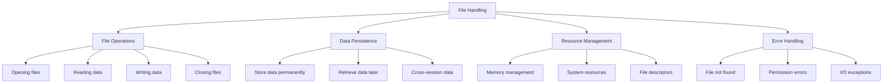

**Diagram Explanation**: This diagram illustrates the main aspects of file handling in Python, showing how it encompasses file operations, data persistence, resource management, and error handling.

### Key Concepts

- **File**: A named location on disk that stores data
- **File Handle**: A reference to an opened file
- **File Pointer**: Current position in the file for read/write operations
- **File Modes**: Different ways to open files (read, write, append, etc.)
- **Context Manager**: Automatic resource management using `with` statement

### Importance of File Handling

1. **Data Persistence**: Store data beyond program execution
2. **Configuration Files**: Read application settings
3. **Log Files**: Record program activities and errors
4. **Data Processing**: Handle large datasets from files
5. **User Data**: Save and load user preferences and data

---

## File Opening and Modes

The `open()` function is used to open files in Python. It requires a filename and a mode parameter that specifies how the file should be opened.

### File Opening Overview

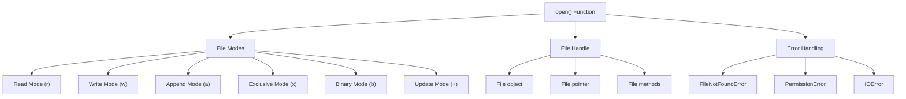

**Diagram Explanation**: This diagram shows the components of file opening in Python, including the different file modes, file handle creation, and potential errors.

### File Modes

| Mode | Description | File Behavior |
|------|-------------|---------------|
| `r` | Read (default) | Opens file for reading. File must exist. |
| `w` | Write | Opens file for writing. Creates file if it doesn't exist, overwrites if it does. |
| `a` | Append | Opens file for appending. Creates file if it doesn't exist, adds to end if it does. |
| `x` | Exclusive creation | Creates file only if it doesn't exist. Fails if file exists. |
| `b` | Binary mode | Used with other modes (e.g., "rb", "wb") for binary files. |
| `+` | Update mode | Combined with other modes (e.g., "r+", "w+") to allow both reading and writing. |

### File Opening Examples

```python
# Read mode (default)
file = open("data.txt", "r")

# Write mode
file = open("output.txt", "w")

# Append mode
file = open("log.txt", "a")

# Exclusive creation mode
file = open("new_file.txt", "x")

# Binary read mode
file = open("image.jpg", "rb")

# Update mode (read and write)
file = open("config.txt", "r+")
```

### Mode Combinations


**Diagram Explanation**: This mind map categorizes file modes into basic modes, binary modes, and update modes, showing their characteristics and use cases.

---

## Writing to Files

Writing to files allows you to store data permanently on disk. Python provides several methods for writing data to files.

### Writing Methods Overview

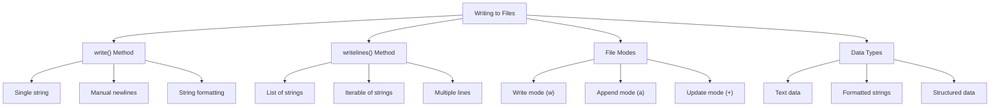

**Diagram Explanation**: This diagram shows the different methods and approaches for writing data to files in Python, including the available methods and file modes.

### Basic Writing Operations

```python
# Opening file in write mode
file = open("new_file.txt", "w")

# Writing single string
file.write("Hello, world!\n")  # \n creates a new line
file.write("This is another line.\n")

# Closing the file
file.close()
```

### Writing Multiple Lines

```python
# Using writelines() method
lines = ["Line 1: Karachi\n", "Line 2: Lahore\n", "Line 3: Peshawar\n"]
file = open("new_file.txt", "a")  # Append mode
file.writelines(lines)
file.close()
```

### Writing with Different Modes

```python
# Write mode - overwrites existing content
with open("data.txt", "w") as file:
    file.write("This will overwrite existing content\n")

# Append mode - adds to existing content
with open("data.txt", "a") as file:
    file.write("This will be appended\n")

# Update mode - allows both reading and writing
with open("data.txt", "w+") as file:
    file.write("Initial content\n")
    file.seek(0)  # Move to beginning
    content = file.read()
    print(content)
```

### Writing Best Practices

1. **Use `with` statement**: Ensures automatic file closing
2. **Handle exceptions**: Catch and handle file operation errors
3. **Add newlines**: Use `\n` for proper line breaks
4. **Flush data**: Use `flush()` for immediate writing
5. **Check permissions**: Ensure write permissions exist

---

## Reading from Files

Reading from files allows you to retrieve stored data. Python provides multiple methods for reading data from files.

### Reading Methods Overview

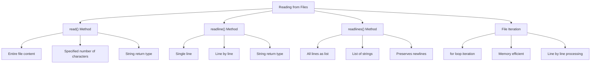

**Diagram Explanation**: This diagram categorizes the different methods for reading data from files, showing their characteristics and return types.

### Basic Reading Operations

```python
# Opening file in read mode
file = open("new_file.txt", "r")

# Reading entire file content
content = file.read()
print(content)

# Reading single line
file.seek(0)  # Reset file pointer
line = file.readline()
print(line)

# Reading all lines into a list
file.seek(0)  # Reset file pointer
lines = file.readlines()
for line in lines:
    print(line)

# Closing the file
file.close()
```

### Reading Methods Comparison

```python
# Method 1: read() - entire file
with open("example.txt", "r") as file:
    content = file.read()
    print("--- Full Content ---")
    print(content)

# Method 2: readline() - single line
with open("example.txt", "r") as file:
    print("--- Single Line ---")
    line = file.readline()
    print(line)

# Method 3: readlines() - all lines as list
with open("example.txt", "r") as file:
    print("--- All Lines as List ---")
    lines = file.readlines()
    for line in lines:
        print(line, end='')

# Method 4: File iteration - memory efficient
with open("example.txt", "r") as file:
    print("--- Line by Line Iteration ---")
    for line in file:
        print(line.strip())  # .strip() removes leading/trailing whitespace
```

### Reading with File Pointer Control

```python
with open("example.txt", "r") as file:
    print("Current position:", file.tell())
    print("First line:", file.readline(), end="")
    print("Current position:", file.tell())
    
    # Move pointer back to start
    file.seek(0)
    print("After seek(0):", file.tell())
    print("First line again:", file.readline(), end="")
```

### Reading Best Practices

1. **Use `with` statement**: Automatic file closing
2. **Handle file not found**: Use try-except blocks
3. **Memory efficiency**: Use file iteration for large files
4. **Strip whitespace**: Use `strip()` to remove newlines
5. **Check file existence**: Verify file exists before reading

---

## File Pointer Management

A file pointer (also called file cursor or file position indicator) is an internal marker that keeps track of the current position in a file where the next read or write operation will occur.

### File Pointer Overview

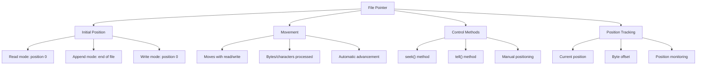

**Diagram Explanation**: This diagram illustrates the key aspects of file pointer management, showing how pointers are positioned, moved, and controlled in Python file operations.

### File Pointer Concepts

1. **Starting Position**:
   - `r` (read mode): Pointer starts at 0 (beginning of the file)
   - `a` (append mode): Pointer starts at the end of the file
   - `w` (write mode): File is truncated, pointer starts at 0

2. **How It Moves**:
   - When you read/write data, the pointer moves forward by the number of bytes/characters processed
   - Example: Reading 10 characters moves the pointer 10 positions forward

3. **Manual Control**:
   - Use `seek(offset)` to move the pointer to a specific byte position
   - Use `tell()` to check the current pointer position

### File Pointer Examples

```python
# Opening file and checking initial position
file = open("new_file.txt", "r")
print("Initial position:", file.tell())  # Output: 0

# Reading content and checking position
content = file.read()
print("Position after read:", file.tell())  # Output: end of file

# Moving pointer back to start
file.seek(0)
print("Position after seek(0):", file.tell())  # Output: 0

# Reading single line
line = file.readline()
print("Position after readline:", file.tell())

# Closing file
file.close()
```

### File Pointer Methods

```python
with open("example.txt", "r") as file:
    # Check current position
    print("Current position:", file.tell())
    
    # Read first line
    first_line = file.readline()
    print("After reading first line:", file.tell())
    
    # Move to specific position
    file.seek(10)  # Move to 10th character
    print("After seek(10):", file.tell())
    
    # Read from current position
    content = file.read(20)  # Read 20 characters
    print("Content from position 10:", content)
    
    # Move to end of file
    file.seek(0, 2)  # 0 offset from end (2)
    print("Position at end:", file.tell())
```

### File Pointer Best Practices

1. **Reset when needed**: Use `seek(0)` to return to file beginning
2. **Monitor position**: Use `tell()` to track current position
3. **Efficient positioning**: Use `seek()` for random access
4. **Handle end of file**: Check for EOF conditions
5. **Binary vs text**: Be aware of different behaviors in binary mode

---

## File Closing

Closing files is crucial for releasing system resources and ensuring that data is properly written to disk. Python provides multiple ways to close files.

### File Closing Overview

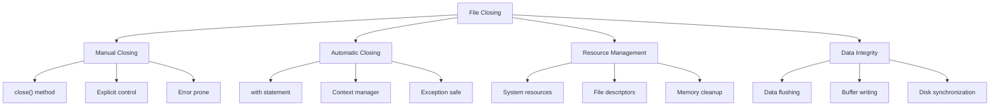

**Diagram Explanation**: This diagram shows the different approaches to file closing in Python, highlighting the benefits of automatic closing and proper resource management.

### Manual File Closing

```python
# Opening and manually closing file
file = open("data.txt", "w")
file.write("Some data")
file.close()  # Manual closing

# Checking if file is closed
print("File closed:", file.closed)  # Output: True
```

### Problems with Manual Closing

```python
# Problematic code - file might not close if error occurs
file = open("data.txt", "w")
try:
    file.write("Some data")
    # If an error occurs here, file won't be closed
    result = 10 / 0  # This will cause an error
except ZeroDivisionError:
    print("Error occurred")
finally:
    file.close()  # Manual cleanup required
```

### Automatic File Closing with `with` Statement

```python
# Using with statement for automatic closing
with open("data.txt", "w") as file:
    file.write("Some data")
# File is automatically closed here, even if an error occurs

# This will raise an error because file is closed
# file.tell()  # ValueError: I/O operation on closed file
```

### File Closing Best Practices

1. **Always use `with` statement**: Ensures automatic closing
2. **Handle exceptions**: Use try-except blocks for error handling
3. **Check file status**: Use `file.closed` to verify file state
4. **Flush before closing**: Use `flush()` for immediate data writing
5. **Multiple files**: Use multiple `with` statements or comma separation

### Multiple File Handling

```python
# Handling multiple files with with statement
with open("source.txt", "r") as source, open("destination.txt", "w") as dest:
    for line in source:
        dest.write(line)
# Both files are automatically closed

# Alternative approach
with open("source.txt", "r") as source:
    with open("destination.txt", "w") as dest:
        for line in source:
            dest.write(line)
# Both files are automatically closed
```

---

## The with Statement

The `with` statement (context manager) is the best practice for file handling in Python. It ensures that files are automatically closed, even if errors occur during execution.

### With Statement Overview

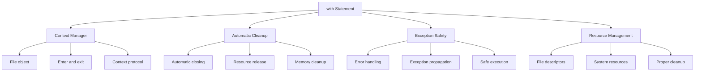

**Diagram Explanation**: This diagram illustrates the key benefits of the `with` statement, showing how it provides automatic cleanup, exception safety, and proper resource management.

### Basic with Statement Usage

```python
# Basic with statement
with open("new_file.txt", "r") as file:
    content = file.read()
    print(content)
# File is automatically closed here

# Validating automatic closing
with open("new_file.txt", "r") as file:
    content = file.read()
    print("File closed inside with:", file.closed)  # Output: False

print("File closed after with:", file.closed)  # Output: True
```

### with Statement Benefits

1. **Automatic Closing**: Files are closed automatically
2. **Exception Safety**: Files are closed even if errors occur
3. **Clean Code**: Reduces boilerplate code
4. **Resource Management**: Proper cleanup of system resources
5. **Error Prevention**: Prevents resource leaks

### with Statement Examples

```python
# Reading with with statement
with open("data.txt", "r") as file:
    for line in file:
        print(line.strip())

# Writing with with statement
with open("output.txt", "w") as file:
    file.write("Line 1\n")
    file.write("Line 2\n")

# Appending with with statement
with open("log.txt", "a") as file:
    file.write("New log entry\n")

# Multiple operations
with open("data.txt", "r+") as file:
    content = file.read()
    file.seek(0)
    file.write("Updated content\n")
```

### Exception Handling with with Statement

```python
# with statement handles exceptions automatically
try:
    with open("nonexistent.txt", "r") as file:
        content = file.read()
except FileNotFoundError:
    print("File not found")
# File is automatically closed even if exception occurs

# Multiple files with exception handling
try:
    with open("source.txt", "r") as source, open("dest.txt", "w") as dest:
        for line in source:
            dest.write(line)
except FileNotFoundError:
    print("Source file not found")
except PermissionError:
    print("Permission denied")
# Both files are automatically closed
```

---

## File Operations Examples

Here are comprehensive examples demonstrating various file operations and their practical applications.

### File Operations Overview

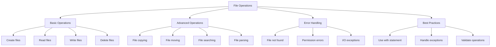

**Diagram Explanation**: This diagram categorizes file operations into basic operations, advanced operations, error handling, and best practices.

### File Creation and Writing

```python
# Create and write to a file
with open('demo.txt', 'w') as file:
    file.write('Python File Handling\n')
    file.write('Line 1\nLine 2\n')

# Read and print content
with open('demo.txt', 'r') as file:
    print("Content:")
    print(file.read())

# Append a new line
with open('demo.txt', 'a') as file:
    file.write('Appended line\n')

# Read lines using seek
with open('demo.txt', 'r+') as file:
    file.seek(0)
    print("First line:", file.readline())
```

### File Copying Function

```python
def copy_file(source_path, destination_path):
    """Copy a file from source to destination with error handling."""
    try:
        with open(source_path, "r") as source_file, open(destination_path, "w") as dest_file:
            for line in source_file:
                dest_file.write(line)
        print(f"File '{source_path}' copied to '{destination_path}' successfully.")
    except FileNotFoundError:
        print(f"Error: Source file '{source_path}' not found.")
    except PermissionError:
        print(f"Error: Permission denied for file '{source_path}' or '{destination_path}'.")
    except Exception as e:
        print(f"An error occurred: {e}")

# Usage
copy_file("source.txt", "destination.txt")
```

### Exclusive File Creation

```python
# Exclusive creation mode - fails if file exists
try:
    with open('unique.txt', 'x') as file:
        file.write('Created exclusively!')
    print("File created successfully!")
except FileExistsError:
    print("File already exists.")
```

### File Reading with Different Methods

```python
# Method 1: Read entire file
with open('example.txt', 'r') as file:
    content = file.read()
    print("--- Full Content ---")
    print(content)

# Method 2: Read line by line
with open('example.txt', 'r') as file:
    print("--- Line by Line ---")
    for line in file:
        print(line, end='')

# Method 3: Read single line
with open('example.txt', 'r') as file:
    print("--- Single Line ---")
    line = file.readline()
    print(line, end='')

# Method 4: Read all lines into list
with open('example.txt', 'r') as file:
    lines = file.readlines()
    print("--- All Lines as List ---")
    for line in lines:
        print(line, end='')
```

---

## Error Handling in File Operations

Proper error handling is essential for robust file operations. Python provides specific exceptions for different file-related errors.

### File Error Types Overview

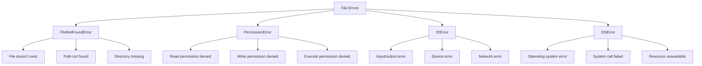

**Diagram Explanation**: This diagram categorizes different types of file-related errors in Python, showing the specific exceptions and their causes.

### Common File Exceptions

1. **FileNotFoundError**: Raised when a file or directory is requested but doesn't exist
2. **PermissionError**: Raised when trying to access a file without proper permissions
3. **IOError**: Raised when an I/O operation fails
4. **OSError**: Base class for operating system related errors

### Error Handling Examples

```python
# Basic error handling
try:
    with open("nonexistent.txt", "r") as file:
        content = file.read()
except FileNotFoundError:
    print("File not found!")
except PermissionError:
    print("Permission denied!")
except IOError as e:
    print(f"I/O error: {e}")
except Exception as e:
    print(f"Unexpected error: {e}")
```

### Comprehensive Error Handling

```python
def safe_file_operation(filename, mode="r"):
    """Safely perform file operations with comprehensive error handling."""
    try:
        with open(filename, mode) as file:
            if mode == "r":
                return file.read()
            elif mode == "w":
                file.write("Sample content")
                return "File written successfully"
            else:
                return "File opened successfully"
    except FileNotFoundError:
        return f"Error: File '{filename}' not found"
    except PermissionError:
        return f"Error: Permission denied for file '{filename}'"
    except IOError as e:
        return f"I/O error: {e}"
    except OSError as e:
        return f"OS error: {e}"
    except Exception as e:
        return f"Unexpected error: {e}"

# Usage examples
result = safe_file_operation("nonexistent.txt")
print(result)  # Output: Error: File 'nonexistent.txt' not found

result = safe_file_operation("readonly.txt", "w")
print(result)  # Output: Error: Permission denied for file 'readonly.txt'
```

### File Validation

```python
import os

def validate_file_operation(filename, mode="r"):
    """Validate file operations before attempting them."""
    # Check if file exists for read operations
    if mode in ["r", "r+"] and not os.path.exists(filename):
        raise FileNotFoundError(f"File '{filename}' not found")
    
    # Check if directory exists for write operations
    if mode in ["w", "a", "x"]:
        directory = os.path.dirname(filename)
        if directory and not os.path.exists(directory):
            raise FileNotFoundError(f"Directory '{directory}' not found")
    
    # Check file permissions
    if mode in ["r", "r+"] and os.path.exists(filename):
        if not os.access(filename, os.R_OK):
            raise PermissionError(f"Read permission denied for '{filename}'")
    
    if mode in ["w", "a", "x"]:
        directory = os.path.dirname(filename) or "."
        if not os.access(directory, os.W_OK):
            raise PermissionError(f"Write permission denied for directory '{directory}'")

# Usage
try:
    validate_file_operation("data.txt", "r")
    with open("data.txt", "r") as file:
        content = file.read()
except (FileNotFoundError, PermissionError) as e:
    print(f"Validation failed: {e}")
```

---

## Comprehensive File Handling Example

Here's a comprehensive example that demonstrates all the file handling concepts covered in this lesson.

### Comprehensive File Handling Flow

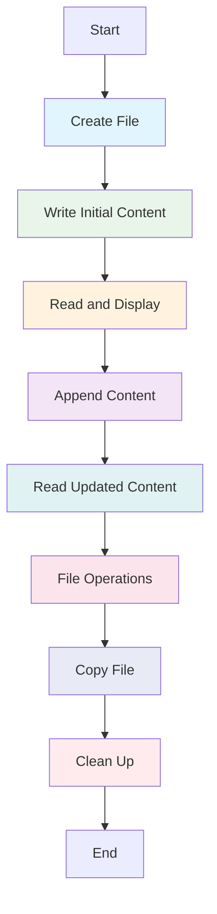

**Diagram Explanation**: This flowchart shows the complete file handling workflow, illustrating the sequence of operations from file creation to cleanup.

### Complete File Handling Example

```python
# Comprehensive file handling example
import os

def comprehensive_file_demo():
    """Demonstrates comprehensive file handling operations."""
    
    # 1. Create a file and write to it
    print("=== Creating and Writing to File ===")
    with open('example.txt', 'w') as f:
        f.write("This is line 1.\n")
        f.write("This is line 2.\n")
        f.writelines(["This is line 3.\n", "This is line 4.\n"])
    print("File created and written successfully!")
    
    # 2. Read the file and print its content
    print("\n=== Reading Full Content ===")
    with open('example.txt', 'r') as f:
        content = f.read()
        print("--- Full Content ---")
        print(content)
    
    # 3. Read the file line by line
    print("\n=== Reading Line by Line ===")
    with open('example.txt', 'r') as f:
        print("--- Line by Line ---")
        for line in f:
            print(line, end='')
    
    # 4. Read a single line
    print("\n\n=== Reading Single Line ===")
    with open('example.txt', 'r') as f:
        print("--- Single Line ---")
        line = f.readline()
        print(line, end='')
    
    # 5. Read all lines into a list
    print("\n=== Reading All Lines as List ===")
    with open('example.txt', 'r') as f:
        lines = f.readlines()
        print("--- All Lines as List ---")
        for line in lines:
            print(line, end='')
    
    # 6. Append to the file
    print("\n\n=== Appending to File ===")
    with open('example.txt', 'a') as f:
        f.write("This is appended line 1.\n")
        f.write("This is appended line 2.\n")
    print("Content appended successfully!")
    
    # 7. Reading with seek and tell
    print("\n=== Seek and Tell Operations ===")
    with open('example.txt', 'r') as f:
        print("--- Seek and Tell ---")
        print("Current position:", f.tell())
        print("First line:", f.readline(), end="")
        print("Current position:", f.tell())
        f.seek(0)
        print("After seek(0):", f.tell())
        print("First line again:", f.readline(), end="")
    
    # 8. Demonstrating 'x' mode (exclusive creation)
    print("\n\n=== Exclusive Creation Mode ===")
    try:
        with open('new_file.txt', 'x') as f:
            f.write("This is a new file created in 'x' mode.")
            print("new_file.txt created successfully!")
    except FileExistsError:
        print("File 'new_file.txt' already exists!")
    
    # 9. Copy file example
    print("\n=== File Copying ===")
    def copy_file(source, destination):
        try:
            with open(source, 'r') as src, open(destination, 'w') as dest:
                for line in src:
                    dest.write(line)
                print(f"'{source}' successfully copied to '{destination}'")
        except FileNotFoundError:
            print(f"Error: File not found '{source}'")
        except Exception as e:
            print(f"Error during copying: {e}")
    
    copy_file("example.txt", "example_copy.txt")
    
    # 10. File information
    print("\n=== File Information ===")
    if os.path.exists('example.txt'):
        file_size = os.path.getsize('example.txt')
        print(f"File size: {file_size} bytes")
        print(f"File exists: {os.path.exists('example.txt')}")
    
    # 11. Clean up (optional)
    print("\n=== Cleanup ===")
    cleanup_files = ['example.txt', 'example_copy.txt', 'new_file.txt']
    for file in cleanup_files:
        if os.path.exists(file):
            os.remove(file)
            print(f"Removed: {file}")

# Run the comprehensive demo
comprehensive_file_demo()
```

### Key Features of This Example

1. **File Creation**: Demonstrates creating files with different modes
2. **Writing Operations**: Shows `write()` and `writelines()` methods
3. **Reading Operations**: Demonstrates all reading methods
4. **File Pointer Control**: Shows `seek()` and `tell()` usage
5. **Appending**: Demonstrates append mode operations
6. **Exclusive Creation**: Shows `x` mode usage
7. **File Copying**: Implements a robust file copying function
8. **Error Handling**: Comprehensive exception handling
9. **File Information**: Shows file metadata access
10. **Cleanup**: Demonstrates proper file cleanup

---

## Key Concepts Covered

This lesson covered the fundamental aspects of file handling in Python:

### Key Concepts Overview

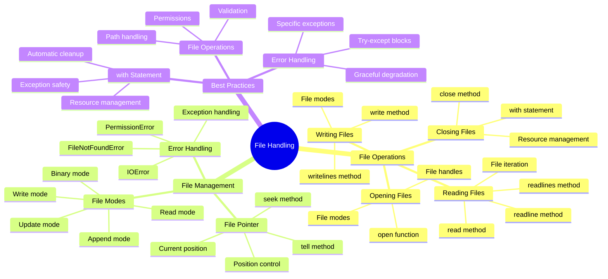

**Diagram Explanation**: This mind map provides a comprehensive overview of all topics covered in this lesson, showing the relationship between file operations, file management, and best practices.

### Best Practices

1. **File Operations**:
   - Always use `with` statement for automatic file closing
   - Handle exceptions appropriately
   - Validate file operations before attempting them
   - Use appropriate file modes for different operations

2. **Resource Management**:
   - Use context managers (`with` statement)
   - Ensure proper cleanup of resources
   - Handle file descriptors properly
   - Monitor system resource usage

3. **Error Handling**:
   - Use specific exception types
   - Provide meaningful error messages
   - Implement graceful error recovery
   - Log errors for debugging

4. **File Security**:
   - Validate file paths
   - Check file permissions
   - Sanitize user input
   - Use secure file operations

### Common Pitfalls

1. **File Operations**:
   - Forgetting to close files
   - Not handling file not found errors
   - Using wrong file modes
   - Not checking file permissions

2. **Resource Management**:
   - Resource leaks from unclosed files
   - Not using context managers
   - Improper exception handling
   - Memory issues with large files

3. **Error Handling**:
   - Catching too broad exceptions
   - Not providing specific error messages
   - Ignoring file operation errors
   - Poor error recovery strategies

4. **File Security**:
   - Path traversal vulnerabilities
   - Insecure file permissions
   - Unvalidated file operations
   - Race conditions in file access

---

## Useful Links

- [Python File I/O Documentation](https://docs.python.org/3/tutorial/inputoutput.html#reading-and-writing-files)
- [File Objects Documentation](https://docs.python.org/3/glossary.html#term-file-object)
- [Built-in Functions - open()](https://docs.python.org/3/library/functions.html#open)
- [File and Directory Access](https://docs.python.org/3/library/filesys.html)
- [Pathlib Module](https://docs.python.org/3/library/pathlib.html)
- [OS Module](https://docs.python.org/3/library/os.html)
- [Exception Handling](https://docs.python.org/3/tutorial/errors.html)
- [Context Managers](https://docs.python.org/3/reference/datamodel.html#context-managers)

---

*This lesson provides a comprehensive understanding of file handling in Python, essential for data persistence, configuration management, and file-based operations in Python programs.*