# 🐍 Advanced Python Functions & Patterns

> **Transform from Python user to Python power user!**  
> Master 7 essential advanced concepts that make your code cleaner, faster, and more reusable.

## 🎯 Learning Path Overview


## 📚 Table of Contents

1. [🔒 Closures](#-closures) - Functions with Memory
2. [🎁 Function Decorators](#-function-decorators) - Wrapping Functions
3. [🔄 Higher-Order Functions](#-higher-order-functions) - Functions Working with Functions
4. [📝 Advanced Comprehensions](#-advanced-comprehensions) - Concise Data Creation
5. [⚡ Caching with lru_cache](#-caching-with-lru_cache) - Performance Optimization
6. [🔄 Iterators & Generators](#-iterators--generators) - Memory-Efficient Sequences
7. [🛡️ Context Managers](#-context-managers) - Automatic Resource Management

---

## 🔒 Closures

**What are Closures?** A closure is a function that "remembers" variables from the scope where it was created, even after that scope has finished executing. Think of it as a function with a memory.

### 🎨 Closures Flow Diagram

```mermaid
flowchart TD
    A[🚀 Start: Function Definition] --> B[📦 Outer Function Created]
    B --> C[🔧 Inner Function Defined]
    C --> D[💾 Variables Captured]
    D --> E[🔄 Inner Function Returned]
    E --> F[📤 Outer Function Ends]
    F --> G[🧠 Inner Function Remembers Variables]
    G --> H[⚡ Closure Ready to Use]
    
    H --> I[📞 Call Closure Function]
    I --> J[🔍 Access Captured Variables]
    J --> K[✅ Execute with Memory]
    K --> L[🔄 Can be Called Multiple Times]
    L --> I
    
    style A fill:#e1f5fe
    style H fill:#c8e6c9
    style D fill:#fff3e0
    style G fill:#fce4ec
    style K fill:#e8f5e8
```



### 🎯 Key Concepts

#### **1. How Closures Work**
- **Inner Function**: A function defined inside another function
- **Captured Variables**: Variables from the outer function that the inner function can access
- **Persistent Memory**: The inner function keeps access to these variables even after the outer function ends

#### **2. Why Use Closures?**
- **State Management**: Keep track of data without using global variables
- **Function Factories**: Create specialized functions with different configurations
- **Data Privacy**: Hide implementation details while providing functionality

#### **3. When to Use Closures**
- Creating counters or accumulators
- Building configurable functions (validators, formatters)
- Implementing callbacks with state
- Creating function factories

### 💡 Real-World Example
```python
def make_counter(start=0):
    """Creates a counter function that remembers its current value"""
    count = start  # This variable is "captured" by the closure
    
    def increment(step=1):
        nonlocal count  # Allows us to modify the captured variable
        count += step
        return count
    
    return increment  # Return the inner function

# Create two independent counters
counter1 = make_counter(10)  # Starts at 10
counter2 = make_counter(100)  # Starts at 100

print("Counter 1:")
print(counter1())  # 11
print(counter1(5))  # 16
print(counter1())  # 17

print("\nCounter 2:")
print(counter2())  # 101
print(counter2(10))  # 111

print("\nEach counter remembers its own state independently!")
```

### 🎨 Visual Explanation
```
make_counter(10) creates:
┌─────────────────┐
│ count = 10      │ ← Captured variable
│                 │
│ increment() ────┼─── Returns this function
│   remembers     │    that remembers count
│   count = 10    │
└─────────────────┘
```

---

## 🎁 Function Decorators

**What are Decorators?** A decorator is a function that takes another function and extends its behavior without permanently modifying it. Think of it as "wrapping" a function with additional functionality.

### 🎨 Decorators Flow Diagram

```mermaid
flowchart TD
    A[🚀 Start: Original Function] --> B[🎁 Decorator Applied]
    B --> C[📦 Wrapper Function Created]
    C --> D[🔧 Enhanced Function Ready]
    
    D --> E[📞 Function Called]
    E --> F[⏰ Before Logic Executed]
    F --> G[🎯 Original Function Called]
    G --> H[📊 After Logic Executed]
    H --> I[✅ Enhanced Result Returned]
    
    J[🔄 Multiple Decorators] --> K[📚 Stacked Wrapping]
    K --> L[🎂 Layer by Layer Enhancement]
    L --> D
    
    M[⚙️ Decorator with Parameters] --> N[🏭 Decorator Factory]
    N --> O[🎛️ Configured Decorator]
    O --> D
    
    style A fill:#e1f5fe
    style D fill:#c8e6c9
    style F fill:#fff3e0
    style G fill:#fce4ec
    style H fill:#e8f5e8
    style K fill:#f3e5f5
```



### 🎯 Key Concepts

#### **1. How Decorators Work**
- **Wrapper Function**: A function that wraps around the original function
- **Function Enhancement**: Adds behavior before, after, or around the original function
- **Transparent Usage**: The decorated function works exactly like the original, but with extra features

#### **2. Why Use Decorators?**
- **Code Reuse**: Apply the same enhancement to multiple functions
- **Separation of Concerns**: Keep business logic separate from cross-cutting concerns
- **Clean Code**: Avoid repetitive code for logging, timing, validation, etc.

#### **3. Common Decorator Patterns**
- **Logging**: Record function calls and results
- **Timing**: Measure how long functions take to execute
- **Validation**: Check inputs before function execution
- **Caching**: Store results to avoid repeated computation
- **Authentication**: Verify permissions before allowing access

### 💡 Real-World Examples

#### Basic Logging Decorator
```python
def log_calls(func):
    """Decorator that logs function calls"""
    
    def wrapper(*args, **kwargs):
        print(f"🔍 Calling {func.__name__} with args: {args}, kwargs: {kwargs}")
        result = func(*args, **kwargs)
        print(f"✅ {func.__name__} returned: {result}")
        return result
    
    return wrapper

# Apply the decorator using @ syntax
@log_calls
def add_numbers(a, b):
    """Simple addition function"""
    return a + b

@log_calls
def greet(name, greeting="Hello"):
    """Greeting function with default parameter"""
    return f"{greeting}, {name}!"

# Test the decorated functions
result1 = add_numbers(5, 3)
result2 = greet("Alice", "Hi")
```

#### Timer Decorator with functools.wraps
```python
import time
import functools

def timer(func):
    """Decorator that measures function execution time"""
    
    @functools.wraps(func)  # Preserves original function metadata
    def wrapper(*args, **kwargs):
        start_time = time.perf_counter()
        result = func(*args, **kwargs)
        end_time = time.perf_counter()
        
        execution_time = end_time - start_time
        print(f"⏱️ {func.__name__} took {execution_time:.6f} seconds")
        return result
    
    return wrapper

@timer
def slow_calculation(n):
    """Simulates a slow calculation"""
    total = 0
    for i in range(n):
        total += i * i
    return total

# Test the timer decorator
result = slow_calculation(10000)
print(f"Calculation result: {result}")

# Check that function metadata is preserved
print(f"Function name preserved: {slow_calculation.__name__}")
print(f"Function docstring preserved: {slow_calculation.__doc__}")
```

---

## 🔄 Higher-Order Functions

**What are Higher-Order Functions?** Higher-order functions are functions that either take other functions as arguments, return functions, or both. They enable functional programming patterns in Python.

### 🎨 Higher-Order Functions Flow Diagram

```mermaid
flowchart TD
    A[🚀 Start: Data Collection] --> B[🔄 Choose HOF Operation]
    
    B --> C[🗺️ MAP: Transform Each Item]
    B --> D[🔍 FILTER: Keep Matching Items]
    B --> E[📊 REDUCE: Combine All Items]
    B --> F[🔗 COMPOSE: Chain Functions]
    
    C --> G[📝 Apply Function to Each Element]
    G --> H[📋 New Collection Created]
    
    D --> I[✅ Test Each Item]
    I --> J[📋 Filtered Collection]
    
    E --> K[🔄 Accumulate Results]
    K --> L[📊 Single Result]
    
    F --> M[🔗 Function A + Function B]
    M --> N[🎯 Combined Function]
    
    H --> O[📈 Data Pipeline]
    J --> O
    L --> O
    N --> O
    
    O --> P[✅ Final Result]
    
    style A fill:#e1f5fe
    style B fill:#fff3e0
    style C fill:#fce4ec
    style D fill:#f3e5f5
    style E fill:#e8f5e8
    style F fill:#fff8e1
    style P fill:#c8e6c9
```



### 🎯 Key Concepts

#### **1. Functions as First-Class Citizens**
- **Pass as Arguments**: Functions can be passed to other functions
- **Return Functions**: Functions can return other functions
- **Store in Variables**: Functions can be assigned to variables
- **Create at Runtime**: Functions can be created dynamically

#### **2. Built-in HOFs**
- **map()**: Apply a function to every item in an iterable
- **filter()**: Keep only items that meet a condition
- **reduce()**: Combine all items into a single value
- **sorted()**: Sort items using a custom function

#### **3. Function Composition**
- **Pipeline Pattern**: Chain functions together
- **Data Transformation**: Transform data through multiple steps
- **Reusable Components**: Build complex operations from simple functions

### 💡 Real-World Examples

#### Built-in HOFs - map, filter, reduce
```python
from functools import reduce

# Sample data
numbers = [1, 2, 3, 4, 5, 6, 7, 8, 9, 10]
words = ["hello", "world", "python", "programming", "functions"]

print("Original data:")
print(f"Numbers: {numbers}")
print(f"Words: {words}")
print()

# map() - Apply a function to every item
squared = list(map(lambda x: x ** 2, numbers))
print("Squared numbers:", squared)

word_lengths = list(map(len, words))
print("Word lengths:", word_lengths)
print()

# filter() - Keep only items that meet a condition
even_numbers = list(filter(lambda x: x % 2 == 0, numbers))
print("Even numbers:", even_numbers)

long_words = list(filter(lambda word: len(word) > 5, words))
print("Long words (>5 chars):", long_words)
print()

# reduce() - Combine all items into a single value
sum_of_numbers = reduce(lambda acc, x: acc + x, numbers, 0)
print("Sum of all numbers:", sum_of_numbers)

longest_word = reduce(lambda longest, word: word if len(word) > len(longest) else longest, words)
print("Longest word:", longest_word)
```

#### Function Composition Pipeline
```python
def compose(f, g):
    """Compose two functions: f(g(x))"""
    return lambda x: f(g(x))

def add_one(x):
    return x + 1

def multiply_by_two(x):
    return x * 2

def square(x):
    return x ** 2

# Create composed functions
add_then_multiply = compose(multiply_by_two, add_one)  # 2 * (x + 1)
square_then_add = compose(add_one, square)  # x^2 + 1

# Test the composed functions
test_value = 5
print(f"Original value: {test_value}")
print(f"add_then_multiply({test_value}) = {add_then_multiply(test_value)}")
print(f"square_then_add({test_value}) = {square_then_add(test_value)}")
print()

# Data processing pipeline
data = [1, 2, 3, 4, 5]
print(f"Original data: {data}")

# Pipeline: square -> add_one -> multiply_by_two
pipeline = compose(multiply_by_two, compose(add_one, square))
processed = [pipeline(x) for x in data]
print(f"Processed data: {processed}")
```

### 🎨 Visual Pipeline
```
Data → [filter] → [map] → [reduce] → Result
  ↓       ↓        ↓        ↓
[1,2,3] → [2] → [4] → 4
```

---

## 📝 Advanced Comprehensions

**What are Comprehensions?** Comprehensions are concise ways to create lists, dictionaries, and sets in Python. They combine loops and conditional logic into a single, readable expression.

### 🎨 Comprehensions Flow Diagram


### 🎯 Key Concepts

#### **1. Types of Comprehensions**
- **List Comprehensions**: Create lists with `[expression for item in iterable]`
- **Dictionary Comprehensions**: Create dictionaries with `{key: value for item in iterable}`
- **Set Comprehensions**: Create sets with `{expression for item in iterable}`
- **Generator Comprehensions**: Create generators with `(expression for item in iterable)`

#### **2. Advanced Features**
- **Conditional Filtering**: Add `if` conditions to filter items
- **Nested Comprehensions**: Use multiple `for` loops for complex data structures
- **Multiple Iterables**: Iterate over multiple sequences simultaneously
- **Expression Complexity**: Use complex expressions and function calls

#### **3. When to Use Comprehensions**
- **Data Transformation**: Convert one data structure to another
- **Filtering**: Extract items that meet specific criteria
- **Mapping**: Apply functions to every item in a collection
- **Flattening**: Convert nested structures to flat ones

### 💡 Real-World Examples

#### Advanced List Comprehensions
```python
# Sample data
numbers = [1, 2, 3, 4, 5, 6, 7, 8, 9, 10]
words = ["hello", "world", "python", "programming", "functions", "advanced"]
matrix = [[1, 2, 3], [4, 5, 6], [7, 8, 9]]

print("Original data:")
print(f"Numbers: {numbers}")
print(f"Words: {words}")
print(f"Matrix: {matrix}")
print()

# Basic list comprehension
squares = [x ** 2 for x in numbers]
print("Squares:", squares)

# List comprehension with condition
even_squares = [x ** 2 for x in numbers if x % 2 == 0]
print("Even squares:", even_squares)

# List comprehension with complex expression
word_info = [(word, len(word), word.upper()) for word in words]
print("Word info (word, length, uppercase):", word_info)

# Nested list comprehension - flatten matrix
flattened = [item for row in matrix for item in row]
print("Flattened matrix:", flattened)

# Multiple conditions
filtered_words = [word.upper() for word in words if len(word) > 5 and 'a' in word]
print("Long words with 'a' (uppercase):", filtered_words)
```

#### Dictionary and Set Comprehensions
```python
# Sample data
students = ["Alice", "Bob", "Charlie", "Diana", "Eve"]
scores = [85, 92, 78, 96, 88]
text = "hello world python programming functions"

print("Original data:")
print(f"Students: {students}")
print(f"Scores: {scores}")
print(f"Text: '{text}'")
print()

# Dictionary comprehension - create student-score mapping
student_scores = {student: score for student, score in zip(students, scores)}
print("Student scores:", student_scores)

# Dictionary comprehension with condition
high_scores = {student: score for student, score in student_scores.items() if score >= 90}
print("High scores (>=90):", high_scores)

# Dictionary comprehension with transformation
grade_scale = {student: "A" if score >= 90 else "B" if score >= 80 else "C" 
               for student, score in student_scores.items()}
print("Grade scale:", grade_scale)

# Set comprehension - unique characters
unique_chars = {char.lower() for char in text if char.isalpha()}
print("Unique letters:", sorted(unique_chars))

# Set comprehension with condition
vowels = {char for char in text.lower() if char in 'aeiou'}
print("Vowels in text:", sorted(vowels))

# Dictionary comprehension from text analysis
word_lengths = {word: len(word) for word in text.split()}
print("Word lengths:", word_lengths)
```

---

## ⚡ Caching with lru_cache

**What is Caching?** Caching is a technique that stores the results of expensive function calls and returns the cached result when the same inputs occur again. This dramatically improves performance for functions with repeated calls.

### 🎨 Caching Flow Diagram

```mermaid
flowchart TD
    A[🚀 Start: Function Call] --> B[🔍 Check Cache]
    
    B --> C{📋 Input in Cache?}
    C -->|Yes| D[⚡ Cache Hit]
    C -->|No| E[❌ Cache Miss]
    
    D --> F[📊 Return Cached Result]
    F --> G[✅ Fast Response]
    
    E --> H[🔄 Execute Function]
    H --> I[⏱️ Expensive Computation]
    I --> J[💾 Store Result in Cache]
    J --> K[📊 Return New Result]
    K --> L[🐌 Slower Response]
    
    M[📈 Cache Management] --> N[🗑️ LRU Eviction]
    N --> O[📏 Size Limit Check]
    O --> P{📊 Cache Full?}
    P -->|Yes| Q[🗑️ Remove Least Recent]
    P -->|No| R[✅ Add to Cache]
    Q --> R
    
    G --> S[📊 Performance Metrics]
    L --> S
    S --> T[📈 Cache Statistics]
    
    style A fill:#e1f5fe
    style D fill:#c8e6c9
    style E fill:#ffcdd2
    style F fill:#e8f5e8
    style I fill:#fff3e0
    style T fill:#f3e5f5
```



### 🎯 Key Concepts

#### **1. How LRU Cache Works**
- **LRU**: Least Recently Used - removes least recently accessed items when cache is full
- **Memoization**: Stores function results based on input parameters
- **Automatic Management**: Handles cache size limits and eviction automatically
- **Transparent**: Works without changing how you call the function

#### **2. Benefits of Caching**
- **Performance**: Avoids repeated expensive calculations
- **Memory Efficiency**: Limits cache size to prevent memory issues
- **Automatic**: No manual cache management required
- **Thread-Safe**: Works correctly in multi-threaded environments

#### **3. When to Use Caching**
- **Recursive Functions**: Fibonacci, factorial, etc.
- **Expensive Computations**: Database queries, API calls, complex calculations
- **Pure Functions**: Functions that always return the same result for the same inputs
- **Repeated Calls**: Functions called frequently with the same parameters

### 💡 Real-World Examples

#### Fibonacci with and without Caching
```python
import time
from functools import lru_cache

# Without caching - slow recursive implementation
def fibonacci_slow(n):
    """Calculate Fibonacci number without caching"""
    if n <= 1:
        return n
    return fibonacci_slow(n - 1) + fibonacci_slow(n - 2)

# With caching - fast implementation
@lru_cache(maxsize=128)
def fibonacci_fast(n):
    """Calculate Fibonacci number with caching"""
    if n <= 1:
        return n
    return fibonacci_fast(n - 1) + fibonacci_fast(n - 2)

# Test performance comparison
test_values = [10, 20, 30]

print("Performance Comparison:")
print("=" * 40)

for n in test_values:
    # Test slow version
    start_time = time.perf_counter()
    result_slow = fibonacci_slow(n)
    slow_time = time.perf_counter() - start_time
    
    # Test fast version
    start_time = time.perf_counter()
    result_fast = fibonacci_fast(n)
    fast_time = time.perf_counter() - start_time
    
    print(f"Fibonacci({n}):")
    print(f"  Slow: {result_slow} (took {slow_time:.6f}s)")
    print(f"  Fast: {result_fast} (took {fast_time:.6f}s)")
    
    if slow_time > 0:
        speedup = slow_time / fast_time
        print(f"  Speedup: {speedup:.1f}x faster!")
    print()

# Show cache statistics
cache_info = fibonacci_fast.cache_info()
print("Cache Statistics:")
print(f"  Hits: {cache_info.hits}")
print(f"  Misses: {cache_info.misses}")
print(f"  Current size: {cache_info.currsize}/{cache_info.maxsize}")
```

#### Custom Caching for Expensive Operations
```python
from functools import lru_cache
import time

# Simulate an expensive database query
@lru_cache(maxsize=32)
def expensive_database_query(user_id):
    """Simulate an expensive database query with caching"""
    print(f"🔍 Executing database query for user {user_id}...")
    time.sleep(0.1)  # Simulate database delay
    return f"User data for {user_id}: {user_id * 42}"

# Simulate an expensive API call
@lru_cache(maxsize=16)
def expensive_api_call(endpoint, params):
    """Simulate an expensive API call with caching"""
    print(f"🌐 Making API call to {endpoint} with params {params}...")
    time.sleep(0.05)  # Simulate network delay
    return f"API response from {endpoint}: {hash(str(params))}"

print("Testing cached operations:")
print("=" * 40)

# Test database queries
print("Database Queries:")
user_ids = [1, 2, 1, 3, 2, 1]  # Note: 1 and 2 are repeated

for user_id in user_ids:
    result = expensive_database_query(user_id)
    print(f"  Result: {result}")

print()

# Test API calls
print("API Calls:")
api_calls = [
    ("/users", {"page": 1}),
    ("/posts", {"limit": 10}),
    ("/users", {"page": 1}),  # Repeated call
    ("/users", {"page": 2}),
    ("/posts", {"limit": 10}),  # Repeated call
]

for endpoint, params in api_calls:
    result = expensive_api_call(endpoint, params)
    print(f"  Result: {result}")

print()

# Show cache statistics
print("Cache Statistics:")
db_cache = expensive_database_query.cache_info()
api_cache = expensive_api_call.cache_info()

print(f"Database cache: {db_cache.hits} hits, {db_cache.misses} misses")
print(f"API cache: {api_cache.hits} hits, {api_cache.misses} misses")
```

---

## 🔄 Iterators & Generators

**What are Iterators and Generators?** Iterators and generators are Python's way of creating lazy, memory-efficient sequences. They produce values one at a time instead of creating entire collections in memory.

### 🎨 Iterators & Generators Flow Diagram

```mermaid
flowchart TD
    A[🚀 Start: Data Source] --> B[🔄 Choose Implementation]
    
    B --> C[📋 Iterator Class]
    B --> D[⚡ Generator Function]
    B --> E[🔧 Generator Expression]
    
    C --> F[🏗️ Implement __iter__ & __next__]
    F --> G[📊 Iterator Object Created]
    
    D --> H[🔧 Use yield Keyword]
    H --> I[⚡ Generator Object Created]
    
    E --> J[📝 (expression for item in iterable)]
    J --> K[🔧 Generator Object Created]
    
    G --> L[🔄 Iteration Process]
    I --> L
    K --> L
    
    L --> M[📞 next() Called]
    M --> N[🔍 Check for More Items]
    N -->|Yes| O[📊 Return Next Value]
    N -->|No| P[🛑 StopIteration Raised]
    
    O --> Q[💾 State Preserved]
    Q --> R[🔄 Ready for Next Call]
    R --> M
    
    P --> S[✅ Iteration Complete]
    
    T[💾 Memory Efficiency] --> U[📈 One Item at a Time]
    U --> V[🚀 Lazy Evaluation]
    V --> W[⚡ On-Demand Computation]
    
    style A fill:#e1f5fe
    style B fill:#fff3e0
    style C fill:#fce4ec
    style D fill:#f3e5f5
    style E fill:#e8f5e8
    style L fill:#fff8e1
    style O fill:#c8e6c9
    style P fill:#ffcdd2
    style V fill:#e3f2fd
```

### 🎯 Key Concepts

#### **1. Iterators**
- **Iterator Protocol**: Objects with `__iter__()` and `__next__()` methods
- **Lazy Evaluation**: Values are computed only when requested
- **Memory Efficient**: Don't store all values in memory at once
- **One-Time Use**: Can only be iterated through once

#### **2. Generators**
- **Generator Functions**: Functions that use `yield` instead of `return`
- **Generator Objects**: Created when you call a generator function
- **State Preservation**: Remember where they left off between calls
- **Automatic Iterator**: Generators automatically implement the iterator protocol

#### **3. When to Use Iterators/Generators**
- **Large Datasets**: When working with data that doesn't fit in memory
- **Infinite Sequences**: When you need potentially unlimited data
- **Data Pipelines**: When processing data step by step
- **Memory Optimization**: When you want to reduce memory usage

### 💡 Real-World Examples

#### Custom Iterator Class
```python
class NumberRange:
    """Custom iterator that generates numbers in a range"""
    
    def __init__(self, start, end, step=1):
        self.start = start
        self.end = end
        self.step = step
        self.current = start
    
    def __iter__(self):
        """Return self as the iterator"""
        return self
    
    def __next__(self):
        """Return the next number in the range"""
        if self.current >= self.end:
            raise StopIteration
        
        value = self.current
        self.current += self.step
        return value

# Test the custom iterator
print("Custom Iterator - NumberRange(0, 10, 2):")
number_range = NumberRange(0, 10, 2)

# Method 1: Using for loop
print("Using for loop:")
for num in number_range:
    print(f"  {num}")

# Method 2: Using next() manually
print("\nUsing next() manually:")
number_range2 = NumberRange(0, 5, 1)
try:
    while True:
        print(f"  {next(number_range2)}")
except StopIteration:
    print("  Iterator exhausted")

# Method 3: Convert to list
print("\nConvert to list:")
number_range3 = NumberRange(0, 8, 3)
numbers_list = list(number_range3)
print(f"  {numbers_list}")
```

#### Generator Functions
```python
def fibonacci_generator(n):
    """Generate Fibonacci numbers up to n"""
    a, b = 0, 1
    count = 0
    while count < n:
        yield a  # This is what makes it a generator
        a, b = b, a + b
        count += 1

def squares_generator(start, end):
    """Generate squares of numbers from start to end"""
    for i in range(start, end + 1):
        yield i ** 2

def even_numbers_generator(limit):
    """Generate even numbers up to limit"""
    num = 0
    while num <= limit:
        if num % 2 == 0:
            yield num
        num += 1

# Test generator functions
print("Generator Functions:")
print("=" * 30)

# Fibonacci generator
print("Fibonacci numbers (first 10):")
fib_gen = fibonacci_generator(10)
for num in fib_gen:
    print(f"  {num}")

print()

# Squares generator
print("Squares from 1 to 5:")
squares_gen = squares_generator(1, 5)
for square in squares_gen:
    print(f"  {square}")

print()

# Even numbers generator
print("Even numbers up to 10:")
even_gen = even_numbers_generator(10)
for even in even_gen:
    print(f"  {even}")

print()

# Generator expressions (similar to list comprehensions)
print("Generator expressions:")
numbers = [1, 2, 3, 4, 5]
doubled_gen = (x * 2 for x in numbers)
print(f"Doubled numbers: {list(doubled_gen)}")

# Memory efficiency demonstration
print("\nMemory efficiency - large range:")
large_range = (x for x in range(1000000))  # Generator expression
print(f"Generator object: {large_range}")
print(f"First 5 values: {[next(large_range) for _ in range(5)]}")
```

### 🎨 Memory Efficiency
```
Traditional approach:
[1,2,3,4,5,6,7,8,9,10] → [2,4,6,8,10] → [4,16,36,64,100] → 15 items in memory

Generator approach:
1 → 2 → 4 (only 1 item in memory at a time)
2 → 4 → 16
3 → (filtered out)
4 → 4 → 16
...
```

---

## 🛡️ Context Managers

**What are Context Managers?** Context managers are objects that define what happens when you enter and exit a block of code. They ensure that resources are properly cleaned up, even if an error occurs.

### 🎨 Context Managers Flow Diagram

```mermaid
flowchart TD
    A[🚀 Start: with Statement] --> B[🔧 Context Manager Created]
    B --> C[📞 __enter__() Called]
    C --> D[🔧 Setup Resources]
    D --> E[📊 Return Resource/Object]
    E --> F[🎯 Execute Code Block]
    
    F --> G{❓ Exception Occurred?}
    G -->|No| H[✅ Normal Completion]
    G -->|Yes| I[❌ Exception Raised]
    
    H --> J[📞 __exit__(None, None, None)]
    I --> K[📞 __exit__(exc_type, exc_val, exc_tb)]
    
    J --> L[🧹 Cleanup Resources]
    K --> M[🧹 Cleanup Resources]
    M --> N[🛡️ Exception Handling]
    N --> O{🔄 Suppress Exception?}
    O -->|Yes| P[✅ Exception Suppressed]
    O -->|No| Q[📤 Exception Re-raised]
    
    L --> R[✅ Context Block Complete]
    P --> R
    Q --> S[❌ Exception Propagated]
    
    T[🏭 Context Manager Types] --> U[📁 Built-in: File Operations]
    T --> V[🎛️ Custom: Class-based]
    T --> W[🔧 Decorator: @contextmanager]
    
    style A fill:#e1f5fe
    style C fill:#fff3e0
    style F fill:#fce4ec
    style H fill:#c8e6c9
    style I fill:#ffcdd2
    style L fill:#e8f5e8
    style M fill:#e8f5e8
    style R fill:#c8e6c9
    style S fill:#ffcdd2
```

### 🎯 Key Concepts

#### **1. How Context Managers Work**
- **`__enter__()`**: Called when entering the `with` block
- **`__exit__()`**: Called when exiting the `with` block (even if an error occurs)
- **Resource Management**: Automatically handle setup and cleanup
- **Exception Safety**: Ensure cleanup happens even if exceptions occur

#### **2. Why Use Context Managers?**
- **Automatic Cleanup**: No need to remember to close files, connections, etc.
- **Exception Safety**: Resources are cleaned up even if errors occur
- **Clean Code**: Reduces boilerplate code for resource management
- **Best Practices**: Follow Python's recommended patterns

#### **3. Common Use Cases**
- **File Operations**: Automatically close files
- **Database Connections**: Ensure connections are properly closed
- **Locks and Semaphores**: Manage thread synchronization
- **Temporary Changes**: Revert changes after a block of code

### 💡 Real-World Examples

#### Built-in Context Manager - File Operations
```python
# Using the built-in file context manager
print("File Context Manager:")
print("=" * 25)

# Write to a file
with open('example.txt', 'w') as f:
    f.write("Hello, World!\n")
    f.write("This is a test file.\n")
    f.write("Context managers are awesome!\n")
    print("✅ File written successfully")

# Read from the file
with open('example.txt', 'r') as f:
    content = f.read()
    print("📄 File content:")
    print(content)

# The file is automatically closed in both cases
print("🔒 File automatically closed")

# Demonstrate exception safety
print("\nException Safety Test:")
try:
    with open('example.txt', 'r') as f:
        print("📖 Reading file...")
        # Simulate an error
        raise ValueError("Simulated error!")
        print("This won't be printed")
except ValueError as e:
    print(f"❌ Error occurred: {e}")
    print("🔒 File was still closed automatically")
```

#### Custom Context Manager
```python
import time
from contextlib import contextmanager

# Custom context manager class
class Timer:
    """Context manager that measures execution time"""
    
    def __init__(self, name="operation"):
        self.name = name
        self.start_time = None
    
    def __enter__(self):
        print(f"⏱️ Starting {self.name}...")
        self.start_time = time.perf_counter()
        return self
    
    def __exit__(self, exc_type, exc_val, exc_tb):
        end_time = time.perf_counter()
        duration = end_time - self.start_time
        print(f"✅ {self.name} completed in {duration:.6f} seconds")
        
        if exc_type is not None:
            print(f"❌ {self.name} failed with {exc_type.__name__}: {exc_val}")
        
        return False  # Don't suppress exceptions

# Context manager using contextmanager decorator
@contextmanager
def temporary_change(obj, attr, new_value):
    """Temporarily change an object's attribute"""
    original_value = getattr(obj, attr)
    print(f"🔄 Temporarily changing {attr} from {original_value} to {new_value}")
    
    try:
        setattr(obj, attr, new_value)
        yield obj
    finally:
        print(f"🔄 Restoring {attr} to {original_value}")
        setattr(obj, attr, original_value)

# Test custom context managers
print("Custom Context Managers:")
print("=" * 30)

# Test Timer context manager
with Timer("calculation"):
    result = sum(i * i for i in range(10000))
    print(f"Calculation result: {result}")

print()

# Test Timer with exception
try:
    with Timer("risky operation"):
        print("Doing something risky...")
        raise ValueError("Something went wrong!")
except ValueError as e:
    print(f"Caught exception: {e}")

print()

# Test temporary change context manager
class Config:
    def __init__(self):
        self.debug = False
        self.log_level = "INFO"

config = Config()
print(f"Original config: debug={config.debug}, log_level={config.log_level}")

with temporary_change(config, 'debug', True):
    print(f"Inside context: debug={config.debug}, log_level={config.log_level}")
    with temporary_change(config, 'log_level', 'DEBUG'):
        print(f"Nested context: debug={config.debug}, log_level={config.log_level}")

print(f"After context: debug={config.debug}, log_level={config.log_level}")
```

---

## 🚀 Quick Reference

| Concept | When to Use | Key Benefit |
|---------|-------------|-------------|
| **Closures** | Need stateful functions | Lightweight state management |
| **Decorators** | Add behavior to functions | Code reuse, separation of concerns |
| **HOFs** | Data transformation pipelines | Functional programming style |
| **Comprehensions** | Create collections concisely | Readable, efficient code |
| **Caching** | Expensive repeated calculations | Performance optimization |
| **Generators** | Large datasets, lazy evaluation | Memory efficiency |
| **Context Managers** | Resource management | Automatic cleanup, error safety |

---

## 🎯 Practice Exercises

### Beginner
1. Create a closure that remembers a counter
2. Write a decorator that logs function calls
3. Use list comprehension to square even numbers

### Intermediate
1. Build a retry decorator with exponential backoff
2. Create a generator that yields Fibonacci numbers
3. Write a context manager for temporary file operations

### Advanced
1. Implement a caching decorator from scratch
2. Build a pipeline using generators and HOFs
3. Create a context manager that manages database connections

---

## 📖 How to Use This Notebook

1. **Open the Jupyter notebook**: `11_advanced_functions_patterns.ipynb`
2. **Run cells sequentially** - each builds on the previous
3. **Experiment** - modify values and see what happens
4. **Practice** - try the exercises at the end of each section
5. **Apply** - use these patterns in your own projects

---

## 🎉 You're Now a Python Power User!

These 7 concepts will transform how you write Python code:
- **Cleaner** - Less boilerplate, more expressive
- **Faster** - Better performance with caching and generators  
- **Safer** - Proper resource management with context managers
- **More Reusable** - Decorators and closures for modular code

Happy coding! 🐍✨
