# [Lesson 11: The Math & Date Time Calendar](https://colab.research.google.com/drive/19ntCCcj3Dwy_nPmkHgJ4XVmsH3HmNJ-R?usp=sharing)

## Table of Contents
1. [Introduction to Date & Time](#introduction-to-date--time)
2. [Tick Intervals and Epoch](#tick-intervals-and-epoch)
3. [Time Module Functions](#time-module-functions)
4. [Getting Current Time](#getting-current-time)
5. [Formatted Time](#formatted-time)
6. [Calendar Module](#calendar-module)
7. [DateTime Module](#datetime-module)
8. [Date Formatting with strftime](#date-formatting-with-strftime)
9. [Python Math Module](#python-math-module)
10. [Mathematical Functions](#mathematical-functions)
11. [Mathematical Constants](#mathematical-constants)
12. [Special Values: NaN and Infinity](#special-values-nan-and-infinity)
13. [Key Concepts Covered](#key-concepts-covered)
14. [Best Practices](#best-practices)
15. [Useful Links](#useful-links)

---

## Introduction to Date & Time

Date and time handling is essential for many programming tasks, from logging events to scheduling operations. Python provides comprehensive modules for working with dates, times, and mathematical operations.

### Date & Time Overview

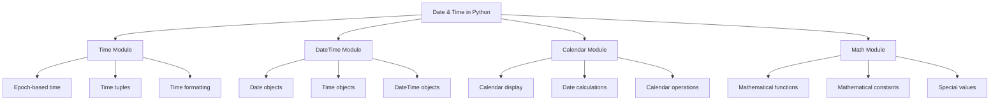

**Diagram Explanation**: This diagram illustrates the main components of date, time, and mathematical operations in Python, showing how different modules work together to provide comprehensive functionality.

### Key Concepts

- **Epoch**: Reference point in time (January 1, 1970, 00:00:00 UTC)
- **Tick Intervals**: Floating-point numbers representing seconds since epoch
- **Time Tuples**: Structured representation of time with 9 components
- **Date Objects**: Python objects representing dates
- **Mathematical Functions**: Built-in functions for mathematical operations

---

## Tick Intervals and Epoch

Understanding tick intervals and epoch is fundamental to working with time in Python. These concepts form the basis of how computers represent and calculate time.

### Epoch and Tick Intervals Overview

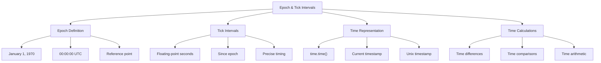

**Diagram Explanation**: This diagram shows the relationship between epoch, tick intervals, and time representation in Python, illustrating how time is measured and calculated.

### What is Epoch?

The **epoch** is a reference point in time from which time is measured. It's the moment when time "begins" for a particular system or standard.

**Most Common Epoch**: January 1, 1970, 00:00:00 (UTC)

### Why Use Epoch?

1. **Consistent Timekeeping**: Provides a standardized way to calculate and compare time across different systems
2. **Simplified Calculations**: Easier to perform calculations with a single number representing seconds since a fixed point
3. **Universal Standard**: Used across many programming languages and systems

### Tick Intervals

Time intervals are floating-point numbers in units of seconds. Particular instants in time are expressed in seconds since the epoch.

```python
import time

# Get current time as ticks since epoch
ticks = time.time()
print("Number of ticks since 12:00am, January 1, 1970:", ticks)
# Output: Number of ticks since 12:00am, January 1, 1970: 1737690101.884116
```

### Epoch Usage in Python

Python's time module provides functions to work with time based on the epoch:

- **`time.time()`**: Returns current time as seconds since epoch
- **`time.gmtime(seconds)`**: Converts seconds since epoch to UTC time tuple
- **`time.localtime(seconds)`**: Converts seconds since epoch to local time tuple

---

## Time Module Functions

The `time` module provides various functions for working with time, including getting current time, converting between formats, and formatting time for display.

### Time Module Overview

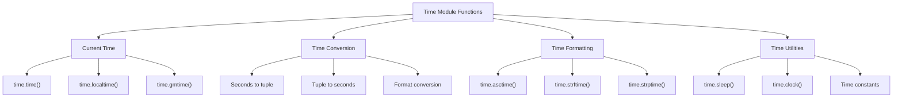

**Diagram Explanation**: This diagram categorizes the main functions in the time module, showing their purposes and relationships.

### Key Time Module Functions

1. **`time.time()`**: Returns current time as seconds since epoch
2. **`time.localtime()`**: Converts seconds to local time tuple
3. **`time.gmtime()`**: Converts seconds to UTC time tuple
4. **`time.asctime()`**: Converts time tuple to readable string
5. **`time.strftime()`**: Formats time according to format string
6. **`time.sleep()`**: Pauses execution for specified seconds

### Time Module Examples

```python
import time

# Get current time in seconds since epoch
current_time = time.time()
print("Current time (seconds since epoch):", current_time)

# Convert to local time tuple
local_time = time.localtime(current_time)
print("Local time tuple:", local_time)

# Convert to UTC time tuple
utc_time = time.gmtime(current_time)
print("UTC time tuple:", utc_time)

# Format time as readable string
formatted_time = time.asctime(local_time)
print("Formatted time:", formatted_time)
```

---

## Getting Current Time

Getting the current time is a fundamental operation in time handling. Python provides multiple ways to obtain and work with current time.

### Current Time Overview

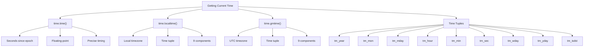

**Diagram Explanation**: This diagram shows the different ways to get current time in Python and the structure of time tuples.

### Getting Current Time

To translate a time instant from seconds since the epoch floating-point value into a time-tuple, pass the floating-point value to a function that returns a time-tuple with all valid nine items.

```python
import time

# Get current time as time tuple
localtime = time.localtime(time.time())
print("Local current time:", localtime)
# Output: Local current time: time.struct_time(tm_year=2025, tm_mon=1, tm_mday=24, tm_hour=3, tm_min=41, tm_sec=48, tm_wday=4, tm_yday=24, tm_isdst=0)
```

### Time Tuple Components

A time tuple contains 9 components:

| Index | Attribute | Values |
|-------|-----------|---------|
| 0 | tm_year | 4-digit year (e.g., 2025) |
| 1 | tm_mon | Month (1 to 12) |
| 2 | tm_mday | Day of month (1 to 31) |
| 3 | tm_hour | Hour (0 to 23) |
| 4 | tm_min | Minute (0 to 59) |
| 5 | tm_sec | Second (0 to 61) |
| 6 | tm_wday | Weekday (0 to 6, Monday is 0) |
| 7 | tm_yday | Day of year (1 to 366) |
| 8 | tm_isdst | Daylight saving time (-1, 0, 1) |

### Time Zone Handling

```python
import time

# Local time (system timezone)
local_time = time.localtime()
print("Local time:", local_time)

# UTC time (Coordinated Universal Time)
utc_time = time.gmtime()
print("UTC time:", utc_time)

# Compare local and UTC
print("Time difference (seconds):", time.timezone)
```

---

## Formatted Time

Formatting time into readable strings is essential for displaying time to users and logging events. Python provides several methods for time formatting.

### Time Formatting Overview

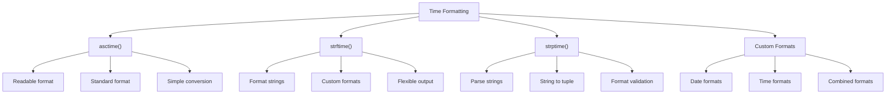

**Diagram Explanation**: This diagram shows the different methods for formatting time in Python, from simple readable formats to custom format strings.

### Getting Formatted Time

You can format any time as per your requirement, but a simple method to get time in a readable format is `asctime()`:

```python
import time

# Get formatted time using asctime()
localtime = time.asctime(time.localtime(time.time()))
print("Local current time:", localtime)
# Output: Local current time: Thu Jan 23 20:55:57 2025
```

### Time Formatting Methods

1. **`time.asctime()`**: Converts time tuple to readable string
2. **`time.strftime()`**: Formats time according to format string
3. **`time.strptime()`**: Parses time string according to format

### Format String Examples

```python
import time

# Get current time
current_time = time.localtime()

# Different format examples
print("Default format:", time.asctime(current_time))
print("Custom format 1:", time.strftime("%Y-%m-%d %H:%M:%S", current_time))
print("Custom format 2:", time.strftime("%A, %B %d, %Y", current_time))
print("Custom format 3:", time.strftime("%I:%M %p", current_time))
```

### Common Format Codes

| Code | Meaning | Example |
|------|---------|---------|
| `%Y` | 4-digit year | 2025 |
| `%m` | Month (01-12) | 01 |
| `%d` | Day (01-31) | 23 |
| `%H` | Hour (00-23) | 20 |
| `%M` | Minute (00-59) | 55 |
| `%S` | Second (00-59) | 57 |
| `%A` | Full weekday name | Thursday |
| `%B` | Full month name | January |
| `%p` | AM/PM | PM |

---

## Calendar Module

The `calendar` module provides a wide range of methods to work with yearly and monthly calendars, including displaying calendars and performing calendar-related calculations.

### Calendar Module Overview

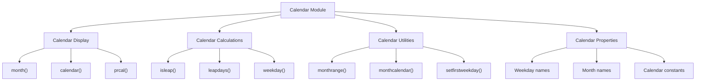

**Diagram Explanation**: This diagram categorizes the main functions in the calendar module, showing their purposes and relationships.

### Getting Calendar for a Month

The calendar module gives a wide range of methods to play with yearly and monthly calendars. Here's how to print a calendar for a given month:

```python
import calendar

# Print calendar for January 2025
cal = calendar.month(2025, 1)
print("Here is the calendar:")
print(cal)
```

**Output**:
```
Here is the calendar:
    January 2025
Mo Tu We Th Fr Sa Su
       1  2  3  4  5
 6  7  8  9 10 11 12
13 14 15 16 17 18 19
20 21 22 23 24 25 26
27 28 29 30 31
```

### Calendar Module Functions

1. **`calendar.month(year, month)`**: Returns formatted calendar for a month
2. **`calendar.calendar(year)`**: Returns formatted calendar for a year
3. **`calendar.isleap(year)`**: Returns True if year is a leap year
4. **`calendar.leapdays(year1, year2)`**: Returns number of leap years between two years
5. **`calendar.weekday(year, month, day)`**: Returns weekday (0=Monday, 6=Sunday)
6. **`calendar.monthrange(year, month)`**: Returns weekday of first day and number of days in month

### Calendar Examples

```python
import calendar

# Check if year is leap year
print("Is 2024 a leap year?", calendar.isleap(2024))  # True
print("Is 2025 a leap year?", calendar.isleap(2025))  # False

# Get weekday of a specific date
weekday = calendar.weekday(2025, 1, 24)
print("Weekday of January 24, 2025:", weekday)  # 4 (Friday)

# Get month range (first weekday, number of days)
first_weekday, num_days = calendar.monthrange(2025, 1)
print("First weekday of January 2025:", first_weekday)  # 2 (Wednesday)
print("Number of days in January 2025:", num_days)  # 31

# Get full year calendar
year_cal = calendar.calendar(2025)
print("Calendar for 2025:")
print(year_cal)
```

---

## DateTime Module

The `datetime` module provides classes for working with dates and times. It offers more object-oriented approach compared to the `time` module.

### DateTime Module Overview

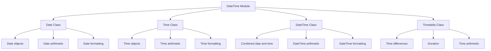

**Diagram Explanation**: This diagram shows the main classes in the datetime module and their relationships.

### Date Objects

The `date` class represents a date (year, month, day) without time information.

```python
from datetime import date

# Create date objects
date1 = date(2023, 4, 19)
print("Date:", date1)  # Output: Date: 2023-04-19

date2 = date(2023, 4, 30)
print("Date2:", date2)  # Output: Date2: 2023-04-30

# Get current date
today = date.today()
print("Today's date:", today)

# Date arithmetic
difference = date2 - date1
print("Difference in days:", difference.days)  # Output: 11
```

### DateTime Objects

The `datetime` class represents both date and time information.

```python
import datetime

# Get current date and time
x = datetime.datetime.now()
print(x)  # Output: 2025-01-23 21:01:49.119953

# Create specific datetime
dt = datetime.datetime(2025, 1, 1, 12, 30, 45)
print("Specific datetime:", dt)

# Access individual components
print("Year:", dt.year)
print("Month:", dt.month)
print("Day:", dt.day)
print("Hour:", dt.hour)
print("Minute:", dt.minute)
print("Second:", dt.second)
```

### DateTime Properties

The datetime object contains:
- **Year**: 4-digit year
- **Month**: Month (1-12)
- **Day**: Day of month (1-31)
- **Hour**: Hour (0-23)
- **Minute**: Minute (0-59)
- **Second**: Second (0-59)
- **Microsecond**: Microsecond (0-999999)

---

## Date Formatting with strftime

The `strftime()` method allows you to format date and time objects into readable strings using format codes.

### strftime Overview

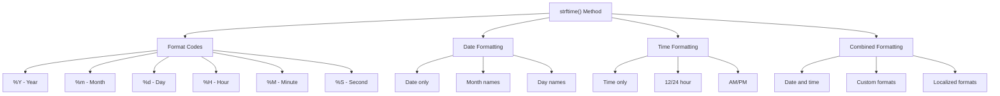

**Diagram Explanation**: This diagram shows the strftime method and its format codes, illustrating how different components can be formatted.

### strftime() Method

The datetime object has a method for formatting date objects into readable strings. The method is called `strftime()`, and takes one parameter, format, to specify the format of the returned string.

```python
import datetime

# Create a datetime object
x = datetime.datetime(2025, 1, 1)

# Different format examples
print(x.strftime("%f"))  # Display Microsecond 000000-999999
print(x.strftime("%A"))  # Display the name of the Day
print(x.strftime("%Y"))  # Display the Year
print(x.strftime("%B"))  # Display the name of the month
```

**Output**:
```
000000
Wednesday
2025
January
```

### Common Format Codes

| Code | Meaning | Example |
|------|---------|---------|
| `%Y` | 4-digit year | 2025 |
| `%y` | 2-digit year | 25 |
| `%m` | Month (01-12) | 01 |
| `%B` | Full month name | January |
| `%b` | Abbreviated month name | Jan |
| `%d` | Day of month (01-31) | 01 |
| `%A` | Full weekday name | Wednesday |
| `%a` | Abbreviated weekday name | Wed |
| `%H` | Hour (00-23) | 14 |
| `%I` | Hour (01-12) | 02 |
| `%M` | Minute (00-59) | 30 |
| `%S` | Second (00-59) | 45 |
| `%f` | Microsecond (000000-999999) | 123456 |
| `%p` | AM/PM | PM |
| `%j` | Day of year (001-366) | 001 |
| `%U` | Week number (00-53) | 00 |
| `%W` | Week number (00-53) | 00 |

### strftime Examples

```python
import datetime

# Create datetime object
dt = datetime.datetime(2025, 1, 1, 14, 30, 45, 123456)

# Various format examples
print("Full date and time:", dt.strftime("%Y-%m-%d %H:%M:%S"))
print("Readable format:", dt.strftime("%A, %B %d, %Y at %I:%M %p"))
print("Short format:", dt.strftime("%m/%d/%y"))
print("Time only:", dt.strftime("%H:%M:%S"))
print("With microseconds:", dt.strftime("%Y-%m-%d %H:%M:%S.%f"))
```

---

## Python Math Module

The `math` module is a built-in module in Python that provides various mathematical functions and constants for performing mathematical operations.

### Math Module Overview

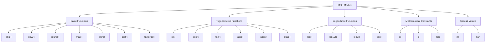

**Diagram Explanation**: This diagram categorizes the main components of the math module, showing different types of mathematical functions and constants.

### Math Module Functions

The math module provides various built-in methods for performing different mathematical tasks:

```python
import math

# Basic mathematical functions
print("abs(-5) =", abs(-5))  # outputs: 5
print("pow(2, 3) =", pow(2, 3))  # outputs: 8
print("round(3.14159, 2) =", round(3.14159, 2))  # outputs: 3.14
print("max(1, 2, 3, 4, 5) =", max(1, 2, 3, 4, 5))  # outputs: 5
print("min(1, 2, 3, 4, 5) =", min(1, 2, 3, 4, 5))  # outputs: 1

# Trigonometric functions
print("math.sin(math.pi/2) =", math.sin(math.pi/2))  # outputs: 1.0
print("math.cos(0) =", math.cos(0))  # outputs: 1.0
print("math.tan(math.pi/4) =", math.tan(math.pi/4))  # outputs: 1.0

# Other mathematical functions
print("math.sqrt(9) =", math.sqrt(9))  # outputs: 3.0
print("math.factorial(5) =", math.factorial(5))  # outputs: 120
print("math.log(10) =", math.log(10))  # outputs: 2.302585092994046
print("math.log10(100) =", math.log10(100))  # outputs: 2.0
print("math.exp(2) =", math.exp(2))  # outputs: 7.38905609893065
print("math.ceil(4.7) =", math.ceil(4.7))  # outputs: 5
print("math.floor(4.7) =", math.floor(4.7))  # outputs: 4
```

---

## Mathematical Functions

Python's math module provides a comprehensive set of mathematical functions for various calculations.

### Mathematical Functions Overview

```mermaid
graph TD
    A["Mathematical Functions"] --> B["Basic Arithmetic"]
    A --> C["Power and Roots"]
    A --> D["Trigonometric"]
    A --> E["Logarithmic"]
    A --> F["Rounding"]
    
    B --> B1["abs() - absolute value"]
    B --> B2["max() - maximum value"]
    B --> B3["min() - minimum value"]
    B --> B4["sum() - sum of values"]
    
    C --> C1["pow() - power"]
    C --> C2["sqrt() - square root"]
    C --> C3["cbrt() - cube root"]
    C --> C4["hypot() - hypotenuse"]
    
    D --> D1["sin() - sine"]
    D --> D2["cos() - cosine"]
    D --> D3["tan() - tangent"]
    D --> D4["asin() - arcsine"]
    
    E --> E1["log() - natural log"]
    E --> E2["log10() - base 10 log"]
    E --> E3["log2() - base 2 log"]
    E --> E4["exp() - exponential"]
    
    F --> F1["ceil() - ceiling"]
    F --> F2["floor() - floor"]
    F --> F3["round() - rounding"]
    F --> F4["trunc() - truncate"]
```

**Diagram Explanation**: This diagram categorizes mathematical functions into different types, showing their purposes and relationships.

### Basic Mathematical Functions

```python
import math

# Absolute value
print("abs(-5) =", abs(-5))  # 5
print("abs(5) =", abs(5))    # 5

# Power function
print("pow(2, 3) =", pow(2, 3))      # 8
print("pow(5, 2) =", pow(5, 2))      # 25
print("2**3 =", 2**3)                # 8 (alternative syntax)

# Rounding
print("round(3.14159, 2) =", round(3.14159, 2))  # 3.14
print("round(3.7) =", round(3.7))                # 4

# Maximum and minimum
print("max(1, 2, 3, 4, 5) =", max(1, 2, 3, 4, 5))  # 5
print("min(1, 2, 3, 4, 5) =", min(1, 2, 3, 4, 5))  # 1
```

### Trigonometric Functions

```python
import math

# Trigonometric functions (angles in radians)
print("math.sin(math.pi/2) =", math.sin(math.pi/2))  # 1.0
print("math.cos(0) =", math.cos(0))                  # 1.0
print("math.tan(math.pi/4) =", math.tan(math.pi/4))  # 1.0

# Inverse trigonometric functions
print("math.asin(1) =", math.asin(1))                # π/2
print("math.acos(0) =", math.acos(0))                # π/2
print("math.atan(1) =", math.atan(1))                # π/4

# Converting between degrees and radians
degrees = 90
radians = math.radians(degrees)
print(f"{degrees} degrees = {radians} radians")

radians = math.pi/2
degrees = math.degrees(radians)
print(f"{radians} radians = {degrees} degrees")
```

### Logarithmic and Exponential Functions

```python
import math

# Logarithmic functions
print("math.log(10) =", math.log(10))        # Natural logarithm
print("math.log10(100) =", math.log10(100))  # Base 10 logarithm
print("math.log2(8) =", math.log2(8))        # Base 2 logarithm

# Exponential function
print("math.exp(2) =", math.exp(2))          # e^2
print("math.e =", math.e)                    # Euler's number

# Square root and other roots
print("math.sqrt(9) =", math.sqrt(9))        # 3.0
print("math.sqrt(2) =", math.sqrt(2))        # 1.4142135623730951
```

### Rounding and Floor/Ceiling Functions

```python
import math

# Rounding functions
print("math.ceil(4.7) =", math.ceil(4.7))      # 5 (ceiling)
print("math.floor(4.7) =", math.floor(4.7))    # 4 (floor)
print("round(4.7) =", round(4.7))              # 5 (rounding)
print("math.trunc(4.7) =", math.trunc(4.7))    # 4 (truncate)

# Factorial
print("math.factorial(5) =", math.factorial(5))  # 120
print("math.factorial(0) =", math.factorial(0))  # 1
```

---

## Mathematical Constants

Python's math module provides several important mathematical constants that are commonly used in mathematical calculations.

### Mathematical Constants Overview

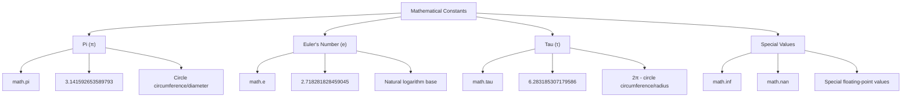

**Diagram Explanation**: This diagram shows the main mathematical constants available in Python's math module and their values.

### Mathematical Constants

```python
import math

# Pi (π) - ratio of circle's circumference to its diameter
print("math.pi =", math.pi)  # 3.141592653589793

# Euler's number (e) - base of natural logarithm
print("math.e =", math.e)    # 2.718281828459045

# Tau (τ) - ratio of circle's circumference to its radius (2π)
print("math.tau =", math.tau)  # 6.283185307179586

# Infinity
print("math.inf =", math.inf)  # inf

# Not a Number
print("math.nan =", math.nan)  # nan
```

### Using Mathematical Constants

```python
import math

# Calculate circle area using pi
radius = 5
area = math.pi * radius**2
print(f"Area of circle with radius {radius}: {area}")

# Calculate compound interest using e
principal = 1000
rate = 0.05
time = 2
amount = principal * math.exp(rate * time)
print(f"Compound interest amount: {amount}")

# Using tau for angular calculations
angle_radians = math.tau / 4  # 90 degrees
print(f"90 degrees in radians: {angle_radians}")

# Check if values are finite
print("Is pi finite?", math.isfinite(math.pi))  # True
print("Is infinity finite?", math.isfinite(math.inf))  # False
```

---

## Special Values: NaN and Infinity

Python's math module provides special floating-point values for representing undefined results and infinite values.

### Special Values Overview

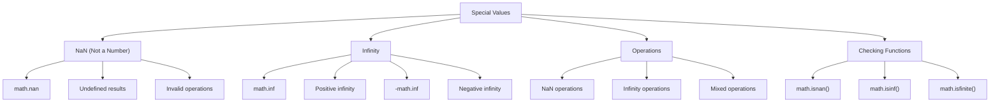

**Diagram Explanation**: This diagram shows the special values in Python's math module and the functions used to check and work with them.

### NaN (Not a Number)

In Python, `NaN` stands for "Not a Number". It's a special floating-point value that represents an undefined or unrepresentable numerical result.

```python
import math

# Creating NaN
result = float('nan')
print(result)  # Output: nan

# NaN from invalid operations
# result = 0 / 0  # Division by zero would raise ZeroDivisionError
# result = math.sqrt(-1)  # Square root of negative number
# print(result)  # Output: nan

# Checking for NaN
x = float('nan')
if math.isnan(x):
    print("x is NaN")

# NaN comparison behavior
x = float('nan')
y = float('nan')
print("NaN == NaN:", x == y)  # Output: False
print("NaN != NaN:", x != y)  # Output: True
```

### Infinity

Python provides `math.inf` for representing positive infinity and `-math.inf` for negative infinity.

```python
import math

# Positive infinity
positive_infinity = math.inf
print("Positive infinity:", positive_infinity)  # Output: inf
print("Type:", type(positive_infinity))         # Output: <class 'float'>

# Negative infinity
negative_infinity = -math.inf
print("Negative infinity:", negative_infinity)  # Output: -inf

# Infinity operations
print("Infinity > 999999999:", math.inf > 999999999999999999999999)  # True
print("Infinity * 2:", math.inf * 2)  # Output: inf
print("Infinity - Infinity:", math.inf - math.inf)  # Output: nan
```

### Working with Special Values

```python
import math

# Checking functions
x = float('nan')
y = math.inf
z = 5.0

print("Is x NaN?", math.isnan(x))      # True
print("Is y infinite?", math.isinf(y)) # True
print("Is z finite?", math.isfinite(z)) # True

# Operations with special values
print("NaN + 5:", float('nan') + 5)    # nan
print("Infinity + 5:", math.inf + 5)   # inf
print("Infinity * 0:", math.inf * 0)   # nan
print("Infinity / Infinity:", math.inf / math.inf)  # nan

# Practical example
def safe_divide(a, b):
    """Safely divide two numbers, handling special cases."""
    if b == 0:
        if a == 0:
            return float('nan')  # 0/0 is undefined
        elif a > 0:
            return math.inf      # positive/0 is infinity
        else:
            return -math.inf     # negative/0 is negative infinity
    return a / b

print("Safe divide 10/0:", safe_divide(10, 0))    # inf
print("Safe divide 0/0:", safe_divide(0, 0))      # nan
print("Safe divide -5/0:", safe_divide(-5, 0))    # -inf
print("Safe divide 10/2:", safe_divide(10, 2))    # 5.0
```

### Important Notes about Special Values

1. **NaN Behavior**:
   - NaN compares unequal to any number, including itself
   - Calculations involving NaN often result in NaN
   - Use `math.isnan()` to check for NaN

2. **Infinity Behavior**:
   - Infinity is greater than any finite number
   - Many operations with infinity result in infinity
   - Some operations (like infinity - infinity) result in NaN

3. **Checking Functions**:
   - `math.isnan(x)`: Returns True if x is NaN
   - `math.isinf(x)`: Returns True if x is infinite
   - `math.isfinite(x)`: Returns True if x is finite

---

## Key Concepts Covered

This lesson covered the fundamental aspects of date, time, calendar, and mathematical operations in Python:

### Key Concepts Overview

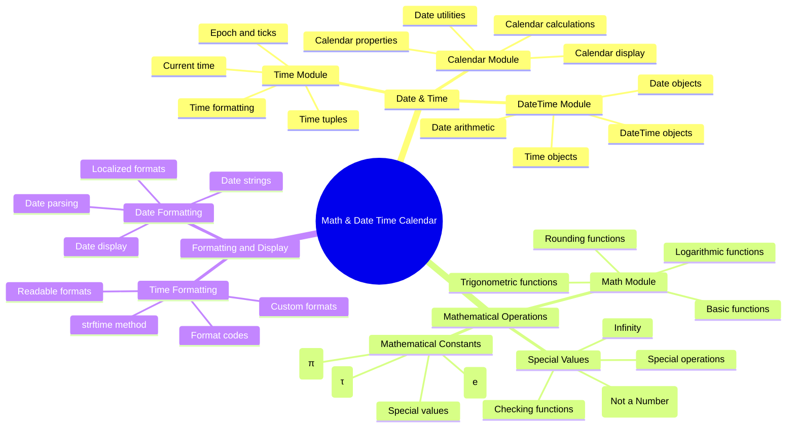

**Diagram Explanation**: This mind map provides a comprehensive overview of all topics covered in this lesson, showing the relationship between date/time operations, mathematical functions, and formatting methods.

### Best Practices

1. **Date and Time**:
   - Use appropriate modules for different needs (time, datetime, calendar)
   - Be aware of timezone differences
   - Use proper formatting for user display
   - Handle date arithmetic carefully

2. **Mathematical Operations**:
   - Import math module for advanced mathematical functions
   - Use appropriate functions for specific calculations
   - Be aware of floating-point precision issues
   - Handle special values (NaN, infinity) properly

3. **Error Handling**:
   - Check for valid date/time values
   - Handle timezone-related errors
   - Validate mathematical inputs
   - Use appropriate exception handling

4. **Performance**:
   - Use built-in functions when possible
   - Avoid unnecessary conversions
   - Cache frequently used calculations
   - Consider precision requirements

### Common Pitfalls

1. **Date and Time**:
   - Confusing local time with UTC
   - Not handling leap years correctly
   - Incorrect date arithmetic
   - Timezone conversion errors

2. **Mathematical Operations**:
   - Not importing math module
   - Using wrong units (degrees vs radians)
   - Not handling division by zero
   - Precision issues with floating-point

3. **Formatting**:
   - Incorrect format codes
   - Not handling locale-specific formats
   - Missing error handling for invalid dates
   - Inconsistent date formats

4. **Special Values**:
   - Not checking for NaN values
   - Incorrect infinity comparisons
   - Not handling undefined operations
   - Missing validation for special cases

---

## Useful Links

- [Python Time Module Documentation](https://docs.python.org/3/library/time.html)
- [Python DateTime Module Documentation](https://docs.python.org/3/library/datetime.html)
- [Python Calendar Module Documentation](https://docs.python.org/3/library/calendar.html)
- [Python Math Module Documentation](https://docs.python.org/3/library/math.html)
- [DateTime Format Codes](https://docs.python.org/3/library/datetime.html#strftime-and-strptime-format-codes)
- [Time Zone Handling](https://docs.python.org/3/library/datetime.html#timezone-objects)
- [Mathematical Functions Reference](https://docs.python.org/3/library/math.html#functions)
- [Floating Point Arithmetic](https://docs.python.org/3/tutorial/floatingpoint.html)

---

*This lesson provides a comprehensive understanding of date, time, calendar, and mathematical operations in Python, essential for time-based applications, mathematical calculations, and data processing tasks.*