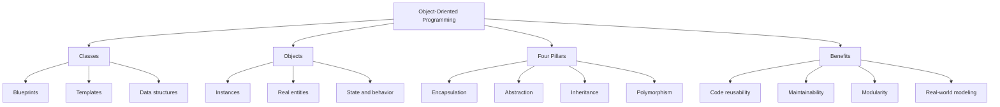
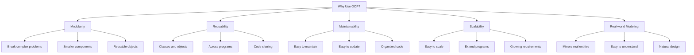
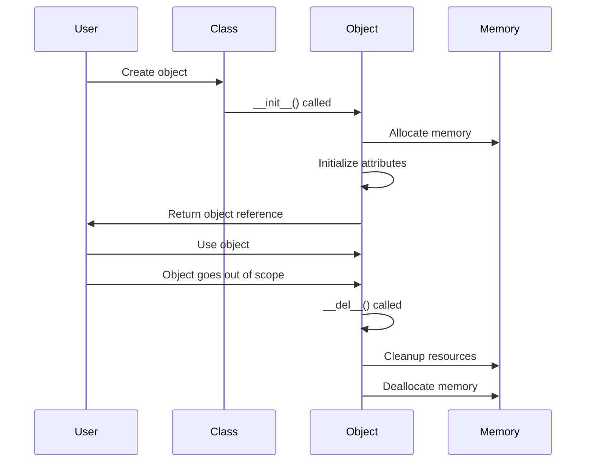
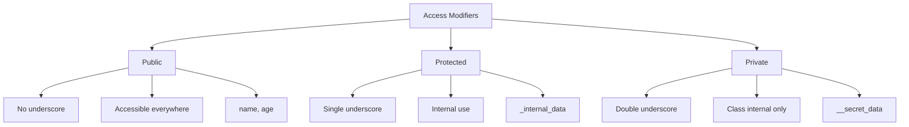
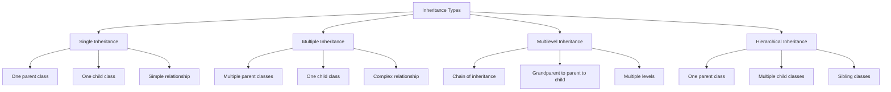
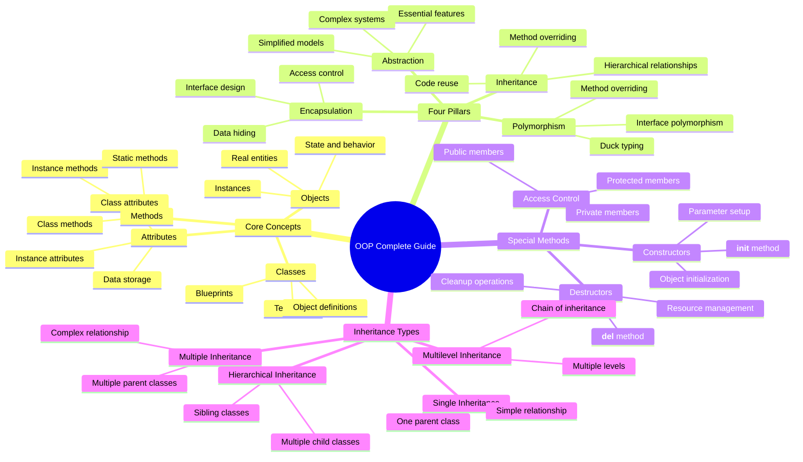

# [Lesson 12: Traditional OOP - Objects & Classes - Part 1](https://colab.research.google.com/drive/10kCAqWJarynBmsvZwD9OAo9SYDq6Bwvr?usp=sharing)

# [OOP In A Nutshell - Part 1](https://colab.research.google.com/drive/1pBG6oOzuF0Gg4Y-2Qb3BTSi09JSp0h7E?usp=sharing)

## Table of Contents
1. [Introduction to Object-Oriented Programming](#introduction-to-object-oriented-programming)
2. [What is OOP?](#what-is-oop)
3. [Why Use OOP?](#why-use-oop)
4. [Key Principles of OOP](#key-principles-of-oop)
5. [Basics of Classes and Objects](#basics-of-classes-and-objects)
6. [Class Definition and Object Creation](#class-definition-and-object-creation)
7. [Attributes and Methods](#attributes-and-methods)
8. [Constructors and Destructors](#constructors-and-destructors)
9. [Access Modifiers](#access-modifiers)
10. [Encapsulation](#encapsulation)
11. [Inheritance](#inheritance)
12. [Inheritance Types](#inheritance-types)
13. [Polymorphism](#polymorphism)
14. [Key Concepts Summary](#key-concepts-summary)
15. [Best Practices](#best-practices)
16. [Useful Links](#useful-links)

---

## Introduction to Object-Oriented Programming

Object-Oriented Programming (OOP) is a programming paradigm that organizes software design around objects and classes, rather than functions and logic. It focuses on modeling real-world entities and their relationships in a more intuitive and structured way.

### OOP Overview



**Diagram Explanation**: This diagram illustrates the fundamental components of Object-Oriented Programming, showing how classes, objects, and the four pillars work together to create structured, maintainable code.

### Key Concepts

- **Class**: A blueprint or template for creating objects
- **Object**: An instance of a class with specific attributes and behaviors
- **Encapsulation**: Bundling data and methods together, hiding internal details
- **Abstraction**: Simplifying complex systems by focusing on essential features
- **Inheritance**: Creating new classes based on existing classes
- **Polymorphism**: Using a single interface to represent different types

---

## What is OOP?

**Object-Oriented Programming (OOP)** is a programming paradigm that organizes software design around **objects and classes**, rather than functions and logic. An object is an instance of a class, which is a blueprint for creating objects. **OOP focuses on modeling real-world entities and their relationships in a more intuitive and structured way.**

### OOP Example

For example, if you're building a car simulation, you might create a Car class. Each car in your program would be an object (instance) of that class, with attributes like color, speed, and model, and behaviors like accelerate() or brake().

```python
class Car:
    def __init__(self, color, speed):
        self.color = color
        self.speed = speed
    
    def accelerate(self):
        self.speed += 10
    
    def get_speed(self):
        return self.speed

# Creating objects (instances) of the Car class
my_car = Car("red", 0)
your_car = Car("blue", 50)

# Using the objects
my_car.accelerate()
print(f"My car speed: {my_car.get_speed()}")  # Output: 10
```

### Why Use OOP?

OOP provides several key advantages that make it a powerful programming paradigm:

1. **Modularity**: OOP allows you to break down complex problems into smaller, reusable components (objects).

2. **Reusability**: Classes and objects can be reused across different parts of a program or in entirely different programs.

3. **Maintainability**: Code is easier to maintain and update because it's organized into logical units.

4. **Scalability**: OOP makes it easier to scale and extend programs as requirements grow.

5. **Real-world modeling**: OOP closely mirrors real-world entities, making it easier to understand and design systems.

### Benefits of OOP



**Diagram Explanation**: This diagram illustrates the five main benefits of using OOP, showing how each benefit contributes to better software development practices.

### Practical Example

```python
class BankAccount:
    def __init__(self, account_holder, initial_balance=0):
        self.account_holder = account_holder
        self.balance = initial_balance
        self.transaction_history = []
    
    def deposit(self, amount):
        if amount > 0:
            self.balance += amount
            self.transaction_history.append(f"Deposit: +${amount}")
            print(f"Deposited ${amount}. New balance: ${self.balance}")
    
    def withdraw(self, amount):
        if amount > 0 and amount <= self.balance:
            self.balance -= amount
            self.transaction_history.append(f"Withdrawal: -${amount}")
            print(f"Withdrew ${amount}. New balance: ${self.balance}")
        else:
            print("Invalid transaction!")
    
    def get_balance(self):
        return self.balance
    
    def get_transaction_history(self):
        return self.transaction_history

# Benefits in action:
# 1. Modularity: Each account is a separate, self-contained object
# 2. Reusability: Can create multiple accounts easily
# 3. Maintainability: Easy to modify account behavior
# 4. Scalability: Can add new features like interest calculation
# 5. Real-world modeling: Mirrors actual bank account behavior

account1 = BankAccount("Alice", 1000)
account2 = BankAccount("Bob", 500)

account1.deposit(200)
account2.withdraw(100)
```

---

## Key Principles of OOP

OOP is built on four fundamental principles that guide the design and implementation of object-oriented systems:

### Four Pillars of OOP

```mermaid
graph TD
    A["Four Pillars of OOP"] --> B["Encapsulation"]
    A --> C["Abstraction"]
    A --> D["Inheritance"]
    A --> E["Polymorphism"]
    
    B --> B1["Data hiding"]
    B --> B2["Bundling data and methods"]
    B --> B3["Access control"]
    B --> B4["Single unit (class)"]
    
    C --> C1["Hide complexity"]
    C --> C2["Show essential features"]
    C --> C3["Simplified interface"]
    C --> C4["Internal details hidden"]
    
    D --> D1["Parent-child relationship"]
    D --> D2["Code reusability"]
    D --> D3["Hierarchical classification"]
    D --> D4["Override/extend functionality"]
    
    E --> E1["One interface"]
    E --> E2["Multiple implementations"]
    E --> E3["Different data types"]
    E --> E4["Runtime behavior"]
```



**Diagram Explanation**: This diagram shows the four fundamental principles of OOP, illustrating how each principle contributes to the overall design philosophy of object-oriented programming.

### 1. Encapsulation

**Encapsulation** is the bundling of data (attributes) and methods (functions) that operate on the data into a single unit (a class). It also restricts direct access to some of an object's components, which is a way of preventing unintended interference.

```python
class Student:
    def __init__(self, name, student_id):
        self.name = name  # Public attribute
        self._student_id = student_id  # Protected attribute
        self.__grades = []  # Private attribute
    
    def add_grade(self, grade):
        """Public method to add grades"""
        if 0 <= grade <= 100:
            self.__grades.append(grade)
        else:
            print("Invalid grade!")
    
    def get_average(self):
        """Public method to get average grade"""
        if self.__grades:
            return sum(self.__grades) / len(self.__grades)
        return 0
    
    def _validate_grade(self, grade):
        """Protected method for internal use"""
        return 0 <= grade <= 100
```

### 2. Abstraction

**Abstraction** hides the complex implementation details and shows only the essential features of an object. It provides a simplified interface to interact with complex systems.

```python
class Car:
    def __init__(self, brand, model):
        self.brand = brand
        self.model = model
        self._engine_status = "off"
        self._fuel_level = 100
    
    def start_engine(self):
        """Public interface - simple to use"""
        if self._fuel_level > 0:
            self._engine_status = "on"
            print(f"{self.brand} {self.model} engine started")
        else:
            print("No fuel! Cannot start engine.")
    
    def drive(self):
        """Public interface - hides complexity"""
        if self._engine_status == "on":
            self._fuel_level -= 10
            print(f"Driving {self.brand} {self.model}")
        else:
            print("Start the engine first!")
    
    def _check_engine(self):
        """Private method - internal complexity hidden"""
        # Complex engine checking logic here
        pass
```

### 3. Inheritance

**Inheritance** allows a class (child) to inherit properties and behaviors from another class (parent). It promotes code reusability and hierarchical classification. The child class can override or extend parent functionality.

```python
# Parent class
class Animal:
    def __init__(self, name, species):
        self.name = name
        self.species = species
    
    def make_sound(self):
        return "Some generic animal sound"
    
    def move(self):
        return f"{self.name} is moving"

# Child class inheriting from Animal
class Dog(Animal):
    def __init__(self, name, breed):
        super().__init__(name, "Canine")
        self.breed = breed
    
    def make_sound(self):
        return "Woof! Woof!"  # Override parent method
    
    def fetch(self):
        return f"{self.name} is fetching the ball"  # New method

# Using inheritance
dog = Dog("Buddy", "Golden Retriever")
print(dog.make_sound())  # Output: Woof! Woof!
print(dog.move())        # Output: Buddy is moving (inherited)
print(dog.fetch())       # Output: Buddy is fetching the ball (new)
```

### 4. Polymorphism

**Polymorphism** lets one interface be used for different underlying data types or classes. It allows objects of different types to be treated as instances of the same class through a common interface.

```python
class Shape:
    def area(self):
        return 0
    
    def perimeter(self):
        return 0

class Rectangle(Shape):
    def __init__(self, width, height):
        self.width = width
        self.height = height
    
    def area(self):
        return self.width * self.height
    
    def perimeter(self):
        return 2 * (self.width + self.height)

class Circle(Shape):
    def __init__(self, radius):
        self.radius = radius
    
    def area(self):
        import math
        return math.pi * self.radius ** 2
    
    def perimeter(self):
        import math
        return 2 * math.pi * self.radius

# Polymorphism in action
shapes = [Rectangle(5, 3), Circle(4)]

for shape in shapes:
    print(f"Area: {shape.area():.2f}")      # Same interface
    print(f"Perimeter: {shape.perimeter():.2f}")  # Different implementations
    print("-" * 20)
```

---

## Basics of Classes and Objects

In this section, we'll dive into the foundational concepts of **classes** and **objects** in Python. These are the building blocks of Object-Oriented Programming (OOP), and understanding them is crucial to writing effective and organized code.

### Class Definition

A class is defined using the `class` keyword followed by the class name and a colon. The class body contains attributes and methods.

```python
class Car:
    # Class attribute (shared by all instances)
    wheels = 4
    
    # Constructor method
    def __init__(self, brand, model, color):
        # Instance attributes (unique to each object)
        self.brand = brand
        self.model = model
        self.color = color
        self.speed = 0
    
    # Instance method
    def accelerate(self):
        self.speed += 10
        print(f"{self.brand} {self.model} is accelerating. Speed: {self.speed}")
    
    def brake(self):
        self.speed -= 10
        if self.speed < 0:
            self.speed = 0
        print(f"{self.brand} {self.model} is braking. Speed: {self.speed}")
    
    def get_info(self):
        return f"{self.color} {self.brand} {self.model} with {self.wheels} wheels"
```

### Object Creation

Objects are created by calling the class name followed by parentheses with any required arguments.

```python
# Creating objects (instances) of the Car class
car1 = Car("Toyota", "Camry", "Red")
car2 = Car("Honda", "Civic", "Blue")
car3 = Car("Ford", "Mustang", "Black")

# Using the objects
print(car1.get_info())  # Output: Red Toyota Camry with 4 wheels
car1.accelerate()       # Output: Toyota Camry is accelerating. Speed: 10
car1.accelerate()       # Output: Toyota Camry is accelerating. Speed: 20

print(car2.get_info())  # Output: Blue Honda Civic with 4 wheels
car2.brake()           # Output: Honda Civic is braking. Speed: 0
```

---

## Constructors and Destructors

Constructors and destructors are special methods that handle object creation and cleanup in Python.

### What is a Constructor?

A constructor is a special method that is automatically called when an object is created. It's used to initialize the object's attributes and set up the object for use.

### The `__init__` Method

The `__init__` method is the constructor in Python. It's called automatically when a new object is created.

```python
class Book:
    def __init__(self, title, author, pages):
        """Constructor method - called when object is created"""
        self.title = title
        self.author = author
        self.pages = pages
        self.is_available = True
        print(f"Book '{self.title}' by {self.author} has been created.")

# Creating objects (constructor is called automatically)
book1 = Book("Python Programming", "John Doe", 300)
book2 = Book("Data Science", "Jane Smith", 250)
```

### Parameterized Constructors

Constructors can accept parameters to initialize objects with specific values.

```python
class BankAccount:
    def __init__(self, account_holder, initial_balance=0, account_type="Savings"):
        """Parameterized constructor with default values"""
        self.account_holder = account_holder
        self.balance = initial_balance
        self.account_type = account_type
        self.account_number = self._generate_account_number()
        self.transaction_history = []
        
        print(f"Account created for {self.account_holder}")
        print(f"Account Type: {self.account_type}")
        print(f"Initial Balance: ${self.balance}")
    
    def _generate_account_number(self):
        """Helper method to generate account number"""
        import random
        return f"ACC{random.randint(100000, 999999)}"
    
    def deposit(self, amount):
        """Deposit money into the account"""
        if amount > 0:
            self.balance += amount
            self.transaction_history.append(f"Deposit: +${amount}")
            print(f"Deposited ${amount}. New balance: ${self.balance}")
        else:
            print("Invalid deposit amount!")
    
    def withdraw(self, amount):
        """Withdraw money from the account"""
        if amount > 0 and amount <= self.balance:
            self.balance -= amount
            self.transaction_history.append(f"Withdrawal: -${amount}")
            print(f"Withdrew ${amount}. New balance: ${self.balance}")
        else:
            print("Invalid withdrawal amount or insufficient funds!")

# Creating accounts with different parameters
account1 = BankAccount("Alice", 1000, "Checking")
account2 = BankAccount("Bob", 500)  # Uses default account type
account3 = BankAccount("Charlie")   # Uses default balance and type
```

### The `__del__` Method (Destructor)

The `__del__` method is called when an object is about to be destroyed. It's used for cleanup operations.

```python
class FileHandler:
    def __init__(self, filename):
        """Constructor - opens a file"""
        self.filename = filename
        self.file = open(filename, 'w')
        print(f"File '{filename}' opened for writing.")
    
    def write_data(self, data):
        """Write data to the file"""
        self.file.write(data)
        print(f"Data written to {self.filename}")
    
    def __del__(self):
        """Destructor - closes the file"""
        if hasattr(self, 'file') and not self.file.closed:
            self.file.close()
            print(f"File '{self.filename}' closed.")

# Using the FileHandler
file_handler = FileHandler("example.txt")
file_handler.write_data("Hello, World!")
# Destructor will be called when the object goes out of scope
```

### Constructor and Destructor Overview



**Diagram Explanation**: This sequence diagram shows the lifecycle of an object, from creation through the constructor to destruction through the destructor.

---

## Access Modifiers

Access modifiers control the visibility and accessibility of class members (attributes and methods) from outside the class.

### Access Modifiers Overview



**Diagram Explanation**: This diagram shows the three levels of access control in Python, illustrating the naming conventions and accessibility levels.

### Public Access

Public members are accessible from anywhere in the program. They have no underscore prefix.

```python
class Student:
    def __init__(self, name, student_id):
        # Public attributes
        self.name = name
        self.student_id = student_id
        self.grades = []
    
    def add_grade(self, grade):
        """Public method"""
        self.grades.append(grade)
    
    def get_average(self):
        """Public method"""
        if self.grades:
            return sum(self.grades) / len(self.grades)
        return 0

# Public access - accessible from anywhere
student = Student("Alice", "S001")
print(student.name)  # Accessible
print(student.student_id)  # Accessible
student.add_grade(85)  # Accessible
print(student.get_average())  # Accessible
```

### Protected Access

Protected members are intended for internal use within the class and its subclasses. They use a single underscore prefix.

```python
class BankAccount:
    def __init__(self, account_holder, initial_balance=0):
        # Public attributes
        self.account_holder = account_holder
        
        # Protected attributes (convention: single underscore)
        self._balance = initial_balance
        self._account_number = self._generate_account_number()
        self._transaction_history = []
    
    def _generate_account_number(self):
        """Protected method - internal use"""
        import random
        return f"ACC{random.randint(100000, 999999)}"
    
    def _validate_transaction(self, amount):
        """Protected method - internal validation"""
        return amount > 0
    
    def deposit(self, amount):
        """Public method using protected members"""
        if self._validate_transaction(amount):
            self._balance += amount
            self._transaction_history.append(f"Deposit: +${amount}")
            print(f"Deposited ${amount}. New balance: ${self._balance}")
        else:
            print("Invalid transaction amount!")

# Protected access - accessible but not recommended from outside
account = BankAccount("Alice", 1000)
print(account._balance)  # Accessible but not recommended
account._validate_transaction(100)  # Accessible but not recommended
```

### Private Access

Private members are intended for use only within the class. They use a double underscore prefix.

```python
class Employee:
    def __init__(self, name, employee_id, salary):
        # Public attributes
        self.name = name
        self.employee_id = employee_id
        
        # Private attributes (convention: double underscore)
        self.__salary = salary
        self.__personal_info = {}
        self.__performance_rating = 0
    
    def __calculate_bonus(self):
        """Private method - internal calculation"""
        if self.__performance_rating >= 4:
            return self.__salary * 0.1
        elif self.__performance_rating >= 3:
            return self.__salary * 0.05
        else:
            return 0
    
    def set_performance_rating(self, rating):
        """Public method to set performance rating"""
        if 1 <= rating <= 5:
            self.__performance_rating = rating
            print(f"Performance rating set to {rating}")
        else:
            print("Invalid rating! Must be between 1 and 5.")
    
    def get_bonus(self):
        """Public method to get bonus"""
        bonus = self.__calculate_bonus()
        return bonus
    
    def get_salary_info(self):
        """Public method to get salary information"""
        return f"Salary: ${self.__salary}, Bonus: ${self.get_bonus()}"

# Private access - not directly accessible from outside
employee = Employee("John", "E001", 50000)
employee.set_performance_rating(4)

# These would cause AttributeError:
# print(employee.__salary)  # Not accessible
# employee.__calculate_bonus()  # Not accessible

# Use public methods instead
print(employee.get_salary_info())  # Output: Salary: $50000, Bonus: $5000.0
```

### Property Decorators for Access Control

Python provides property decorators for more elegant access control:

```python
class Temperature:
    def __init__(self, celsius=0):
        self._celsius = celsius
    
    @property
    def celsius(self):
        """Getter for celsius temperature"""
        return self._celsius
    
    @celsius.setter
    def celsius(self, value):
        """Setter for celsius temperature"""
        if value < -273.15:
            raise ValueError("Temperature cannot be below absolute zero!")
        self._celsius = value
    
    @property
    def fahrenheit(self):
        """Getter for fahrenheit temperature"""
        return (self._celsius * 9/5) + 32
    
    @fahrenheit.setter
    def fahrenheit(self, value):
        """Setter for fahrenheit temperature"""
        celsius = (value - 32) * 5/9
        if celsius < -273.15:
            raise ValueError("Temperature cannot be below absolute zero!")
        self._celsius = celsius

# Using properties
temp = Temperature(25)
print(f"Celsius: {temp.celsius}°C")  # Output: Celsius: 25°C
print(f"Fahrenheit: {temp.fahrenheit}°F")  # Output: Fahrenheit: 77.0°F

# Setting temperature using properties
temp.celsius = 30
print(f"New Celsius: {temp.celsius}°C")  # Output: New Celsius: 30°C

temp.fahrenheit = 86
print(f"New Celsius: {temp.celsius}°C")  # Output: New Celsius: 30°C
```

---

## Encapsulation

**Encapsulation** is one of the **core principles of Object-Oriented Programming (OOP)**. It refers to the bundling of data (attributes) and methods (functions) that operate on the data into a single unit (a class). Encapsulation also involves restricting direct access to some of an object's components, which is a way of preventing unintended interference and misuse of data.

### Access Levels in Python

Python uses naming conventions to indicate access levels:

- **Public**: No underscore prefix (e.g., `name`, `age`)
- **Protected**: Single underscore prefix (e.g., `_internal_data`)
- **Private**: Double underscore prefix (e.g., `__secret_data`)

### Encapsulation Example

```python
class BankAccount:
    def __init__(self, account_holder, initial_balance=0):
        # Public attributes
        self.account_holder = account_holder
        
        # Protected attributes (convention: single underscore)
        self._account_number = self._generate_account_number()
        
        # Private attributes (convention: double underscore)
        self.__balance = initial_balance
        self.__transaction_history = []
    
    def _generate_account_number(self):
        """Protected method - internal implementation"""
        import random
        return f"ACC{random.randint(100000, 999999)}"
    
    def deposit(self, amount):
        """Public method - part of the interface"""
        if amount > 0:
            self.__balance += amount
            self.__transaction_history.append(f"Deposit: +${amount}")
            print(f"Deposited ${amount}. New balance: ${self.__balance}")
        else:
            print("Invalid deposit amount!")
    
    def withdraw(self, amount):
        """Public method - part of the interface"""
        if amount > 0 and amount <= self.__balance:
            self.__balance -= amount
            self.__transaction_history.append(f"Withdrawal: -${amount}")
            print(f"Withdrew ${amount}. New balance: ${self.__balance}")
        else:
            print("Invalid withdrawal amount or insufficient funds!")
    
    def get_balance(self):
        """Public getter method"""
        return self.__balance
    
    def get_account_number(self):
        """Public getter for protected attribute"""
        return self._account_number
    
    def get_transaction_history(self):
        """Public method to view transaction history"""
        return self.__transaction_history.copy()  # Return a copy to prevent modification
```

---

## Inheritance

**Inheritance** is one of the core principles of Object-Oriented Programming (OOP). It allows a class (called a **child class** or **subclass**) to inherit attributes and methods from another class (called a **parent class** or **superclass**). This promotes code reuse and establishes a hierarchical relationship between classes.

### Basic Inheritance Example

```python
# Parent class (Base class)
class Vehicle:
    def __init__(self, brand, model, year):
        self.brand = brand
        self.model = model
        self.year = year
        self.speed = 0
    
    def start_engine(self):
        print(f"{self.brand} {self.model} engine started")
    
    def accelerate(self):
        self.speed += 10
        print(f"Speed increased to {self.speed} km/h")
    
    def brake(self):
        self.speed -= 10
        if self.speed < 0:
            self.speed = 0
        print(f"Speed decreased to {self.speed} km/h")
    
    def get_info(self):
        return f"{self.year} {self.brand} {self.model}"

# Child class (Derived class)
class Car(Vehicle):
    def __init__(self, brand, model, year, doors):
        # Call parent constructor
        super().__init__(brand, model, year)
        self.doors = doors
        self.fuel_level = 100
    
    def open_trunk(self):
        print("Trunk opened")
    
    def refuel(self):
        self.fuel_level = 100
        print("Car refueled")
    
    def get_info(self):
        # Override parent method
        return f"{super().get_info()} with {self.doors} doors"

# Another child class
class Motorcycle(Vehicle):
    def __init__(self, brand, model, year, engine_size):
        super().__init__(brand, model, year)
        self.engine_size = engine_size
        self.helmet_required = True
    
    def wheelie(self):
        print("Performing a wheelie!")
    
    def get_info(self):
        return f"{super().get_info()} with {self.engine_size}cc engine"
```

---

## Inheritance Types

Inheritance allows a class to inherit properties and methods from another class. Python supports different types of inheritance.

### Types of Inheritance



**Diagram Explanation**: This diagram illustrates the different types of inheritance in Python, showing how classes can inherit from one or more parent classes in various configurations.

### Single Inheritance

Single inheritance occurs when a class inherits from only one parent class.

```python
# Parent class
class Animal:
    def __init__(self, name, species):
        self.name = name
        self.species = species
    
    def make_sound(self):
        return "Some generic animal sound"
    
    def move(self):
        return f"{self.name} is moving"

# Child class (single inheritance)
class Dog(Animal):
    def __init__(self, name, breed):
        super().__init__(name, "Canine")
        self.breed = breed
    
    def make_sound(self):
        return "Woof! Woof!"  # Override parent method
    
    def fetch(self):
        return f"{self.name} is fetching the ball"  # New method

# Using single inheritance
dog = Dog("Buddy", "Golden Retriever")
print(dog.make_sound())  # Output: Woof! Woof!
print(dog.move())        # Output: Buddy is moving (inherited)
print(dog.fetch())       # Output: Buddy is fetching the ball (new)
```

### Multiple Inheritance

Multiple inheritance occurs when a class inherits from more than one parent class.

```python
# First parent class
class Flyable:
    def fly(self):
        return "Flying through the air"
    
    def land(self):
        return "Landing safely"

# Second parent class
class Swimmable:
    def swim(self):
        return "Swimming in water"
    
    def dive(self):
        return "Diving deep"

# Child class with multiple inheritance
class Duck(Animal, Flyable, Swimmable):
    def __init__(self, name):
        super().__init__(name, "Bird")
    
    def make_sound(self):
        return "Quack! Quack!"

# Using multiple inheritance
duck = Duck("Donald")
print(duck.make_sound())  # Output: Quack! Quack! (from Animal)
print(duck.fly())         # Output: Flying through the air (from Flyable)
print(duck.swim())        # Output: Swimming in water (from Swimmable)
print(duck.move())        # Output: Donald is moving (from Animal)
```

### Multilevel Inheritance

Multilevel inheritance occurs when a class inherits from a child class, creating a chain of inheritance.

```python
# Grandparent class
class Vehicle:
    def __init__(self, brand, model):
        self.brand = brand
        self.model = model
        self.speed = 0
    
    def start_engine(self):
        print(f"{self.brand} {self.model} engine started")
    
    def accelerate(self):
        self.speed += 10
        print(f"Speed increased to {self.speed} km/h")

# Parent class (inherits from Vehicle)
class Car(Vehicle):
    def __init__(self, brand, model, doors):
        super().__init__(brand, model)
        self.doors = doors
        self.fuel_level = 100
    
    def refuel(self):
        self.fuel_level = 100
        print("Car refueled")
    
    def open_trunk(self):
        print("Trunk opened")

# Child class (inherits from Car)
class SportsCar(Car):
    def __init__(self, brand, model, doors, top_speed):
        super().__init__(brand, model, doors)
        self.top_speed = top_speed
        self.turbo_mode = False
    
    def activate_turbo(self):
        self.turbo_mode = True
        print("Turbo mode activated!")
    
    def accelerate(self):
        if self.turbo_mode:
            self.speed += 20  # Faster acceleration in turbo mode
        else:
            self.speed += 10
        print(f"Speed increased to {self.speed} km/h")

# Using multilevel inheritance
sports_car = SportsCar("Ferrari", "F8", 2, 340)
sports_car.start_engine()  # Output: Ferrari F8 engine started (from Vehicle)
sports_car.refuel()        # Output: Car refueled (from Car)
sports_car.activate_turbo()  # Output: Turbo mode activated! (from SportsCar)
sports_car.accelerate()    # Output: Speed increased to 20 km/h (overridden)
```

### Hierarchical Inheritance

Hierarchical inheritance occurs when multiple classes inherit from the same parent class.

```python
# Parent class
class Shape:
    def __init__(self, name):
        self.name = name
    
    def area(self):
        return 0
    
    def perimeter(self):
        return 0
    
    def describe(self):
        return f"This is a {self.name}"

# First child class
class Rectangle(Shape):
    def __init__(self, width, height):
        super().__init__("Rectangle")
        self.width = width
        self.height = height
    
    def area(self):
        return self.width * self.height
    
    def perimeter(self):
        return 2 * (self.width + self.height)

# Second child class
class Circle(Shape):
    def __init__(self, radius):
        super().__init__("Circle")
        self.radius = radius
    
    def area(self):
        import math
        return math.pi * self.radius ** 2
    
    def perimeter(self):
        import math
        return 2 * math.pi * self.radius

# Third child class
class Triangle(Shape):
    def __init__(self, base, height, side1, side2):
        super().__init__("Triangle")
        self.base = base
        self.height = height
        self.side1 = side1
        self.side2 = side2
    
    def area(self):
        return 0.5 * self.base * self.height
    
    def perimeter(self):
        return self.base + self.side1 + self.side2

# Using hierarchical inheritance
shapes = [
    Rectangle(5, 3),
    Circle(4),
    Triangle(6, 4, 5, 5)
]

for shape in shapes:
    print(f"{shape.describe()}")
    print(f"Area: {shape.area():.2f}")
    print(f"Perimeter: {shape.perimeter():.2f}")
    print("-" * 20)
```

---

## Polymorphism

**Polymorphism** is one of the `core principles` of Object-Oriented Programming (OOP). It refers to the ability of different classes to be treated as instances of the same class through a common interface. In simpler terms, polymorphism allows objects of different types to be used interchangeably if they share a common behavior.

### Polymorphism Example

```python
class Shape:
    def __init__(self, name):
        self.name = name
    
    def area(self):
        return 0
    
    def perimeter(self):
        return 0
    
    def describe(self):
        return f"This is a {self.name}"

class Rectangle(Shape):
    def __init__(self, width, height):
        super().__init__("Rectangle")
        self.width = width
        self.height = height
    
    def area(self):
        return self.width * self.height
    
    def perimeter(self):
        return 2 * (self.width + self.height)

class Circle(Shape):
    def __init__(self, radius):
        super().__init__("Circle")
        self.radius = radius
    
    def area(self):
        import math
        return math.pi * self.radius ** 2
    
    def perimeter(self):
        import math
        return 2 * math.pi * self.radius

# Polymorphism in action
shapes = [
    Rectangle(5, 3),
    Circle(4),
]

# Same interface, different behaviors
for shape in shapes:
    print(f"{shape.describe()}")
    print(f"Area: {shape.area():.2f}")
    print(f"Perimeter: {shape.perimeter():.2f}")
    print("-" * 30)
```

---

## Key Concepts Summary

This comprehensive lesson covered all the essential aspects of Object-Oriented Programming in Python:

### Key Concepts Overview



**Diagram Explanation**: This mind map provides a comprehensive summary of all OOP concepts covered in this lesson, showing the relationships between core concepts, the four pillars, special methods, and inheritance types.

### Best Practices

1. **Class Design**:
   - Use descriptive class names in PascalCase
   - Include docstrings for classes and methods
   - Follow the single responsibility principle
   - Use proper encapsulation with access control

2. **Inheritance**:
   - Use inheritance for "is-a" relationships
   - Avoid deep inheritance hierarchies
   - Use composition when appropriate
   - Override methods thoughtfully

3. **Polymorphism**:
   - Design for interfaces, not implementations
   - Use duck typing effectively
   - Maintain consistent method signatures
   - Document expected behaviors

4. **Access Control**:
   - Use private attributes for sensitive data
   - Provide public methods for controlled access
   - Use property decorators for elegant getters/setters
   - Document access levels clearly

5. **Constructors and Destructors**:
   - Initialize all necessary attributes in `__init__`
   - Use default parameters when appropriate
   - Clean up resources in `__del__`
   - Handle exceptions in constructors

### Common Pitfalls

1. **Class Design**:
   - Creating classes that are too large or complex
   - Not following naming conventions
   - Missing docstrings and documentation
   - Poor separation of concerns

2. **Inheritance**:
   - Using inheritance for "has-a" relationships
   - Creating overly complex inheritance hierarchies
   - Not calling parent constructors properly
   - Breaking the Liskov Substitution Principle

3. **Access Control**:
   - Exposing too much internal state
   - Not validating input in setters
   - Using public attributes when private is needed
   - Not providing proper interfaces

4. **Special Methods**:
   - Not handling exceptions in constructors
   - Forgetting to clean up resources in destructors
   - Not using `super()` properly in inheritance
   - Overcomplicating special method implementations

---

## Useful Links

- [Python Classes Documentation](https://docs.python.org/3/tutorial/classes.html)
- [Object-Oriented Programming in Python](https://docs.python.org/3/tutorial/classes.html#a-first-look-at-classes)
- [Inheritance in Python](https://docs.python.org/3/tutorial/classes.html#inheritance)
- [Python Property Decorators](https://docs.python.org/3/library/functions.html#property)
- [Method Resolution Order (MRO)](https://docs.python.org/3/tutorial/classes.html#multiple-inheritance)
- [Python Style Guide (PEP 8)](https://peps.python.org/pep-0008/)
- [SOLID Principles](https://en.wikipedia.org/wiki/SOLID)
- [Design Patterns in Python](https://refactoring.guru/design-patterns/python)

---

*This lesson provides a comprehensive understanding of Object-Oriented Programming fundamentals in Python, essential for writing clean, maintainable, and scalable code using classes, objects, and the four pillars of OOP.*
