# [Lesson 13: Traditional OOP - Objects & Classes - Part 2](https://colab.research.google.com/drive/13i4LN9HrdFbp_GK-IEoKU8OCZh6F4Ilp?usp=sharing)

# [OOP In A Nutshell - Part 2](https://colab.research.google.com/drive/1p7bamEmj-onayJch5QaZ-6NT_KFtarZL?usp=sharing)

## Table of Contents
1. [Introduction to Advanced OOP](#introduction-to-advanced-oop)
2. [Class and Static Variables](#class-and-static-variables)
3. [Class Variable vs Instance Variable](#class-variable-vs-instance-variable)
4. [Composition and Aggregation](#composition-and-aggregation)
5. [Method Resolution Order (MRO)](#method-resolution-order-mro)
6. [Diamond Inheritance](#diamond-inheritance)
7. [Property Decorators](#property-decorators)
8. [Class Decorators](#class-decorators)
9. [Callable Objects](#callable-objects)
10. [Working with Modules and Packages in OOP](#working-with-modules-and-packages-in-oop)
11. [Advanced OOP Concepts](#advanced-oop-concepts)
12. [Error Handling in OOP](#error-handling-in-oop)
13. [Testing OOP Code](#testing-oop-code)
14. [SOLID Principles in Python](#solid-principles-in-python)
15. [Function Decorators](#function-decorators)
16. [Iterable Objects](#iterable-objects)
17. [Object-Based vs Object-Oriented Languages](#object-based-vs-object-oriented-languages)
18. [Key Concepts Summary](#key-concepts-summary)
19. [Useful Links](#useful-links)

---

## Introduction to Advanced OOP

This lesson covers advanced Object-Oriented Programming concepts in Python, building upon the fundamentals covered in Part 1. We'll explore class variables, composition, aggregation, method resolution order, decorators, and advanced design patterns.

### Advanced OOP Overview

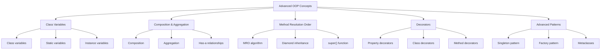

**Diagram Explanation**: This diagram illustrates the advanced OOP concepts covered in this lesson, showing how different topics build upon each other to create sophisticated object-oriented designs.

## Class and Static Variables

Class and static variables are used to store data that is related to the class itself, rather than to instances of the class. They offer a way to share data and behavior across all instances.

### Difference between Class and Static Variables

While the terms are often used **interchangeably** in Python, class variables are the preferred terminology. These variables are defined within the class but outside of any method.

- **Class variables:** These are associated with the class itself and are shared among all instances of the class. They are defined within the class but outside of any method.

- **Instance variables:** These are unique to each object or instance of the class.

### Class Variables Overview

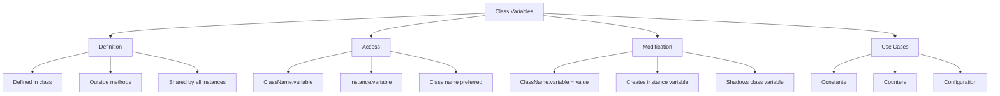

**Diagram Explanation**: This diagram shows how class variables work, including their definition, access methods, modification behavior, and common use cases.

### Accessing and Modifying Class Variables

Class variables can be accessed and modified using the class name or an instance of the class.

- **Accessing**: Class variables are accessed using the class name directly (e.g., `ClassName.variable_name`) or through an instance of the class (e.g., `instance_name.variable_name`).

- **Modifying**: When modifying a class variable through an instance, you are actually creating a new instance variable that shadows the class variable for that particular instance. To modify the class variable itself, you should use the class name.

### Example: Working with Class and Static Variables

```python
class Bakery:
    type = "cake"  # Class variable
    cake_count = 0  # Class variable for counting

    def __init__(self, flavor, price):
        self.flavor = flavor  # Instance variable
        self.price = price    # Instance variable
        Bakery.cake_count += 1  # Increment class variable

    @classmethod
    def update_cake_count(cls, count):
        cls.cake_count = count

    @classmethod
    def get_cake_count(cls):
        return cls.cake_count

    def get_info(self):
        return f"{self.flavor} {Bakery.type} - ${self.price}"

# Creating instances
cake1 = Bakery("Chocolate", 15.99)
cake2 = Bakery("Vanilla", 12.99)
cake3 = Bakery("Strawberry", 18.99)

# Accessing class variables
print(f"Bakery type: {Bakery.type}")  # Output: Bakery type: cake
print(f"Total cakes: {Bakery.cake_count}")  # Output: Total cakes: 3

# Accessing through instances
print(f"Cake 1 info: {cake1.get_info()}")  # Output: Chocolate cake - $15.99
print(f"Cake 2 info: {cake2.get_info()}")  # Output: Vanilla cake - $12.99

# Modifying class variable
Bakery.type = "dessert"
print(f"New type: {Bakery.type}")  # Output: New type: dessert

# Using class methods
Bakery.update_cake_count(5)
print(f"Updated count: {Bakery.get_cake_count()}")  # Output: Updated count: 5
```

## Class Variable vs Instance Variable

Understanding the distinction between class and instance variables is crucial for effective object-oriented programming in Python.

### Key Differences

| Feature | Class Variable | Instance Variable |
|---------|----------------|-------------------|
| **Scope** | Shared by all instances of the class | Unique to each instance of the class |
| **Creation** | Created when the class is defined | Created when an object is instantiated |
| **Access** | Accessed using the class name or instance name | Accessed through an instance of the class |
| **Modification** | Modified using the class name | Modified through a specific instance |
| **Use Cases** | Maintain values common to all instances, track statistics | Store object-specific data |

### Class vs Instance Variables Example

```python
class Student:
    # Class variables
    school_name = "Python Academy"
    total_students = 0
    
    def __init__(self, name, student_id, grade):
        # Instance variables
        self.name = name
        self.student_id = student_id
        self.grade = grade
        self.gpa = 0.0
        
        # Increment class variable
        Student.total_students += 1
    
    def update_gpa(self, new_gpa):
        """Update instance variable"""
        self.gpa = new_gpa
    
    @classmethod
    def get_total_students(cls):
        """Class method to access class variable"""
        return cls.total_students
    
    @classmethod
    def change_school_name(cls, new_name):
        """Class method to modify class variable"""
        cls.school_name = new_name
    
    def get_info(self):
        """Instance method accessing both types of variables"""
        return f"{self.name} (ID: {self.student_id}) - Grade: {self.grade}, GPA: {self.gpa}"

# Creating instances
student1 = Student("Alice", "S001", 10)
student2 = Student("Bob", "S002", 11)
student3 = Student("Charlie", "S003", 12)

# Accessing class variables
print(f"School: {Student.school_name}")  # Output: School: Python Academy
print(f"Total students: {Student.total_students}")  # Output: Total students: 3

# Accessing instance variables
print(student1.get_info())  # Output: Alice (ID: S001) - Grade: 10, GPA: 0.0
print(student2.get_info())  # Output: Bob (ID: S002) - Grade: 11, GPA: 0.0

# Modifying instance variables
student1.update_gpa(3.8)
student2.update_gpa(3.5)
print(student1.get_info())  # Output: Alice (ID: S001) - Grade: 10, GPA: 3.8

# Modifying class variables
Student.change_school_name("Advanced Python Academy")
print(f"New school: {Student.school_name}")  # Output: New school: Advanced Python Academy

# All instances see the change
print(f"Student 1 school: {student1.school_name}")  # Output: Student 1 school: Advanced Python Academy
```

### Important Notes

1. **Class variables are shared**: All instances share the same class variable
2. **Instance variables are unique**: Each instance has its own copy of instance variables
3. **Modification through instance**: Creates a new instance variable that shadows the class variable
4. **Use class name for modification**: To modify the actual class variable, use the class name

## Composition and Aggregation

Composition and Aggregation are not design patterns — they are object-oriented design principles — how objects are built or connected.

### Composition vs Aggregation Overview

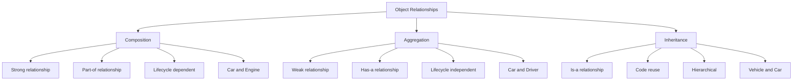

**Diagram Explanation**: This diagram shows the different types of object relationships, illustrating how composition, aggregation, and inheritance differ in their strength and lifecycle dependencies.

### What is Composition? (Strong Relationship — "part of")

- Think of a **car and its engine**.
- A car **has-an** engine.
- If the **car is destroyed**, the **engine is gone too**.
- The engine **can't exist on its own** — it's part of the car.

### What is Aggregation? (Weak Relationship — "has a")

- Think of a **car and its driver**.
- A car **has-a** driver.
- If the **car is destroyed**, the **driver still exists**.
- The driver **can exist independently** — they're not part of the car.

### Difference Between Composition and Inheritance

| Aspect | Composition | Aggregation | Inheritance |
|--------|-------------|-------------|-------------|
| **Relationship** | "part of" | "has a" | "is a" |
| **Strength** | Strong | Weak | Strong |
| **Lifecycle** | Dependent | Independent | Dependent |
| **Flexibility** | High | High | Low |
| **Reusability** | High | High | Medium |

### Example: Implementing Composition and Aggregation

```python
# Composition Example: Car and Engine
class Engine:
    def __init__(self, engine_type, horsepower):
        self.engine_type = engine_type
        self.horsepower = horsepower
        self.is_running = False
    
    def start(self):
        self.is_running = True
        print(f"{self.engine_type} engine started")
    
    def stop(self):
        self.is_running = False
        print(f"{self.engine_type} engine stopped")

class Car:
    def __init__(self, brand, model, engine_type, horsepower):
        self.brand = brand
        self.model = model
        # Composition: Car HAS-A Engine (part of)
        self.engine = Engine(engine_type, horsepower)
        self.speed = 0
    
    def start_car(self):
        self.engine.start()
        print(f"{self.brand} {self.model} is ready to drive")
    
    def accelerate(self):
        if self.engine.is_running:
            self.speed += 10
            print(f"Speed: {self.speed} km/h")
        else:
            print("Start the engine first!")
    
    def stop_car(self):
        self.engine.stop()
        self.speed = 0
        print(f"{self.brand} {self.model} stopped")

# Aggregation Example: Car and Driver
class Driver:
    def __init__(self, name, license_number):
        self.name = name
        self.license_number = license_number
        self.current_car = None
    
    def drive_car(self, car):
        # Aggregation: Driver HAS-A Car (can exist independently)
        self.current_car = car
        print(f"{self.name} is now driving {car.brand} {car.model}")
    
    def park_car(self):
        if self.current_car:
            print(f"{self.name} parked {self.current_car.brand} {self.current_car.model}")
            self.current_car = None
        else:
            print(f"{self.name} is not driving any car")

# Using Composition and Aggregation
car = Car("Toyota", "Camry", "V6", 300)
driver = Driver("Alice", "DL123456")

# Composition: Engine is part of the car
car.start_car()  # Output: V6 engine started, Toyota Camry is ready to drive
car.accelerate()  # Output: Speed: 10 km/h

# Aggregation: Driver can drive different cars
driver.drive_car(car)  # Output: Alice is now driving Toyota Camry
driver.park_car()  # Output: Alice parked Toyota Camry

# The driver can exist without the car
print(f"Driver {driver.name} exists independently")  # Output: Driver Alice exists independently

# The engine cannot exist without the car (composition)
# If car is destroyed, engine is destroyed too
```

### When to Use Composition vs Aggregation

**Use Composition when:**
- The child object cannot exist without the parent
- The child object is a fundamental part of the parent
- The lifecycle of the child is controlled by the parent

**Use Aggregation when:**
- The child object can exist independently
- The relationship is temporary or optional
- The child object can be shared among multiple parents

## Method Resolution Order (MRO)

Method Resolution Order (MRO) is the order in which Python searches for methods in a class hierarchy. It's particularly important in multiple inheritance scenarios.

### The mro() Method

The `mro()` method returns a tuple of classes that represents the method resolution order for a class.

### How Python Resolves Method Calls in Multiple Inheritance

Python uses the C3 Linearization algorithm to determine the MRO. This algorithm ensures that:
1. A class always appears before its parents
2. The order of parents is preserved
3. No class appears more than once

### MRO Overview

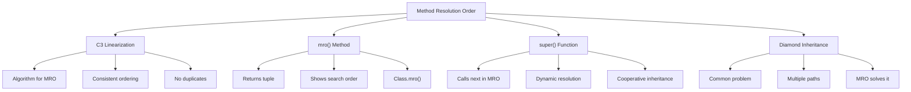

**Diagram Explanation**: This diagram shows how Method Resolution Order works, including the C3 algorithm, the mro() method, super() function, and how it handles diamond inheritance problems.

### Example: Understanding MRO in Python

```python
class A:
    def method(self):
        print("A's method")

class B(A):
    def method(self):
        print("B's method")
        super().method()

class C(A):
    def method(self):
        print("C's method")
        super().method()

class D(B, C):
    def method(self):
        print("D's method")
        super().method()

# Check MRO
print("D's MRO:", D.mro())
# Output: D's MRO: [<class '__main__.D'>, <class '__main__.B'>, <class '__main__.C'>, <class '__main__.A'>, <class 'object'>]

# Create instance and call method
d = D()
d.method()
# Output:
# D's method
# B's method
# C's method
# A's method
```

### Explanation of the Code

1. **Class D** inherits from both **B** and **C**
2. **B** and **C** both inherit from **A**
3. When `d.method()` is called, Python follows the MRO: D → B → C → A
4. Each class calls `super().method()` to continue the chain
5. The result is a cooperative method call chain

### Visualizing MRO

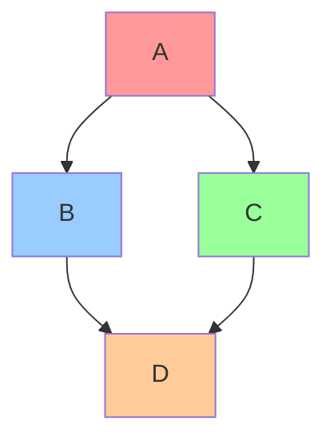

**Diagram Explanation**: This diagram shows the diamond inheritance pattern where D inherits from both B and C, which both inherit from A.

## Diamond Inheritance

Diamond inheritance is a common problem in multiple inheritance where a class inherits from two classes that both inherit from the same base class, creating a diamond shape in the inheritance hierarchy.

### Example with Diamond Inheritance

```python
class Animal:
    def __init__(self, name):
        self.name = name
        print(f"Animal {name} created")

class Mammal(Animal):
    def __init__(self, name):
        print(f"Mammal {name} created")
        super().__init__(name)

class Bird(Animal):
    def __init__(self, name):
        print(f"Bird {name} created")
        super().__init__(name)

class Bat(Mammal, Bird):
    def __init__(self, name):
        print(f"Bat {name} created")
        super().__init__(name)

# Check MRO
print("Bat's MRO:", Bat.mro())
# Output: Bat's MRO: [<class '__main__.Bat'>, <class '__main__.Mammal'>, <class '__main__.Bird'>, <class '__main__.Animal'>, <class 'object'>]

# Create a bat
bat = Bat("Vampire")
# Output:
# Bat Vampire created
# Mammal Vampire created
# Bird Vampire created
# Animal Vampire created
```

### Explanation of the Code

1. **Bat** inherits from both **Mammal** and **Bird**
2. **Mammal** and **Bird** both inherit from **Animal**
3. The MRO ensures that **Animal** is only called once
4. The order is: Bat → Mammal → Bird → Animal
5. Each class calls `super().__init__()` to continue the chain

### Key Takeaways

1. **MRO is deterministic**: The same inheritance hierarchy always produces the same MRO
2. **super() is dynamic**: It follows the MRO, not the class definition
3. **Cooperative inheritance**: All classes in the chain must call `super()`
4. **Diamond inheritance is handled**: The C3 algorithm prevents duplicate calls

## Property Decorators

Property decorators provide an elegant way to define getter, setter, and deleter methods for class attributes. They allow you to add validation, computation, or side effects when accessing attributes.

### Property Decorators Overview

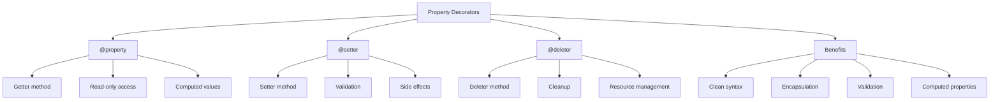

**Diagram Explanation**: This diagram shows the different types of property decorators and their benefits, illustrating how they provide clean, encapsulated access to class attributes.

### 1️⃣ Basic Getter (Read-Only Property)

```python
class Circle:
    def __init__(self, radius):
        self._radius = radius
    
    @property
    def radius(self):
        """Getter for radius"""
        return self._radius
    
    @property
    def area(self):
        """Computed property for area"""
        import math
        return math.pi * self._radius ** 2
    
    @property
    def circumference(self):
        """Computed property for circumference"""
        import math
        return 2 * math.pi * self._radius

# Using the property
circle = Circle(5)
print(f"Radius: {circle.radius}")  # Output: Radius: 5
print(f"Area: {circle.area:.2f}")  # Output: Area: 78.54
print(f"Circumference: {circle.circumference:.2f}")  # Output: Circumference: 31.42

# This would raise an AttributeError
# circle.radius = 10  # Can't set read-only property
```

### 2️⃣ Setter (Change a Value with Validation)

```python
class Temperature:
    def __init__(self, celsius=0):
        self._celsius = celsius
    
    @property
    def celsius(self):
        """Getter for celsius temperature"""
        return self._celsius
    
    @celsius.setter
    def celsius(self, value):
        """Setter for celsius temperature with validation"""
        if value < -273.15:
            raise ValueError("Temperature cannot be below absolute zero!")
        self._celsius = value
    
    @property
    def fahrenheit(self):
        """Getter for fahrenheit temperature"""
        return (self._celsius * 9/5) + 32
    
    @fahrenheit.setter
    def fahrenheit(self, value):
        """Setter for fahrenheit temperature"""
        celsius = (value - 32) * 5/9
        if celsius < -273.15:
            raise ValueError("Temperature cannot be below absolute zero!")
        self._celsius = celsius

# Using the property with validation
temp = Temperature(25)
print(f"Celsius: {temp.celsius}°C")  # Output: Celsius: 25°C
print(f"Fahrenheit: {temp.fahrenheit}°F")  # Output: Fahrenheit: 77.0°F

# Setting temperature with validation
temp.celsius = 30
print(f"New Celsius: {temp.celsius}°C")  # Output: New Celsius: 30°C

temp.fahrenheit = 86
print(f"New Celsius: {temp.celsius}°C")  # Output: New Celsius: 30°C

# This would raise a ValueError
# temp.celsius = -300  # ValueError: Temperature cannot be below absolute zero!
```

### 3️⃣ Deleter (Remove an Attribute)

```python
class Person:
    def __init__(self, name, age):
        self._name = name
        self._age = age
        self._email = None
    
    @property
    def name(self):
        """Getter for name"""
        return self._name
    
    @name.setter
    def name(self, value):
        """Setter for name"""
        if not value or not isinstance(value, str):
            raise ValueError("Name must be a non-empty string")
        self._name = value
    
    @name.deleter
    def name(self):
        """Deleter for name"""
        print(f"Deleting name: {self._name}")
        self._name = None
    
    @property
    def email(self):
        """Getter for email"""
        return self._email
    
    @email.setter
    def email(self, value):
        """Setter for email with validation"""
        if value and "@" not in value:
            raise ValueError("Invalid email format")
        self._email = value
    
    @email.deleter
    def email(self):
        """Deleter for email"""
        print(f"Deleting email: {self._email}")
        self._email = None

# Using the property with deleter
person = Person("Alice", 30)
person.email = "alice@example.com"

print(f"Name: {person.name}")  # Output: Name: Alice
print(f"Email: {person.email}")  # Output: Email: alice@example.com

# Deleting attributes
del person.email  # Output: Deleting email: alice@example.com
print(f"Email after deletion: {person.email}")  # Output: Email after deletion: None

del person.name  # Output: Deleting name: Alice
print(f"Name after deletion: {person.name}")  # Output: Name after deletion: None
```

### Benefits of Property Decorators

1. **Clean Syntax**: Access attributes like regular attributes
2. **Encapsulation**: Hide internal implementation details
3. **Validation**: Add validation logic when setting values
4. **Computed Properties**: Calculate values on-the-fly
5. **Side Effects**: Perform actions when accessing attributes
6. **Backward Compatibility**: Can be added to existing code without breaking changes

## Class Decorators

Class decorators are functions that modify or enhance classes. They provide a way to add functionality to classes without modifying their original definition.

### Class Decorators Overview

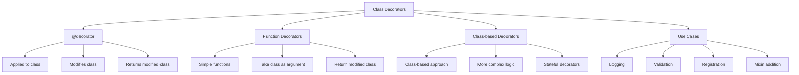

**Diagram Explanation**: This diagram shows the different types of class decorators and their use cases, illustrating how they can modify and enhance classes.

### Example: Class Decorators

```python
# Function-based class decorator
def add_logging(cls):
    """Add logging functionality to a class"""
    original_init = cls.__init__
    
    def new_init(self, *args, **kwargs):
        print(f"Creating instance of {cls.__name__}")
        original_init(self, *args, **kwargs)
        print(f"Instance of {cls.__name__} created successfully")
    
    cls.__init__ = new_init
    return cls

# Class-based decorator
class Singleton:
    """Singleton decorator using class"""
    def __init__(self, cls):
        self.cls = cls
        self.instance = None
    
    def __call__(self, *args, **kwargs):
        if self.instance is None:
            self.instance = self.cls(*args, **kwargs)
        return self.instance

# Using the decorators
@add_logging
class Person:
    def __init__(self, name, age):
        self.name = name
        self.age = age
    
    def greet(self):
        return f"Hello, I'm {self.name}"

@Singleton
class Database:
    def __init__(self):
        self.connection = "Database connection established"
    
    def query(self, sql):
        return f"Executing: {sql}"

# Testing the decorators
person = Person("Alice", 30)
# Output:
# Creating instance of Person
# Instance of Person created successfully

db1 = Database()
db2 = Database()
print(db1 is db2)  # Output: True (same instance)
```

## Callable Objects

In Python, a callable object is any object that can be called using the `()` operator. This includes functions, methods, classes, and objects with a `__call__` method.

### Callable Objects Overview

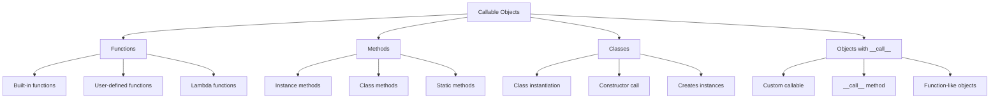

**Diagram Explanation**: This diagram shows the different types of callable objects in Python, illustrating how various objects can be called using the () operator.

### Example: Callable Objects

```python
class Calculator:
    def __init__(self, operation):
        self.operation = operation
    
    def __call__(self, a, b):
        """Make the object callable"""
        if self.operation == "add":
            return a + b
        elif self.operation == "multiply":
            return a * b
        elif self.operation == "divide":
            return a / b if b != 0 else "Cannot divide by zero"
        else:
            return "Unknown operation"

# Creating callable objects
adder = Calculator("add")
multiplier = Calculator("multiply")
divider = Calculator("divide")

# Using callable objects
print(adder(5, 3))        # Output: 8
print(multiplier(4, 6))   # Output: 24
print(divider(10, 2))     # Output: 5.0

# Checking if objects are callable
print(callable(adder))           # Output: True
print(callable("hello"))         # Output: False
print(callable(len))             # Output: True
print(callable(Calculator))      # Output: True
```

## Working with Modules and Packages in OOP

Organizing classes in modules and packages is essential for maintaining clean, scalable code. This section covers how to structure OOP code across multiple files.

### Module and Package Structure

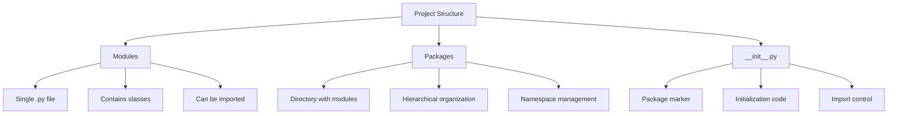

**Diagram Explanation**: This diagram shows how to organize OOP code using modules and packages, illustrating the hierarchical structure and import mechanisms.

### Example: Organizing Classes in Modules

```python
# animals/mammals.py
class Dog:
    def __init__(self, name, breed):
        self.name = name
        self.breed = breed
    
    def bark(self):
        return f"{self.name} says Woof!"

class Cat:
    def __init__(self, name, color):
        self.name = name
        self.color = color
    
    def meow(self):
        return f"{self.name} says Meow!"

# animals/birds.py
class Eagle:
    def __init__(self, name, wingspan):
        self.name = name
        self.wingspan = wingspan
    
    def fly(self):
        return f"{self.name} is flying with {self.wingspan}cm wingspan"

# vehicles/cars.py
class Car:
    def __init__(self, brand, model, year):
        self.brand = brand
        self.model = model
        self.year = year
    
    def start(self):
        return f"{self.year} {self.brand} {self.model} is starting"

# vehicles/bikes.py
class Bike:
    def __init__(self, brand, type_bike):
        self.brand = brand
        self.type_bike = type_bike
    
    def ride(self):
        return f"Riding {self.brand} {self.type_bike}"

# animals/__init__.py
from .mammals import Dog, Cat
from .birds import Eagle

__all__ = ['Dog', 'Cat', 'Eagle']

# vehicles/__init__.py
from .cars import Car
from .bikes import Bike

__all__ = ['Car', 'Bike']

# main.py
from animals import Dog, Cat, Eagle
from vehicles import Car, Bike

# Using the classes
dog = Dog("Buddy", "Golden Retriever")
cat = Cat("Whiskers", "Orange")
eagle = Eagle("Thunder", 200)

car = Car("Toyota", "Camry", 2023)
bike = Bike("Trek", "Mountain")

print(dog.bark())      # Output: Buddy says Woof!
print(cat.meow())      # Output: Whiskers says Meow!
print(eagle.fly())     # Output: Thunder is flying with 200cm wingspan
print(car.start())     # Output: 2023 Toyota Camry is starting
print(bike.ride())     # Output: Riding Trek Mountain
```

## Advanced OOP Concepts

This section covers advanced OOP concepts including metaclasses, design patterns, and sophisticated object-oriented techniques.

### Advanced OOP Concepts Overview

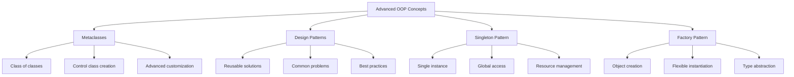

**Diagram Explanation**: This diagram shows the advanced OOP concepts including metaclasses and design patterns, illustrating how they provide sophisticated object-oriented solutions.

### Metaclasses

Metaclasses are the "class of classes" - they define how classes are created and behave.

```python
class SingletonMeta(type):
    """Metaclass for singleton pattern"""
    _instances = {}
    
    def __call__(cls, *args, **kwargs):
        if cls not in cls._instances:
            cls._instances[cls] = super().__call__(*args, **kwargs)
        return cls._instances[cls]

class Database(metaclass=SingletonMeta):
    def __init__(self):
        self.connection = "Database connected"
    
    def query(self, sql):
        return f"Executing: {sql}"

# Testing singleton
db1 = Database()
db2 = Database()
print(db1 is db2)  # Output: True (same instance)
```

### Singleton Design Pattern

The Singleton pattern ensures that a class has only one instance and provides global access to it.

```python
class Logger:
    _instance = None
    _initialized = False
    
    def __new__(cls):
        if cls._instance is None:
            cls._instance = super().__new__(cls)
        return cls._instance
    
    def __init__(self):
        if not self._initialized:
            self.logs = []
            self._initialized = True
    
    def log(self, message):
        self.logs.append(message)
        print(f"LOG: {message}")
    
    def get_logs(self):
        return self.logs

# Testing singleton
logger1 = Logger()
logger2 = Logger()
print(logger1 is logger2)  # Output: True

logger1.log("First message")
logger2.log("Second message")
print(logger1.get_logs())  # Output: ['First message', 'Second message']
```

### Factory Design Pattern

The Factory pattern provides an interface for creating objects without specifying their exact class.

```python
class Animal:
    def speak(self):
        pass

class Dog(Animal):
    def speak(self):
        return "Woof!"

class Cat(Animal):
    def speak(self):
        return "Meow!"

class AnimalFactory:
    @staticmethod
    def create_animal(animal_type):
        if animal_type.lower() == "dog":
            return Dog()
        elif animal_type.lower() == "cat":
            return Cat()
        else:
            raise ValueError(f"Unknown animal type: {animal_type}")

# Using the factory
factory = AnimalFactory()
dog = factory.create_animal("dog")
cat = factory.create_animal("cat")

print(dog.speak())  # Output: Woof!
print(cat.speak())  # Output: Meow!
```

## Error Handling in OOP

Error handling in Object-Oriented Programming involves raising exceptions in methods and creating custom exceptions for classes. This ensures robust and maintainable code.

### Error Handling Overview

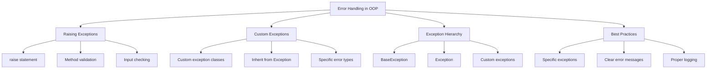

**Diagram Explanation**: This diagram shows the different aspects of error handling in OOP, including raising exceptions, custom exceptions, and best practices.

### Raising Exceptions in Methods

```python
class BankAccount:
    def __init__(self, account_number, initial_balance=0):
        self.account_number = account_number
        self.balance = initial_balance
    
    def deposit(self, amount):
        """Deposit money into the account"""
        if amount <= 0:
            raise ValueError("Deposit amount must be positive")
        self.balance += amount
        return self.balance
    
    def withdraw(self, amount):
        """Withdraw money from the account"""
        if amount <= 0:
            raise ValueError("Withdrawal amount must be positive")
        if amount > self.balance:
            raise InsufficientFundsError(f"Insufficient funds. Available: ${self.balance}")
        self.balance -= amount
        return self.balance
    
    def get_balance(self):
        """Get current balance"""
        return self.balance

# Custom Exception Class
class InsufficientFundsError(Exception):
    """Custom exception for insufficient funds"""
    pass

# Using the class with error handling
try:
    account = BankAccount("12345", 1000)
    
    # Valid operations
    account.deposit(500)
    print(f"Balance after deposit: ${account.get_balance()}")  # Output: Balance after deposit: $1500
    
    account.withdraw(200)
    print(f"Balance after withdrawal: ${account.get_balance()}")  # Output: Balance after withdrawal: $1300
    
    # This will raise an exception
    account.withdraw(2000)  # Raises InsufficientFundsError
    
except ValueError as e:
    print(f"Value Error: {e}")
except InsufficientFundsError as e:
    print(f"Insufficient Funds Error: {e}")
except Exception as e:
    print(f"Unexpected error: {e}")
```

### Custom Exceptions in Classes

```python
class Student:
    def __init__(self, name, age, student_id):
        if not name or not isinstance(name, str):
            raise InvalidNameError("Name must be a non-empty string")
        if age < 0 or age > 150:
            raise InvalidAgeError("Age must be between 0 and 150")
        if not student_id or not isinstance(student_id, str):
            raise InvalidStudentIdError("Student ID must be a non-empty string")
        
        self.name = name
        self.age = age
        self.student_id = student_id
        self.grades = []
    
    def add_grade(self, grade):
        """Add a grade to the student's record"""
        if not isinstance(grade, (int, float)):
            raise InvalidGradeError("Grade must be a number")
        if grade < 0 or grade > 100:
            raise InvalidGradeError("Grade must be between 0 and 100")
        
        self.grades.append(grade)
        return self.grades
    
    def get_average(self):
        """Calculate average grade"""
        if not self.grades:
            raise NoGradesError("No grades available to calculate average")
        return sum(self.grades) / len(self.grades)

# Custom Exception Classes
class InvalidNameError(Exception):
    """Exception for invalid names"""
    pass

class InvalidAgeError(Exception):
    """Exception for invalid ages"""
    pass

class InvalidStudentIdError(Exception):
    """Exception for invalid student IDs"""
    pass

class InvalidGradeError(Exception):
    """Exception for invalid grades"""
    pass

class NoGradesError(Exception):
    """Exception when no grades are available"""
    pass

# Using the class with custom exceptions
try:
    student = Student("Alice", 20, "S001")
    student.add_grade(85)
    student.add_grade(92)
    student.add_grade(78)
    
    print(f"Student: {student.name}")
    print(f"Grades: {student.grades}")
    print(f"Average: {student.get_average():.2f}")
    
    # This will raise an exception
    student.add_grade(150)  # Raises InvalidGradeError
    
except (InvalidNameError, InvalidAgeError, InvalidStudentIdError, 
        InvalidGradeError, NoGradesError) as e:
    print(f"Student Error: {e}")
```

## Testing OOP Code

Testing Object-Oriented Programming code is crucial for ensuring reliability and maintainability. This section covers unit testing classes and methods using unittest and pytest.

### Testing Overview

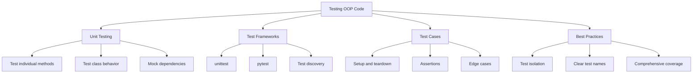

**Diagram Explanation**: This diagram shows the different aspects of testing OOP code, including frameworks, test cases, and best practices.

### Example: Calculator Class with Testing

```python
# calculator.py
class Calculator:
    def __init__(self):
        self.history = []
    
    def add(self, a, b):
        """Add two numbers"""
        if not isinstance(a, (int, float)) or not isinstance(b, (int, float)):
            raise TypeError("Arguments must be numbers")
        result = a + b
        self.history.append(f"{a} + {b} = {result}")
        return result
    
    def subtract(self, a, b):
        """Subtract two numbers"""
        if not isinstance(a, (int, float)) or not isinstance(b, (int, float)):
            raise TypeError("Arguments must be numbers")
        result = a - b
        self.history.append(f"{a} - {b} = {result}")
        return result
    
    def multiply(self, a, b):
        """Multiply two numbers"""
        if not isinstance(a, (int, float)) or not isinstance(b, (int, float)):
            raise TypeError("Arguments must be numbers")
        result = a * b
        self.history.append(f"{a} * {b} = {result}")
        return result
    
    def divide(self, a, b):
        """Divide two numbers"""
        if not isinstance(a, (int, float)) or not isinstance(b, (int, float)):
            raise TypeError("Arguments must be numbers")
        if b == 0:
            raise ValueError("Cannot divide by zero")
        result = a / b
        self.history.append(f"{a} / {b} = {result}")
        return result
    
    def get_history(self):
        """Get calculation history"""
        return self.history.copy()
    
    def clear_history(self):
        """Clear calculation history"""
        self.history.clear()
```

### Testing with unittest

```python
# test_calculator.py
import unittest
from calculator import Calculator

class TestCalculator(unittest.TestCase):
    def setUp(self):
        """Set up test fixtures before each test method"""
        self.calc = Calculator()
    
    def tearDown(self):
        """Clean up after each test method"""
        self.calc.clear_history()
    
    def test_add_positive_numbers(self):
        """Test adding positive numbers"""
        result = self.calc.add(2, 3)
        self.assertEqual(result, 5)
        self.assertIn("2 + 3 = 5", self.calc.get_history())
    
    def test_add_negative_numbers(self):
        """Test adding negative numbers"""
        result = self.calc.add(-2, -3)
        self.assertEqual(result, -5)
    
    def test_subtract_numbers(self):
        """Test subtracting numbers"""
        result = self.calc.subtract(10, 3)
        self.assertEqual(result, 7)
        self.assertIn("10 - 3 = 7", self.calc.get_history())
    
    def test_multiply_numbers(self):
        """Test multiplying numbers"""
        result = self.calc.multiply(4, 5)
        self.assertEqual(result, 20)
        self.assertIn("4 * 5 = 20", self.calc.get_history())
    
    def test_divide_numbers(self):
        """Test dividing numbers"""
        result = self.calc.divide(10, 2)
        self.assertEqual(result, 5)
        self.assertIn("10 / 2 = 5", self.calc.get_history())
    
    def test_divide_by_zero(self):
        """Test dividing by zero raises ValueError"""
        with self.assertRaises(ValueError):
            self.calc.divide(10, 0)
    
    def test_invalid_input_type(self):
        """Test invalid input types raise TypeError"""
        with self.assertRaises(TypeError):
            self.calc.add("2", 3)
        
        with self.assertRaises(TypeError):
            self.calc.subtract(2, "3")
    
    def test_history_tracking(self):
        """Test that operations are tracked in history"""
        self.calc.add(1, 2)
        self.calc.subtract(5, 3)
        self.calc.multiply(2, 4)
        
        history = self.calc.get_history()
        self.assertEqual(len(history), 3)
        self.assertIn("1 + 2 = 3", history)
        self.assertIn("5 - 3 = 2", history)
        self.assertIn("2 * 4 = 8", history)
    
    def test_clear_history(self):
        """Test clearing history"""
        self.calc.add(1, 2)
        self.calc.clear_history()
        self.assertEqual(len(self.calc.get_history()), 0)

if __name__ == '__main__':
    unittest.main()
```

### Testing with pytest

```python
# test_calculator_pytest.py
import pytest
from calculator import Calculator

class TestCalculatorPytest:
    @pytest.fixture
    def calc(self):
        """Create a calculator instance for each test"""
        return Calculator()
    
    def test_add_positive_numbers(self, calc):
        """Test adding positive numbers"""
        result = calc.add(2, 3)
        assert result == 5
        assert "2 + 3 = 5" in calc.get_history()
    
    def test_add_negative_numbers(self, calc):
        """Test adding negative numbers"""
        result = calc.add(-2, -3)
        assert result == -5
    
    def test_subtract_numbers(self, calc):
        """Test subtracting numbers"""
        result = calc.subtract(10, 3)
        assert result == 7
        assert "10 - 3 = 7" in calc.get_history()
    
    def test_multiply_numbers(self, calc):
        """Test multiplying numbers"""
        result = calc.multiply(4, 5)
        assert result == 20
        assert "4 * 5 = 20" in calc.get_history()
    
    def test_divide_numbers(self, calc):
        """Test dividing numbers"""
        result = calc.divide(10, 2)
        assert result == 5
        assert "10 / 2 = 5" in calc.get_history()
    
    def test_divide_by_zero(self, calc):
        """Test dividing by zero raises ValueError"""
        with pytest.raises(ValueError, match="Cannot divide by zero"):
            calc.divide(10, 0)
    
    def test_invalid_input_type(self, calc):
        """Test invalid input types raise TypeError"""
        with pytest.raises(TypeError, match="Arguments must be numbers"):
            calc.add("2", 3)
        
        with pytest.raises(TypeError, match="Arguments must be numbers"):
            calc.subtract(2, "3")
    
    def test_history_tracking(self, calc):
        """Test that operations are tracked in history"""
        calc.add(1, 2)
        calc.subtract(5, 3)
        calc.multiply(2, 4)
        
        history = calc.get_history()
        assert len(history) == 3
        assert "1 + 2 = 3" in history
        assert "5 - 3 = 2" in history
        assert "2 * 4 = 8" in history
    
    def test_clear_history(self, calc):
        """Test clearing history"""
        calc.add(1, 2)
        calc.clear_history()
        assert len(calc.get_history()) == 0

# Run with: pytest test_calculator_pytest.py -v
```

## SOLID Principles in Python

SOLID principles are fundamental design principles that help create maintainable, scalable, and robust object-oriented code.

### SOLID Principles Overview

```mermaid
graph TD
    A["SOLID Principles"] --> B["Single Responsibility"]
    A --> C["Open/Closed"]
    A --> D["Liskov Substitution"]
    A --> E["Interface Segregation"]
    A --> F["Dependency Inversion"]
    
    B --> B1["One class, one reason"]
    B --> B2["Focused responsibility"]
    B --> B3["Easier maintenance"]
    
    C --> C1["Open for extension"]
    C --> C2["Closed for modification"]
    C --> C3["Inheritance/Composition"]
    
    D --> D1["Substitutability"]
    D --> D2["Behavioral compatibility"]
    D --> D3["Contract adherence"]
    
    E --> E1["Small interfaces"]
    E --> E2["Client-specific"]
    E --> E3["No forced dependencies"]
    
    F --> F1["Depend on abstractions"]
    F --> F2["Not on concretions"]
    F --> F3["Inversion of control"]
```

**Diagram Explanation**: This diagram shows the five SOLID principles and their key concepts, illustrating how they guide good object-oriented design.

### 1. Single Responsibility Principle (SRP)

A class should have only one reason to change.

```python
# Bad: Violates SRP
class User:
    def __init__(self, name, email):
        self.name = name
        self.email = email
    
    def save_to_database(self):
        # Database logic
        pass
    
    def send_email(self, message):
        # Email logic
        pass
    
    def validate_email(self):
        # Validation logic
        pass

# Good: Follows SRP
class User:
    def __init__(self, name, email):
        self.name = name
        self.email = email

class UserValidator:
    @staticmethod
    def validate_email(email):
        return "@" in email and "." in email.split("@")[1]

class UserRepository:
    def save(self, user):
        # Database logic
        pass

class EmailService:
    def send_email(self, user, message):
        # Email logic
        pass
```

### 2. Open/Closed Principle (OCP)

Software entities should be open for extension but closed for modification.

```python
# Bad: Violates OCP
class Shape:
    def __init__(self, shape_type, width, height):
        self.shape_type = shape_type
        self.width = width
        self.height = height
    
    def area(self):
        if self.shape_type == "rectangle":
            return self.width * self.height
        elif self.shape_type == "circle":
            return 3.14 * (self.width / 2) ** 2
        # Adding new shapes requires modifying this class

# Good: Follows OCP
from abc import ABC, abstractmethod

class Shape(ABC):
    @abstractmethod
    def area(self):
        pass

class Rectangle(Shape):
    def __init__(self, width, height):
        self.width = width
        self.height = height
    
    def area(self):
        return self.width * self.height

class Circle(Shape):
    def __init__(self, radius):
        self.radius = radius
    
    def area(self):
        import math
        return math.pi * self.radius ** 2

class Triangle(Shape):
    def __init__(self, base, height):
        self.base = base
        self.height = height
    
    def area(self):
        return 0.5 * self.base * self.height

# New shapes can be added without modifying existing code
```

### 3. Liskov Substitution Principle (LSP)

Objects of a superclass should be replaceable with objects of a subclass without breaking the application.

```python
# Bad: Violates LSP
class Bird:
    def fly(self):
        return "Flying"

class Penguin(Bird):
    def fly(self):
        raise Exception("Penguins can't fly")  # Breaks LSP

# Good: Follows LSP
class Bird:
    def move(self):
        return "Moving"

class FlyingBird(Bird):
    def fly(self):
        return "Flying"
    
    def move(self):
        return self.fly()

class Penguin(Bird):
    def swim(self):
        return "Swimming"
    
    def move(self):
        return self.swim()

# All birds can be substituted without breaking functionality
def make_bird_move(bird):
    return bird.move()  # Works for all bird types
```

### 4. Interface Segregation Principle (ISP)

Clients should not be forced to depend on interfaces they don't use.

```python
# Bad: Violates ISP
class Worker:
    def work(self):
        pass
    
    def eat(self):
        pass
    
    def sleep(self):
        pass

class Robot(Worker):
    def work(self):
        return "Working"
    
    def eat(self):  # Robots don't eat!
        raise Exception("Robots don't eat")
    
    def sleep(self):  # Robots don't sleep!
        raise Exception("Robots don't sleep")

# Good: Follows ISP
from abc import ABC, abstractmethod

class Workable(ABC):
    @abstractmethod
    def work(self):
        pass

class Eatable(ABC):
    @abstractmethod
    def eat(self):
        pass

class Sleepable(ABC):
    @abstractmethod
    def sleep(self):
        pass

class Human(Workable, Eatable, Sleepable):
    def work(self):
        return "Working"
    
    def eat(self):
        return "Eating"
    
    def sleep(self):
        return "Sleeping"

class Robot(Workable):
    def work(self):
        return "Working"
    # No need to implement eat() or sleep()
```

### 5. Dependency Inversion Principle (DIP)

High-level modules should not depend on low-level modules. Both should depend on abstractions.

```python
# Bad: Violates DIP
class EmailService:
    def send_email(self, message):
        return f"Email sent: {message}"

class NotificationService:
    def __init__(self):
        self.email_service = EmailService()  # Depends on concrete class
    
    def send_notification(self, message):
        return self.email_service.send_email(message)

# Good: Follows DIP
from abc import ABC, abstractmethod

class MessageService(ABC):
    @abstractmethod
    def send_message(self, message):
        pass

class EmailService(MessageService):
    def send_message(self, message):
        return f"Email sent: {message}"

class SMSService(MessageService):
    def send_message(self, message):
        return f"SMS sent: {message}"

class NotificationService:
    def __init__(self, message_service: MessageService):  # Depends on abstraction
        self.message_service = message_service
    
    def send_notification(self, message):
        return self.message_service.send_message(message)

# Usage
email_service = EmailService()
sms_service = SMSService()

notification1 = NotificationService(email_service)
notification2 = NotificationService(sms_service)

print(notification1.send_notification("Hello via email"))
print(notification2.send_notification("Hello via SMS"))
```

## Function Decorators

Function decorators are a powerful feature in Python that allows you to modify or enhance functions without changing their original code.

### Function Decorators Overview

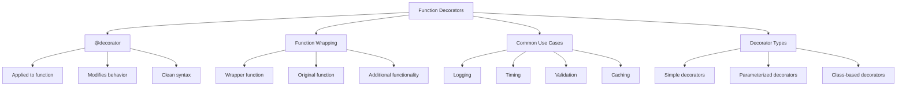

**Diagram Explanation**: This diagram shows how function decorators work, including their syntax, wrapping mechanism, and common use cases.

### Example: Function Decorators

```python
import time
import functools

# Simple decorator
def timer(func):
    """Decorator to measure function execution time"""
    @functools.wraps(func)
    def wrapper(*args, **kwargs):
        start_time = time.time()
        result = func(*args, **kwargs)
        end_time = time.time()
        print(f"{func.__name__} executed in {end_time - start_time:.4f} seconds")
        return result
    return wrapper

# Parameterized decorator
def retry(max_attempts=3):
    """Decorator to retry function execution on failure"""
    def decorator(func):
        @functools.wraps(func)
        def wrapper(*args, **kwargs):
            for attempt in range(max_attempts):
                try:
                    return func(*args, **kwargs)
                except Exception as e:
                    if attempt == max_attempts - 1:
                        raise e
                    print(f"Attempt {attempt + 1} failed: {e}. Retrying...")
            return None
        return wrapper
    return decorator

# Validation decorator
def validate_types(*types):
    """Decorator to validate function argument types"""
    def decorator(func):
        @functools.wraps(func)
        def wrapper(*args, **kwargs):
            for i, (arg, expected_type) in enumerate(zip(args, types)):
                if not isinstance(arg, expected_type):
                    raise TypeError(f"Argument {i} must be of type {expected_type.__name__}")
            return func(*args, **kwargs)
        return wrapper
    return decorator

# Using the decorators
@timer
@validate_types(int, int)
def add_numbers(a, b):
    """Add two numbers"""
    time.sleep(0.1)  # Simulate some work
    return a + b

@retry(max_attempts=3)
def risky_operation():
    """An operation that might fail"""
    import random
    if random.random() < 0.7:  # 70% chance of failure
        raise Exception("Operation failed")
    return "Success!"

# Testing the decorators
result = add_numbers(5, 3)
print(f"Result: {result}")

try:
    result = risky_operation()
    print(f"Risky operation result: {result}")
except Exception as e:
    print(f"All attempts failed: {e}")
```

## Iterable Objects

Iterable objects are objects that can be iterated over using loops. In Python, any object that implements the `__iter__` method is iterable.

### Iterable Objects Overview

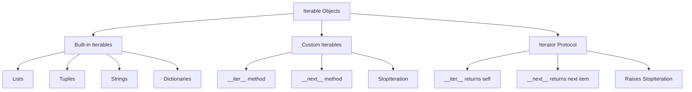

**Diagram Explanation**: This diagram shows how iterable objects work in Python, including built-in iterables and the iterator protocol for custom classes.

### Example: Custom Iterable Class

```python
class NumberRange:
    def __init__(self, start, end, step=1):
        self.start = start
        self.end = end
        self.step = step
    
    def __iter__(self):
        return NumberRangeIterator(self.start, self.end, self.step)

class NumberRangeIterator:
    def __init__(self, start, end, step):
        self.current = start
        self.end = end
        self.step = step
    
    def __iter__(self):
        return self
    
    def __next__(self):
        if self.current >= self.end:
            raise StopIteration
        value = self.current
        self.current += self.step
        return value

# Using the custom iterable
numbers = NumberRange(1, 10, 2)
for num in numbers:
    print(num)  # Output: 1, 3, 5, 7, 9

# Using with list comprehension
squares = [x**2 for x in NumberRange(1, 6)]
print(squares)  # Output: [1, 4, 9, 16, 25]
```

## Object-Based vs Object-Oriented Languages

Understanding the difference between object-based and object-oriented languages helps clarify Python's approach to OOP.

### Object-Based vs Object-Oriented Overview

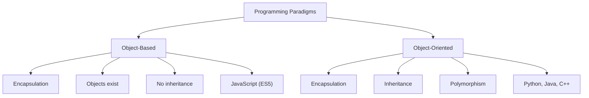

**Diagram Explanation**: This diagram shows the key differences between object-based and object-oriented programming paradigms, illustrating what features each includes.

### Key Differences

| Feature | Object-Based | Object-Oriented |
|---------|--------------|-----------------|
| **Encapsulation** | ✅ Yes | ✅ Yes |
| **Inheritance** | ❌ No | ✅ Yes |
| **Polymorphism** | ❌ No | ✅ Yes |
| **Examples** | JavaScript (ES5), VBScript | Python, Java, C++, C# |

### Python as Object-Oriented

Python is a fully object-oriented language because it supports:

1. **Encapsulation**: Classes and objects with private attributes
2. **Inheritance**: Single and multiple inheritance
3. **Polymorphism**: Method overriding and duck typing

```python
# Example demonstrating all OOP features
class Animal:
    def __init__(self, name):
        self.name = name
    
    def speak(self):
        return f"{self.name} makes a sound"

class Dog(Animal):
    def speak(self):  # Polymorphism - method overriding
        return f"{self.name} says Woof!"

class Cat(Animal):
    def speak(self):  # Polymorphism - method overriding
        return f"{self.name} says Meow!"

# Polymorphism in action
animals = [Dog("Buddy"), Cat("Whiskers")]
for animal in animals:
    print(animal.speak())
# Output:
# Buddy says Woof!
# Whiskers says Meow!
```

## Key Concepts Summary

This comprehensive lesson covered advanced Object-Oriented Programming concepts in Python:

### Advanced OOP Concepts Covered

1. **Class and Static Variables**
   - Shared data across all instances
   - Class methods for class variable operations
   - Proper access patterns

2. **Composition and Aggregation**
   - "Has-a" relationships
   - Lifecycle dependencies
   - Design principles for object relationships

3. **Method Resolution Order (MRO)**
   - C3 Linearization algorithm
   - Multiple inheritance resolution
   - Diamond inheritance handling

4. **Property Decorators**
   - Getter, setter, and deleter methods
   - Validation and computed properties
   - Clean attribute access

### Best Practices

1. **Class Variables**:
   - Use class variables for shared data
   - Access via class name when possible
   - Be careful with mutable class variables
   - Use class methods for class variable operations

2. **Composition and Aggregation**:
   - Use composition for "part-of" relationships
   - Use aggregation for "has-a" relationships
   - Consider lifecycle dependencies
   - Prefer composition over inheritance when appropriate

3. **Method Resolution Order**:
   - Understand MRO for multiple inheritance
   - Use `super()` for cooperative inheritance
   - Check MRO with `Class.mro()`
   - Design inheritance hierarchies carefully

4. **Property Decorators**:
   - Use properties for computed attributes
   - Add validation in setters
   - Use private attributes with underscore prefix
   - Provide clean public interfaces

### Common Pitfalls to Avoid

1. **Class Variables**:
   - Don't modify mutable class variables through instances
   - Be aware of variable shadowing
   - Use class methods for class variable operations

2. **Multiple Inheritance**:
   - Avoid deep inheritance hierarchies
   - Use composition when possible
   - Understand MRO implications

3. **Property Decorators**:
   - Don't forget to call `super()` in inheritance chains
   - Validate input in setters
   - Use appropriate naming conventions

### When to Use Each Concept

| Concept | When to Use | Example |
|---------|-------------|---------|
| **Class Variables** | Shared data, counters, constants | `total_instances`, `default_config` |
| **Composition** | Strong "part-of" relationships | Car and Engine |
| **Aggregation** | Weak "has-a" relationships | Car and Driver |
| **Property Decorators** | Validation, computed values | Temperature conversion, area calculation |
| **Multiple Inheritance** | Mixin patterns, interface implementation | Logging mixin, database mixin |

## Useful Links

### Documentation and References

- [Python Official Documentation - Classes](https://docs.python.org/3/tutorial/classes.html)
- [Python Official Documentation - Property](https://docs.python.org/3/library/functions.html#property)
- [Python Official Documentation - super()](https://docs.python.org/3/library/functions.html#super)
- [Method Resolution Order (MRO) - Python Docs](https://docs.python.org/3/tutorial/classes.html#multiple-inheritance)

### Advanced Topics

- [Python Descriptors](https://docs.python.org/3/howto/descriptor.html)
- [Python Metaclasses](https://docs.python.org/3/reference/datamodel.html#metaclasses)
- [Python Abstract Base Classes](https://docs.python.org/3/library/abc.html)
- [Python Data Classes](https://docs.python.org/3/library/dataclasses.html)

### Design Patterns

- [Design Patterns in Python](https://refactoring.guru/design-patterns/python)
- [Python Design Patterns](https://python-patterns.guide/)
- [SOLID Principles in Python](https://realpython.com/solid-principles-python/)

### Best Practices

- [PEP 8 - Style Guide for Python Code](https://peps.python.org/pep-0008/)
- [PEP 257 - Docstring Conventions](https://peps.python.org/pep-0257/)
- [Python Best Practices](https://docs.python-guide.org/)

---

## Conclusion

This lesson covered advanced Object-Oriented Programming concepts in Python, building upon the fundamentals from Part 1. You've learned about:

- **Class and Static Variables**: How to share data across instances
- **Composition and Aggregation**: Design principles for object relationships
- **Method Resolution Order**: How Python resolves method calls in inheritance hierarchies
- **Property Decorators**: Elegant ways to control attribute access

These concepts are essential for writing maintainable, scalable Python code. Practice implementing these patterns in your own projects to solidify your understanding.

Remember: **Good OOP design is about creating clear, maintainable relationships between objects that model real-world concepts effectively.**

---
