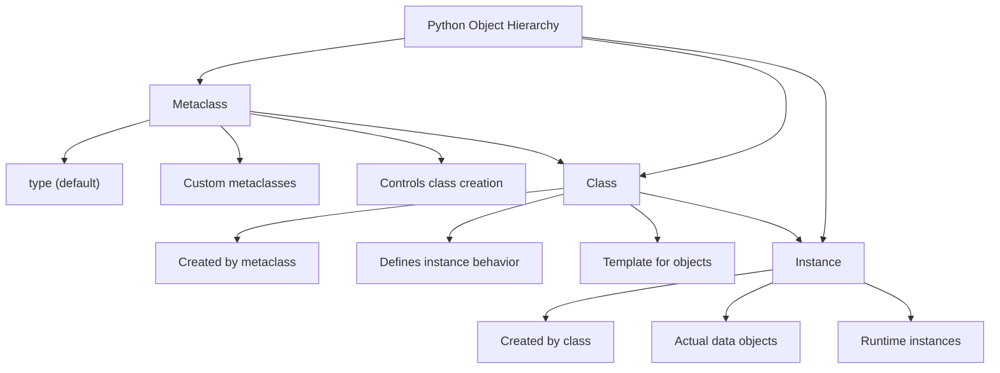
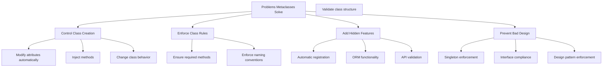
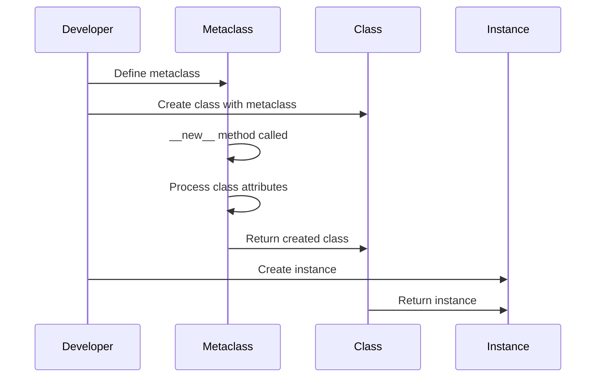
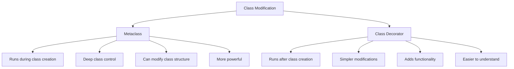
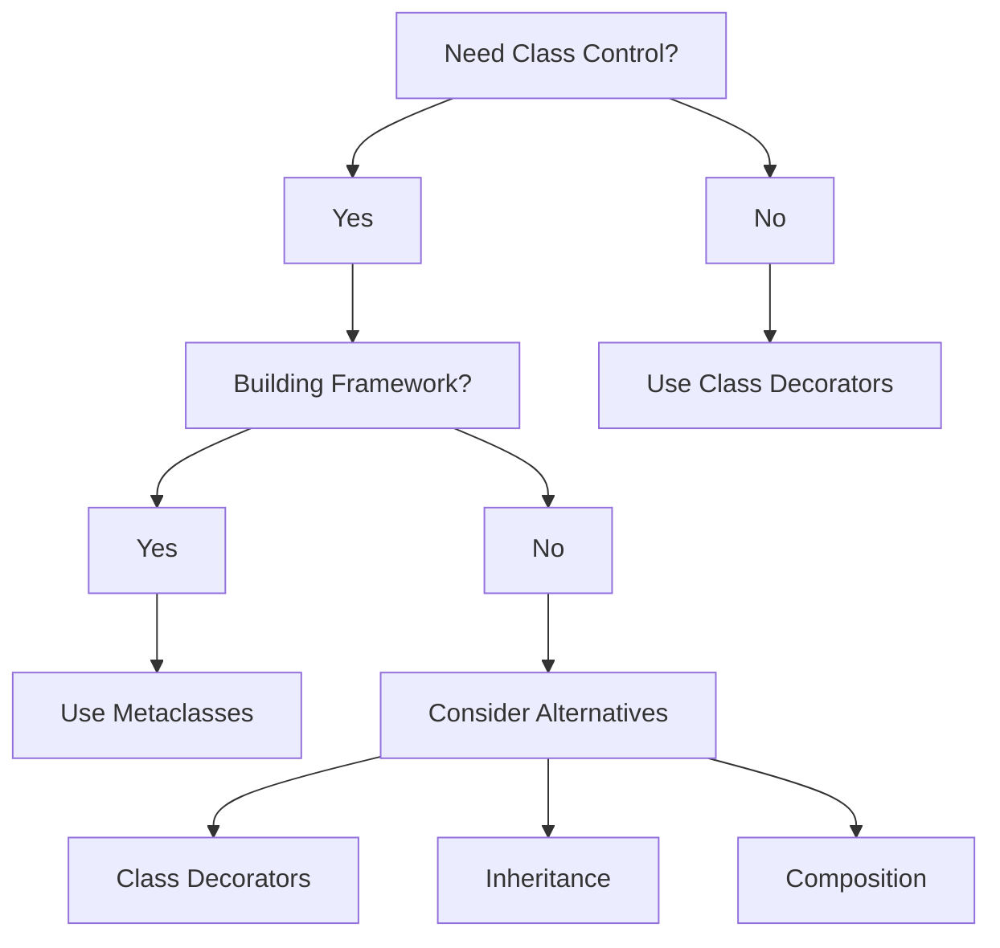
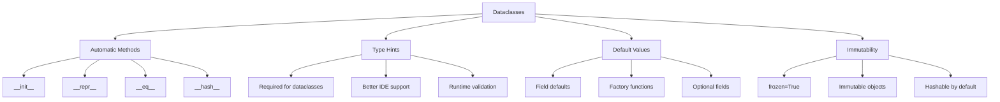
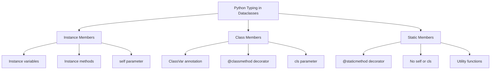
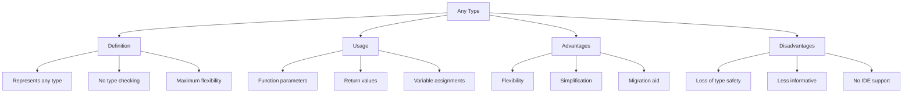
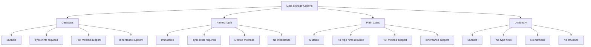

# [Lesson 14: Modern Python - Metaclasses & Dataclasses](https://colab.research.google.com/drive/1fTvN2tSLS4xHzTuzBO1JMpL5yyU0x3vS?usp=sharing)

## Table of Contents
1. [Introduction to Metaclasses](#introduction-to-metaclasses)
2. [What Problem Do Metaclasses Solve?](#what-problem-do-metaclasses-solve)
3. [How Metaclasses Work](#how-metaclasses-work)
4. [Real-World Metaclass Examples](#real-world-metaclass-examples)
5. [Metaclass vs Class Decorator](#metaclass-vs-class-decorator)
6. [Should You Use Metaclasses?](#should-you-use-metaclasses)
7. [Introduction to Dataclasses](#introduction-to-dataclasses)
8. [What is a Dataclass?](#what-is-a-dataclass)
9. [Why Do We Need Dataclasses?](#why-do-we-need-dataclasses)
10. [Key Benefits of Dataclasses](#key-benefits-of-dataclasses)
11. [Dataclass Features](#dataclass-features)
12. [Python Typing & Dataclasses](#python-typing--dataclasses)
13. [Instance, Class, and Static Members](#instance-class-and-static-members)
14. [The Any Type](#the-any-type)
15. [Advanced Dataclass Features](#advanced-dataclass-features)
16. [Comparison: Dataclass vs Alternatives](#comparison-dataclass-vs-alternatives)
17. [Best Practices](#best-practices)
18. [Key Concepts Summary](#key-concepts-summary)
19. [Useful Links](#useful-links)

---

## Introduction to Metaclasses

Metaclasses are one of Python's most advanced features, often called "classes of classes." They define how classes themselves behave, just like classes define how instances behave.

### Metaclasses Overview



**Diagram Explanation**: This diagram shows the Python object hierarchy, illustrating how metaclasses control class creation, classes control instance creation, and instances are the actual runtime objects.

### Key Concepts

- **Classes are instances of metaclasses** (just like objects are instances of classes)
- By default, most classes use `type` as their metaclass
- Metaclasses allow you to control class creation and behavior
- They are used in advanced frameworks like Django, SQLAlchemy, and others

### Basic Metaclass Example

```python
# Default behavior - using type metaclass
class Dog:
    pass

# This is equivalent to:
Dog = type("Dog", (), {})

# Custom metaclass
class MyMeta(type):
    def __new__(cls, name, bases, attrs):
        print(f"MyMeta: Creating class: {name}")
        return super().__new__(cls, name, bases, attrs)

# Using the custom metaclass
class Cat(metaclass=MyMeta):
    pass
# Output: MyMeta: Creating class: Cat
```

## What Problem Do Metaclasses Solve?

Metaclasses provide powerful capabilities for controlling class creation and behavior. They solve several important problems in advanced Python programming.

### Problems Metaclasses Solve



**Diagram Explanation**: This diagram shows the various problems that metaclasses can solve, including class creation control, rule enforcement, feature addition, and design prevention.

### Example Use Cases

- **ORMs (Object-Relational Mappers)**: Like Django models
- **Automatic registration**: Register classes in a registry
- **Singleton patterns**: Ensure only one instance exists
- **API validation**: Validate class structure and methods
- **Framework development**: Create powerful, flexible frameworks

### Real-World Example: Enforce Class Rules

```python
class EnforceHelloMeta(type):
    def __new__(cls, name, bases, attrs):
        # Check if the class defines 'say_hello'
        if "say_hello" not in attrs:
            raise TypeError(f"{name} must define 'say_hello()'!")
        
        # Check if class name starts with 'A'
        if not name.startswith("A"):
            raise ValueError("Class name must start with 'A'")
        
        return super().__new__(cls, name, bases, attrs)

# This works - has say_hello method and starts with 'A'
class Animal(metaclass=EnforceHelloMeta):
    def say_hello(self):
        pass

class Anaconda(Animal):
    def say_hello(self):
        print("Hisss!")

# This would fail - missing say_hello method
# class Animal(metaclass=EnforceHelloMeta):
#     pass  # ❌ Error: Must define 'say_hello'!

# This would fail - doesn't start with 'A'
# class Dog(Animal):  # ❌ Error: Must start with 'A'
#     def say_hello(self):
#         print("Woof!")

# Test the working example
anaconda = Anaconda()
anaconda.say_hello()  # Output: Hisss!
```

## How Metaclasses Work

Understanding how metaclasses work is crucial for using them effectively. Let's break down the process step by step.

### Metaclass Creation Process



**Diagram Explanation**: This sequence diagram shows the step-by-step process of how metaclasses work, from definition to instance creation.

### Step-by-Step Process

1. **Default Behavior (`type` metaclass)**:
   ```python
   class Dog:
       pass
   
   # Python silently uses type to create it:
   Dog = type("Dog", (), {})  # Same as `class Dog: pass`
   ```

2. **Custom Metaclass**:
   ```python
   class MyMeta(type):
       def __new__(cls, name, bases, attrs):
           # Runs when a class is created
           print(f"MyMeta: Creating class: {name}")
           return super().__new__(cls, name, bases, attrs)
   ```

3. **Using a Metaclass**:
   ```python
   class Cat(metaclass=MyMeta):
       pass
   # Output: MyMeta: Creating class: Cat
   ```

### Metaclass Methods

| Method | When Called | Purpose |
|--------|-------------|---------|
| `__new__` | During class creation | Create and return the class |
| `__init__` | After class creation | Initialize the class |
| `__call__` | When creating instances | Control instance creation |

### Example: Singleton Metaclass

```python
class SingletonMeta(type):
    _instances = {}
    
    def __call__(cls, *args, **kwargs):
        if cls not in cls._instances:
            cls._instances[cls] = super().__call__(*args, **kwargs)
        return cls._instances[cls]

class Database(metaclass=SingletonMeta):
    def __init__(self):
        self.connection = "Database connected"
    
    def query(self, sql):
        return f"Executing: {sql}"

# Test singleton behavior
db1 = Database()
db2 = Database()
print(db1 is db2)  # Output: True (same instance!)
print(db1.connection)  # Output: Database connected
```

## Real-World Metaclass Examples

Let's explore practical examples of metaclasses in real-world scenarios.

### Example 1: Automatic Registration

```python
class RegistryMeta(type):
    registry = {}
    
    def __new__(cls, name, bases, attrs):
        new_class = super().__new__(cls, name, bases, attrs)
        if name != 'BasePlugin':
            cls.registry[name] = new_class
        return new_class

class BasePlugin(metaclass=RegistryMeta):
    pass

class EmailPlugin(BasePlugin):
    def send_email(self, message):
        return f"Email sent: {message}"

class SMSPlugin(BasePlugin):
    def send_sms(self, message):
        return f"SMS sent: {message}"

# All plugins are automatically registered
print(RegistryMeta.registry)
# Output: {'EmailPlugin': <class '__main__.EmailPlugin'>, 'SMSPlugin': <class '__main__.SMSPlugin'>}
```

### Example 2: API Validation

```python
class APIValidationMeta(type):
    def __new__(cls, name, bases, attrs):
        # Ensure all API classes have required methods
        required_methods = ['validate', 'process']
        for method in required_methods:
            if method not in attrs:
                raise TypeError(f"{name} must implement {method} method")
        
        return super().__new__(cls, name, bases, attrs)

class UserAPI(metaclass=APIValidationMeta):
    def validate(self, data):
        return "valid" in data
    
    def process(self, data):
        return f"Processed: {data}"

# This would fail - missing required methods
# class BadAPI(metaclass=APIValidationMeta):
#     pass  # ❌ Error: Must implement validate and process methods
```

## Metaclass vs Class Decorator

Understanding when to use metaclasses versus class decorators is important for making the right design choices.

### Comparison Overview



**Diagram Explanation**: This diagram compares metaclasses and class decorators, showing their different use cases and complexity levels.

### Feature Comparison

| Feature | Metaclass | Class Decorator |
|---------|-----------|-----------------|
| **When it runs** | Class creation | After class creation |
| **Use case** | Deep class control | Simpler modifications |
| **Example** | Enforce methods | Add logging |
| **Complexity** | High | Low |
| **Debugging** | Hard | Easy |

### Example: Class Decorator Alternative

```python
# Using class decorator instead of metaclass
def enforce_hello(cls):
    if not hasattr(cls, 'say_hello'):
        raise TypeError(f"{cls.__name__} must define 'say_hello()'!")
    return cls

@enforce_hello
class Dog:
    def say_hello(self):
        print("Woof!")

# This would fail
# @enforce_hello
# class Cat:
#     pass  # ❌ Error: Must define 'say_hello()'!
```

### When to Use Each

**Use Metaclasses when:**
- You need deep control over class creation
- Building frameworks or libraries
- Need to modify class structure fundamentally
- Working with inheritance hierarchies

**Use Class Decorators when:**
- Simple modifications are sufficient
- Adding functionality to existing classes
- Working with individual classes
- Need easier debugging and maintenance

## Should You Use Metaclasses?

Metaclasses are powerful but should be used judiciously. Let's explore when to use them and their trade-offs.

### Decision Matrix



**Diagram Explanation**: This decision tree helps determine when to use metaclasses versus other alternatives.

### Pros and Cons

| Pros | Cons |
|------|------|
| Extremely powerful | Hard to debug |
| Great for APIs | Overkill for most cases |
| Used in big libraries | Can make code confusing |
| Enables advanced patterns | Steep learning curve |

### When to Use Metaclasses

**✅ YES - Use metaclasses for:**
- Advanced frameworks (Django, SQLAlchemy)
- ORM implementations
- API validation systems
- Plugin architectures
- Singleton enforcement
- Automatic method generation

**❌ NO - Don't use metaclasses for:**
- Everyday application code
- Simple class modifications
- When class decorators suffice
- One-off solutions
- Learning projects

### Final Verdict

- **Metaclasses = "Class factories"**
- **Use them sparingly** (only when absolutely needed)
- **Most developers never write one**—but understanding them helps debug big frameworks
- **Prefer class decorators** if you don't need metaclass power

## Introduction to Dataclasses

Dataclasses are a powerful Python feature introduced in Python 3.7 (via PEP 557) that automatically generate common boilerplate code for classes. They're designed to simplify class creation when the class primarily stores data.

### Dataclasses Overview



**Diagram Explanation**: This diagram shows the key features of dataclasses, including automatic method generation, type hints, default values, and immutability options.

### What is a Dataclass?

A `dataclass` in Python is a decorator that simplifies the creation of classes used primarily for storing data. It automatically adds special methods to the class:

- **`__init__`**: Constructor method to initialize attributes
- **`__repr__`**: Human-readable string representation
- **`__eq__`**: Equality comparison based on attributes
- **`__hash__`**: Makes instances hashable (optional)

### Before vs After Dataclasses

**Before dataclasses (manual implementation):**
```python
class Person:
    def __init__(self, name, age):
        self.name = name
        self.age = age

    def __repr__(self):
        return f"Person(name={self.name}, age={self.age})"

    def __eq__(self, other):
        if isinstance(other, Person):
            return self.name == other.name and self.age == other.age
        return False
```

**With dataclasses (automatic generation):**
```python
from dataclasses import dataclass

@dataclass
class Person:
    name: str
    age: int
```

✅ **Same functionality in 3 lines instead of 12!**

## What is a Dataclass?

Let's dive deeper into what dataclasses are and how they work.

### Core Concept

Dataclasses are classes decorated with `@dataclass` that automatically generate common special methods. They're perfect for classes that primarily store data with minimal behavior.

### Basic Example

```python
from dataclasses import dataclass

@dataclass
class Point:
    x: float
    y: float

# Usage
point = Point(3.0, 4.0)
print(point)  # Output: Point(x=3.0, y=4.0)
print(point.x)  # Output: 3.0
print(point.y)  # Output: 4.0
```

### Generated Methods

```python
from dataclasses import dataclass

@dataclass
class Person:
    name: str
    age: int

# All these methods are automatically generated:
person1 = Person("Alice", 30)
person2 = Person("Bob", 25)
person3 = Person("Alice", 30)

print(person1)  # Output: Person(name='Alice', age=30) - uses __repr__
print(person1 == person2)  # Output: False - uses __eq__
print(person1 == person3)  # Output: True - uses __eq__
```

## Why Do We Need Dataclasses?

Understanding the problems dataclasses solve helps us appreciate their value.

### Problem: Boilerplate Code

Traditional Python classes require manual implementation of:
- `__init__` (initialization)
- `__repr__` (string representation)
- `__eq__` (equality comparison)
- `__hash__` (hashing)
- And often ordering methods, etc.

**Manual implementation is:**
- Time-consuming
- Error-prone
- Hard to maintain
- Repetitive

### Solution: `@dataclass`

Dataclasses automatically generate all these methods while keeping:
- ✔ **Type hints support**
- ✔ **Clean syntax**
- ✔ **Customizability when needed**
- ✔ **Consistent behavior**

### Example: The Boilerplate Problem

```python
# Without dataclass - lots of boilerplate
class User:
    def __init__(self, username, email, is_active=True):
        self.username = username
        self.email = email
        self.is_active = is_active
    
    def __repr__(self):
        return f"User(username='{self.username}', email='{self.email}', is_active={self.is_active})"
    
    def __eq__(self, other):
        if not isinstance(other, User):
            return False
        return (self.username == other.username and 
                self.email == other.email and 
                self.is_active == other.is_active)
    
    def __hash__(self):
        return hash((self.username, self.email, self.is_active))

# With dataclass - clean and simple
from dataclasses import dataclass

@dataclass
class User:
    username: str
    email: str
    is_active: bool = True
```

## Key Benefits of Dataclasses

Dataclasses provide several key benefits that make them valuable for data-oriented classes.

### 1. Automatic Method Generation

| Method | What It Does | Automatically Generated? |
|--------|--------------|-------------------------|
| `__init__` | Initializes attributes | ✅ Yes |
| `__repr__` | String representation | ✅ Yes |
| `__eq__` | Compares instances | ✅ Yes |
| `__hash__` | Makes objects hashable | Optional (unsafe_hash=True) |

### 2. Type Hints Integration

Dataclasses **require type hints**, improving code clarity and enabling better IDE support:

```python
@dataclass
class Point:
    x: float  # Type hints are mandatory
    y: float

# IDE can provide better autocomplete and error checking
point = Point(3.0, 4.0)
# IDE knows point.x is a float
```

### 3. Default Values

```python
@dataclass
class User:
    username: str
    email: str
    is_active: bool = True  # Default value
    created_at: str = "2024-01-01"  # Another default

# Usage
user1 = User("alice", "alice@example.com")  # Uses defaults
user2 = User("bob", "bob@example.com", False)  # Override default
```

### 4. Immutability (frozen=True)

```python
@dataclass(frozen=True)
class Config:
    api_key: str
    base_url: str

config = Config("secret-key", "https://api.example.com")
# config.api_key = "new-key"  # ❌ Error: frozen instance
```

### 5. Post-Initialization Processing

```python
@dataclass
class Person:
    name: str
    age: int

    def __post_init__(self):
        self.adult = self.age >= 18
        self.display_name = f"{self.name} ({self.age})"

person = Person("Alice", 25)
print(person.adult)  # Output: True
print(person.display_name)  # Output: Alice (25)
```

## Dataclass Features

Let's explore the various features and options available in dataclasses.

### Field Customization

```python
from dataclasses import dataclass, field

@dataclass
class User:
    username: str
    email: str
    tags: list = field(default_factory=list)  # Mutable default
    is_active: bool = True
    _id: int = field(init=False)  # Not in __init__
    
    def __post_init__(self):
        self._id = hash(self.username)

user = User("alice", "alice@example.com")
print(user.tags)  # Output: []
print(user._id)  # Output: hash value
```

### Comparison Options

```python
from dataclasses import dataclass

@dataclass(order=True)  # Generate comparison methods
class Person:
    name: str
    age: int

person1 = Person("Alice", 30)
person2 = Person("Bob", 25)

print(person1 > person2)  # Output: True (compares by age)
print(person1 < person2)  # Output: False
```

### Hash Options

```python
from dataclasses import dataclass

@dataclass(unsafe_hash=True)  # Generate __hash__ method
class Point:
    x: float
    y: float

point = Point(3.0, 4.0)
print(hash(point))  # Output: hash value
```

### Complete Example

```python
from dataclasses import dataclass, field
from typing import List, Optional

@dataclass(order=True, unsafe_hash=True)
class Student:
    name: str
    age: int
    grades: List[float] = field(default_factory=list)
    student_id: Optional[str] = None
    
    def __post_init__(self):
        if self.student_id is None:
            self.student_id = f"STU{hash(self.name) % 10000:04d}"
    
    def add_grade(self, grade: float):
        self.grades.append(grade)
    
    def get_average(self) -> float:
        return sum(self.grades) / len(self.grades) if self.grades else 0.0

# Usage
student1 = Student("Alice", 20)
student2 = Student("Bob", 19)

student1.add_grade(85.5)
student1.add_grade(92.0)
student1.add_grade(78.5)

print(student1)  # Output: Student(name='Alice', age=20, grades=[85.5, 92.0, 78.5], student_id='STU1234')
print(student1.get_average())  # Output: 85.33333333333333
print(student1 > student2)  # Output: True (compares by age)
```

## Python Typing & Dataclasses

This section shows how to properly type instance variables/methods, class variables/methods, and static variables/methods using Python's `dataclasses` and `typing` modules.

### Typing Overview



**Diagram Explanation**: This diagram shows the different types of members in dataclasses and how to properly type them using Python's typing system.

### Key Points Explained

#### Instance Members
- **Variables**: Defined directly in class with type hints (handled by `@dataclass`)
- **Methods**: First parameter is `self`, can access both instance and class data
- **Default values**: Use `field()` for mutable defaults to avoid shared state issues

#### Class Members
- **Variables**: Annotated with `ClassVar` to indicate they belong to the class
- **Final variables**: Use `ClassVar[Final]` for constants that shouldn't change
- **Methods**: Decorated with `@classmethod`, first parameter is `cls`

#### Static Members
- **Variables**: In dataclasses, these become instance variables with defaults
- **Methods**: Decorated with `@staticmethod`, no access to `self` or `cls`

## Instance, Class, and Static Members

Let's explore how to properly implement and type different types of members in dataclasses.

### Instance Variables and Methods

Instance variables are attributes that are unique to each instance of a class. Instance methods are functions that belong to an instance of a class.

#### Instance Variables
- **Definition**: These variables are specific to each instance (object) of the class
- **Scope**: They are created and assigned when an object is instantiated, and they hold data specific to that object
- **Access**: Accessed through an instance of the class using `self`

#### Instance Methods
- **Definition**: These are the regular methods in a class that operate on instance variables
- **Scope**: They work on a specific instance (object) of the class and can modify or retrieve instance variables using `self`
- **Access**: Accessed through an instance of the class

```python
from dataclasses import dataclass
from typing import Optional

@dataclass
class Person:
    """A person with a name and age."""
    name: str
    age: int
    occupation: Optional[str] = None

    def greet(self) -> None:
        """Print a greeting message."""
        print(f"Hello, my name is {self.name} and I am {self.age} years old.")

# Create an instance of Person
person = Person("John Doe", 30, "Software Engineer")
print(person)  # Output: Person(name='John Doe', age=30, occupation='Software Engineer')
person.greet()  # Output: Hello, my name is John Doe and I am 30 years old.
```

### Class Variables and Methods

Class variables are attributes that are shared by all instances of a class. Class methods are functions that belong to a class.

#### Class Variables
- **Definition**: These variables are shared by all instances of the class
- **Scope**: They belong to the class itself, not to any particular instance
- **Access**: Accessed using the class name or via an instance, but modifying it via instances will change the variable for that specific instance, not globally

#### Class Methods
- **Definition**: These methods work on the class itself rather than on a specific instance. They can modify or access class variables
- **Scope**: Defined using the `@classmethod` decorator. They take `cls` as the first argument, representing the class
- **Access**: Accessed using the class name or an instance, but typically meant to operate at the class level

```python
from dataclasses import dataclass, field
from typing import ClassVar, Final

@dataclass
class Person:
    """A person with a name and age."""
    name: str
    age: int
    occupation: str = "Unknown"
    species: ClassVar[str] = "Homo sapiens"

    # Final class variable (shouldn't be modified)
    MAX_AGE: ClassVar[Final[int]] = 150

    @classmethod
    def get_species(cls) -> str:
        """Return the species of the person."""
        return cls.species

    @classmethod
    def create_baby(cls, name: str) -> 'Person':
        """Create a baby person."""
        return cls(name, 0, "Baby")

# Create instances of Person
john = Person("John Doe", 30, "Software Engineer")
alex = Person("Alex", 25, "Accountant")

print(john.get_species())  # Output: Homo sapiens
print(alex.get_species())  # Output: Homo sapiens

# Change class variable
Person.species = "New Species"
print(john.get_species())  # Output: New Species
print(alex.get_species())  # Output: New Species

# Use class method
baby = Person.create_baby("Little John")
print(baby)  # Output: Person(name='Little John', age=0, occupation='Baby')
```

### Static Variables and Methods

Static variables are attributes that are shared by all instances of a class, but are not instance-specific. Static methods are functions that belong to a class, but do not have access to the class or instance.

#### Static Variables
- **Definition**: Static variables are variables that don't depend on the instance or class. In Python, we don't typically use static variables, but they can be simulated using class variables or just constants
- **Scope**: They are often used as constants or utility values that don't change. They can be accessed without an instance or class

#### Static Methods
- **Definition**: Static methods are utility methods that don't need to access or modify instance or class-level data
- **Scope**: Defined using the `@staticmethod` decorator. They do not take `self` or `cls` as parameters and are independent of both instance and class state
- **Access**: Accessed directly through the class or an instance, but typically don't interact with instance or class variables

```python
from dataclasses import dataclass
from typing import Optional, Final

@dataclass
class Person:
    """A person with a name and age."""
    name: str
    age: int
    occupation: Optional[str] = None

    # Static variable (class-level constant)
    VERSION: Final[str] = '1.0.0'

    @staticmethod
    def get_version() -> str:
        """Get the Person class version"""
        return Person.VERSION

    @staticmethod
    def is_adult(age: int) -> bool:
        """Check if age represents an adult"""
        return age >= 18

    @staticmethod
    def calculate_birth_year(age: int, current_year: int = 2024) -> int:
        """Calculate birth year from age"""
        return current_year - age

# Create instances of Person
person1 = Person("John Doe", 30, "Software Engineer")
person2 = Person("Jane Doe", 25, "Doctor")

# Access static method through class
print(Person.get_version())  # Output: 1.0.0
print(Person.is_adult(25))  # Output: True
print(Person.calculate_birth_year(30))  # Output: 1994

# Access static method through instance
print(person1.get_version())  # Output: 1.0.0
print(person1.is_adult(16))  # Output: False
```

### Summary of Differences

| Feature | Instance | Class | Static |
|---------|----------|-------|--------|
| **Variables** | Belongs to a specific instance (object) | Shared by all instances of the class | Doesn't depend on instance or class |
| **Methods** | Operates on instance variables (via self) | Operates on class variables (via cls) | Does not operate on instance or class data |
| **Access** | Accessed through an instance (obj.method()) | Accessed through class or instance (cls.method()) | Accessed via class or instance (cls.method() or obj.method()) |
| **Typical Use Case** | Data specific to an object (e.g., name, age) | Data shared by all instances (e.g., company name) | Utility functions or constants that don't change state |
| **Decorator** | None (normal method) | @classmethod | @staticmethod |

## The Any Type

The `Any` type in Python's `typing` module represents any type, including built-in types, custom classes, and other types defined in the `typing` module.

### Any Type Overview



**Diagram Explanation**: This diagram shows the Any type's characteristics, usage patterns, and trade-offs between flexibility and type safety.

### Usage and Examples

```python
from typing import Any
import random

def print_value(value: Any) -> None:
    """Print any type of value"""
    print(f"print_value = {type(value)} : {value}")

print_value(123)  # Output: print_value = <class 'int'> : 123
print_value("hello")  # Output: print_value = <class 'str'> : hello
print_value([1, 2, 3])  # Output: print_value = <class 'list'> : [1, 2, 3]

def get_value() -> Any:
    """Return a random value of any type"""
    data_list: list = [1, "name", 2.0, True, {"key": "value"}]
    random_index: int = random.randint(0, len(data_list) - 1)
    return data_list[random_index]

value = get_value()
print(f"get_value = {type(value)} : {value}")
```

### When to Use Any

**✅ Use `Any` when:**
- Migrating from untyped code
- Working with dynamic content
- Interfacing with external libraries
- Prototyping and experimentation

**❌ Avoid `Any` when:**
- You can specify a more precise type
- Type safety is important
- Working in a team environment
- Building production systems

### Best Practices

1. **Use `Any` sparingly** - prefer more specific types when possible
2. **Document expected types** - add comments explaining what types are expected
3. **Test thoroughly** - since type checking is disabled, ensure runtime behavior is correct
4. **Consider alternatives** - use `Union` types or `TypeVar` for more specific cases

## Advanced Dataclass Features

Let's explore some advanced features and techniques for working with dataclasses.

### Field Customization with `field()`

```python
from dataclasses import dataclass, field
from typing import List, Optional

@dataclass
class User:
    username: str
    email: str
    tags: List[str] = field(default_factory=list)  # Mutable default
    is_active: bool = True
    _id: int = field(init=False)  # Not in __init__
    password_hash: Optional[str] = field(default=None, repr=False)  # Hidden from repr
    
    def __post_init__(self):
        self._id = hash(self.username)

user = User("alice", "alice@example.com")
print(user)  # Output: User(username='alice', email='alice@example.com', tags=[], is_active=True, _id=123456789)
```

### Inheritance with Dataclasses

```python
from dataclasses import dataclass

@dataclass
class Animal:
    name: str
    age: int

@dataclass
class Dog(Animal):
    breed: str
    is_trained: bool = False

dog = Dog("Buddy", 3, "Golden Retriever", True)
print(dog)  # Output: Dog(name='Buddy', age=3, breed='Golden Retriever', is_trained=True)
```

### Dataclass with Properties

```python
from dataclasses import dataclass

@dataclass
class Rectangle:
    width: float
    height: float
    
    @property
    def area(self) -> float:
        return self.width * self.height
    
    @property
    def perimeter(self) -> float:
        return 2 * (self.width + self.height)

rect = Rectangle(5.0, 3.0)
print(f"Area: {rect.area}")  # Output: Area: 15.0
print(f"Perimeter: {rect.perimeter}")  # Output: Perimeter: 16.0
```

## Comparison: Dataclass vs Alternatives

Understanding when to use dataclasses versus other alternatives helps make the right design choices.

### Comparison Overview



**Diagram Explanation**: This diagram compares different data storage options in Python, showing their key characteristics and trade-offs.

### Feature Comparison Table

| Feature | Dataclass | NamedTuple | Plain Class | Dictionary |
|---------|-----------|------------|-------------|------------|
| **Mutable** | ✅ Yes | ❌ No | ✅ Yes | ✅ Yes |
| **Default Values** | ✅ Yes | ✅ Yes | ✅ Yes | ✅ Yes |
| **Methods** | ✅ Full support | ❌ Limited | ✅ Full support | ❌ No |
| **Inheritance** | ✅ Yes | ❌ No | ✅ Yes | ❌ No |
| **Type Hints** | ✅ Required | ✅ Required | ❌ Optional | ❌ No |
| **Memory Usage** | Higher | Lowest | Highest | Medium |
| **Performance** | Good | Best | Good | Good |

### Example: NamedTuple vs Dataclass

```python
from typing import NamedTuple
from dataclasses import dataclass

# NamedTuple (immutable)
class PointNT(NamedTuple):
    x: float
    y: float

# Dataclass (mutable)
@dataclass
class PointDC:
    x: float
    y: float

# Usage
pnt = PointNT(1, 2)
pdc = PointDC(1, 2)

print(pdc)  # Output: PointDC(x=1, y=2)
pdc.x = 5  # ✅ Mutable
print(pdc)  # Output: PointDC(x=5, y=2)

# pnt.x = 3  # ❌ Immutable - would raise error
```

## Best Practices

Following best practices ensures effective use of metaclasses and dataclasses.

### Metaclass Best Practices

1. **Use sparingly** - Only when absolutely necessary
2. **Document thoroughly** - Explain why metaclasses are needed
3. **Keep simple** - Avoid complex metaclass hierarchies
4. **Test extensively** - Metaclasses can be hard to debug
5. **Consider alternatives** - Class decorators might be sufficient

### Dataclass Best Practices

1. **Use type hints** - They're required and improve code quality
2. **Use `field()` for mutable defaults** - Avoid shared state issues
3. **Consider `frozen=True`** - For immutable data structures
4. **Use `__post_init__`** - For validation and computed fields
5. **Keep methods simple** - Dataclasses are for data, not complex behavior

### When to Use Each

**Use Metaclasses for:**
- Framework development
- ORM implementations
- Plugin architectures
- Advanced class manipulation

**Use Dataclasses for:**
- Data Transfer Objects (DTOs)
- Configuration objects
- Simple domain models
- API request/response models

**Avoid Both for:**
- Complex business logic
- Performance-critical code
- Simple data structures
- One-off solutions

## Key Concepts Summary

This comprehensive lesson covered modern Python features for advanced class creation and data management:

### Metaclasses Summary

- **Definition**: "Classes of classes" that control class creation
- **Use Cases**: Frameworks, ORMs, plugin systems, validation
- **Key Methods**: `__new__`, `__init__`, `__call__`
- **Best Practice**: Use sparingly, prefer class decorators when possible

### Dataclasses Summary

- **Definition**: Decorator that automatically generates common methods
- **Generated Methods**: `__init__`, `__repr__`, `__eq__`, `__hash__`
- **Key Features**: Type hints, default values, immutability, inheritance
- **Best Practice**: Use for data-oriented classes with minimal behavior

### Typing Integration

- **Instance Members**: Direct type hints, `self` parameter
- **Class Members**: `ClassVar` annotation, `@classmethod` decorator
- **Static Members**: `@staticmethod` decorator, no `self` or `cls`
- **Any Type**: Use sparingly, prefer specific types

### Decision Matrix

| Need | Use |
|------|-----|
| Simple data storage | Dataclass |
| Immutable data | NamedTuple or frozen dataclass |
| Complex class behavior | Plain class |
| Framework development | Metaclass |
| Plugin system | Metaclass |
| API models | Dataclass |

## Useful Links

### Documentation and References

- [Python Official Documentation - Dataclasses](https://docs.python.org/3/library/dataclasses.html)
- [Python Official Documentation - Metaclasses](https://docs.python.org/3/reference/datamodel.html#metaclasses)
- [PEP 557 - Data Classes](https://peps.python.org/pep-0557/)
- [Python Typing Documentation](https://docs.python.org/3/library/typing.html)

### Advanced Topics

- [Python Descriptors](https://docs.python.org/3/howto/descriptor.html)
- [Python Abstract Base Classes](https://docs.python.org/3/library/abc.html)
- [Python Type Hints](https://docs.python.org/3/library/typing.html)
- [Python Property Decorators](https://docs.python.org/3/library/functions.html#property)

### Best Practices

- [PEP 8 - Style Guide for Python Code](https://peps.python.org/pep-0008/)
- [PEP 484 - Type Hints](https://peps.python.org/pep-0484/)
- [Python Best Practices](https://docs.python-guide.org/)

---

## Conclusion

This lesson covered two powerful Python features for advanced class creation and data management:

### Metaclasses
- **Powerful but complex** - Use only when necessary
- **Framework development** - Essential for building advanced libraries
- **Class factories** - Control how classes are created and behave

### Dataclasses
- **Simple and effective** - Perfect for data-oriented classes
- **Automatic methods** - Reduces boilerplate code significantly
- **Type safety** - Requires and encourages type hints

### Key Takeaways

1. **Metaclasses are powerful** but should be used sparingly
2. **Dataclasses are practical** for most data storage needs
3. **Type hints improve** code quality and maintainability
4. **Choose the right tool** for the specific use case
5. **Follow best practices** for maintainable code

Remember: **Good Python code is simple, readable, and uses the right tool for the job. Metaclasses and dataclasses are powerful tools, but they should enhance your code, not complicate it.**

---