# [Lesson 16: Asyncio](https://colab.research.google.com/drive/1MtSf6NxfWI14aDA5kLLAOMVqH0NNWN98?usp=sharing)

## Table of Contents
1. [Introduction to Asyncio](#introduction-to-asyncio)
2. [Synchronous vs Asynchronous Programming](#synchronous-vs-asynchronous-programming)
3. [Key Concepts](#key-concepts)
4. [Setting Up Asyncio in Jupyter](#setting-up-asyncio-in-jupyter)
5. [Basic Asyncio Example](#basic-asyncio-example)
6. [Understanding asyncio and await](#understanding-asyncio-and-await)
7. [Awaitable Objects](#awaitable-objects)
8. [Custom Awaitables](#custom-awaitables)
9. [Futures](#futures)
10. [Future States](#future-states)
11. [Event Loop](#event-loop)
12. [How Event Loop Works](#how-event-loop-works)
13. [Best Practices](#best-practices)
14. [Common Asyncio Functions](#common-asyncio-functions)
15. [Real-World Examples](#real-world-examples)
16. [Key Concepts Summary](#key-concepts-summary)
17. [Useful Links](#useful-links)

---

## Introduction to Asyncio

Asyncio is a powerful Python library that enables single-threaded concurrent programming using coroutines, multiplexing I/O access over sockets and other resources. It's designed to handle I/O-bound tasks efficiently by allowing programs to perform multiple operations concurrently without blocking.

### Asyncio Overview

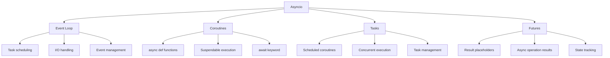

**Diagram Explanation**: This diagram shows the core components of Asyncio, including the event loop, coroutines, tasks, and futures, and how they work together to enable asynchronous programming.

### Key Benefits

- **Concurrency**: Execute multiple I/O operations simultaneously
- **Efficiency**: Better resource utilization for I/O-bound tasks
- **Responsiveness**: Non-blocking operations keep applications responsive
- **Scalability**: Handle thousands of concurrent connections
- **Single-threaded**: Avoids the complexity of multi-threading

### Perfect Use Cases

✅ **Network programming** (HTTP clients, web servers)  
✅ **Database operations** (async database drivers)  
✅ **File I/O operations** (reading/writing files)  
✅ **Web scraping** (multiple concurrent requests)  
✅ **Real-time applications** (chat servers, gaming)  
✅ **API clients** (concurrent API calls)

## Synchronous vs Asynchronous Programming

Understanding the difference between synchronous and asynchronous programming is crucial for mastering Asyncio.

### Coffee Shop Analogy

Imagine you're at a coffee shop ordering coffee and a pastry:

#### Synchronous Approach
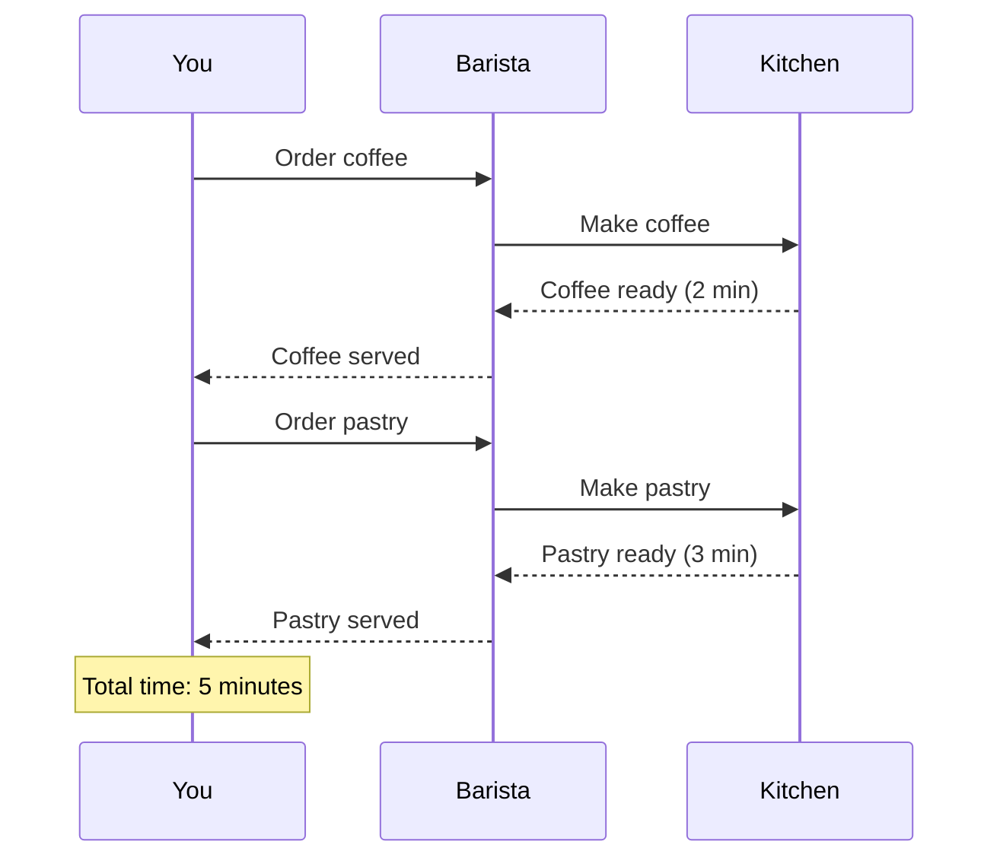

**Diagram Explanation**: This sequence diagram shows the synchronous approach where you wait for each order to complete before placing the next one.

#### Asynchronous Approach
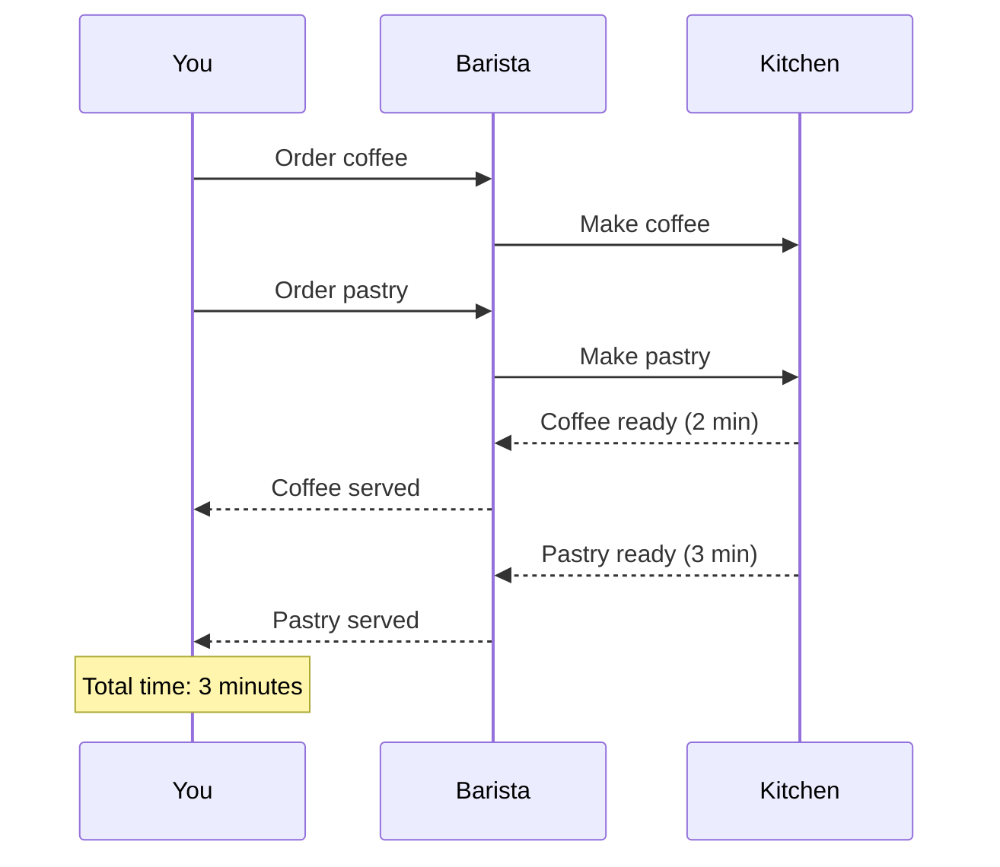

**Diagram Explanation**: This sequence diagram shows the asynchronous approach where you can place both orders and do other things while they're being prepared.

### Code Comparison

```python
import asyncio
import time
import threading

# Synchronous approach
def make_coffee_sync():
    print(f"Making coffee... Thread: {threading.current_thread().name}")
    time.sleep(2)  # Simulate coffee preparation
    print("Coffee is ready!")

def make_pastry_sync():
    print(f"Making pastry... Thread: {threading.current_thread().name}")
    time.sleep(3)  # Simulate pastry preparation
    print("Pastry is ready!")

def order_sync():
    make_coffee_sync()
    make_pastry_sync()

# Asynchronous approach
async def make_coffee_async():
    print(f"Making coffee... Thread: {threading.current_thread().name}")
    await asyncio.sleep(2)  # Non-blocking sleep
    print("Coffee is ready!")

async def make_pastry_async():
    print(f"Making pastry... Thread: {threading.current_thread().name}")
    await asyncio.sleep(3)  # Non-blocking sleep
    print("Pastry is ready!")

async def order_async():
    # Run both tasks concurrently
    tasks = [
        asyncio.create_task(make_coffee_async()),
        asyncio.create_task(make_pastry_async())
    ]
    await asyncio.gather(*tasks)

# Performance comparison
print("Synchronous approach:")
start_time = time.time()
order_sync()
print(f"Total time: {time.time() - start_time} seconds")

print("\nAsynchronous approach:")
start_time = time.time()
asyncio.run(order_async())
print(f"Total time: {time.time() - start_time} seconds")
```

### Key Differences

| Aspect | Synchronous | Asynchronous |
|--------|-------------|--------------|
| **Execution** | Sequential | Concurrent |
| **Blocking** | Blocks on I/O | Non-blocking |
| **Time** | Sum of all operations | Max of concurrent operations |
| **Complexity** | Simple | More complex |
| **Use Case** | CPU-bound tasks | I/O-bound tasks |

## Key Concepts

Asyncio introduces several important concepts that work together to enable asynchronous programming.

### Core Concepts Overview

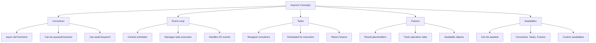

**Diagram Explanation**: This diagram shows the relationships between the core Asyncio concepts and their characteristics.

### 1. Coroutines

**Definition**: Coroutines are special functions defined with `async def` that can be paused and resumed at specific points using the `await` keyword.

```python
async def my_coroutine():
    print("Start")
    await asyncio.sleep(1)  # Pause here
    print("Middle")
    await asyncio.sleep(1)  # Pause here
    print("End")
    return "Completed"

# Coroutines must be awaited
result = await my_coroutine()
```

### 2. Event Loop

**Definition**: The event loop is the central component that manages and executes asynchronous tasks, handling I/O operations and scheduling.

```python
# Get the current event loop
loop = asyncio.get_event_loop()

# Run a coroutine
loop.run_until_complete(my_coroutine())

# Or use asyncio.run() (recommended)
asyncio.run(my_coroutine())
```

### 3. Tasks

**Definition**: Tasks are coroutines that have been scheduled to run on the event loop. They allow coroutines to run concurrently.

```python
async def task1():
    await asyncio.sleep(1)
    print("Task 1 done")

async def task2():
    await asyncio.sleep(2)
    print("Task 2 done")

async def main():
    # Create tasks
    t1 = asyncio.create_task(task1())
    t2 = asyncio.create_task(task2())
    
    # Wait for both to complete
    await asyncio.gather(t1, t2)

asyncio.run(main())
```

### 4. Futures

**Definition**: Futures represent the result of an asynchronous operation that may not have completed yet. They act as placeholders for future results.

```python
async def my_operation():
    await asyncio.sleep(1)
    return "Operation completed"

async def main():
    # Create a task (which returns a future)
    future = asyncio.create_task(my_operation())
    
    # Do other work
    print("Doing other work...")
    
    # Wait for the result
    result = await future
    print(f"Result: {result}")
```

## Setting Up Asyncio in Jupyter

Jupyter notebooks have a unique challenge with Asyncio due to nested event loops. Here's how to set it up properly.

### The Problem

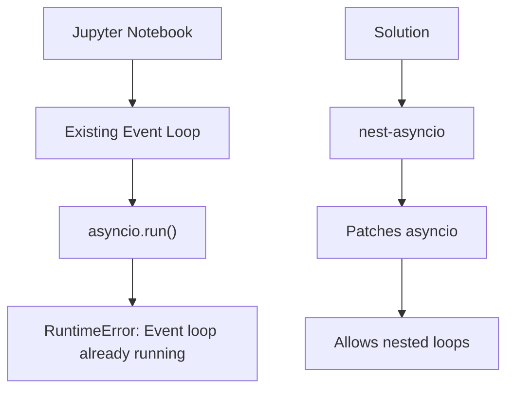

**Diagram Explanation**: This diagram shows the problem with nested event loops in Jupyter and the solution using nest-asyncio.

### Installation and Setup

```python
# Install nest-asyncio
!pip install nest-asyncio

# Apply the patch
import nest_asyncio
nest_asyncio.apply()

print("Successfully enabled Jupyter to handle nested event loops")
```

### Alternative Approaches

```python
# Method 1: Using nest-asyncio (recommended)
import nest_asyncio
nest_asyncio.apply()

async def my_coroutine():
    await asyncio.sleep(1)
    print("Hello from coroutine!")

# Now you can use asyncio.run()
asyncio.run(my_coroutine())

# Method 2: Direct await (without asyncio.run())
await my_coroutine()

# Method 3: Using the event loop directly
loop = asyncio.get_event_loop()
loop.run_until_complete(my_coroutine())
```

## Basic Asyncio Example

Let's create a comprehensive example that demonstrates the power of Asyncio.

### Coffee Shop Example

```python
import asyncio
import time
import threading

# Synchronous functions
def make_coffee_sync():
    print(f"Making coffee... Thread: {threading.current_thread().name}")
    time.sleep(2)
    print("Coffee is ready!")

def make_pastry_sync():
    print(f"Making pastry... Thread: {threading.current_thread().name}")
    time.sleep(3)
    print("Pastry is ready!")

def order_sync():
    make_coffee_sync()
    make_pastry_sync()

# Asynchronous functions
async def make_coffee_async():
    print(f"Making coffee... Thread: {threading.current_thread().name}")
    await asyncio.sleep(2)
    print("Coffee is ready!")

async def make_pastry_async():
    print(f"Making pastry... Thread: {threading.current_thread().name}")
    await asyncio.sleep(3)
    print("Pastry is ready!")

async def order_async():
    # Create tasks for concurrent execution
    tasks = [
        asyncio.create_task(make_coffee_async()),
        asyncio.create_task(make_pastry_async())
    ]
    await asyncio.gather(*tasks)

# Performance comparison
print("=== Synchronous Approach ===")
start_time = time.time()
order_sync()
sync_time = time.time() - start_time
print(f"Total time: {sync_time} seconds")

print("\n=== Asynchronous Approach ===")
start_time = time.time()
asyncio.run(order_async())
async_time = time.time() - start_time
print(f"Total time: {async_time} seconds")

print(f"\nTime saved: {sync_time - async_time} seconds")
print(f"Efficiency improvement: {((sync_time - async_time) / sync_time) * 100:.1f}%")
```

### Execution Flow

```mermaid
gantt
    title Synchronous vs Asynchronous Execution
    dateFormat X
    axisFormat %s
    
    section Synchronous
    Coffee (2s)    :0, 2
    Pastry (3s)    :2, 5
    
    section Asynchronous
    Coffee (2s)    :0, 2
    Pastry (3s)    :0, 3
```

**Diagram Explanation**: This Gantt chart shows the time difference between synchronous and asynchronous execution of the coffee and pastry tasks.

## Understanding asyncio and await

The `asyncio` library and `await` keyword work together to enable asynchronous programming in Python.

### asyncio vs await

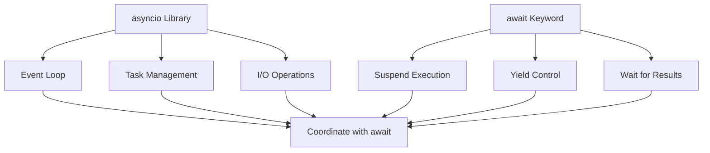

**Diagram Explanation**: This diagram shows how the asyncio library and await keyword work together to enable asynchronous programming.

### Key Differences

| Component | Purpose | Usage |
|-----------|---------|-------|
| **asyncio** | Provides the framework | Library import and setup |
| **await** | Suspends execution | Used inside async functions |

### Basic Structure

```python
import asyncio

# 1. Define async function
async def my_function():
    print("Start")
    await asyncio.sleep(1)  # 2. Use await
    print("End")
    return "Done"

# 3. Run with asyncio.run()
async def main():
    result = await my_function()
    print(f"Result: {result}")

asyncio.run(main())
```

### Advanced Example

```python
import asyncio

async def task1():
    print("Task 1 starting")
    await asyncio.sleep(2)
    print("Task 1 completed")
    return "Task 1 result"

async def task2():
    print("Task 2 starting")
    await asyncio.sleep(1)
    print("Task 2 completed")
    return "Task 2 result"

async def main():
    print("Main starting")
    
    # Create tasks
    t1 = asyncio.create_task(task1())
    t2 = asyncio.create_task(task2())
    
    # Wait for both tasks
    results = await asyncio.gather(t1, t2)
    
    print(f"Results: {results}")
    print("Main completed")

asyncio.run(main())
```

### Implications

- **Efficiency**: Ideal for I/O-bound tasks
- **Single-threaded**: Not suitable for CPU-bound tasks
- **Correct Usage**: Always await coroutines properly
- **Non-blocking**: Allows other tasks to run while waiting

## Awaitable Objects

Awaitable objects are objects that can be used with the `await` keyword in async functions.

### What Makes an Object Awaitable?

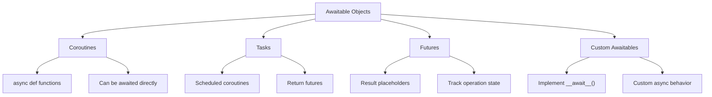

**Diagram Explanation**: This diagram shows the different types of awaitable objects and their characteristics.

### Checking if an Object is Awaitable

```python
import inspect
import asyncio

async def my_coroutine():
    await asyncio.sleep(1)
    return "Hello"

# Check if objects are awaitable
print("Coroutine object:", inspect.isawaitable(my_coroutine()))
print("Task object:", inspect.isawaitable(asyncio.create_task(my_coroutine())))
print("Future object:", inspect.isawaitable(asyncio.Future()))
print("Regular function:", inspect.isawaitable(lambda: "Hello"))
```

### Types of Awaitable Objects

#### 1. Coroutines
```python
async def my_coroutine():
    await asyncio.sleep(1)
    return "Coroutine result"

# Coroutines are awaitable
result = await my_coroutine()
print(result)
```

#### 2. Tasks
```python
async def my_coroutine():
    await asyncio.sleep(1)
    return "Task result"

# Tasks are awaitable
task = asyncio.create_task(my_coroutine())
result = await task
print(result)
```

#### 3. Futures
```python
async def my_coroutine():
    await asyncio.sleep(1)
    return "Future result"

# Futures are awaitable
future = asyncio.create_task(my_coroutine())
result = await future
print(result)
```

## Custom Awaitables

You can create custom awaitable objects by implementing the `__await__()` method.

### Implementing Custom Awaitables

```python
class CustomAwaitable:
    def __await__(self):
        # Delegate to asyncio.sleep
        yield from asyncio.sleep(2).__await__()
        return "Custom Awaitable Done"

async def main():
    result = await CustomAwaitable()
    print(result)

asyncio.run(main())
```

### Advanced Custom Awaitable

```python
class DelayedResult:
    def __init__(self, delay, value):
        self.delay = delay
        self.value = value
    
    def __await__(self):
        yield from asyncio.sleep(self.delay).__await__()
        return self.value

async def main():
    # Create custom awaitables
    delayed1 = DelayedResult(1, "First result")
    delayed2 = DelayedResult(2, "Second result")
    
    # Use them concurrently
    results = await asyncio.gather(delayed1, delayed2)
    print(f"Results: {results}")

asyncio.run(main())
```

### Custom Awaitable with State

```python
class StatefulAwaitable:
    def __init__(self, name):
        self.name = name
        self.state = "pending"
    
    def __await__(self):
        self.state = "running"
        yield from asyncio.sleep(1).__await__()
        self.state = "completed"
        return f"{self.name} completed"

async def main():
    awaitable = StatefulAwaitable("MyTask")
    print(f"Initial state: {awaitable.state}")
    
    result = await awaitable
    print(f"Final state: {awaitable.state}")
    print(f"Result: {result}")

asyncio.run(main())
```

## Futures

Futures are fundamental objects in Asyncio that represent the result of an asynchronous operation that may not have completed yet. They act as placeholders for future results and are closely related to coroutines and tasks.

### What Are Futures?

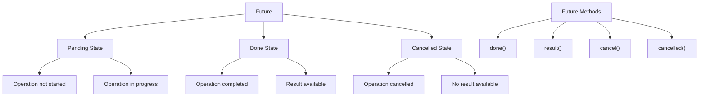

**Diagram Explanation**: This diagram shows the three states of a Future and the key methods available for managing them.

### Key Characteristics of Futures

1. **Asynchronous Result**: A Future is created when an asynchronous operation is initiated, but the result is not immediately available
2. **State Tracking**: Futures track the state of operations (pending, done, cancelled)
3. **Awaitable**: Futures can be used with the `await` keyword
4. **One-Time Use**: A Future can only be resolved once

### Basic Future Example

```python
import asyncio

async def my_coroutine():
    await asyncio.sleep(1)
    print("Task done...")
    return "My Coroutine completed"

async def main():
    # Create a Task (which returns a Future)
    print("Starting Coroutine...")
    future = asyncio.create_task(my_coroutine())
    
    print("Going to Maldives on a 2 day vacation")
    await asyncio.sleep(2)
    print("Come back from vacation")
    
    # Await the Future
    result = await future
    print(f"Future result: {result}")

asyncio.run(main())
```

### Manual Future Creation

```python
import asyncio

async def example_future():
    # Create a Future object manually
    future = asyncio.Future()
    print(f"Initial state: {future.done()}")  # False (Pending)
    
    # Simulate computation
    await asyncio.sleep(2)
    
    # Set the result
    future.set_result("Task Completed")
    print(f"Final state: {future.done()}")  # True (Done)
    print(f"Result: {future.result()}")  # "Task Completed"

asyncio.run(example_future())
```

## Future States

Understanding the different states of a Future is crucial for effective asynchronous programming.

### Future State Diagram

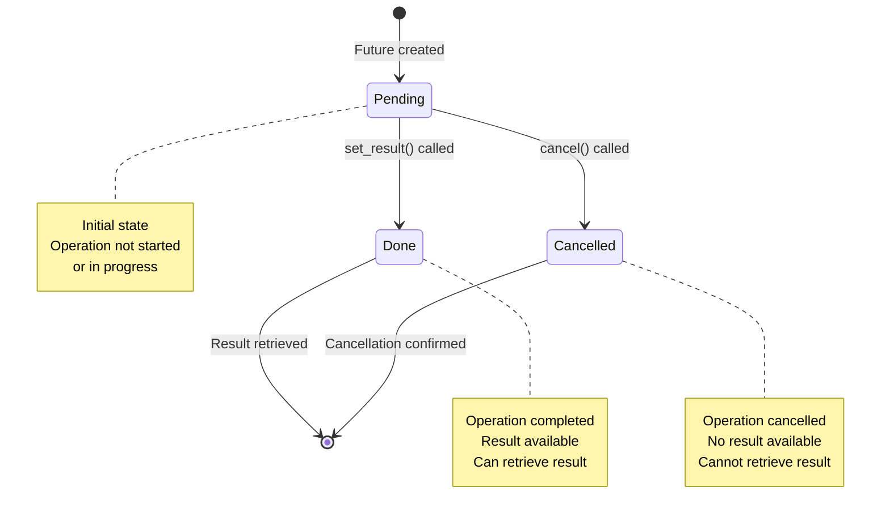

**Diagram Explanation**: This state diagram shows the lifecycle of a Future object and the transitions between different states.

### 1. Pending State

**Definition**: The initial state when the operation has not started or is still in progress.

```python
import asyncio

async def pending_example():
    future = asyncio.Future()
    print(f"Pending: {not future.done()}")
    print(f"Done: {future.done()}")
    print(f"Cancelled: {future.cancelled()}")

asyncio.run(pending_example())
```

### 2. Done State

**Definition**: The operation has completed successfully, and the result is available.

```python
import asyncio

async def done_example():
    future = asyncio.Future()
    
    # Set the result
    future.set_result("Operation completed")
    
    print(f"Done: {future.done()}")
    print(f"Result: {future.result()}")
    print(f"Cancelled: {future.cancelled()}")

asyncio.run(done_example())
```

### 3. Cancelled State

**Definition**: The operation was cancelled before completion.

```python
import asyncio

async def cancelled_example():
    future = asyncio.Future()
    
    # Cancel the future
    future.cancel()
    
    print(f"Cancelled: {future.cancelled()}")
    print(f"Done: {future.done()}")
    
    # Trying to get result from cancelled future raises exception
    try:
        result = future.result()
    except asyncio.CancelledError:
        print("Cannot get result from cancelled future")

asyncio.run(cancelled_example())
```

### Future Methods

```python
import asyncio

async def future_methods_example():
    future = asyncio.Future()
    
    # Check states
    print(f"done(): {future.done()}")
    print(f"cancelled(): {future.cancelled()}")
    
    # Set result
    future.set_result("Success!")
    print(f"After set_result - done(): {future.done()}")
    print(f"result(): {future.result()}")
    
    # Create another future for cancellation
    future2 = asyncio.Future()
    future2.cancel()
    print(f"After cancel - cancelled(): {future2.cancelled()}")

asyncio.run(future_methods_example())
```

## Event Loop

The event loop is the core component of Asyncio that manages and executes asynchronous tasks, handling I/O operations and scheduling.

### What is an Event Loop?

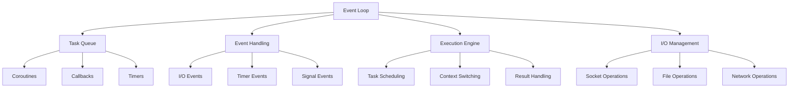

**Diagram Explanation**: This diagram shows the main components of an event loop and how they work together to manage asynchronous operations.

### Event Loop Responsibilities

1. **Task Queue Management**: Maintains a queue of tasks that need to be executed
2. **Event Handling**: Listens for events (I/O operations, timers, signals)
3. **Task Execution**: Executes tasks when they're ready to run
4. **Non-blocking Operations**: Switches between tasks while waiting for I/O

### Basic Event Loop Usage

```python
import asyncio

async def my_coroutine():
    print("Coroutine running")
    await asyncio.sleep(1)
    print("Coroutine completed")
    return "Done"

# Get the current event loop
loop = asyncio.get_event_loop()

# Create a task
task = loop.create_task(my_coroutine())

# Run until complete
loop.run_until_complete(task)
```

### Event Loop Methods

```python
import asyncio

async def event_loop_methods():
    loop = asyncio.get_event_loop()
    
    # Create a task
    task = loop.create_task(my_coroutine())
    
    # Check if running
    print(f"Loop is running: {loop.is_running()}")
    
    # Get current time
    print(f"Current time: {loop.time()}")
    
    # Schedule a callback
    def callback():
        print("Callback executed")
    
    loop.call_soon(callback)
    
    # Schedule a delayed callback
    loop.call_later(1, callback)
    
    return task

# Run the example
asyncio.run(event_loop_methods())
```

## How Event Loop Works

Understanding the internal workings of the event loop helps in writing efficient asynchronous code.

### Event Loop Lifecycle

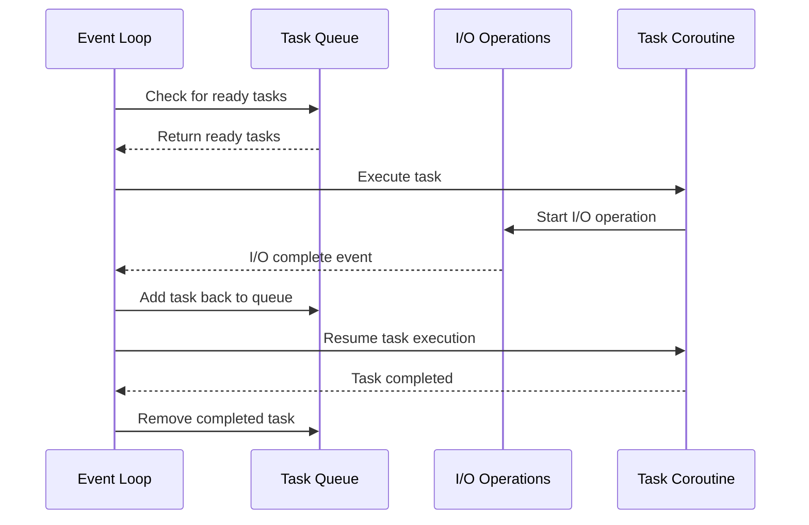

**Diagram Explanation**: This sequence diagram shows how the event loop manages the lifecycle of tasks and I/O operations.

### Event Loop Execution Flow

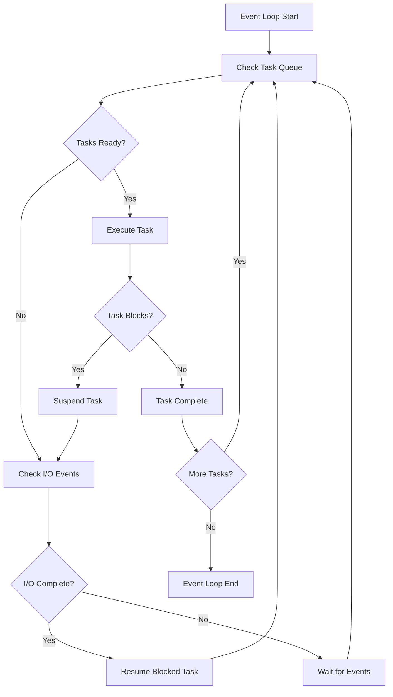

**Diagram Explanation**: This flowchart shows the detailed execution flow of an event loop, including task execution, I/O handling, and task suspension/resumption.

### Event Loop Example

```python
import asyncio
import time

async def task1():
    print("Task 1: Starting")
    await asyncio.sleep(2)
    print("Task 1: Completed")
    return "Task 1 result"

async def task2():
    print("Task 2: Starting")
    await asyncio.sleep(1)
    print("Task 2: Completed")
    return "Task 2 result"

async def main():
    print("Main: Starting")
    
    # Create tasks
    t1 = asyncio.create_task(task1())
    t2 = asyncio.create_task(task2())
    
    print("Main: Tasks created")
    
    # Wait for both tasks
    results = await asyncio.gather(t1, t2)
    
    print(f"Main: Results: {results}")
    print("Main: Completed")

# Run the example
asyncio.run(main())
```

### Event Loop Monitoring

```python
import asyncio

async def monitor_event_loop():
    loop = asyncio.get_event_loop()
    
    print(f"Event loop: {loop}")
    print(f"Is running: {loop.is_running()}")
    print(f"Current time: {loop.time()}")
    
    # Get loop statistics
    if hasattr(loop, '_selector'):
        print(f"Selector: {loop._selector}")
    
    # Monitor task creation
    original_create_task = loop.create_task
    
    def monitored_create_task(coro):
        print(f"Creating task for: {coro}")
        return original_create_task(coro)
    
    loop.create_task = monitored_create_task
    
    # Create a task
    task = loop.create_task(asyncio.sleep(1))
    await task

asyncio.run(monitor_event_loop())
```

## Best Practices

Following best practices ensures efficient and maintainable asynchronous code.

### 1. Use asyncio.run() for Entry Points

```python
# ✅ Good
async def main():
    # Your async code here
    pass

if __name__ == "__main__":
    asyncio.run(main())

# ❌ Avoid
if __name__ == "__main__":
    loop = asyncio.get_event_loop()
    loop.run_until_complete(main())
```

### 2. Always Await Coroutines

```python
# ✅ Good
async def good_example():
    result = await my_coroutine()
    return result

# ❌ Bad
async def bad_example():
    result = my_coroutine()  # Returns coroutine object, not result
    return result
```

### 3. Use asyncio.gather() for Concurrent Operations

```python
# ✅ Good
async def concurrent_example():
    tasks = [
        asyncio.create_task(operation1()),
        asyncio.create_task(operation2()),
        asyncio.create_task(operation3())
    ]
    results = await asyncio.gather(*tasks)
    return results

# ❌ Less efficient
async def sequential_example():
    result1 = await operation1()
    result2 = await operation2()
    result3 = await operation3()
    return [result1, result2, result3]
```

### 4. Handle Exceptions Properly

```python
# ✅ Good
async def exception_handling():
    try:
        result = await risky_operation()
        return result
    except Exception as e:
        print(f"Operation failed: {e}")
        return None

# ✅ Good - with gather
async def gather_with_exceptions():
    tasks = [
        asyncio.create_task(operation1()),
        asyncio.create_task(operation2()),
        asyncio.create_task(operation3())
    ]
    
    results = await asyncio.gather(*tasks, return_exceptions=True)
    
    for i, result in enumerate(results):
        if isinstance(result, Exception):
            print(f"Task {i} failed: {result}")
        else:
            print(f"Task {i} succeeded: {result}")
```

### 5. Use Context Managers for Resources

```python
# ✅ Good
async def resource_management():
    async with aiofiles.open('file.txt', 'r') as f:
        content = await f.read()
    return content

# ✅ Good - with timeout
async def timeout_example():
    try:
        result = await asyncio.wait_for(slow_operation(), timeout=5.0)
        return result
    except asyncio.TimeoutError:
        print("Operation timed out")
        return None
```

## Common Asyncio Functions

Asyncio provides many useful functions for managing asynchronous operations.

### Core Functions

```python
import asyncio

# 1. asyncio.run() - Run async function
async def main():
    print("Hello from async!")

asyncio.run(main())

# 2. asyncio.sleep() - Non-blocking sleep
async def sleep_example():
    print("Before sleep")
    await asyncio.sleep(1)
    print("After sleep")

# 3. asyncio.create_task() - Create task
async def task_example():
    task = asyncio.create_task(sleep_example())
    await task

# 4. asyncio.gather() - Run multiple coroutines
async def gather_example():
    tasks = [
        asyncio.create_task(sleep_example()),
        asyncio.create_task(sleep_example())
    ]
    await asyncio.gather(*tasks)

# 5. asyncio.wait_for() - Add timeout
async def timeout_example():
    try:
        result = await asyncio.wait_for(sleep_example(), timeout=0.5)
    except asyncio.TimeoutError:
        print("Operation timed out")
```

### Advanced Functions

```python
import asyncio

# 1. asyncio.wait() - Wait for tasks with conditions
async def wait_example():
    tasks = [
        asyncio.create_task(asyncio.sleep(1)),
        asyncio.create_task(asyncio.sleep(2)),
        asyncio.create_task(asyncio.sleep(3))
    ]
    
    # Wait for first task to complete
    done, pending = await asyncio.wait(tasks, return_when=asyncio.FIRST_COMPLETED)
    print(f"Completed: {len(done)}, Pending: {len(pending)}")
    
    # Cancel remaining tasks
    for task in pending:
        task.cancel()

# 2. asyncio.shield() - Protect from cancellation
async def shield_example():
    protected_task = asyncio.shield(important_operation())
    try:
        result = await protected_task
    except asyncio.CancelledError:
        print("Task was cancelled but protected")

# 3. asyncio.to_thread() - Run in thread (Python 3.9+)
async def thread_example():
    # Run CPU-bound task in thread
    result = await asyncio.to_thread(cpu_intensive_function)
    return result
```

### Utility Functions

```python
import asyncio

# 1. asyncio.current_task() - Get current task
async def current_task_example():
    task = asyncio.current_task()
    print(f"Current task: {task}")

# 2. asyncio.all_tasks() - Get all tasks
async def all_tasks_example():
    tasks = asyncio.all_tasks()
    print(f"All tasks: {tasks}")

# 3. asyncio.iscoroutine() - Check if object is coroutine
def check_coroutine():
    async def my_coroutine():
        pass
    
    print(f"Is coroutine: {asyncio.iscoroutine(my_coroutine())}")
    print(f"Is coroutine function: {asyncio.iscoroutinefunction(my_coroutine)}")
```

## Real-World Examples

Let's explore practical examples of using Asyncio in real-world scenarios.

### 1. HTTP Client with aiohttp

```python
import asyncio
import aiohttp
import time

async def fetch_url(session, url):
    async with session.get(url) as response:
        return await response.text()

async def http_client_example():
    urls = [
        'https://httpbin.org/delay/1',
        'https://httpbin.org/delay/2',
        'https://httpbin.org/delay/3'
    ]
    
    start_time = time.time()
    
    async with aiohttp.ClientSession() as session:
        tasks = [fetch_url(session, url) for url in urls]
        results = await asyncio.gather(*tasks)
    
    end_time = time.time()
    print(f"Fetched {len(urls)} URLs in {end_time - start_time:.2f} seconds")
    return results

# Run the example
# asyncio.run(http_client_example())
```

### 2. File Processing

```python
import asyncio
import aiofiles
import os

async def process_file(filename):
    async with aiofiles.open(filename, 'r') as f:
        content = await f.read()
        # Process content
        processed = content.upper()
    
    output_filename = f"processed_{filename}"
    async with aiofiles.open(output_filename, 'w') as f:
        await f.write(processed)
    
    return f"Processed {filename}"

async def file_processing_example():
    files = ['file1.txt', 'file2.txt', 'file3.txt']
    
    tasks = [process_file(filename) for filename in files]
    results = await asyncio.gather(*tasks)
    
    for result in results:
        print(result)

# Run the example
# asyncio.run(file_processing_example())
```

### 3. Database Operations

```python
import asyncio
import asyncpg

async def database_example():
    # Connect to database
    conn = await asyncpg.connect(
        host='localhost',
        port=5432,
        user='user',
        password='password',
        database='mydb'
    )
    
    # Execute queries concurrently
    tasks = [
        conn.fetch('SELECT * FROM users WHERE id = $1', 1),
        conn.fetch('SELECT * FROM posts WHERE user_id = $1', 1),
        conn.fetch('SELECT COUNT(*) FROM comments WHERE post_id = $1', 1)
    ]
    
    results = await asyncio.gather(*tasks)
    
    # Process results
    users, posts, comment_count = results
    print(f"Found {len(users)} users, {len(posts)} posts, {comment_count[0]['count']} comments")
    
    await conn.close()

# Run the example
# asyncio.run(database_example())
```

### 4. Web Server with aiohttp

```python
from aiohttp import web
import asyncio

async def handle_request(request):
    # Simulate some async work
    await asyncio.sleep(0.1)
    return web.Response(text="Hello, Async World!")

async def init_app():
    app = web.Application()
    app.router.add_get('/', handle_request)
    return app

async def web_server_example():
    app = await init_app()
    runner = web.AppRunner(app)
    await runner.setup()
    
    site = web.TCPSite(runner, 'localhost', 8080)
    await site.start()
    
    print("Server started at http://localhost:8080")
    
    # Keep server running
    try:
        await asyncio.Future()  # Run forever
    except KeyboardInterrupt:
        pass
    finally:
        await runner.cleanup()

# Run the example
# asyncio.run(web_server_example())
```

## Key Concepts Summary

Let's summarize the key concepts we've covered in this comprehensive guide to Asyncio.

### Core Concepts Recap

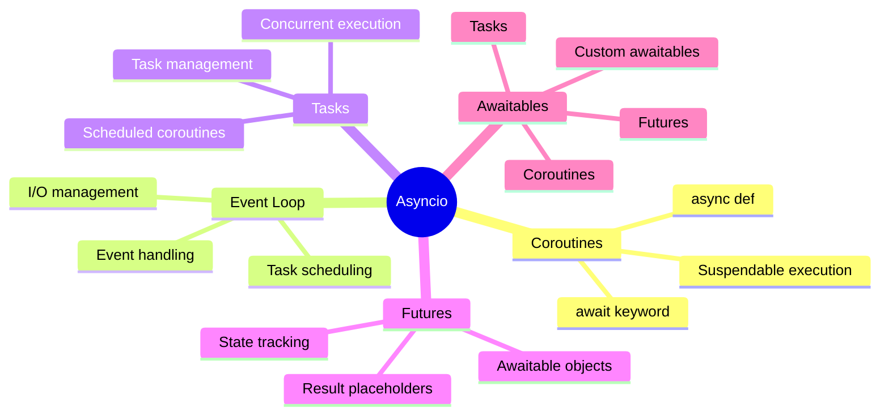

**Diagram Explanation**: This mind map summarizes all the core concepts of Asyncio and their relationships.

### Key Takeaways

1. **Asyncio enables single-threaded concurrency** for I/O-bound tasks
2. **Coroutines are the building blocks** of asynchronous programming
3. **The event loop manages execution** and handles I/O operations
4. **Tasks allow concurrent execution** of coroutines
5. **Futures represent future results** of asynchronous operations
6. **Proper use of await** is crucial for non-blocking operations

### When to Use Asyncio

✅ **Use Asyncio for:**
- Network programming (HTTP clients, web servers)
- Database operations
- File I/O operations
- Web scraping
- Real-time applications
- Any I/O-bound tasks

❌ **Don't use Asyncio for:**
- CPU-bound tasks (use multiprocessing instead)
- Simple synchronous operations
- When you need true parallelism

### Performance Benefits

- **Concurrency**: Handle thousands of concurrent connections
- **Efficiency**: Better resource utilization
- **Responsiveness**: Non-blocking operations
- **Scalability**: Easy to scale horizontally

## Useful Links

### Official Documentation
- [Python Asyncio Documentation](https://docs.python.org/3/library/asyncio.html)
- [Asyncio Tutorial](https://docs.python.org/3/library/asyncio-task.html)
- [Asyncio Examples](https://docs.python.org/3/library/asyncio-examples.html)

### Popular Asyncio Libraries
- [aiohttp](https://aiohttp.readthedocs.io/) - HTTP client/server
- [asyncpg](https://magicstack.github.io/asyncpg/) - PostgreSQL driver
- [aiomysql](https://aiomysql.readthedocs.io/) - MySQL driver
- [aiofiles](https://aiofiles.readthedocs.io/) - File operations
- [aioredis](https://aioredis.readthedocs.io/) - Redis client

### Learning Resources
- [Real Python Asyncio Guide](https://realpython.com/async-io-python/)
- [Asyncio Best Practices](https://docs.python.org/3/library/asyncio-dev.html)
- [Asyncio Patterns](https://docs.python.org/3/library/asyncio-task.html#asyncio-patterns)

### Tools and Utilities
- [nest-asyncio](https://pypi.org/project/nest-asyncio/) - Nested event loops
- [asyncio-mqtt](https://pypi.org/project/asyncio-mqtt/) - MQTT client
- [aiodns](https://pypi.org/project/aiodns/) - DNS resolution

---

**Note**: This comprehensive guide covers the fundamentals of Asyncio in Python. For advanced topics like asyncio subprocess, asyncio streams, and asyncio synchronization primitives, refer to the official Python documentation and specialized resources.

---