# [Lesson 17: CPython & GIL](https://colab.research.google.com/drive/1MtSf6NxfWI14aDA5kLLAOMVqH0NNWN98?usp=sharing)

## Table of Contents
1. [Introduction to CPython](#introduction-to-cpython)
2. [What is CPython?](#what-is-cpython)
3. [CPython vs .pyc Files](#cpython-vs-pyc-files)
4. [Python Implementations Comparison](#python-implementations-comparison)
5. [Global Interpreter Lock (GIL)](#global-interpreter-lock-gil)
6. [GIL Impact on Performance](#gil-impact-on-performance)
7. [Threading vs Multiprocessing](#threading-vs-multiprocessing)
8. [CPU-bound vs I/O-bound Tasks](#cpu-bound-vs-io-bound-tasks)
9. [GIL Alternatives and Solutions](#gil-alternatives-and-solutions)
10. [Real-world Examples](#real-world-examples)
11. [Best Practices](#best-practices)
12. [Key Concepts Summary](#key-concepts-summary)
13. [Useful Links](#useful-links)

---

## Introduction to CPython

CPython is the reference implementation of the Python programming language. When people say "Python," they usually mean CPython. It's the original and most widely used version of Python, written in C and serving as the foundation for the entire Python ecosystem.

### CPython Overview

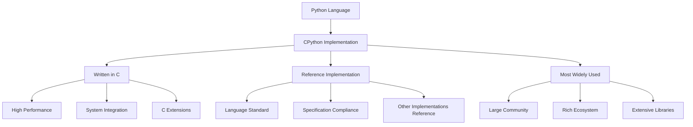

**Diagram Explanation**: This diagram shows CPython's role as the reference implementation of Python, its characteristics, and its position in the Python ecosystem.

### Why CPython Matters

- **Reference Implementation**: CPython defines what Python is and how it should behave
- **Widely Adopted**: Over 99% of Python installations use CPython
- **Ecosystem Foundation**: Most Python libraries and frameworks are built for CPython
- **Performance**: Written in C for optimal performance
- **Compatibility**: Ensures consistent behavior across different platforms

### Checking Your Python Implementation

```python
import platform
print(platform.python_implementation())
# Output: CPython
```

## What is CPython?

CPython is the reference implementation of the Python programming language, written in C. It serves as the standard against which all other Python implementations are measured and provides the foundation for the entire Python ecosystem.

### Key Characteristics of CPython

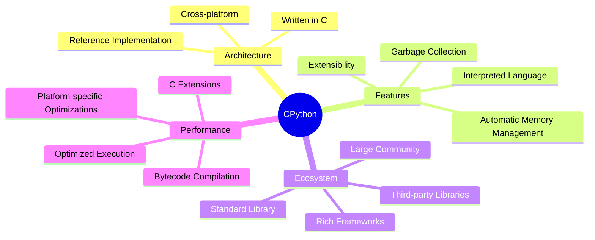

**Diagram Explanation**: This mind map shows the key characteristics of CPython, organized into architecture, features, ecosystem, and performance categories.

### 1. Reference Implementation

**Definition**: CPython is the original and most commonly used implementation of Python. It adheres closely to the specifications of the Python language, making it the standard against which other implementations are compared.

```python
# CPython follows the Python language specification exactly
# This ensures consistent behavior across different platforms
import sys
print(f"Python version: {sys.version}")
print(f"Implementation: {sys.implementation.name}")
print(f"Implementation version: {sys.implementation.version}")
```

### 2. Interpreted Language

**Definition**: CPython is an interpreted language, meaning that Python code is executed line by line. This allows for interactive programming and rapid prototyping, but it can also lead to slower execution speeds compared to compiled languages.

```python
# Interactive programming example
x = 10
y = 20
result = x + y
print(f"Result: {result}")

# Rapid prototyping
def quick_function():
    return "This is a quick prototype"

print(quick_function())
```

### 3. Memory Management

**Definition**: CPython uses automatic memory management, which includes a built-in garbage collector for reclaiming memory that is no longer in use. This helps prevent memory leaks and makes it easier for developers to manage resources.

```python
import gc

# Automatic memory management
def create_large_list():
    return [i for i in range(1000000)]

# Garbage collection
large_list = create_large_list()
del large_list  # Memory will be reclaimed automatically

# Manual garbage collection
gc.collect()
print("Garbage collection completed")
```

### 4. Extensibility

**Definition**: CPython allows for the integration of C and C++ code, enabling developers to write performance-critical components in these languages and call them from Python. This is particularly useful for computationally intensive tasks.

```python
# Example of using C extensions (NumPy is written in C)
import numpy as np

# High-performance array operations
arr = np.array([1, 2, 3, 4, 5])
result = np.sum(arr ** 2)
print(f"Sum of squares: {result}")
```

### 5. Standard Library

**Definition**: CPython comes with a comprehensive standard library that provides modules and functions for a wide range of tasks, from file I/O to web development, data manipulation, and more.

```python
# Examples from the standard library
import os
import json
import urllib.request
from datetime import datetime

# File operations
print(f"Current directory: {os.getcwd()}")

# JSON handling
data = {"name": "Python", "version": "3.9"}
json_str = json.dumps(data)
print(f"JSON: {json_str}")

# Date and time
now = datetime.now()
print(f"Current time: {now}")
```

### 6. Cross-Platform

**Definition**: CPython is available on various operating systems, including Windows, macOS, and Linux, making it a versatile choice for developers.

```python
import platform
import sys

# Platform information
print(f"Platform: {platform.platform()}")
print(f"Architecture: {platform.architecture()}")
print(f"Machine: {platform.machine()}")
print(f"Processor: {platform.processor()}")
print(f"Python executable: {sys.executable}")
```

### 7. Community and Ecosystem

**Definition**: Being the most popular implementation, CPython has a large community and a rich ecosystem of third-party libraries and frameworks, such as NumPy, Pandas, Flask, and Django, which enhance its capabilities.

```python
# Popular libraries in the CPython ecosystem
try:
    import numpy as np
    import pandas as pd
    import requests
    import flask
    print("All popular libraries are available!")
except ImportError as e:
    print(f"Library not available: {e}")
```

### 8. Versioning

**Definition**: CPython has undergone several major versions, with Python 2.x and Python 3.x being the most notable. Python 3 introduced many improvements and changes, and it is now the recommended version for new projects.

```python
import sys

# Version information
print(f"Python version: {sys.version}")
print(f"Version info: {sys.version_info}")
print(f"Major version: {sys.version_info.major}")
print(f"Minor version: {sys.version_info.minor}")
print(f"Micro version: {sys.version_info.micro}")
```

## CPython vs .pyc Files

CPython and .pyc files are related but serve different purposes in the Python execution process. Understanding their relationship is crucial for understanding how Python code is executed.

### Relationship Overview

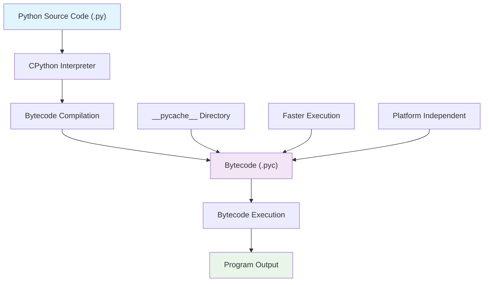

**Diagram Explanation**: This diagram shows the relationship between Python source code, CPython interpreter, bytecode compilation, and execution process.

### Key Differences

| Feature | CPython | .pyc File |
|---------|---------|-----------|
| **Type** | Interpreter & Compiler | Compiled Bytecode |
| **Role** | Runs Python code | Stores precompiled bytecode |
| **Written in** | C | Binary (bytecode) |
| **Execution** | Interprets and executes | Needs CPython to run |
| **Location** | Installed system-wide | Stored in __pycache__ |

### CPython's Role

**Definition**: CPython is the reference implementation of Python, written in C. It compiles Python source code (.py files) into bytecode and then executes it.

```python
# CPython compiles and executes Python code
def hello_world():
    print("Hello, World!")
    return "Success"

# This function is compiled to bytecode and executed by CPython
result = hello_world()
print(f"Result: {result}")
```

### .pyc Files' Role

**Definition**: .pyc (Python Compiled) files are the compiled bytecode versions of Python scripts. They help speed up execution by avoiding recompilation when the script runs again.

```python
import py_compile
import os

# Create a simple Python file
with open("example.py", "w") as f:
    f.write("print('Hello from compiled file!')\n")

# Compile to .pyc
py_compile.compile("example.py")

# Check if .pyc file was created
if os.path.exists("example.pyc"):
    print("Bytecode file created successfully!")
    
# Clean up
os.remove("example.py")
os.remove("example.pyc")
```

### Bytecode Compilation Process

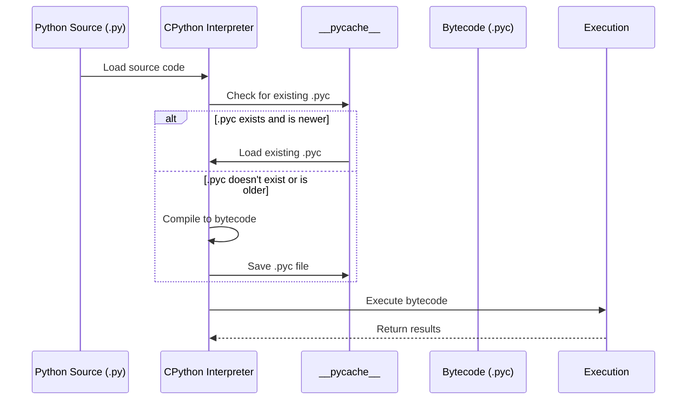

**Diagram Explanation**: This sequence diagram shows the bytecode compilation process and how CPython handles .pyc files for optimization.

### Practical Example

```python
import dis
import marshal

def example_function(x, y):
    result = x + y
    return result * 2

# Disassemble the function to see bytecode
print("Bytecode for example_function:")
dis.dis(example_function)

# Show the function's code object
print(f"\nCode object: {example_function.__code__}")
print(f"Bytecode: {example_function.__code__.co_code}")
```

## Python Implementations Comparison

While CPython is the most widely used Python implementation, there are several alternatives available, each with its own strengths and use cases.

### Python Implementations Overview

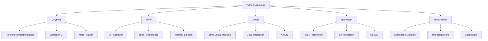

**Diagram Explanation**: This diagram shows the different Python implementations and their key characteristics.

### 1. CPython (Reference Implementation)

**Characteristics**:
- Written in C
- Reference implementation
- Most widely used
- Has GIL
- Extensive ecosystem

```python
# CPython example
import platform
print(f"Implementation: {platform.python_implementation()}")
print(f"Version: {platform.python_version()}")
```

### 2. PyPy (Just-in-Time Compiler)

**Characteristics**:
- JIT compiler for high performance
- Memory efficient
- Compatible with CPython
- Has GIL
- Faster execution for long-running programs

```python
# PyPy is designed to be a drop-in replacement for CPython
# The same code runs on both implementations
def fibonacci(n):
    if n <= 1:
        return n
    return fibonacci(n-1) + fibonacci(n-2)

# This code runs faster on PyPy for large values of n
result = fibonacci(30)
print(f"Fibonacci(30) = {result}")
```

### 3. Jython (Java Virtual Machine)

**Characteristics**:
- Runs on Java Virtual Machine (JVM)
- No GIL (true multithreading)
- Java integration
- Access to Java libraries
- Slower startup time

```python
# Jython allows integration with Java
# This is a conceptual example - actual Jython syntax may vary
from java.util import ArrayList
from java.lang import String

# Create Java objects from Python
java_list = ArrayList()
java_list.add("Hello")
java_list.add("World")
print(f"Java list size: {java_list.size()}")
```

### 4. IronPython (.NET Framework)

**Characteristics**:
- Runs on .NET Common Language Runtime (CLR)
- No GIL (true multithreading)
- C# integration
- Access to .NET libraries
- Windows-focused

```python
# IronPython allows integration with .NET
# This is a conceptual example - actual IronPython syntax may vary
import clr
clr.AddReference("System.Windows.Forms")
from System.Windows.Forms import MessageBox

# Use .NET components from Python
MessageBox.Show("Hello from IronPython!")
```

### 5. MicroPython (Embedded Systems)

**Characteristics**:
- Lightweight implementation
- Designed for microcontrollers
- Minimal memory footprint
- Real-time capabilities
- Limited standard library

```python
# MicroPython example for embedded systems
import machine
import time

# Control GPIO pins on a microcontroller
led = machine.Pin(2, machine.Pin.OUT)

# Blink LED
for i in range(10):
    led.on()
    time.sleep(0.5)
    led.off()
    time.sleep(0.5)
```

### Implementation Comparison Table

| Feature | CPython | PyPy | Jython | IronPython | MicroPython |
|---------|---------|------|--------|------------|-------------|
| **Performance** | Good | Excellent | Good | Good | Limited |
| **Memory Usage** | Moderate | Low | High | High | Very Low |
| **GIL** | Yes | Yes | No | No | N/A |
| **Ecosystem** | Excellent | Good | Limited | Limited | Limited |
| **Use Case** | General | Performance | Java Integration | .NET Integration | Embedded |
| **Startup Time** | Fast | Slow | Slow | Slow | Fast |

### Choosing the Right Implementation

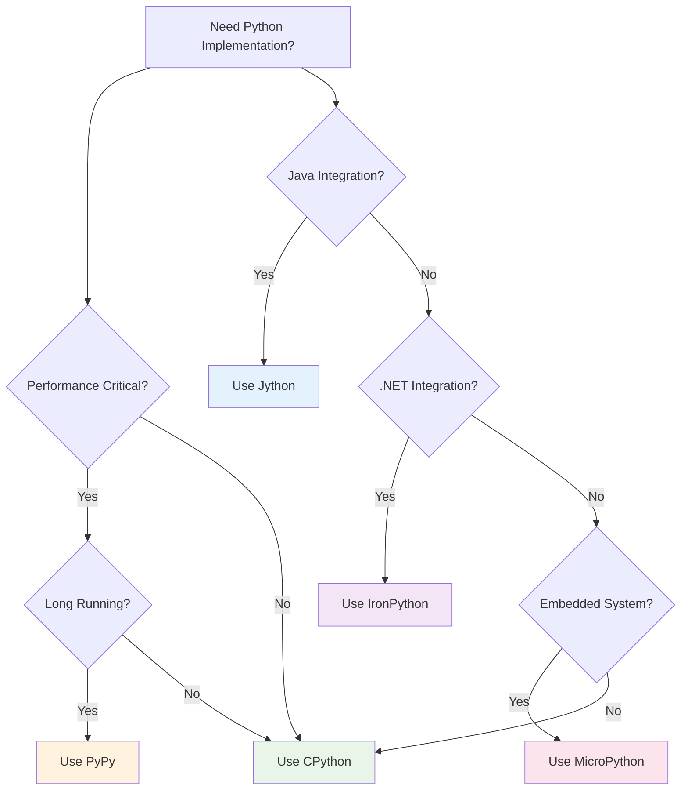

**Diagram Explanation**: This flowchart helps you choose the right Python implementation based on your specific needs and requirements.

## Global Interpreter Lock (GIL)

The Global Interpreter Lock (GIL) is one of the most important and controversial features of CPython. It's a mechanism that ensures only one thread executes Python bytecode at a time, which has significant implications for multi-threaded programming in Python.

### What is the GIL?

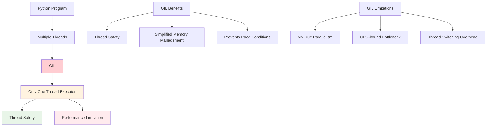

**Diagram Explanation**: This diagram shows how the GIL works and its benefits and limitations in CPython.

### Key Points about the GIL

#### 1. Single Thread Execution

**Definition**: The GIL allows only one thread to execute Python bytecode at a time, even on multi-core processors. This means that multi-threaded Python programs may not achieve true parallelism in CPU-bound tasks.

```python
import threading
import time

def cpu_intensive_task():
    """A CPU-intensive task that will be limited by the GIL"""
    result = 0
    for i in range(10000000):
        result += i ** 2
    return result

def demonstrate_gil_limitation():
    """Demonstrates that multiple threads don't provide speedup for CPU-bound tasks"""
    start_time = time.time()
    
    # Create multiple threads
    threads = []
    for i in range(4):
        thread = threading.Thread(target=cpu_intensive_task)
        threads.append(thread)
        thread.start()
    
    # Wait for all threads to complete
    for thread in threads:
        thread.join()
    
    end_time = time.time()
    print(f"Time with 4 threads: {end_time - start_time:.2f} seconds")

# Run the demonstration
demonstrate_gil_limitation()
```

#### 2. Thread Safety

**Definition**: The GIL simplifies memory management and makes the CPython interpreter thread-safe. It prevents race conditions and other concurrency issues that can arise when multiple threads access shared data.

```python
import threading
import time

# Shared variable
counter = 0
lock = threading.Lock()

def increment_counter():
    """Increment counter with GIL protection"""
    global counter
    for _ in range(100000):
        counter += 1

def increment_counter_with_lock():
    """Increment counter with explicit locking"""
    global counter
    for _ in range(100000):
        with lock:
            counter += 1

def demonstrate_thread_safety():
    """Demonstrates thread safety with and without explicit locking"""
    global counter
    
    # Test with GIL only
    counter = 0
    threads = []
    start_time = time.time()
    
    for i in range(4):
        thread = threading.Thread(target=increment_counter)
        threads.append(thread)
        thread.start()
    
    for thread in threads:
        thread.join()
    
    end_time = time.time()
    print(f"Counter with GIL only: {counter}")
    print(f"Time: {end_time - start_time:.2f} seconds")
    
    # Test with explicit locking
    counter = 0
    threads = []
    start_time = time.time()
    
    for i in range(4):
        thread = threading.Thread(target=increment_counter_with_lock)
        threads.append(thread)
        thread.start()
    
    for thread in threads:
        thread.join()
    
    end_time = time.time()
    print(f"Counter with explicit lock: {counter}")
    print(f"Time: {end_time - start_time:.2f} seconds")

# Run the demonstration
demonstrate_thread_safety()
```

#### 3. Impact on Performance

**Definition**: The GIL has different impacts on different types of tasks:

- **CPU-bound Programs**: For CPU-bound tasks, the GIL can be a bottleneck
- **I/O-bound Programs**: For I/O-bound tasks, the GIL is less of an issue

```python
import threading
import time
import requests

def cpu_bound_task():
    """CPU-bound task that will be limited by GIL"""
    result = 0
    for i in range(1000000):
        result += i ** 2
    return result

def io_bound_task():
    """I/O-bound task that can benefit from threading despite GIL"""
    try:
        response = requests.get("https://httpbin.org/delay/1", timeout=5)
        return response.status_code
    except:
        return 0

def demonstrate_performance_impact():
    """Demonstrates GIL impact on different task types"""
    
    # CPU-bound task with threading
    print("CPU-bound task with threading:")
    start_time = time.time()
    threads = []
    
    for i in range(4):
        thread = threading.Thread(target=cpu_bound_task)
        threads.append(thread)
        thread.start()
    
    for thread in threads:
        thread.join()
    
    end_time = time.time()
    print(f"Time: {end_time - start_time:.2f} seconds")
    
    # I/O-bound task with threading
    print("\nI/O-bound task with threading:")
    start_time = time.time()
    threads = []
    
    for i in range(4):
        thread = threading.Thread(target=io_bound_task)
        threads.append(thread)
        thread.start()
    
    for thread in threads:
        thread.join()
    
    end_time = time.time()
    print(f"Time: {end_time - start_time:.2f} seconds")

# Run the demonstration
demonstrate_performance_impact()
```

### GIL Release Points

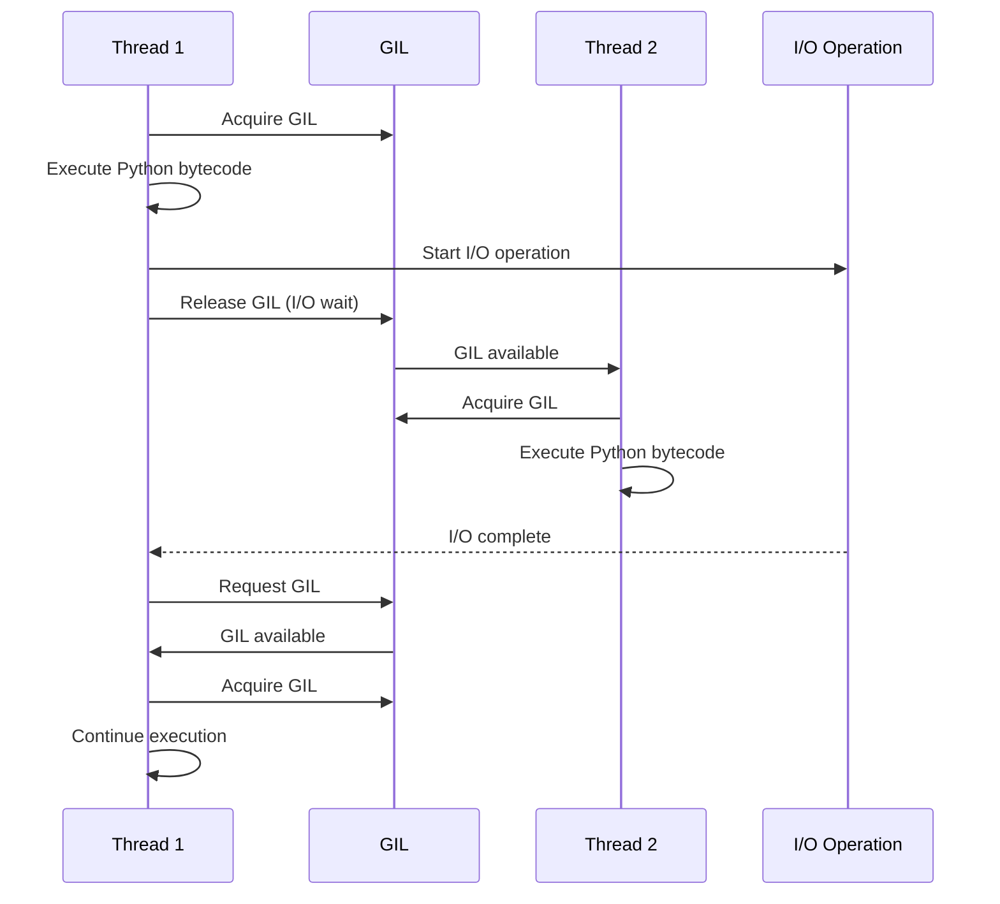

**Diagram Explanation**: This sequence diagram shows how the GIL is released during I/O operations, allowing other threads to execute.

### When GIL is Released

The GIL is released in several situations:

1. **I/O Operations**: File reading, network requests, database queries
2. **Time.sleep()**: Explicit sleep operations
3. **C Extensions**: When C code releases the GIL
4. **Garbage Collection**: During certain garbage collection operations

```python
import threading
import time
import os

def io_operation():
    """I/O operation that releases the GIL"""
    print(f"Thread {threading.current_thread().name} starting I/O")
    time.sleep(2)  # This releases the GIL
    print(f"Thread {threading.current_thread().name} finished I/O")

def demonstrate_gil_release():
    """Demonstrates GIL release during I/O operations"""
    threads = []
    
    for i in range(3):
        thread = threading.Thread(target=io_operation, name=f"Thread-{i}")
        threads.append(thread)
        thread.start()
    
    for thread in threads:
        thread.join()
    
    print("All threads completed")

# Run the demonstration
demonstrate_gil_release()
```

## GIL Impact on Performance

Understanding the GIL's impact on performance is crucial for writing efficient Python programs. The impact varies significantly between CPU-bound and I/O-bound tasks.

### Performance Impact Overview

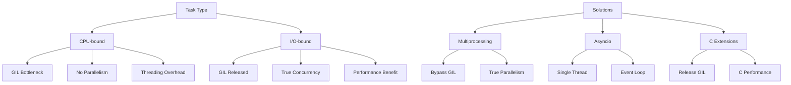

**Diagram Explanation**: This diagram shows the different impacts of the GIL on various task types and the available solutions.

### CPU-bound vs I/O-bound Performance

```python
import threading
import multiprocessing
import time
import requests

def cpu_bound_task(n):
    """CPU-intensive task"""
    result = 0
    for i in range(n):
        result += i ** 2
    return result

def io_bound_task():
    """I/O-intensive task"""
    try:
        response = requests.get("https://httpbin.org/delay/1", timeout=5)
        return response.status_code
    except:
        return 0

def compare_performance():
    """Compare performance of different approaches"""
    
    # CPU-bound task comparison
    print("=== CPU-bound Task Comparison ===")
    n = 1000000
    
    # Single thread
    start_time = time.time()
    result = cpu_bound_task(n)
    single_thread_time = time.time() - start_time
    print(f"Single thread: {single_thread_time:.2f} seconds")
    
    # Multiple threads (limited by GIL)
    start_time = time.time()
    threads = []
    for i in range(4):
        thread = threading.Thread(target=cpu_bound_task, args=(n,))
        threads.append(thread)
        thread.start()
    
    for thread in threads:
        thread.join()
    multi_thread_time = time.time() - start_time
    print(f"Multiple threads: {multi_thread_time:.2f} seconds")
    
    # Multiple processes (bypasses GIL)
    start_time = time.time()
    processes = []
    for i in range(4):
        process = multiprocessing.Process(target=cpu_bound_task, args=(n,))
        processes.append(process)
        process.start()
    
    for process in processes:
        process.join()
    multi_process_time = time.time() - start_time
    print(f"Multiple processes: {multi_process_time:.2f} seconds")
    
    # I/O-bound task comparison
    print("\n=== I/O-bound Task Comparison ===")
    
    # Single thread
    start_time = time.time()
    for i in range(4):
        io_bound_task()
    single_thread_io_time = time.time() - start_time
    print(f"Single thread I/O: {single_thread_io_time:.2f} seconds")
    
    # Multiple threads (benefits from GIL release)
    start_time = time.time()
    threads = []
    for i in range(4):
        thread = threading.Thread(target=io_bound_task)
        threads.append(thread)
        thread.start()
    
    for thread in threads:
        thread.join()
    multi_thread_io_time = time.time() - start_time
    print(f"Multiple threads I/O: {multi_thread_io_time:.2f} seconds")

# Run the comparison
compare_performance()
```

### GIL Performance Metrics

```python
import threading
import time
import psutil
import os

def monitor_gil_impact():
    """Monitor the impact of GIL on system resources"""
    
    def cpu_task():
        """CPU-intensive task"""
        result = 0
        for i in range(10000000):
            result += i ** 2
        return result
    
    def io_task():
        """I/O-intensive task"""
        time.sleep(1)
        return "I/O completed"
    
    # Monitor CPU usage during different task types
    print("=== GIL Impact Monitoring ===")
    
    # CPU-bound task with threading
    print("CPU-bound task with threading:")
    start_time = time.time()
    threads = []
    
    for i in range(4):
        thread = threading.Thread(target=cpu_task)
        threads.append(thread)
        thread.start()
    
    for thread in threads:
        thread.join()
    
    end_time = time.time()
    print(f"Time: {end_time - start_time:.2f} seconds")
    print(f"CPU usage: {psutil.cpu_percent()}%")
    
    # I/O-bound task with threading
    print("\nI/O-bound task with threading:")
    start_time = time.time()
    threads = []
    
    for i in range(4):
        thread = threading.Thread(target=io_task)
        threads.append(thread)
        thread.start()
    
    for thread in threads:
        thread.join()
    
    end_time = time.time()
    print(f"Time: {end_time - start_time:.2f} seconds")
    print(f"CPU usage: {psutil.cpu_percent()}%")

# Run the monitoring
monitor_gil_impact()
```

## Threading vs Multiprocessing

Understanding the difference between threading and multiprocessing is crucial for writing efficient Python programs, especially when dealing with the GIL limitations.

### Threading vs Multiprocessing Overview

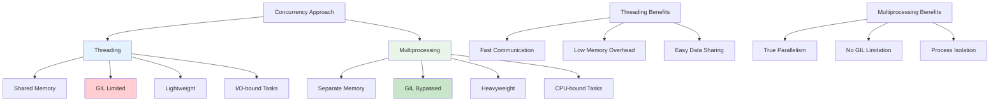

**Diagram Explanation**: This diagram shows the key differences between threading and multiprocessing, their benefits, and when to use each approach.

### Threading Characteristics

**Definition**: Threading creates multiple threads within a single process, sharing the same memory space and being limited by the GIL.

```python
import threading
import time

def threading_example():
    """Demonstrates threading with shared memory"""
    
    # Shared variable
    shared_counter = 0
    lock = threading.Lock()
    
    def worker(thread_id):
        """Worker function that increments shared counter"""
        nonlocal shared_counter
        for i in range(100000):
            with lock:
                shared_counter += 1
        print(f"Thread {thread_id} completed")
    
    # Create and start threads
    threads = []
    start_time = time.time()
    
    for i in range(4):
        thread = threading.Thread(target=worker, args=(i,))
        threads.append(thread)
        thread.start()
    
    # Wait for all threads to complete
    for thread in threads:
        thread.join()
    
    end_time = time.time()
    print(f"Final counter value: {shared_counter}")
    print(f"Time taken: {end_time - start_time:.2f} seconds")

# Run the threading example
threading_example()
```

### Multiprocessing Characteristics

**Definition**: Multiprocessing creates separate processes, each with its own memory space and Python interpreter, bypassing the GIL.

```python
import multiprocessing
import time

def multiprocessing_example():
    """Demonstrates multiprocessing with separate memory spaces"""
    
    def worker(process_id, iterations):
        """Worker function that performs CPU-intensive task"""
        result = 0
        for i in range(iterations):
            result += i ** 2
        print(f"Process {process_id} completed with result: {result}")
        return result
    
    # Create and start processes
    processes = []
    start_time = time.time()
    
    for i in range(4):
        process = multiprocessing.Process(target=worker, args=(i, 1000000))
        processes.append(process)
        process.start()
    
    # Wait for all processes to complete
    for process in processes:
        process.join()
    
    end_time = time.time()
    print(f"Time taken: {end_time - start_time:.2f} seconds")

# Run the multiprocessing example
multiprocessing_example()
```

### Performance Comparison

```python
import threading
import multiprocessing
import time

def cpu_bound_task(n):
    """CPU-intensive task for performance comparison"""
    result = 0
    for i in range(n):
        result += (i ** 2) ** 0.5
    return result

def compare_threading_multiprocessing():
    """Compare threading vs multiprocessing performance"""
    
    n = 15**6  # Number of calculations
    num_workers = 4
    
    print("=== Performance Comparison ===")
    
    # Threading approach
    print("Threading approach:")
    start_time = time.time()
    threads = []
    
    for i in range(num_workers):
        thread = threading.Thread(target=cpu_bound_task, args=(n,))
        threads.append(thread)
        thread.start()
    
    for thread in threads:
        thread.join()
    
    threading_time = time.time() - start_time
    print(f"Time taken with threading: {threading_time:.2f} seconds")
    
    # Multiprocessing approach
    print("\nMultiprocessing approach:")
    start_time = time.time()
    processes = []
    
    for i in range(num_workers):
        process = multiprocessing.Process(target=cpu_bound_task, args=(n,))
        processes.append(process)
        process.start()
    
    for process in processes:
        process.join()
    
    multiprocessing_time = time.time() - start_time
    print(f"Time taken with multiprocessing: {multiprocessing_time:.2f} seconds")
    
    # Performance analysis
    if multiprocessing_time < threading_time:
        improvement = ((threading_time - multiprocessing_time) / threading_time) * 100
        print(f"\nMultiprocessing is {improvement:.1f}% faster than threading")
    else:
        print("\nThreading is faster than multiprocessing (unexpected for CPU-bound tasks)")

# Run the comparison
compare_threading_multiprocessing()
```

### Memory Usage Comparison

```python
import threading
import multiprocessing
import time
import psutil
import os

def memory_intensive_task():
    """Memory-intensive task for comparison"""
    # Create a large list
    large_list = [i for i in range(1000000)]
    # Perform some operations
    result = sum(large_list)
    return result

def monitor_memory_usage():
    """Monitor memory usage during threading vs multiprocessing"""
    
    print("=== Memory Usage Comparison ===")
    
    # Get initial memory usage
    process = psutil.Process(os.getpid())
    initial_memory = process.memory_info().rss / 1024 / 1024  # MB
    print(f"Initial memory usage: {initial_memory:.2f} MB")
    
    # Threading approach
    print("\nThreading approach:")
    start_time = time.time()
    threads = []
    
    for i in range(4):
        thread = threading.Thread(target=memory_intensive_task)
        threads.append(thread)
        thread.start()
    
    for thread in threads:
        thread.join()
    
    threading_time = time.time() - start_time
    threading_memory = process.memory_info().rss / 1024 / 1024  # MB
    print(f"Time: {threading_time:.2f} seconds")
    print(f"Memory usage: {threading_memory:.2f} MB")
    print(f"Memory increase: {threading_memory - initial_memory:.2f} MB")
    
    # Multiprocessing approach
    print("\nMultiprocessing approach:")
    start_time = time.time()
    processes = []
    
    for i in range(4):
        process = multiprocessing.Process(target=memory_intensive_task)
        processes.append(process)
        process.start()
    
    for process in processes:
        process.join()
    
    multiprocessing_time = time.time() - start_time
    multiprocessing_memory = psutil.Process(os.getpid()).memory_info().rss / 1024 / 1024  # MB
    print(f"Time: {multiprocessing_time:.2f} seconds")
    print(f"Memory usage: {multiprocessing_memory:.2f} MB")
    print(f"Memory increase: {multiprocessing_memory - initial_memory:.2f} MB")

# Run the memory monitoring
monitor_memory_usage()
```

### Communication Between Processes

```python
import multiprocessing
import time

def worker_with_queue(queue, process_id):
    """Worker function that communicates via queue"""
    result = process_id * 1000
    queue.put(f"Process {process_id} result: {result}")
    time.sleep(1)  # Simulate work
    return result

def demonstrate_process_communication():
    """Demonstrates communication between processes"""
    
    # Create a queue for communication
    queue = multiprocessing.Queue()
    
    # Create and start processes
    processes = []
    for i in range(4):
        process = multiprocessing.Process(target=worker_with_queue, args=(queue, i))
        processes.append(process)
        process.start()
    
    # Wait for all processes to complete
    for process in processes:
        process.join()
    
    # Collect results from queue
    results = []
    while not queue.empty():
        results.append(queue.get())
    
    print("Results from processes:")
    for result in results:
        print(result)

# Run the communication example
demonstrate_process_communication()
```

### When to Use Threading vs Multiprocessing

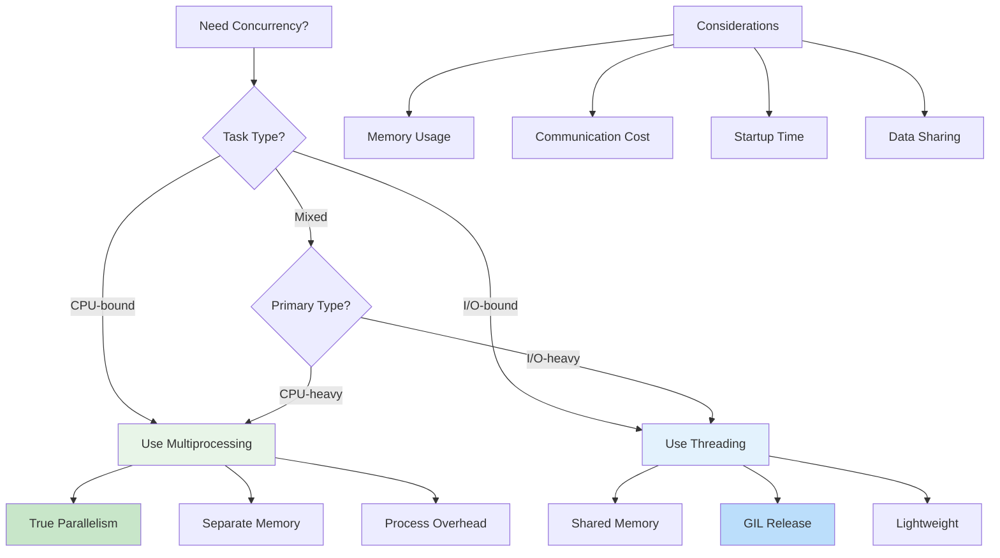

**Diagram Explanation**: This flowchart helps you decide between threading and multiprocessing based on your task type and requirements.

### Best Practices

#### For Threading:
```python
import threading
import time

def threading_best_practices():
    """Demonstrates threading best practices"""
    
    # Use locks for shared data
    shared_data = {"counter": 0}
    lock = threading.Lock()
    
    def safe_increment():
        with lock:
            shared_data["counter"] += 1
    
    # Use thread-local storage when appropriate
    local_data = threading.local()
    
    def worker_with_local(thread_id):
        local_data.value = thread_id
        for i in range(1000):
            safe_increment()
        print(f"Thread {thread_id} completed, local value: {local_data.value}")
    
    # Create and manage threads properly
    threads = []
    for i in range(4):
        thread = threading.Thread(target=worker_with_local, args=(i,))
        threads.append(thread)
        thread.start()
    
    for thread in threads:
        thread.join()
    
    print(f"Final counter: {shared_data['counter']}")

# Run the best practices example
threading_best_practices()
```

#### For Multiprocessing:
```python
import multiprocessing
import time

def multiprocessing_best_practices():
    """Demonstrates multiprocessing best practices"""
    
    def worker_process(process_id, shared_dict, lock):
        """Worker process with proper synchronization"""
        with lock:
            shared_dict[f"process_{process_id}"] = process_id * 1000
        
        # Simulate work
        time.sleep(1)
        
        with lock:
            shared_dict[f"process_{process_id}_completed"] = True
    
    # Use Manager for shared data
    manager = multiprocessing.Manager()
    shared_dict = manager.dict()
    lock = manager.Lock()
    
    # Create and start processes
    processes = []
    for i in range(4):
        process = multiprocessing.Process(
            target=worker_process, 
            args=(i, shared_dict, lock)
        )
        processes.append(process)
        process.start()
    
    # Wait for all processes to complete
    for process in processes:
        process.join()
    
    print("Shared data after all processes completed:")
    for key, value in shared_dict.items():
        print(f"{key}: {value}")

# Run the best practices example
multiprocessing_best_practices()
```

## CPU-bound vs I/O-bound Tasks

Understanding the difference between CPU-bound and I/O-bound tasks is essential for choosing the right concurrency approach and understanding GIL limitations.

### Task Type Overview

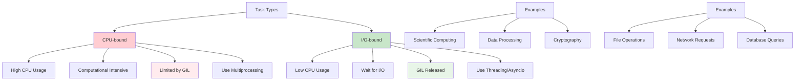

**Diagram Explanation**: This diagram shows the characteristics of CPU-bound and I/O-bound tasks, their examples, and recommended approaches.

### CPU-bound Tasks

**Definition**: CPU-bound tasks are computationally intensive tasks that require significant processing power from the CPU to complete. These tasks spend most of their time executing instructions on the CPU.

#### Characteristics of CPU-bound Tasks

- **High CPU Utilization**: CPU-bound tasks utilize a large percentage of the CPU's processing power
- **Computationally Intensive**: These tasks involve complex calculations, data processing, or algorithmic operations
- **Low I/O Operations**: CPU-bound tasks typically involve minimal input/output operations
- **Sequential Execution**: CPU-bound tasks often require sequential execution

```python
import time
import multiprocessing
import threading

def cpu_bound_task(n):
    """CPU-intensive task that performs calculations"""
    result = 0
    for i in range(n):
        result += (i ** 2) ** 0.5  # Some arbitrary computation
    return result

def demonstrate_cpu_bound():
    """Demonstrates CPU-bound task characteristics"""
    
    n = 1000000
    print("=== CPU-bound Task Demonstration ===")
    
    # Single thread execution
    start_time = time.time()
    result = cpu_bound_task(n)
    single_time = time.time() - start_time
    print(f"Single thread: {single_time:.2f} seconds")
    
    # Multiple threads (limited by GIL)
    start_time = time.time()
    threads = []
    for i in range(4):
        thread = threading.Thread(target=cpu_bound_task, args=(n,))
        threads.append(thread)
        thread.start()
    
    for thread in threads:
        thread.join()
    threading_time = time.time() - start_time
    print(f"Multiple threads: {threading_time:.2f} seconds")
    
    # Multiple processes (bypasses GIL)
    start_time = time.time()
    processes = []
    for i in range(4):
        process = multiprocessing.Process(target=cpu_bound_task, args=(n,))
        processes.append(process)
        process.start()
    
    for process in processes:
        process.join()
    multiprocessing_time = time.time() - start_time
    print(f"Multiple processes: {multiprocessing_time:.2f} seconds")
    
    # Analysis
    print(f"\nThreading overhead: {threading_time - single_time:.2f} seconds")
    print(f"Multiprocessing speedup: {single_time / multiprocessing_time:.2f}x")

# Run the demonstration
demonstrate_cpu_bound()
```

#### Examples of CPU-bound Tasks

```python
import time
import math

def scientific_simulation():
    """Scientific simulation example"""
    result = 0
    for i in range(1000000):
        result += math.sin(i) * math.cos(i)
    return result

def data_compression():
    """Data compression example"""
    data = list(range(100000))
    compressed = []
    for i in range(0, len(data), 2):
        compressed.append(data[i] + data[i+1] if i+1 < len(data) else data[i])
    return compressed

def cryptography():
    """Cryptography example"""
    result = 0
    for i in range(1000000):
        result += (i ** 3) % 1000000
    return result

def machine_learning():
    """Machine learning example"""
    weights = [0.1, 0.2, 0.3, 0.4, 0.5]
    data = list(range(100000))
    predictions = []
    for value in data:
        prediction = sum(w * value for w in weights)
        predictions.append(prediction)
    return predictions

def video_encoding():
    """Video encoding example"""
    frames = 1000
    encoded_frames = []
    for frame in range(frames):
        # Simulate encoding process
        encoded_frame = sum(i ** 2 for i in range(1000))
        encoded_frames.append(encoded_frame)
    return encoded_frames

def demonstrate_cpu_bound_examples():
    """Demonstrates various CPU-bound task examples"""
    
    print("=== CPU-bound Task Examples ===")
    
    tasks = [
        ("Scientific Simulation", scientific_simulation),
        ("Data Compression", data_compression),
        ("Cryptography", cryptography),
        ("Machine Learning", machine_learning),
        ("Video Encoding", video_encoding)
    ]
    
    for name, task in tasks:
        start_time = time.time()
        result = task()
        end_time = time.time()
        print(f"{name}: {end_time - start_time:.2f} seconds")

# Run the examples
demonstrate_cpu_bound_examples()
```

### I/O-bound Tasks

**Definition**: I/O-bound tasks are tasks that spend most of their time waiting for input/output operations to complete, such as reading from files, making network requests, or querying databases.

#### Characteristics of I/O-bound Tasks

- **Low CPU Usage**: I/O-bound tasks utilize minimal CPU processing power
- **Wait for I/O**: These tasks spend most of their time waiting for I/O operations
- **High I/O Operations**: I/O-bound tasks involve frequent input/output operations
- **Concurrent Execution**: I/O-bound tasks can benefit from concurrent execution

```python
import time
import threading
import requests
import os

def io_bound_task():
    """I/O-intensive task that makes network requests"""
    try:
        response = requests.get("https://httpbin.org/delay/1", timeout=5)
        return response.status_code
    except:
        return 0

def file_operation():
    """File I/O operation"""
    filename = "temp_file.txt"
    with open(filename, "w") as f:
        f.write("Hello, World!" * 1000)
    
    with open(filename, "r") as f:
        content = f.read()
    
    os.remove(filename)
    return len(content)

def demonstrate_io_bound():
    """Demonstrates I/O-bound task characteristics"""
    
    print("=== I/O-bound Task Demonstration ===")
    
    # Single thread execution
    start_time = time.time()
    for i in range(4):
        io_bound_task()
    single_time = time.time() - start_time
    print(f"Single thread: {single_time:.2f} seconds")
    
    # Multiple threads (benefits from GIL release)
    start_time = time.time()
    threads = []
    for i in range(4):
        thread = threading.Thread(target=io_bound_task)
        threads.append(thread)
        thread.start()
    
    for thread in threads:
        thread.join()
    threading_time = time.time() - start_time
    print(f"Multiple threads: {threading_time:.2f} seconds")
    
    # Analysis
    if threading_time < single_time:
        speedup = single_time / threading_time
        print(f"Threading speedup: {speedup:.2f}x")
    else:
        print("Threading didn't provide speedup (unexpected for I/O-bound tasks)")

# Run the demonstration
demonstrate_io_bound()
```

#### Examples of I/O-bound Tasks

```python
import time
import requests
import os
import sqlite3

def network_request():
    """Network request example"""
    try:
        response = requests.get("https://httpbin.org/json", timeout=5)
        return response.json()
    except:
        return None

def file_reading():
    """File reading example"""
    filename = "example.txt"
    if os.path.exists(filename):
        with open(filename, "r") as f:
            content = f.read()
        return len(content)
    return 0

def database_query():
    """Database query example"""
    # Create a simple in-memory database
    conn = sqlite3.connect(":memory:")
    cursor = conn.cursor()
    
    # Create table and insert data
    cursor.execute("CREATE TABLE users (id INTEGER, name TEXT)")
    for i in range(1000):
        cursor.execute("INSERT INTO users VALUES (?, ?)", (i, f"User{i}"))
    
    # Query data
    cursor.execute("SELECT COUNT(*) FROM users")
    result = cursor.fetchone()[0]
    
    conn.close()
    return result

def web_scraping():
    """Web scraping example"""
    try:
        response = requests.get("https://httpbin.org/html", timeout=5)
        return len(response.text)
    except:
        return 0

def demonstrate_io_bound_examples():
    """Demonstrates various I/O-bound task examples"""
    
    print("=== I/O-bound Task Examples ===")
    
    tasks = [
        ("Network Request", network_request),
        ("File Reading", file_reading),
        ("Database Query", database_query),
        ("Web Scraping", web_scraping)
    ]
    
    for name, task in tasks:
        start_time = time.time()
        result = task()
        end_time = time.time()
        print(f"{name}: {end_time - start_time:.2f} seconds, Result: {result}")

# Run the examples
demonstrate_io_bound_examples()
```

### Impact on Concurrency

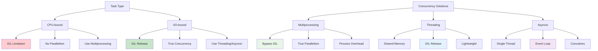

**Diagram Explanation**: This diagram shows how different task types impact concurrency and the available solutions for each.

### Choosing the Right Approach

```python
import time
import threading
import multiprocessing
import asyncio
import aiohttp

def choose_concurrency_approach():
    """Demonstrates choosing the right concurrency approach"""
    
    print("=== Choosing the Right Concurrency Approach ===")
    
    # CPU-bound task
    def cpu_task():
        result = 0
        for i in range(1000000):
            result += i ** 2
        return result
    
    # I/O-bound task
    def io_task():
        time.sleep(1)  # Simulate I/O wait
        return "I/O completed"
    
    # Test CPU-bound task with different approaches
    print("\nCPU-bound task:")
    
    # Single thread
    start_time = time.time()
    cpu_task()
    single_time = time.time() - start_time
    print(f"Single thread: {single_time:.2f} seconds")
    
    # Threading (limited by GIL)
    start_time = time.time()
    threads = []
    for i in range(4):
        thread = threading.Thread(target=cpu_task)
        threads.append(thread)
        thread.start()
    
    for thread in threads:
        thread.join()
    threading_time = time.time() - start_time
    print(f"Threading: {threading_time:.2f} seconds")
    
    # Multiprocessing (bypasses GIL)
    start_time = time.time()
    processes = []
    for i in range(4):
        process = multiprocessing.Process(target=cpu_task)
        processes.append(process)
        process.start()
    
    for process in processes:
        process.join()
    multiprocessing_time = time.time() - start_time
    print(f"Multiprocessing: {multiprocessing_time:.2f} seconds")
    
    # Test I/O-bound task with different approaches
    print("\nI/O-bound task:")
    
    # Single thread
    start_time = time.time()
    for i in range(4):
        io_task()
    single_io_time = time.time() - start_time
    print(f"Single thread: {single_io_time:.2f} seconds")
    
    # Threading (benefits from GIL release)
    start_time = time.time()
    threads = []
    for i in range(4):
        thread = threading.Thread(target=io_task)
        threads.append(thread)
        thread.start()
    
    for thread in threads:
        thread.join()
    threading_io_time = time.time() - start_time
    print(f"Threading: {threading_io_time:.2f} seconds")
    
    # Analysis and recommendations
    print("\n=== Recommendations ===")
    print("For CPU-bound tasks:")
    if multiprocessing_time < threading_time:
        print("✓ Use multiprocessing (bypasses GIL)")
    else:
        print("✗ Threading is not effective (GIL limitation)")
    
    print("For I/O-bound tasks:")
    if threading_io_time < single_io_time:
        print("✓ Use threading (GIL is released during I/O)")
    else:
        print("✗ Threading didn't provide benefit")

# Run the demonstration
choose_concurrency_approach()
```

## GIL Alternatives and Solutions

While the GIL is a fundamental part of CPython, there are several alternatives and solutions to work around its limitations.

### GIL Alternatives Overview

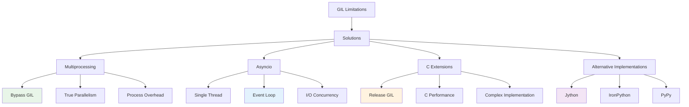

**Diagram Explanation**: This diagram shows the various alternatives and solutions to work around GIL limitations.

### 1. Multiprocessing

**Definition**: Multiprocessing creates separate processes, each with its own Python interpreter and memory space, bypassing the GIL entirely.

```python
import multiprocessing
import time

def cpu_intensive_task(n):
    """CPU-intensive task that benefits from multiprocessing"""
    result = 0
    for i in range(n):
        result += i ** 2
    return result

def demonstrate_multiprocessing():
    """Demonstrates multiprocessing as a GIL alternative"""
    
    n = 1000000
    num_processes = 4
    
    print("=== Multiprocessing as GIL Alternative ===")
    
    # Single process
    start_time = time.time()
    result = cpu_intensive_task(n)
    single_time = time.time() - start_time
    print(f"Single process: {single_time:.2f} seconds")
    
    # Multiple processes
    start_time = time.time()
    processes = []
    for i in range(num_processes):
        process = multiprocessing.Process(target=cpu_intensive_task, args=(n,))
        processes.append(process)
        process.start()
    
    for process in processes:
        process.join()
    
    multiprocessing_time = time.time() - start_time
    print(f"Multiple processes: {multiprocessing_time:.2f} seconds")
    
    # Calculate speedup
    speedup = single_time / multiprocessing_time
    print(f"Speedup: {speedup:.2f}x")

# Run the demonstration
demonstrate_multiprocessing()
```

### 2. Asyncio

**Definition**: Asyncio provides single-threaded concurrency using coroutines and an event loop, avoiding GIL limitations for I/O-bound tasks.

```python
import asyncio
import time

async def io_bound_task():
    """I/O-bound task that benefits from asyncio"""
    await asyncio.sleep(1)  # Simulate I/O wait
    return "I/O completed"

async def demonstrate_asyncio():
    """Demonstrates asyncio as a GIL alternative"""
    
    print("=== Asyncio as GIL Alternative ===")
    
    # Single task
    start_time = time.time()
    result = await io_bound_task()
    single_time = time.time() - start_time
    print(f"Single task: {single_time:.2f} seconds")
    
    # Multiple concurrent tasks
    start_time = time.time()
    tasks = [io_bound_task() for _ in range(4)]
    results = await asyncio.gather(*tasks)
    concurrent_time = time.time() - start_time
    print(f"Concurrent tasks: {concurrent_time:.2f} seconds")
    
    # Calculate speedup
    speedup = single_time / concurrent_time
    print(f"Speedup: {speedup:.2f}x")

# Run the demonstration
asyncio.run(demonstrate_asyncio())
```

### 3. C Extensions

**Definition**: C extensions can release the GIL during execution, allowing other threads to run Python code concurrently.

```python
# This is a conceptual example - actual C extension would be written in C
# and compiled as a Python extension module

def demonstrate_c_extension_concept():
    """Demonstrates the concept of C extensions releasing the GIL"""
    
    print("=== C Extensions as GIL Alternative ===")
    print("C extensions can release the GIL during execution")
    print("This allows other threads to run Python code concurrently")
    print("Examples include NumPy, Pandas, and other performance-critical libraries")
    
    # Example using NumPy (which releases the GIL internally)
    try:
        import numpy as np
        
        # NumPy operations release the GIL internally
        arr = np.random.random((1000, 1000))
        result = np.sum(arr ** 2)
        print(f"NumPy result: {result}")
        print("NumPy operations can run concurrently with other Python code")
        
    except ImportError:
        print("NumPy not available - install with: pip install numpy")

# Run the demonstration
demonstrate_c_extension_concept()
```

### 4. Alternative Python Implementations

**Definition**: Some Python implementations don't have a GIL, allowing true multithreading.

```python
def demonstrate_alternative_implementations():
    """Demonstrates alternative Python implementations without GIL"""
    
    print("=== Alternative Python Implementations ===")
    
    implementations = {
        "Jython": {
            "description": "Python on Java Virtual Machine",
            "gil": "No GIL",
            "benefits": ["True multithreading", "Java integration"],
            "limitations": ["Slower startup", "Limited ecosystem"]
        },
        "IronPython": {
            "description": "Python on .NET Framework",
            "gil": "No GIL",
            "benefits": ["True multithreading", "C# integration"],
            "limitations": ["Windows-focused", "Limited ecosystem"]
        },
        "PyPy": {
            "description": "Just-in-time compiler",
            "gil": "Has GIL",
            "benefits": ["High performance", "Memory efficient"],
            "limitations": ["Still has GIL", "Compatibility issues"]
        }
    }
    
    for name, info in implementations.items():
        print(f"\n{name}:")
        print(f"  Description: {info['description']}")
        print(f"  GIL: {info['gil']}")
        print(f"  Benefits: {', '.join(info['benefits'])}")
        print(f"  Limitations: {', '.join(info['limitations'])}")

# Run the demonstration
demonstrate_alternative_implementations()
```

## Real-world Examples

Let's explore practical examples of how to handle GIL limitations in real-world scenarios.

### Example 1: Web Scraping with Threading

```python
import threading
import requests
import time
from concurrent.futures import ThreadPoolExecutor

def scrape_url(url):
    """Scrape a single URL"""
    try:
        response = requests.get(url, timeout=5)
        return {
            "url": url,
            "status": response.status_code,
            "content_length": len(response.text)
        }
    except Exception as e:
        return {
            "url": url,
            "status": "error",
            "error": str(e)
        }

def web_scraping_example():
    """Demonstrates web scraping with threading (I/O-bound task)"""
    
    urls = [
        "https://httpbin.org/delay/1",
        "https://httpbin.org/delay/2",
        "https://httpbin.org/delay/1",
        "https://httpbin.org/delay/2"
    ]
    
    print("=== Web Scraping with Threading ===")
    
    # Sequential approach
    start_time = time.time()
    sequential_results = []
    for url in urls:
        result = scrape_url(url)
        sequential_results.append(result)
    sequential_time = time.time() - start_time
    print(f"Sequential approach: {sequential_time:.2f} seconds")
    
    # Threading approach
    start_time = time.time()
    with ThreadPoolExecutor(max_workers=4) as executor:
        threading_results = list(executor.map(scrape_url, urls))
    threading_time = time.time() - start_time
    print(f"Threading approach: {threading_time:.2f} seconds")
    
    # Calculate speedup
    speedup = sequential_time / threading_time
    print(f"Speedup: {speedup:.2f}x")
    
    return threading_results

# Run the example
web_scraping_example()
```

### Example 2: Data Processing with Multiprocessing

```python
import multiprocessing
import time
import random

def process_data_chunk(data_chunk):
    """Process a chunk of data (CPU-intensive task)"""
    result = 0
    for value in data_chunk:
        result += value ** 2
    return result

def data_processing_example():
    """Demonstrates data processing with multiprocessing (CPU-bound task)"""
    
    # Generate large dataset
    data = [random.randint(1, 100) for _ in range(1000000)]
    chunk_size = len(data) // 4
    chunks = [data[i:i + chunk_size] for i in range(0, len(data), chunk_size)]
    
    print("=== Data Processing with Multiprocessing ===")
    
    # Sequential approach
    start_time = time.time()
    sequential_result = process_data_chunk(data)
    sequential_time = time.time() - start_time
    print(f"Sequential approach: {sequential_time:.2f} seconds")
    
    # Multiprocessing approach
    start_time = time.time()
    with multiprocessing.Pool(processes=4) as pool:
        multiprocessing_results = pool.map(process_data_chunk, chunks)
    multiprocessing_result = sum(multiprocessing_results)
    multiprocessing_time = time.time() - start_time
    print(f"Multiprocessing approach: {multiprocessing_time:.2f} seconds")
    
    # Calculate speedup
    speedup = sequential_time / multiprocessing_time
    print(f"Speedup: {speedup:.2f}x")
    
    # Verify results are the same
    print(f"Results match: {sequential_result == multiprocessing_result}")
    
    return multiprocessing_result

# Run the example
data_processing_example()
```

### Example 3: Mixed Workload with Asyncio

```python
import asyncio
import aiohttp
import time

async def fetch_data(session, url):
    """Fetch data from a URL asynchronously"""
    try:
        async with session.get(url) as response:
            data = await response.json()
            return {
                "url": url,
                "status": response.status,
                "data": data
            }
    except Exception as e:
        return {
            "url": url,
            "status": "error",
            "error": str(e)
        }

async def mixed_workload_example():
    """Demonstrates mixed workload with asyncio"""
    
    urls = [
        "https://httpbin.org/json",
        "https://httpbin.org/json",
        "https://httpbin.org/json",
        "https://httpbin.org/json"
    ]
    
    print("=== Mixed Workload with Asyncio ===")
    
    # Sequential approach
    start_time = time.time()
    sequential_results = []
    async with aiohttp.ClientSession() as session:
        for url in urls:
            result = await fetch_data(session, url)
            sequential_results.append(result)
    sequential_time = time.time() - start_time
    print(f"Sequential approach: {sequential_time:.2f} seconds")
    
    # Asyncio approach
    start_time = time.time()
    async with aiohttp.ClientSession() as session:
        tasks = [fetch_data(session, url) for url in urls]
        asyncio_results = await asyncio.gather(*tasks)
    asyncio_time = time.time() - start_time
    print(f"Asyncio approach: {asyncio_time:.2f} seconds")
    
    # Calculate speedup
    speedup = sequential_time / asyncio_time
    print(f"Speedup: {speedup:.2f}x")
    
    return asyncio_results

# Run the example
asyncio.run(mixed_workload_example())
```

## Best Practices

Following best practices ensures efficient and maintainable code when working with GIL limitations.

### 1. Choose the Right Concurrency Approach

```python
import time
import threading
import multiprocessing
import asyncio

def choose_concurrency_approach():
    """Demonstrates choosing the right concurrency approach"""
    
    print("=== Choosing the Right Concurrency Approach ===")
    
    # CPU-bound task
    def cpu_task():
        result = 0
        for i in range(1000000):
            result += i ** 2
        return result
    
    # I/O-bound task
    def io_task():
        time.sleep(1)  # Simulate I/O wait
        return "I/O completed"
    
    # Test CPU-bound task
    print("\nCPU-bound task:")
    
    # Single thread
    start_time = time.time()
    cpu_task()
    single_time = time.time() - start_time
    print(f"Single thread: {single_time:.2f} seconds")
    
    # Threading (limited by GIL)
    start_time = time.time()
    threads = []
    for i in range(4):
        thread = threading.Thread(target=cpu_task)
        threads.append(thread)
        thread.start()
    
    for thread in threads:
        thread.join()
    threading_time = time.time() - start_time
    print(f"Threading: {threading_time:.2f} seconds")
    
    # Multiprocessing (bypasses GIL)
    start_time = time.time()
    processes = []
    for i in range(4):
        process = multiprocessing.Process(target=cpu_task)
        processes.append(process)
        process.start()
    
    for process in processes:
        process.join()
    multiprocessing_time = time.time() - start_time
    print(f"Multiprocessing: {multiprocessing_time:.2f} seconds")
    
    # Test I/O-bound task
    print("\nI/O-bound task:")
    
    # Single thread
    start_time = time.time()
    for i in range(4):
        io_task()
    single_io_time = time.time() - start_time
    print(f"Single thread: {single_io_time:.2f} seconds")
    
    # Threading (benefits from GIL release)
    start_time = time.time()
    threads = []
    for i in range(4):
        thread = threading.Thread(target=io_task)
        threads.append(thread)
        thread.start()
    
    for thread in threads:
        thread.join()
    threading_io_time = time.time() - start_time
    print(f"Threading: {threading_io_time:.2f} seconds")
    
    # Recommendations
    print("\n=== Recommendations ===")
    print("For CPU-bound tasks:")
    if multiprocessing_time < threading_time:
        print("✓ Use multiprocessing (bypasses GIL)")
    else:
        print("✗ Threading is not effective (GIL limitation)")
    
    print("For I/O-bound tasks:")
    if threading_io_time < single_io_time:
        print("✓ Use threading (GIL is released during I/O)")
    else:
        print("✗ Threading didn't provide benefit")

# Run the demonstration
choose_concurrency_approach()
```

### 2. Use Appropriate Data Structures

```python
import threading
import multiprocessing
import time

def demonstrate_data_structures():
    """Demonstrates appropriate data structures for different approaches"""
    
    print("=== Appropriate Data Structures ===")
    
    # Threading with shared data
    print("\nThreading with shared data:")
    shared_counter = 0
    lock = threading.Lock()
    
    def increment_shared():
        nonlocal shared_counter
        for i in range(100000):
            with lock:
                shared_counter += 1
    
    threads = []
    start_time = time.time()
    
    for i in range(4):
        thread = threading.Thread(target=increment_shared)
        threads.append(thread)
        thread.start()
    
    for thread in threads:
        thread.join()
    
    end_time = time.time()
    print(f"Final counter: {shared_counter}")
    print(f"Time: {end_time - start_time:.2f} seconds")
    
    # Multiprocessing with separate data
    print("\nMultiprocessing with separate data:")
    
    def process_data(process_id):
        result = 0
        for i in range(100000):
            result += 1
        return result
    
    with multiprocessing.Pool(processes=4) as pool:
        start_time = time.time()
        results = pool.map(process_data, range(4))
        end_time = time.time()
    
    print(f"Results: {results}")
    print(f"Total: {sum(results)}")
    print(f"Time: {end_time - start_time:.2f} seconds")

# Run the demonstration
demonstrate_data_structures()
```

### 3. Handle Exceptions Properly

```python
import threading
import multiprocessing
import time

def demonstrate_exception_handling():
    """Demonstrates proper exception handling in concurrent code"""
    
    print("=== Exception Handling ===")
    
    # Threading with exception handling
    print("\nThreading with exception handling:")
    
    def worker_with_exception(worker_id):
        try:
            if worker_id == 2:
                raise ValueError(f"Worker {worker_id} failed")
            time.sleep(1)
            return f"Worker {worker_id} completed"
        except Exception as e:
            return f"Worker {worker_id} failed: {e}"
    
    threads = []
    results = []
    
    for i in range(4):
        thread = threading.Thread(target=lambda i=i: results.append(worker_with_exception(i)))
        threads.append(thread)
        thread.start()
    
    for thread in threads:
        thread.join()
    
    print("Results:", results)
    
    # Multiprocessing with exception handling
    print("\nMultiprocessing with exception handling:")
    
    def process_with_exception(process_id):
        try:
            if process_id == 2:
                raise ValueError(f"Process {process_id} failed")
            time.sleep(1)
            return f"Process {process_id} completed"
        except Exception as e:
            return f"Process {process_id} failed: {e}"
    
    with multiprocessing.Pool(processes=4) as pool:
        results = pool.map(process_with_exception, range(4))
    
    print("Results:", results)

# Run the demonstration
demonstrate_exception_handling()
```

## Key Concepts Summary

Let's summarize the key concepts we've covered in this comprehensive guide to CPython and the GIL.

### Core Concepts Recap

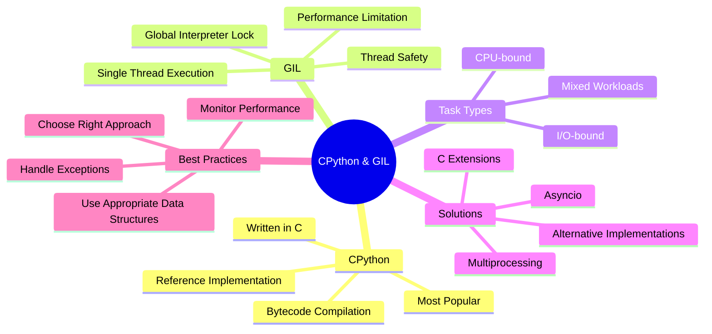

**Diagram Explanation**: This mind map summarizes all the core concepts of CPython and the GIL, their relationships, and solutions.

### Key Takeaways

1. **CPython is the reference implementation** of Python, written in C
2. **The GIL ensures thread safety** but limits parallelism for CPU-bound tasks
3. **Task type determines the best approach**: CPU-bound vs I/O-bound
4. **Multiprocessing bypasses the GIL** for true parallelism
5. **Asyncio provides single-threaded concurrency** for I/O-bound tasks
6. **C extensions can release the GIL** during execution
7. **Alternative implementations** like Jython and IronPython don't have a GIL

### When to Use Each Approach

| Task Type | Approach | Reason |
|-----------|----------|---------|
| **CPU-bound** | Multiprocessing | Bypasses GIL, true parallelism |
| **I/O-bound** | Threading/Asyncio | GIL is released during I/O |
| **Mixed** | Asyncio + Multiprocessing | Best of both worlds |
| **Performance Critical** | C Extensions | Release GIL, C performance |

### Performance Guidelines

- **CPU-bound tasks**: Use multiprocessing for true parallelism
- **I/O-bound tasks**: Use threading or asyncio for concurrency
- **Mixed workloads**: Combine asyncio with multiprocessing
- **Performance critical**: Consider C extensions or alternative implementations

## Useful Links

### Official Documentation
- [Python Documentation](https://docs.python.org/3/)
- [CPython Source Code](https://github.com/python/cpython)
- [GIL Documentation](https://docs.python.org/3/glossary.html#term-global-interpreter-lock)
- [Multiprocessing Documentation](https://docs.python.org/3/library/multiprocessing.html)
- [Asyncio Documentation](https://docs.python.org/3/library/asyncio.html)

### Python Implementations
- [PyPy](https://pypy.org/) - Just-in-time compiler
- [Jython](https://www.jython.org/) - Python on JVM
- [IronPython](https://ironpython.net/) - Python on .NET
- [MicroPython](https://micropython.org/) - Python for microcontrollers

### Learning Resources
- [Real Python GIL Guide](https://realpython.com/python-gil/)
- [Python Concurrency Patterns](https://docs.python.org/3/library/concurrent.futures.html)
- [Asyncio Tutorial](https://docs.python.org/3/library/asyncio-task.html)
- [Multiprocessing Best Practices](https://docs.python.org/3/library/multiprocessing.html#programming-guidelines)

### Tools and Libraries
- [NumPy](https://numpy.org/) - C extensions that release GIL
- [Pandas](https://pandas.pydata.org/) - Data processing with C extensions
- [aiohttp](https://aiohttp.readthedocs.io/) - Async HTTP client/server
- [concurrent.futures](https://docs.python.org/3/library/concurrent.futures.html) - High-level concurrency

---

**Note**: This comprehensive guide covers the fundamentals of CPython and the GIL. For advanced topics like custom C extensions, performance profiling, and specific optimization techniques, refer to the official Python documentation and specialized resources.

---
