# [Lesson 18: Docstrings & MkDocs](https://colab.research.google.com/drive/1oSRS37pA_YVZGSaeT3YQbWbGhOs3JUTt?usp=sharing)

## Table of Contents
1. [Introduction to Documentation](#introduction-to-documentation)
2. [What are Docstrings?](#what-are-docstrings)
3. [Docstring Syntax and Formats](#docstring-syntax-and-formats)
4. [Where to Use Docstrings](#where-to-use-docstrings)
5. [Accessing Docstrings](#accessing-docstrings)
6. [Docstring Best Practices](#docstring-best-practices)
7. [Introduction to MkDocs](#introduction-to-mkdocs)
8. [MkDocs Installation and Setup](#mkdocs-installation-and-setup)
9. [Writing Content with MkDocs](#writing-content-with-mkdocs)
10. [Customizing with Themes](#customizing-with-themes)
11. [Navigation and Structure](#navigation-and-structure)
12. [Adding Plugins](#adding-plugins)
13. [Search Functionality](#search-functionality)
14. [Deployment Options](#deployment-options)
15. [Advanced Features](#advanced-features)
16. [Real-world Examples](#real-world-examples)
17. [Best Practices](#best-practices)
18. [Key Concepts Summary](#key-concepts-summary)
19. [Useful Links](#useful-links)

---

## Introduction to Documentation

> "It doesn't matter how good your software is, because if the documentation is not good enough, people will not use it."
> 
> — *[Daniele Procida](https://www.divio.com/en/blog/documentation/)*

Documentation is the bridge between your code and its users. It's not just about explaining what your code does, but about making it accessible, understandable, and maintainable. In Python, documentation takes two main forms: **Docstrings** (inline documentation) and **MkDocs** (external documentation websites).

### Documentation Overview

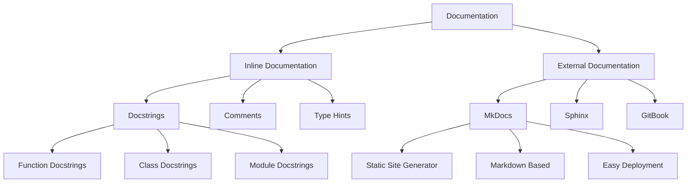

**Diagram Explanation**: This comprehensive diagram illustrates the complete documentation ecosystem in Python. It shows how documentation is divided into two main categories:

- **Inline Documentation** (left branch): Documentation that lives within the code itself, including docstrings (the primary focus), comments for implementation details, and type hints for parameter documentation.

- **External Documentation** (right branch): Standalone documentation websites and tools, with MkDocs being the main focus, alongside alternatives like Sphinx and GitBook.

The diagram also shows the specific components of each type, such as function/class/module docstrings for inline documentation, and static site generation, markdown-based writing, and easy deployment features for external documentation tools.

### Why Documentation Matters

- **Code Understanding**: Helps developers understand code quickly
- **Maintenance**: Makes code easier to maintain and update
- **Collaboration**: Enables better team collaboration
- **User Experience**: Improves user experience and adoption
- **Professional Standards**: Meets industry best practices

### Documentation Types

| Type | Purpose | Audience | Tools |
|------|---------|----------|-------|
| **Inline** | Explain code functionality | Developers | Docstrings, Comments |
| **API** | Document interfaces | API users | Sphinx, MkDocs |
| **User** | Guide end users | End users | MkDocs, GitBook |
| **Technical** | Deep technical details | Advanced users | Sphinx, MkDocs |

## What are Docstrings?

Docstrings are string literals that appear as the first statement in a function, class, or module. They serve as built-in documentation that explains what the code does, how to use it, and what to expect from it.

### Docstring Overview

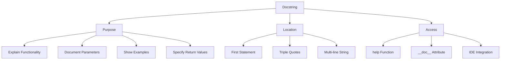

**Diagram Explanation**: This diagram provides a complete overview of docstrings by breaking them down into three essential dimensions:

- **Purpose** (top branch): Shows what docstrings are designed to accomplish - explaining functionality, documenting parameters, providing examples, and specifying return values. This is the "what" of docstrings.

- **Location** (middle branch): Demonstrates where docstrings are placed in code - as the first statement, using triple quotes, and as multi-line strings. This is the "where" of docstrings.

- **Access** (bottom branch): Illustrates how docstrings can be retrieved and used - through the help() function, the __doc__ attribute, and IDE integration. This is the "how" of docstrings.

This three-dimensional view helps developers understand not just what docstrings are, but how they fit into the development workflow and how they can be effectively utilized.

### Key Features of Docstrings

1. **Multi-line Strings**: Written using triple quotes (`"""..."""` or `'''...'''`)
2. **First Statement**: Must be the first statement in the function/class/module
3. **Accessible**: Can be accessed via `help()` or `.__doc__` attribute
4. **Tool Integration**: Used by documentation generators like Sphinx
5. **IDE Support**: Displayed in IDEs and code editors

### Basic Docstring Example

```python
def greet(name):
    """
    This function greets the user.
    
    Args:
        name (str): The name of the person to greet
        
    Returns:
        None
        
    Example:
        >>> greet("Alice")
        Hello, Alice!
    """
    print(f"Hello, {name}!")

# Access the docstring
print("greet.__doc__ =", greet.__doc__)
print("\nhelp() =")
help(greet)
```

### Docstring vs Comments

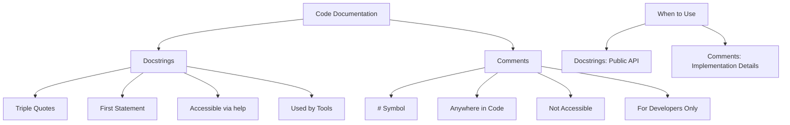

**Diagram Explanation**: This diagram provides a clear comparison between docstrings and comments, two fundamental documentation approaches in Python:

- **Docstrings** (left branch): Formal documentation that follows specific conventions - uses triple quotes, must be the first statement, is accessible via help() function, and is used by documentation generation tools. These are for public API documentation.

- **Comments** (right branch): Informal documentation that uses the # symbol, can be placed anywhere in code, is not accessible programmatically, and is primarily for developers reading the source code. These are for implementation details and internal explanations.

- **When to Use** (bottom section): The diagram also shows the decision criteria - use docstrings for public APIs that users will interact with, and use comments for implementation details that explain how the code works internally.

This distinction is crucial for maintaining clean, professional code that serves both end users and fellow developers.

## Docstring Syntax and Formats

Python supports several docstring formats, each with its own conventions and advantages. The choice of format depends on your project's needs and team preferences.

### Docstring Formats Overview

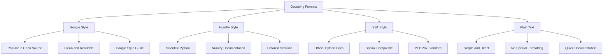

**Diagram Explanation**: This diagram presents the four main docstring formats available in Python, each with distinct characteristics and use cases:

- **Google Style** (top left): Popular in open-source projects, known for clean and readable syntax, following Google's style guide. Best for general Python projects.

- **NumPy Style** (top right): Specifically designed for scientific Python projects, used extensively in NumPy documentation, with detailed sections for comprehensive documentation. Ideal for scientific computing.

- **reST Style** (bottom left): The official Python documentation format, compatible with Sphinx and other documentation generators, following PEP 287 standard. Best for official documentation.

- **Plain Text** (bottom right): Simple and direct approach with no special formatting, suitable for quick documentation without complex structure. Good for simple projects.

Each format has different levels of tool support, learning curves, and suitability for different types of projects, making the choice dependent on your specific needs and team preferences.

### 1. Google Style

**Definition**: Google Style is a popular docstring format that's clean, readable, and widely adopted in open-source projects.

```python
def calculate_area(length, width):
    """Calculate the area of a rectangle.
    
    Args:
        length (float): The length of the rectangle
        width (float): The width of the rectangle
        
    Returns:
        float: The area of the rectangle
        
    Raises:
        ValueError: If length or width is negative
        
    Example:
        >>> calculate_area(5.0, 3.0)
        15.0
        >>> calculate_area(-1, 2)
        Traceback (most recent call last):
        ...
        ValueError: Length and width must be positive
    """
    if length < 0 or width < 0:
        raise ValueError("Length and width must be positive")
    return length * width
```

### 2. NumPy Style

**Definition**: NumPy Style is commonly used in scientific Python projects and provides detailed sections for comprehensive documentation.

```python
def calculate_area(length, width):
    """Calculate the area of a rectangle.
    
    Parameters
    ----------
    length : float
        The length of the rectangle
    width : float
        The width of the rectangle
        
    Returns
    -------
    float
        The area of the rectangle
        
    Raises
    ------
    ValueError
        If length or width is negative
        
    Examples
    --------
    >>> calculate_area(5.0, 3.0)
    15.0
    >>> calculate_area(-1, 2)
    Traceback (most recent call last):
    ...
    ValueError: Length and width must be positive
    
    Notes
    -----
    This function uses the standard formula: area = length * width
    
    See Also
    --------
    calculate_perimeter : Calculate the perimeter of a rectangle
    """
    if length < 0 or width < 0:
        raise ValueError("Length and width must be positive")
    return length * width
```

### 3. reST (reStructuredText) Style

**Definition**: reST Style is the official Python documentation format, compatible with Sphinx and other documentation generators.

```python
def calculate_area(length, width):
    """Calculate the area of a rectangle.
    
    :param length: The length of the rectangle
    :type length: float
    :param width: The width of the rectangle
    :type width: float
    :returns: The area of the rectangle
    :rtype: float
    :raises ValueError: If length or width is negative
    
    .. note::
        This function uses the standard formula: area = length * width
        
    .. warning::
        Negative values will raise a ValueError
        
    Example::
    
        >>> calculate_area(5.0, 3.0)
        15.0
    """
    if length < 0 or width < 0:
        raise ValueError("Length and width must be positive")
    return length * width
```

### 4. Plain Text Style

**Definition**: Plain Text Style is simple and direct, suitable for quick documentation without special formatting.

```python
def calculate_area(length, width):
    """Calculate the area of a rectangle.
    
    Takes length and width as parameters and returns the area.
    Both parameters must be positive numbers.
    """
    if length < 0 or width < 0:
        raise ValueError("Length and width must be positive")
    return length * width
```

### Format Comparison

| Feature | Google | NumPy | reST | Plain Text |
|---------|--------|-------|------|------------|
| **Readability** | High | High | Medium | High |
| **Tool Support** | Good | Excellent | Excellent | Basic |
| **Learning Curve** | Easy | Medium | Hard | Easy |
| **Scientific Use** | Good | Excellent | Good | Basic |
| **Sphinx Support** | Good | Excellent | Excellent | Basic |

## Where to Use Docstrings

Docstrings can be used in various places in your Python code. Each location serves a specific purpose and follows certain conventions.

### Docstring Locations

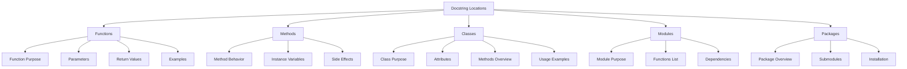

**Diagram Explanation**: This diagram shows where docstrings can be used in Python code and what each location should document.

### 1. Function Docstrings

**Definition**: Function docstrings explain what a function does, its parameters, return values, and provide usage examples.

```python
def fibonacci(n):
    """Calculate the nth Fibonacci number.
    
    Args:
        n (int): The position in the Fibonacci sequence (0-indexed)
        
    Returns:
        int: The nth Fibonacci number
        
    Raises:
        ValueError: If n is negative
        
    Example:
        >>> fibonacci(0)
        0
        >>> fibonacci(10)
        55
    """
    if n < 0:
        raise ValueError("n must be non-negative")
    if n <= 1:
        return n
    return fibonacci(n-1) + fibonacci(n-2)
```

### 2. Method Docstrings

**Definition**: Method docstrings document class methods, including their behavior, parameters, and any side effects.

```python
class BankAccount:
    """A simple bank account class."""
    
    def __init__(self, initial_balance=0):
        """Initialize a bank account with an initial balance.
        
        Args:
            initial_balance (float): The initial balance (default: 0)
        """
        self.balance = initial_balance
    
    def deposit(self, amount):
        """Deposit money into the account.
        
        Args:
            amount (float): The amount to deposit
            
        Returns:
            float: The new balance
            
        Raises:
            ValueError: If amount is negative
        """
        if amount < 0:
            raise ValueError("Amount must be positive")
        self.balance += amount
        return self.balance
    
    def withdraw(self, amount):
        """Withdraw money from the account.
        
        Args:
            amount (float): The amount to withdraw
            
        Returns:
            float: The new balance
            
        Raises:
            ValueError: If amount is negative or exceeds balance
        """
        if amount < 0:
            raise ValueError("Amount must be positive")
        if amount > self.balance:
            raise ValueError("Insufficient funds")
        self.balance -= amount
        return self.balance
```

### 3. Class Docstrings

**Definition**: Class docstrings describe the class's purpose, its main attributes, and provide usage examples.

```python
class Dog:
    """A class representing a dog.
    
    This class provides basic functionality for a dog, including
    barking and basic information storage.
    
    Attributes:
        name (str): The dog's name
        breed (str): The dog's breed
        age (int): The dog's age in years
        
    Example:
        >>> my_dog = Dog("Buddy", "Golden Retriever", 3)
        >>> my_dog.bark()
        Woof! My name is Buddy
    """
    
    def __init__(self, name, breed, age):
        """Initialize a new dog.
        
        Args:
            name (str): The dog's name
            breed (str): The dog's breed
            age (int): The dog's age in years
        """
        self.name = name
        self.breed = breed
        self.age = age
    
    def bark(self):
        """Make the dog bark."""
        print(f"Woof! My name is {self.name}")
    
    def get_info(self):
        """Get information about the dog.
        
        Returns:
            str: A formatted string with dog information
        """
        return f"{self.name} is a {self.age}-year-old {self.breed}"
```

### 4. Module Docstrings

**Definition**: Module docstrings are placed at the top of a file and describe the module's purpose, its main functions, and dependencies.

```python
"""
Math Operations Module

This module provides basic mathematical operations including
addition, subtraction, multiplication, and division.

Functions:
    add(a, b): Add two numbers
    subtract(a, b): Subtract b from a
    multiply(a, b): Multiply two numbers
    divide(a, b): Divide a by b

Dependencies:
    - math: For advanced mathematical functions

Example:
    >>> import math_ops
    >>> result = math_ops.add(5, 3)
    >>> print(result)
    8

Author: Your Name
Version: 1.0.0
"""

import math

def add(a, b):
    """Add two numbers."""
    return a + b

def subtract(a, b):
    """Subtract b from a."""
    return a - b

def multiply(a, b):
    """Multiply two numbers."""
    return a * b

def divide(a, b):
    """Divide a by b."""
    if b == 0:
        raise ValueError("Cannot divide by zero")
    return a / b
```

### 5. Package Docstrings

**Definition**: Package docstrings are placed in the `__init__.py` file and describe the package's purpose and contents.

```python
"""
Data Processing Package

This package provides tools for data processing, analysis, and visualization.

Submodules:
    - data_loader: Functions for loading data from various sources
    - data_cleaner: Functions for cleaning and preprocessing data
    - data_analyzer: Functions for statistical analysis
    - data_visualizer: Functions for creating charts and graphs

Installation:
    pip install data-processing

Usage:
    >>> import data_processing as dp
    >>> data = dp.load_csv('data.csv')
    >>> cleaned_data = dp.clean_data(data)
    >>> analysis = dp.analyze_data(cleaned_data)

Author: Data Team
Version: 2.1.0
License: MIT
"""

from .data_loader import load_csv, load_json, load_excel
from .data_cleaner import clean_data, remove_duplicates, handle_missing
from .data_analyzer import analyze_data, get_statistics, find_patterns
from .data_visualizer import create_chart, plot_distribution, generate_report

__version__ = "2.1.0"
__author__ = "Data Team"
__all__ = [
    "load_csv", "load_json", "load_excel",
    "clean_data", "remove_duplicates", "handle_missing",
    "analyze_data", "get_statistics", "find_patterns",
    "create_chart", "plot_distribution", "generate_report"
]
```

## Accessing Docstrings

There are several ways to access and view docstrings in Python. Understanding these methods is crucial for effective code exploration and documentation usage.

### Access Methods

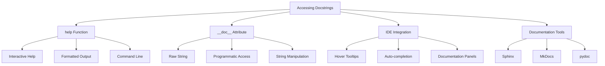

**Diagram Explanation**: This diagram shows the different ways to access docstrings in Python, from interactive help to documentation generation tools.

### 1. Using the `help()` Function

**Definition**: The `help()` function provides interactive help information, including docstrings, in a formatted manner.

```python
def calculate_area(length, width):
    """Calculate the area of a rectangle.
    
    Args:
        length (float): The length of the rectangle
        width (float): The width of the rectangle
        
    Returns:
        float: The area of the rectangle
        
    Example:
        >>> calculate_area(5.0, 3.0)
        15.0
    """
    return length * width

# Using help() function
help(calculate_area)

# Output:
# Help on function calculate_area in module __main__:
# 
# calculate_area(length, width)
#     Calculate the area of a rectangle.
#     
#     Args:
#         length (float): The length of the rectangle
#         width (float): The width of the rectangle
#         
#     Returns:
#         float: The area of the rectangle
#         
#     Example:
#         >>> calculate_area(5.0, 3.0)
#         15.0
```

### 2. Using the `__doc__` Attribute

**Definition**: The `__doc__` attribute provides direct access to the raw docstring as a string.

```python
def calculate_area(length, width):
    """Calculate the area of a rectangle.
    
    Args:
        length (float): The length of the rectangle
        width (float): The width of the rectangle
        
    Returns:
        float: The area of the rectangle
    """
    return length * width

# Accessing __doc__ attribute
print("Raw docstring:")
print(repr(calculate_area.__doc__))

print("\nFormatted docstring:")
print(calculate_area.__doc__)

# Output:
# Raw docstring:
# 'Calculate the area of a rectangle.\n    \n    Args:\n        length (float): The length of the rectangle\n        width (float): The width of the rectangle\n        \n    Returns:\n        float: The area of the rectangle'
# 
# Formatted docstring:
# Calculate the area of a rectangle.
#     
#     Args:
#         length (float): The length of the rectangle
#         width (float): The width of the rectangle
#         
#     Returns:
#         float: The area of the rectangle
```

### 3. Accessing Module Docstrings

**Definition**: Module docstrings can be accessed using the same methods as function docstrings.

```python
# math_operations.py
"""
Math Operations Module

This module provides basic mathematical operations.
"""

import math

def add(a, b):
    """Add two numbers."""
    return a + b

# Accessing module docstring
import math_operations

print("Module docstring:")
print(math_operations.__doc__)

print("\nModule help:")
help(math_operations)
```

### 4. Accessing Class and Method Docstrings

**Definition**: Class and method docstrings follow the same access patterns as functions.

```python
class Calculator:
    """A simple calculator class."""
    
    def __init__(self):
        """Initialize the calculator."""
        self.history = []
    
    def add(self, a, b):
        """Add two numbers and store in history."""
        result = a + b
        self.history.append(f"{a} + {b} = {result}")
        return result

# Accessing class docstring
print("Class docstring:")
print(Calculator.__doc__)

# Accessing method docstring
print("\nMethod docstring:")
print(Calculator.add.__doc__)

# Using help() for class
print("\nClass help:")
help(Calculator)
```

### 5. Programmatic Docstring Access

**Definition**: Docstrings can be accessed programmatically for documentation generation and analysis.

```python
import inspect

def analyze_function(func):
    """Analyze a function's docstring.
    
    Args:
        func: The function to analyze
        
    Returns:
        dict: Analysis results
    """
    docstring = func.__doc__
    signature = inspect.signature(func)
    
    return {
        "name": func.__name__,
        "docstring": docstring,
        "signature": str(signature),
        "has_docstring": docstring is not None,
        "docstring_length": len(docstring) if docstring else 0
    }

def example_function(x, y):
    """This is an example function.
    
    Args:
        x: First parameter
        y: Second parameter
        
    Returns:
        The sum of x and y
    """
    return x + y

# Analyze the function
analysis = analyze_function(example_function)
print("Function Analysis:")
for key, value in analysis.items():
    print(f"{key}: {value}")
```

### 6. Interactive Documentation

**Definition**: Python's interactive shell provides convenient ways to explore documentation.

```python
# In Python interactive shell or Jupyter notebook

# Get help for built-in functions
help(len)
help(print)

# Get help for modules
import os
help(os)

# Get help for specific functions
help(os.path.join)

# Get help for classes
help(list)

# Get help for methods
help(list.append)
```

### 7. Documentation Generation

**Definition**: Docstrings can be used to generate comprehensive documentation using tools like Sphinx or pydoc.

```python
# Using pydoc from command line
# pydoc -w module_name  # Generate HTML documentation
# pydoc -p 8080         # Start documentation server

# Using pydoc programmatically
import pydoc

def generate_docs(module_name):
    """Generate documentation for a module."""
    try:
        module = __import__(module_name)
        doc = pydoc.HTMLDoc()
        html = doc.document(module)
        return html
    except ImportError:
        return f"Module {module_name} not found"

# Example usage
# html_docs = generate_docs("math_operations")
# print(html_docs)
```

## Docstring Best Practices

Following best practices ensures that your docstrings are effective, consistent, and useful for both developers and documentation tools.

### Best Practices Overview

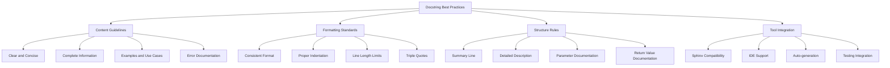

**Diagram Explanation**: This diagram shows the key areas of docstring best practices: content guidelines, formatting standards, structure rules, and tool integration.

### 1. Content Guidelines

**Definition**: Effective docstrings should be clear, complete, and provide all necessary information for users.

```python
def calculate_compound_interest(principal, rate, time, compound_frequency=12):
    """Calculate compound interest for an investment.
    
    This function calculates the compound interest earned on an investment
    using the standard compound interest formula:
    A = P(1 + r/n)^(nt)
    
    Args:
        principal (float): The initial amount of money invested
        rate (float): The annual interest rate (as a decimal, e.g., 0.05 for 5%)
        time (float): The time the money is invested for, in years
        compound_frequency (int, optional): Number of times interest is compounded per year. Defaults to 12.
        
    Returns:
        float: The final amount after compound interest
        
    Raises:
        ValueError: If principal, rate, or time is negative
        TypeError: If any parameter is not a number
        
    Example:
        >>> calculate_compound_interest(1000, 0.05, 2)
        1104.7130674412967
        >>> calculate_compound_interest(1000, 0.05, 2, 1)  # Annual compounding
        1102.5
        
    Note:
        The rate should be provided as a decimal (0.05 for 5%), not as a percentage.
        
    See Also:
        calculate_simple_interest: For simple interest calculations
    """
    if not all(isinstance(x, (int, float)) for x in [principal, rate, time, compound_frequency]):
        raise TypeError("All parameters must be numbers")
    
    if principal < 0 or rate < 0 or time < 0:
        raise ValueError("Principal, rate, and time must be non-negative")
    
    return principal * (1 + rate / compound_frequency) ** (compound_frequency * time)
```

### 2. Formatting Standards

**Definition**: Consistent formatting makes docstrings easier to read and maintain.

```python
def process_data(data, options=None):
    """Process input data according to specified options.
    
    This function takes raw data and processes it according to the
    provided options, returning cleaned and formatted data.
    
    Args:
        data (list or dict): The input data to process
        options (dict, optional): Processing options. Defaults to None.
            Available options:
                - 'clean': Remove invalid entries (default: True)
                - 'sort': Sort the data (default: False)
                - 'format': Output format ('list' or 'dict', default: 'list')
                
    Returns:
        list or dict: The processed data in the specified format
        
    Raises:
        ValueError: If data is empty or invalid
        TypeError: If data is not a list or dict
        
    Example:
        >>> data = [1, 2, None, 4, 5]
        >>> options = {'clean': True, 'sort': True}
        >>> process_data(data, options)
        [1, 2, 4, 5]
        
        >>> process_data({'a': 1, 'b': 2}, {'format': 'dict'})
        {'a': 1, 'b': 2}
    """
    if not data:
        raise ValueError("Data cannot be empty")
    
    if not isinstance(data, (list, dict)):
        raise TypeError("Data must be a list or dict")
    
    # Default options
    if options is None:
        options = {'clean': True, 'sort': False, 'format': 'list'}
    
    # Process data based on options
    processed_data = data.copy()
    
    if options.get('clean', True):
        if isinstance(processed_data, list):
            processed_data = [item for item in processed_data if item is not None]
        else:
            processed_data = {k: v for k, v in processed_data.items() if v is not None}
    
    if options.get('sort', False):
        if isinstance(processed_data, list):
            processed_data.sort()
        else:
            processed_data = dict(sorted(processed_data.items()))
    
    return processed_data
```

### 3. Structure Rules

**Definition**: Well-structured docstrings follow a consistent pattern that makes them easy to read and understand.

```python
def create_user(username, email, role='user', **kwargs):
    """Create a new user account.
    
    This function creates a new user account with the specified username
    and email address. Additional user attributes can be provided as
    keyword arguments.
    
    Args:
        username (str): The unique username for the account
        email (str): The user's email address
        role (str, optional): The user's role. Must be one of:
            - 'user': Regular user (default)
            - 'admin': Administrator
            - 'moderator': Moderator
        **kwargs: Additional user attributes (e.g., first_name, last_name)
        
    Returns:
        dict: A dictionary containing the created user information:
            - 'id': Unique user ID
            - 'username': The username
            - 'email': The email address
            - 'role': The user role
            - 'created_at': Timestamp of creation
            - Additional attributes from kwargs
            
    Raises:
        ValueError: If username or email is invalid
        TypeError: If required parameters are not strings
        
    Example:
        >>> user = create_user('john_doe', 'john@example.com')
        >>> print(user['username'])
        john_doe
        
        >>> admin = create_user('admin', 'admin@example.com', 'admin', 
        ...                    first_name='Admin', last_name='User')
        >>> print(admin['role'])
        admin
        
    Note:
        The username must be unique across all users. If a username
        already exists, a ValueError will be raised.
        
    See Also:
        update_user: Update an existing user
        delete_user: Delete a user account
    """
    if not isinstance(username, str) or not isinstance(email, str):
        raise TypeError("Username and email must be strings")
    
    if not username or not email:
        raise ValueError("Username and email cannot be empty")
    
    if '@' not in email:
        raise ValueError("Invalid email format")
    
    if role not in ['user', 'admin', 'moderator']:
        raise ValueError("Role must be 'user', 'admin', or 'moderator'")
    
    # Create user object
    user = {
        'id': f"user_{len(username)}_{hash(email) % 10000}",
        'username': username,
        'email': email,
        'role': role,
        'created_at': '2024-01-01T00:00:00Z',
        **kwargs
    }
    
    return user
```

### 4. Testing Integration

**Definition**: Docstrings can be integrated with testing frameworks to ensure examples work correctly.

```python
def fibonacci(n):
    """Calculate the nth Fibonacci number.
    
    Args:
        n (int): The position in the Fibonacci sequence (0-indexed)
        
    Returns:
        int: The nth Fibonacci number
        
    Raises:
        ValueError: If n is negative
        
    Example:
        >>> fibonacci(0)
        0
        >>> fibonacci(1)
        1
        >>> fibonacci(10)
        55
        >>> fibonacci(-1)
        Traceback (most recent call last):
        ...
        ValueError: n must be non-negative
    """
    if n < 0:
        raise ValueError("n must be non-negative")
    if n <= 1:
        return n
    return fibonacci(n-1) + fibonacci(n-2)

# Test the docstring examples
if __name__ == "__main__":
    import doctest
    doctest.testmod()
```

## Introduction to MkDocs

MkDocs is a static site generator that turns Markdown files into a professional documentation website. It's lightweight, customizable, and perfect for developers, technical writers, and open-source projects.

### MkDocs Overview

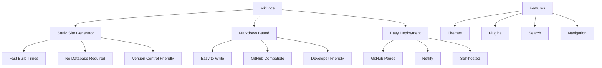

**Diagram Explanation**: This diagram provides a comprehensive overview of MkDocs by breaking it down into its core characteristics and features:

- **Static Site Generator** (top left): MkDocs generates static HTML files, resulting in fast build times, no database requirements, and version control friendly documentation.

- **Markdown Based** (top right): MkDocs uses Markdown for content creation, making it easy to write, GitHub compatible, and developer friendly.

- **Easy Deployment** (bottom left): MkDocs supports multiple deployment options including GitHub Pages, Netlify, and self-hosted solutions.

- **Features** (bottom right): MkDocs offers rich functionality including customizable themes, extensive plugin ecosystem, built-in search capabilities, and flexible navigation systems.

This diagram helps developers understand why MkDocs is an excellent choice for documentation projects, highlighting its simplicity, flexibility, and powerful features that make it suitable for projects of all sizes.

### Why Choose MkDocs?

- **Simple**: Easy to set up and use
- **Fast**: Quick build times and fast loading
- **Flexible**: Customizable themes and plugins
- **Markdown**: Write documentation in familiar Markdown
- **Version Control**: Works well with Git
- **Free Hosting**: Deploy for free on GitHub Pages, Netlify, etc.

### MkDocs vs Other Tools

| Feature | MkDocs | Sphinx | GitBook | Docusaurus |
|---------|--------|--------|---------|------------|
| **Learning Curve** | Easy | Hard | Easy | Medium |
| **Markdown Support** | Excellent | Good | Excellent | Good |
| **Themes** | Many | Limited | Limited | Good |
| **Plugins** | Many | Many | Limited | Good |
| **Deployment** | Easy | Medium | Easy | Easy |
| **Python Integration** | Good | Excellent | Limited | Limited |

## MkDocs Installation and Setup

Setting up MkDocs is straightforward and can be done in just a few steps.

### Installation Process

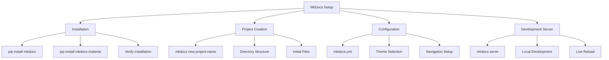

**Diagram Explanation**: This diagram shows the step-by-step process of setting up MkDocs from installation to running the development server.

### 1. Installation

**Definition**: Install MkDocs and its dependencies using pip.

```bash
# Basic installation
pip install mkdocs

# Install Material theme (recommended)
pip install mkdocs-material

# Install additional plugins
pip install mkdocs-awesome-pages-plugin
pip install mkdocs-minify-plugin

# Verify installation
mkdocs --version
```

### 2. Project Creation

**Definition**: Create a new MkDocs project with the basic structure.

```bash
# Create a new project
mkdocs new my-docs

# Navigate to the project directory
cd my-docs

# View the project structure
ls -la
```

### 3. Project Structure

**Definition**: Understanding the default project structure helps you organize your documentation.

```
my-docs/
├── docs/                    # Documentation source files
│   └── index.md            # Homepage
├── mkdocs.yml              # Configuration file
└── site/                   # Generated site (created after build)
    ├── index.html
    ├── css/
    ├── js/
    └── ...
```

### 4. Basic Configuration

**Definition**: Configure MkDocs using the `mkdocs.yml` file.

```yaml
# mkdocs.yml
site_name: My Project Documentation
site_description: A comprehensive guide to my project
site_author: Your Name
site_url: https://your-username.github.io/my-docs

# Repository
repo_name: your-username/my-docs
repo_url: https://github.com/your-username/my-docs

# Theme
theme:
  name: material
  features:
    - navigation.tabs
    - navigation.sections
    - navigation.expand
    - navigation.top
    - search.highlight
    - search.share
  palette:
    - scheme: default
      primary: indigo
      accent: indigo
      toggle:
        icon: material/brightness-7
        name: Switch to dark mode
    - scheme: slate
      primary: indigo
      accent: indigo
      toggle:
        icon: material/brightness-4
        name: Switch to light mode

# Navigation
nav:
  - Home: index.md
  - User Guide:
      - Installation: guide/installation.md
      - Quick Start: guide/quickstart.md
      - Configuration: guide/configuration.md
  - API Reference: api.md
  - Contributing: contributing.md

# Plugins
plugins:
  - search
  - awesome-pages

# Markdown extensions
markdown_extensions:
  - pymdownx.highlight:
      anchor_linenums: true
  - pymdownx.inlinehilite
  - pymdownx.superfences
  - pymdownx.tabbed:
      alternate_style: true
  - admonition
  - pymdownx.details
  - pymdownx.superfences
  - attr_list
  - md_in_html
  - toc:
      permalink: true
```

### 5. Development Server

**Definition**: Start the development server to preview your documentation.

```bash
# Start the development server
mkdocs serve

# Start with specific host and port
mkdocs serve --dev-addr 0.0.0.0:8000

# Start with live reload
mkdocs serve --livereload
```

### 6. Building the Site

**Definition**: Build the static site for deployment.

```bash
# Build the site
mkdocs build

# Build with verbose output
mkdocs build --verbose

# Clean the site directory before building
mkdocs build --clean
```

### 7. Project Structure Example

**Definition**: A complete example of a well-organized MkDocs project.

```
my-docs/
├── docs/
│   ├── index.md                    # Homepage
│   ├── guide/
│   │   ├── installation.md
│   │   ├── quickstart.md
│   │   └── configuration.md
│   ├── api/
│   │   ├── index.md
│   │   ├── functions.md
│   │   └── classes.md
│   ├── examples/
│   │   ├── basic-usage.md
│   │   └── advanced-examples.md
│   ├── contributing.md
│   └── changelog.md
├── mkdocs.yml                      # Configuration
├── requirements.txt                # Dependencies
└── README.md                       # Project README
```

### 8. Initial Content

**Definition**: Create the initial content for your documentation.

```markdown
<!-- docs/index.md -->
# Welcome to My Project

Welcome to the documentation for My Project! This guide will help you get started with using our amazing tool.

## Quick Start

Get up and running in minutes:

1. **Install** the package
2. **Configure** your settings
3. **Start** using the features

```python
import my_project

# Initialize the project
project = my_project.Project()

# Start using it
result = project.process_data("example")
print(result)
```

## Features

- 🚀 **Fast Performance** - Optimized for speed
- 🔧 **Easy Configuration** - Simple setup process
- 📚 **Comprehensive Documentation** - Everything you need to know
- 🤝 **Community Support** - Active community and support

## What's Next?

- [Installation Guide](guide/installation.md) - Learn how to install the project
- [Quick Start](guide/quickstart.md) - Get started quickly
- [API Reference](api/index.md) - Detailed API documentation

---

## Writing Content with MkDocs

MkDocs uses Markdown for content creation, making it easy to write and maintain documentation.

### Markdown Features

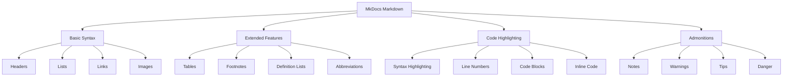

**Diagram Explanation**: This diagram illustrates the comprehensive Markdown capabilities available in MkDocs, organized into four main categories:

- **Basic Syntax** (top left): Fundamental Markdown elements including headers, lists, links, and images. These are the building blocks of any Markdown document.

- **Extended Features** (top right): Advanced Markdown features like tables, footnotes, definition lists, and abbreviations that enhance document structure and readability.

- **Code Highlighting** (bottom left): Code-related features including syntax highlighting, line numbers, code blocks, and inline code formatting for technical documentation.

- **Admonitions** (bottom right): Special callout boxes for notes, warnings, tips, and danger messages that help draw attention to important information.

This diagram helps content creators understand the full range of formatting options available in MkDocs, from simple text formatting to sophisticated documentation features that make content more engaging and informative.

### Basic Markdown Syntax

```markdown
# Header 1
## Header 2
### Header 3

**Bold text** and *italic text*

- Bullet point 1
- Bullet point 2
  - Nested bullet point

1. Numbered list item 1
2. Numbered list item 2

[Link text](https://example.com)


`inline code`

```python
# Code block
def hello():
    print("Hello, MkDocs!")
```

> Blockquote text

---

Horizontal rule
```

### Admonitions (Callouts)

```markdown
!!! note "Note Title"
    This is a note with a title.

!!! tip
    This is a tip without a title.

!!! warning "Warning"
    This is a warning message.

!!! danger "Danger"
    This is a danger message.

!!! info "Information"
    This is an information message.
```

### Code Blocks with Syntax Highlighting

```python
def calculate_fibonacci(n):
    """Calculate the nth Fibonacci number.
    
    Args:
        n (int): The position in the sequence
        
    Returns:
        int: The Fibonacci number
    """
    if n <= 1:
        return n
    return calculate_fibonacci(n-1) + calculate_fibonacci(n-2)

# Example usage
result = calculate_fibonacci(10)
print(f"Fibonacci(10) = {result}")
```

### Tables

```markdown
| Feature | MkDocs | Sphinx | GitBook |
|---------|--------|--------|---------|
| Learning Curve | Easy | Hard | Easy |
| Markdown Support | Excellent | Good | Excellent |
| Themes | Many | Limited | Limited |
| Plugins | Many | Many | Limited |
```

### Navigation and Structure

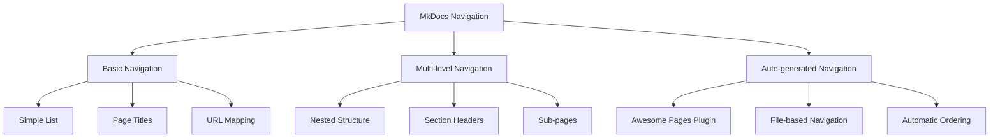

**Diagram Explanation**: This diagram shows the different navigation options available in MkDocs.

### Navigation Configuration

```yaml
# mkdocs.yml
nav:
  - Home: index.md
  - User Guide:
      - Installation: guide/installation.md
      - Quick Start: guide/quickstart.md
      - Configuration: guide/configuration.md
  - API Reference:
      - Functions: api/functions.md
      - Classes: api/classes.md
      - Modules: api/modules.md
  - Examples:
      - Basic Usage: examples/basic.md
      - Advanced Examples: examples/advanced.md
  - Contributing: contributing.md
  - Changelog: changelog.md
```

## Customizing with Themes

MkDocs supports various themes to customize the appearance of your documentation.

### Popular Themes

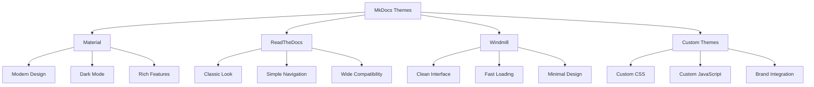

**Diagram Explanation**: This diagram shows the popular MkDocs themes and their characteristics.

### Material Theme Configuration

```yaml
# mkdocs.yml
theme:
  name: material
  features:
    - navigation.tabs
    - navigation.sections
    - navigation.expand
    - navigation.top
    - search.highlight
    - search.share
    - content.code.copy
    - content.code.annotate
  palette:
    - scheme: default
      primary: indigo
      accent: indigo
      toggle:
        icon: material/brightness-7
        name: Switch to dark mode
    - scheme: slate
      primary: indigo
      accent: indigo
      toggle:
        icon: material/brightness-4
        name: Switch to light mode
  font:
    text: Roboto
    code: Roboto Mono
  icon:
    repo: fontawesome/brands/github
    edit: material/pencil
    view: material/eye
```

### Custom CSS and JavaScript

```yaml
# mkdocs.yml
extra_css:
  - stylesheets/custom.css
  - stylesheets/additional.css

extra_javascript:
  - javascripts/custom.js
  - javascripts/analytics.js
```

### Custom CSS Example

```css
/* stylesheets/custom.css */
:root {
  --md-primary-fg-color: #1976d2;
  --md-primary-fg-color--light: #42a5f5;
  --md-primary-fg-color--dark: #1565c0;
}

.md-header {
  background-color: var(--md-primary-fg-color);
}

.md-nav__link--active {
  font-weight: bold;
}

.md-typeset h1 {
  color: var(--md-primary-fg-color);
}

/* Custom admonition styles */
.md-typeset .admonition.note {
  border-left-color: #1976d2;
}

.md-typeset .admonition.note .admonition-title {
  background-color: rgba(25, 118, 210, 0.1);
}
```

## Adding Plugins

MkDocs supports plugins to extend functionality and add new features.

### Popular Plugins

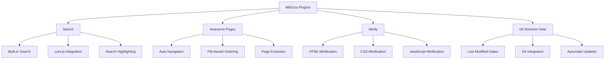

**Diagram Explanation**: This diagram shows popular MkDocs plugins and their features.

### Plugin Installation and Configuration

```bash
# Install plugins
pip install mkdocs-awesome-pages-plugin
pip install mkdocs-minify-plugin
pip install mkdocs-git-revision-date-plugin
pip install mkdocs-pdf-export-plugin
```

```yaml
# mkdocs.yml
plugins:
  - search
  - awesome-pages:
      filename: .pages
      collapse_single_pages: true
  - minify:
      minify_html: true
      minify_css: true
      minify_js: true
  - git-revision-date:
      enabled: true
      fallback_to_build_date: true
```

### Awesome Pages Plugin

```yaml
# .pages file in docs directory
nav:
  - Home: index.md
  - Guide:
      - Installation: guide/installation.md
      - Quick Start: guide/quickstart.md
      - Configuration: guide/configuration.md
  - API: api/
  - Examples: examples/
  - Contributing: contributing.md

exclude:
  - README.md
  - CHANGELOG.md
```

## Search Functionality

MkDocs includes built-in search functionality powered by Lunr.js.

### Search Configuration

```yaml
# mkdocs.yml
plugins:
  - search:
      lang: en
      separator: '[\s\-]+'
      min_search_length: 3
      prebuild_index: false
```

### Search Features

- **Full-text search**: Search across all content
- **Highlighting**: Highlight search terms in results
- **Fuzzy matching**: Find results even with typos
- **Multi-language support**: Support for various languages
- **Customizable**: Configure search behavior

## Deployment Options

MkDocs provides multiple deployment options for hosting your documentation.

### Deployment Methods

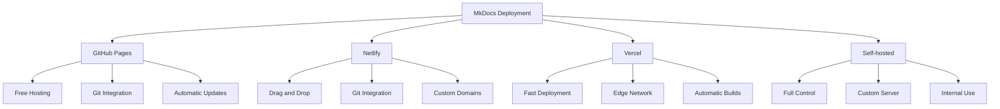

**Diagram Explanation**: This diagram shows the different deployment options for MkDocs documentation.

### GitHub Pages Deployment

```bash
# Deploy to GitHub Pages
mkdocs gh-deploy

# Deploy with custom message
mkdocs gh-deploy -m "Update documentation"

# Deploy to custom branch
mkdocs gh-deploy --remote-branch custom-branch
```

### Netlify Deployment

```yaml
# netlify.toml
[build]
  command = "mkdocs build"
  publish = "site"

[build.environment]
  PYTHON_VERSION = "3.9"

[[plugins]]
  package = "@netlify/plugin-git"
```

### Self-hosted Deployment

```bash
# Build the site
mkdocs build

# Upload to server
rsync -av site/ user@server:/var/www/docs/

# Or use scp
scp -r site/* user@server:/var/www/docs/
```

## Advanced Features

MkDocs supports advanced features for professional documentation.

### Advanced Configuration

```yaml
# mkdocs.yml
site_name: Advanced Documentation
site_description: A comprehensive guide
site_author: Your Name
site_url: https://example.com

# Repository
repo_name: username/repository
repo_url: https://github.com/username/repository
edit_uri: edit/main/docs/

# Copyright
copyright: Copyright &copy; 2024 Your Name

# Extra
extra:
  version: 1.0.0
  social:
    - icon: fontawesome/brands/github
      link: https://github.com/username
    - icon: fontawesome/brands/twitter
      link: https://twitter.com/username
    - icon: fontawesome/brands/linkedin
      link: https://linkedin.com/in/username

# Markdown extensions
markdown_extensions:
  - pymdownx.highlight:
      anchor_linenums: true
      line_spans: __span
      pygments_lang_class: true
  - pymdownx.inlinehilite
  - pymdownx.superfences:
      custom_fences:
        - name: mermaid
          class: mermaid
          format: !!python/name:pymdownx.superfences.fence_code_format
  - pymdownx.tabbed:
      alternate_style: true
  - admonition
  - pymdownx.details
  - attr_list
  - md_in_html
  - toc:
      permalink: true
      permalink_title: "Link to this section"
```

### Multi-language Support

```bash
# Install i18n plugin
pip install mkdocs-static-i18n
```

```yaml
# mkdocs.yml
plugins:
  - i18n:
      default_language: en
      languages:
        en: English
        es: Español
        fr: Français
```

### Custom Domain

```yaml
# mkdocs.yml
site_url: https://docs.example.com
```

```bash
# Add CNAME file for GitHub Pages
echo "docs.example.com" > docs/CNAME
```

## Real-world Examples

Let's explore practical examples of using MkDocs for different types of documentation.

### Example 1: API Documentation

```markdown
<!-- docs/api/functions.md -->
# API Functions

## Authentication

### `authenticate(username, password)`

Authenticate a user with username and password.

**Parameters:**
- `username` (str): The username
- `password` (str): The password

**Returns:**
- `dict`: Authentication result with token

**Example:**
```python
result = authenticate("user", "password")
print(result["token"])
```

**Raises:**
- `AuthenticationError`: If credentials are invalid
```

### Example 2: User Guide

```markdown
<!-- docs/guide/installation.md -->
# Installation

## Prerequisites

Before installing, ensure you have:

- Python 3.8 or higher
- pip package manager
- Git (optional, for development)

## Installation Methods

### Method 1: pip install

```bash
pip install my-package
```

### Method 2: From Source

```bash
git clone https://github.com/username/my-package.git
cd my-package
pip install -e .
```

### Method 3: Development Installation

```bash
git clone https://github.com/username/my-package.git
cd my-package
pip install -e ".[dev]"
```

## Verification

Test your installation:

```python
import my_package
print(my_package.__version__)
```
```

### Example 3: Contributing Guide

```markdown
<!-- docs/contributing.md -->
# Contributing

Thank you for your interest in contributing to this project!

## Getting Started

1. Fork the repository
2. Clone your fork
3. Create a feature branch
4. Make your changes
5. Submit a pull request

## Development Setup

```bash
# Clone the repository
git clone https://github.com/username/project.git
cd project

# Install development dependencies
pip install -e ".[dev]"

# Run tests
pytest

# Run linting
flake8 src/
```

## Code Style

We follow PEP 8 style guidelines. Use `black` for formatting:

```bash
black src/
```

## Submitting Changes

1. Ensure tests pass
2. Update documentation
3. Add changelog entry
4. Submit pull request
```

## Best Practices

Following best practices ensures your documentation is effective and maintainable.

### Documentation Best Practices

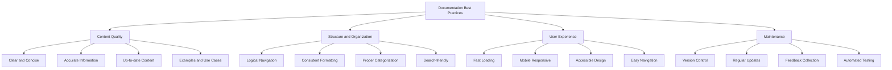

**Diagram Explanation**: This diagram presents a comprehensive framework for documentation best practices, organized into four essential pillars:

- **Content Quality** (top left): Focuses on the substance of documentation - ensuring content is clear and concise, accurate, up-to-date, and includes practical examples and use cases.

- **Structure and Organization** (top right): Emphasizes the organization of information - logical navigation, consistent formatting, proper categorization, and search-friendly content structure.

- **User Experience** (bottom left): Considers the end-user perspective - fast loading times, mobile responsiveness, accessible design, and easy navigation for optimal user experience.

- **Maintenance** (bottom right): Addresses the long-term sustainability of documentation - version control, regular updates, feedback collection, and automated testing to ensure documentation remains current and useful.

This framework provides a holistic approach to documentation that ensures both immediate usability and long-term maintainability, helping teams create documentation that truly serves their users and evolves with their projects.

### 1. Content Quality

- **Clear and Concise**: Write in simple, clear language
- **Accurate Information**: Ensure all information is correct
- **Up-to-date Content**: Keep documentation current with code changes
- **Examples and Use Cases**: Provide practical examples

### 2. Structure and Organization

- **Logical Navigation**: Organize content in a logical flow
- **Consistent Formatting**: Use consistent formatting throughout
- **Proper Categorization**: Group related content together
- **Search-friendly**: Use descriptive titles and keywords

### 3. User Experience

- **Fast Loading**: Optimize for speed
- **Mobile Responsive**: Ensure mobile compatibility
- **Accessible Design**: Follow accessibility guidelines
- **Easy Navigation**: Make it easy to find information

### 4. Maintenance

- **Version Control**: Use Git for version control
- **Regular Updates**: Update documentation regularly
- **Feedback Collection**: Collect and act on user feedback
- **Automated Testing**: Test documentation automatically

## Key Concepts Summary

Let's summarize the key concepts we've covered in this comprehensive guide to Docstrings and MkDocs.

### Core Concepts Recap

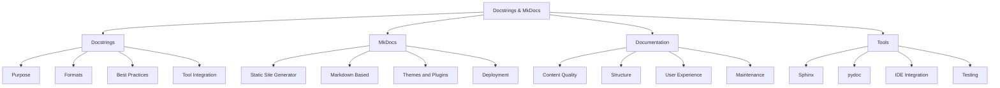

**Diagram Explanation**: This mind map summarizes all the core concepts of docstrings and MkDocs.

### Key Takeaways

1. **Docstrings are essential** for documenting Python code
2. **Multiple formats available** (Google, NumPy, reST, Plain Text)
3. **MkDocs is powerful** for creating documentation websites
4. **Markdown makes writing easy** and accessible
5. **Themes and plugins** provide customization options
6. **Multiple deployment options** available
7. **Best practices ensure** effective documentation

### When to Use Each Tool

| Tool | Use Case | Best For |
|------|----------|----------|
| **Docstrings** | Inline documentation | API documentation, code explanation |
| **MkDocs** | External documentation | User guides, tutorials, project docs |
| **Sphinx** | Complex documentation | Large projects, multiple formats |
| **pydoc** | Quick documentation | Simple HTML generation |

### Documentation Workflow

1. **Write docstrings** in your code
2. **Create MkDocs project** for external docs
3. **Organize content** logically
4. **Customize appearance** with themes
5. **Add functionality** with plugins
6. **Deploy documentation** to web
7. **Maintain and update** regularly

## Common Mistakes and Troubleshooting

### Common Docstring Mistakes

**Definition**: Understanding common pitfalls helps avoid documentation errors and ensures professional-quality docstrings.

#### 1. Missing Docstrings

```python
# ❌ Bad: No docstring
def calculate_tax(amount, rate):
    return amount * rate

# ✅ Good: Clear docstring
def calculate_tax(amount, rate):
    """Calculate tax amount based on the given amount and rate.
    
    Args:
        amount (float): The base amount to calculate tax on
        rate (float): The tax rate as a decimal (e.g., 0.1 for 10%)
        
    Returns:
        float: The calculated tax amount
    """
    return amount * rate
```

#### 2. Inconsistent Formatting

```python
# ❌ Bad: Inconsistent format
def process_data(data):
    """Process data
    Args:
        data: input data
    Returns: processed data
    """
    pass

# ✅ Good: Consistent Google style
def process_data(data):
    """Process input data according to specified rules.
    
    Args:
        data (list): The input data to process
        
    Returns:
        list: The processed data
    """
    pass
```

#### 3. Outdated Information

```python
# ❌ Bad: Outdated docstring
def get_user_data(user_id):
    """Get user data from database.
    
    Args:
        user_id (int): The user ID
        
    Returns:
        dict: User data including name and email
    """
    # Now also returns phone number, but docstring not updated
    return {"name": "John", "email": "john@example.com", "phone": "123-456-7890"}

# ✅ Good: Updated docstring
def get_user_data(user_id):
    """Get user data from database.
    
    Args:
        user_id (int): The user ID
        
    Returns:
        dict: User data including name, email, and phone number
    """
    return {"name": "John", "email": "john@example.com", "phone": "123-456-7890"}
```

### Common MkDocs Issues

#### 1. Navigation Problems

```yaml
# ❌ Bad: Incorrect file paths
nav:
  - Home: index.md
  - Guide: guide/installation.md  # File doesn't exist

# ✅ Good: Correct file paths
nav:
  - Home: index.md
  - Guide:
      - Installation: guide/installation.md
      - Quick Start: guide/quickstart.md
```

#### 2. Theme Configuration Issues

```yaml
# ❌ Bad: Incorrect theme configuration
theme:
  name: material
  features:
    - navigation.tabs
    - search.highlight
  palette:
    primary: indigo  # Missing scheme

# ✅ Good: Correct theme configuration
theme:
  name: material
  features:
    - navigation.tabs
    - search.highlight
  palette:
    - scheme: default
      primary: indigo
      accent: indigo
```

#### 3. Plugin Configuration Errors

```yaml
# ❌ Bad: Incorrect plugin syntax
plugins:
  - search:
      lang: en
      separator: '[\s\-]+'
  - awesome-pages:
      filename: .pages
      collapse_single_pages: true

# ✅ Good: Correct plugin syntax
plugins:
  - search:
      lang: en
      separator: '[\s\-]+'
  - awesome-pages:
      filename: .pages
      collapse_single_pages: true
```

### Troubleshooting Guide

#### MkDocs Build Errors

```bash
# Common error: Missing dependencies
ERROR: Could not find a version that satisfies the requirement mkdocs-material

# Solution: Install dependencies
pip install mkdocs-material

# Common error: Invalid YAML syntax
ERROR: while parsing a block mapping

# Solution: Check YAML indentation and syntax
mkdocs build --verbose
```

#### Docstring Access Issues

```python
# Common issue: Docstring not accessible
def my_function():
    # This is a comment, not a docstring
    pass

print(my_function.__doc__)  # Returns None

# Solution: Use proper docstring syntax
def my_function():
    """This is a proper docstring."""
    pass

print(my_function.__doc__)  # Returns the docstring
```

## Advanced Topics

### Custom MkDocs Plugins

**Definition**: Creating custom plugins allows you to extend MkDocs functionality for specific project needs.

```python
# custom_plugin.py
from mkdocs.plugins import BasePlugin

class CustomPlugin(BasePlugin):
    def on_page_content(self, html, page, config, files):
        # Custom processing of page content
        return html.replace("{{version}}", config.get("version", "1.0.0"))
```

### Docstring Testing

**Definition**: Testing docstrings ensures they remain accurate and examples work correctly.

```python
import doctest
import unittest

def fibonacci(n):
    """Calculate the nth Fibonacci number.
    
    Args:
        n (int): The position in the sequence
        
    Returns:
        int: The Fibonacci number
        
    Example:
        >>> fibonacci(0)
        0
        >>> fibonacci(10)
        55
    """
    if n <= 1:
        return n
    return fibonacci(n-1) + fibonacci(n-2)

# Test docstring examples
if __name__ == "__main__":
    doctest.testmod()
```

### Documentation Automation

**Definition**: Automating documentation processes ensures consistency and reduces manual work.

```yaml
# .github/workflows/docs.yml
name: Deploy Documentation

on:
  push:
    branches: [ main ]

jobs:
  deploy:
    runs-on: ubuntu-latest
    steps:
    - uses: actions/checkout@v2
    - name: Setup Python
      uses: actions/setup-python@v2
      with:
        python-version: 3.9
    - name: Install dependencies
      run: |
        pip install mkdocs mkdocs-material
    - name: Build docs
      run: mkdocs build
    - name: Deploy to GitHub Pages
      uses: peaceiris/actions-gh-pages@v3
      with:
        github_token: ${{ secrets.GITHUB_TOKEN }}
        publish_dir: ./site
```

## Useful Links

### Official Documentation
- [Python Docstrings](https://www.python.org/dev/peps/pep-0257/)
- [MkDocs Documentation](https://www.mkdocs.org/)
- [Material for MkDocs](https://squidfunk.github.io/mkdocs-material/)
- [Sphinx Documentation](https://www.sphinx-doc.org/)

### Style Guides
- [Google Python Style Guide](https://google.github.io/styleguide/pyguide.html)
- [NumPy Docstring Standard](https://numpydoc.readthedocs.io/en/latest/format.html)
- [PEP 287 - reStructuredText Docstring Format](https://peps.python.org/pep-0287/)

### Tools and Plugins
- [MkDocs Plugins](https://github.com/mkdocs/mkdocs/wiki/MkDocs-Plugins)
- [Material for MkDocs Plugins](https://squidfunk.github.io/mkdocs-material/plugins/)
- [Awesome MkDocs](https://github.com/mkdocs/awesome-mkdocs)

### Learning Resources
- [Real Python - Documenting Python Code](https://realpython.com/documenting-python-code/)
- [MkDocs Tutorial](https://www.mkdocs.org/getting-started/)
- [Material for MkDocs Guide](https://squidfunk.github.io/mkdocs-material/getting-started/)

### Deployment Platforms
- [GitHub Pages](https://pages.github.com/)
- [Netlify](https://www.netlify.com/)
- [Vercel](https://vercel.com/)
- [Read the Docs](https://readthedocs.org/)

---

**Note**: This comprehensive guide covers the fundamentals of docstrings and MkDocs. For advanced topics like custom themes, complex plugin development, and enterprise deployment, refer to the official documentation and specialized resources.

---