# [Lesson 19: Applied Python Concepts](https://colab.research.google.com/drive/your-chapter-19-link)

## 🚀 **Welcome to Real-World Python!**

This chapter transforms you from a Python learner into a **Python practitioner**. You'll master 5 essential Python concepts through practical examples that solve real problems.

### **What You'll Learn**
This chapter covers **5 essential Python concepts** through practical examples. Each topic builds real-world skills you'll use in professional development.

### **Topics Covered**
1. **File I/O and Text Processing** 📁 - Safe file operations and data processing
2. **Asynchronous Programming** ⚡ - Handle multiple tasks efficiently with asyncio
3. **Data Validation** ✅ - Ensure data quality and safety with validation techniques
4. **Object-Oriented Programming** 🏗️ - Master OOP with practical examples
5. **Performance Optimization** 🚀 - Optimize code with caching and smart algorithms

### **Key Skills You'll Master**
- **File I/O and Text Processing**: Context managers, string methods, data analysis
- **Asynchronous Programming**: async/await syntax, concurrent execution, performance benefits
- **Data Validation**: Input validation with dataclasses and Pydantic, error handling
- **Object-Oriented Programming**: Classes, objects, methods, encapsulation, inheritance
- **Performance Optimization**: Algorithm comparison, caching strategies, performance measurement

### **Prerequisites**
- Completed Lessons 1-18 (or equivalent Python knowledge)
- Understanding of functions, classes, and basic data structures
- Familiarity with error handling and file operations

### **Learning Approach**
Each topic is **self-contained** but builds on previous knowledge. Start with any topic that interests you, or follow them in order for a complete learning journey.

> **💡 Pro Tip:** Run each example, modify the code, and experiment. The best learning happens when you break things and fix them!

---

## 🎯 **What You'll Actually Do**

### **Topic 1: File I/O and Text Processing** 📁
- **Create and read text files** using context managers
- **Process log data** with string methods like `.strip()`, `.split()`
- **Analyze data frequency** using Python's `Counter` class
- **Handle file errors** gracefully with proper error handling

### **Topic 2: Asynchronous Programming** ⚡
- **Compare synchronous vs asynchronous** execution patterns
- **Write async functions** using `async def` and `await`
- **Run concurrent tasks** with `asyncio.gather()`
- **Measure performance improvements** (3x faster execution!)

### **Topic 3: Data Validation** ✅
- **Validate user input** using dataclasses with `__post_init__`
- **Use Pydantic** for advanced validation with automatic type conversion
- **Check email formats, age ranges, and name requirements**
- **Handle validation errors** with clear user feedback

### **Topic 4: Object-Oriented Programming** 🏗️
- **Create a Book class** with attributes and methods
- **Build a Library management system** with encapsulation
- **Implement book checkout/return** functionality
- **Practice inheritance and polymorphism** concepts

### **Topic 5: Performance Optimization** 🚀
- **Compare recursive vs iterative** algorithms (Fibonacci example)
- **Implement caching** with `@functools.lru_cache`
- **Measure performance improvements** (1000x faster with caching!)
- **Understand when and how to optimize** code

---

## 📊 **Flow Diagrams**

Visual representations of the key concepts covered in this chapter:

### **1. File I/O and Text Processing Flow**

#### **A. Basic File Operations**

**📋 Diagram Explanation:**
- **Open File**: Start by opening a file for reading ('r'), writing ('w'), or appending ('a')
- **Read/Write Data**: Perform the actual file operations - read content or write new content
- **Close File**: Always close the file to free up system resources and ensure data is saved

#### **B. Safe File Handling**

**📋 Diagram Explanation:**
- **Start**: Begin the file operation process
- **Use with open()**: Use Python's context manager to safely handle files
- **File Operations**: Read, write, or process data within the context manager
- **Auto Close**: The file automatically closes when exiting the `with` block, even if errors occur
- **End**: Process complete with guaranteed file cleanup

#### **C. Text Processing Steps**

**📋 Diagram Explanation:**
- **Raw Text**: The initial data from files (often messy with extra spaces, newlines)
- **Clean Text (.strip())**: Remove whitespace and newline characters from the beginning and end
- **Split Text (.split())**: Break text into individual words or parts using spaces or other delimiters
- **Extract Data**: Pull out specific information like timestamps, log levels, or user data
- **Analyze (Counter)**: Count frequency of items to understand patterns in the data

### **2. Asynchronous Programming Flow**

#### **A. Synchronous vs Asynchronous**

```mermaid
flowchart TD
    A[Synchronous] --> B[Task 1 → Task 2 → Task 3]
    B --> C[Total: 3 seconds]
    
    D[Asynchronous] --> E[Task 1, 2, 3 together]
    E --> F[Total: 1 second]
    
    style A fill:#ffebee
    style C fill:#ffebee
    style D fill:#e8f5e8
    style F fill:#e8f5e8
```

**📋 Diagram Explanation:**
- **Synchronous**: Tasks run one after another (sequential) - like waiting in line
- **Task 1 → Task 2 → Task 3**: Each task must complete before the next starts
- **Total: 3 seconds**: If each task takes 1 second, total time is 3 seconds
- **Asynchronous**: Tasks run at the same time (concurrent) - like ordering from multiple restaurants
- **Task 1, 2, 3 together**: All tasks start simultaneously and run in parallel
- **Total: 1 second**: All tasks complete in the time of the longest task (1 second)

#### **B. Async Function Structure**

**📋 Diagram Explanation:**
- **async def function**: Define a function that can run asynchronously (non-blocking)
- **await operation**: Pause this function and wait for an async operation to complete
- **asyncio.run()**: Start the event loop that manages all async operations
- **Concurrent execution**: Multiple async functions can run simultaneously

#### **C. Performance Comparison**

**📋 Diagram Explanation:**
- **3 Tasks**: We have three tasks that each take 1 second to complete
- **Sync: 3s**: Synchronous execution takes 3 seconds (1+1+1)
- **Async: 1s**: Asynchronous execution takes 1 second (all run together)
- **3x Faster!**: Asynchronous is 3 times faster than synchronous for this example

### **3. Data Validation Flow**

#### **A. Validation Process**

```mermaid
flowchart TD
    A[Input Data] --> B[Check Format]
    B --> C{Valid?}
    C -->|Yes| D[✅ Success]
    C -->|No| E[❌ Error Message]
    
    style A fill:#e1f5fe
    style D fill:#e8f5e8
    style E fill:#ffebee
```

**📋 Diagram Explanation:**
- **Input Data**: User provides data (name, email, age, etc.)
- **Check Format**: Validate the data against rules (email format, age range, etc.)
- **Valid?**: Decision point - does the data meet all requirements?
- **✅ Success**: Data is valid, proceed with creating the object
- **❌ Error Message**: Data is invalid, show user what needs to be fixed

#### **B. Validation Methods**

**📋 Diagram Explanation:**
- **Data**: Input data that needs validation
- **Dataclass**: Use Python's dataclass with `__post_init__` method for validation
- **Pydantic**: Use Pydantic library for advanced validation with automatic type conversion
- **Custom**: Write your own validation functions for specific requirements
- **__post_init__**: Method that runs after object creation to validate data
- **Field Validation**: Pydantic's built-in field validation with constraints
- **Manual Checks**: Custom validation logic you write yourself

#### **C. Common Validations**

```mermaid
flowchart TD
    A[User Input] --> B[Name: 2+ chars]
    A --> C[Email: valid format]
    A --> D[Age: 0-150]
    
    B --> E{All Valid?}
    C --> E
    D --> E
    
    E -->|Yes| F[✅ Create User]
    E -->|No| G[❌ Show Error]
    
    style A fill:#e1f5fe
    style F fill:#e8f5e8
    style G fill:#ffebee
```

**📋 Diagram Explanation:**
- **User Input**: Data provided by the user (name, email, age)
- **Name: 2+ chars**: Check that name has at least 2 characters
- **Email: valid format**: Verify email follows proper format (user@domain.com)
- **Age: 0-150**: Ensure age is a reasonable number between 0 and 150
- **All Valid?**: Check if all three validations pass
- **✅ Create User**: If all validations pass, create the user object
- **❌ Show Error**: If any validation fails, display error message to user

### **4. Object-Oriented Programming Flow**

#### **A. Class Structure**

**📋 Diagram Explanation:**
- **Class: Book**: A blueprint or template for creating book objects
- **Attributes**: Data stored in each book object (title, author, number of pages)
- **Methods**: Functions that belong to the Book class (check_out, return_book)
- **Attributes vs Methods**: Attributes store data, methods perform actions

#### **B. Object Creation**

**📋 Diagram Explanation:**
- **Class Blueprint**: The Book class definition (template)
- **Create Object**: Instantiate a new book object from the class
- **book1 = Book(...)**: Create a specific book instance with actual data
- **Use Methods**: Call methods on the created object (book1.check_out())

#### **C. Method Usage**

```mermaid
flowchart TD
    A[book.check_out] --> B{Already checked out?}
    B -->|No| C[✅ Check out book]
    B -->|Yes| D[❌ Already checked out]
    
    style A fill:#e1f5fe
    style C fill:#e8f5e8
    style D fill:#ffebee
```

**📋 Diagram Explanation:**
- **book.check_out**: Call the check_out method on a book object
- **Already checked out?**: Check the current status of the book
- **✅ Check out book**: If available, mark as checked out and return success message
- **❌ Already checked out**: If already checked out, return error message

### **5. Performance Optimization and Caching Flow**

#### **A. Algorithm Comparison**

**📋 Diagram Explanation:**
- **Same Problem**: Solving the same problem (like calculating Fibonacci numbers)
- **Recursive (Slow)**: Function calls itself repeatedly, recalculating the same values
- **Iterative (Fast)**: Uses loops to build up the solution step by step
- **Why Iterative is Faster**: Avoids redundant calculations and function call overhead

#### **B. Caching Process**

```mermaid
flowchart TD
    A[Function Call] --> B{In Cache?}
    B -->|Yes| C[⚡ Return Cached Result]
    B -->|No| D[Calculate Result]
    D --> E[Store in Cache]
    E --> F[Return Result]
    
    style A fill:#e1f5fe
    style C fill:#e8f5e8
    style D fill:#fff3e0
    style E fill:#fff3e0
    style F fill:#e8f5e8
```

**📋 Diagram Explanation:**
- **Function Call**: A function is called with specific parameters
- **In Cache?**: Check if we've calculated this result before
- **⚡ Return Cached Result**: If in cache, return the stored result immediately (very fast!)
- **Calculate Result**: If not in cache, perform the actual calculation
- **Store in Cache**: Save the result for future use
- **Return Result**: Give the calculated result to the caller

#### **C. Performance Improvement**

**📋 Diagram Explanation:**
- **First Call**: First time calling the function with these parameters
- **Calculate: 1s**: Takes 1 second to perform the actual calculation
- **Second Call**: Calling the same function with the same parameters again
- **Cache Hit: 0.001s**: Takes only 0.001 seconds because result is already cached
- **1000x Faster!**: Cached result is 1000 times faster than recalculating

---

## 🎉 **Congratulations! You've Mastered Applied Python!**

### **What You've Learned**

#### **1. File I/O and Text Processing** 📁
- Safe file operations with context managers
- Text processing with string methods
- Data analysis with Counter

#### **2. Asynchronous Programming** ⚡
- Understanding sync vs async
- Using async/await syntax
- Performance benefits of concurrency

#### **3. Data Validation** ✅
- Input validation with dataclasses
- Advanced validation with Pydantic
- Error handling and user feedback

#### **4. Object-Oriented Programming** 🏗️
- Classes, objects, and methods
- Encapsulation and inheritance
- Real-world OOP patterns

#### **5. Performance Optimization** 🚀
- Algorithm comparison
- Caching strategies
- Performance measurement

### **Next Steps**

1. **Practice**: Try modifying the examples
2. **Experiment**: Combine different concepts
3. **Build**: Create your own projects
4. **Learn**: Explore more advanced topics

### **Real-World Applications**

These concepts are used in:
- **Web Development**: APIs, data processing, validation
- **Data Science**: File processing, optimization, analysis
- **DevOps**: Log analysis, automation, monitoring
- **Software Engineering**: System design, performance tuning

> **🚀 You're now ready to build real-world Python applications with confidence!**
