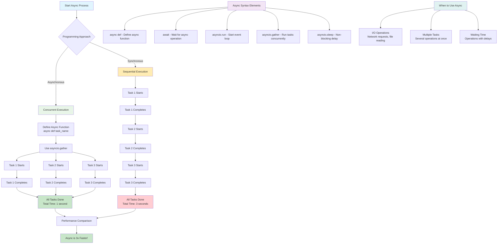
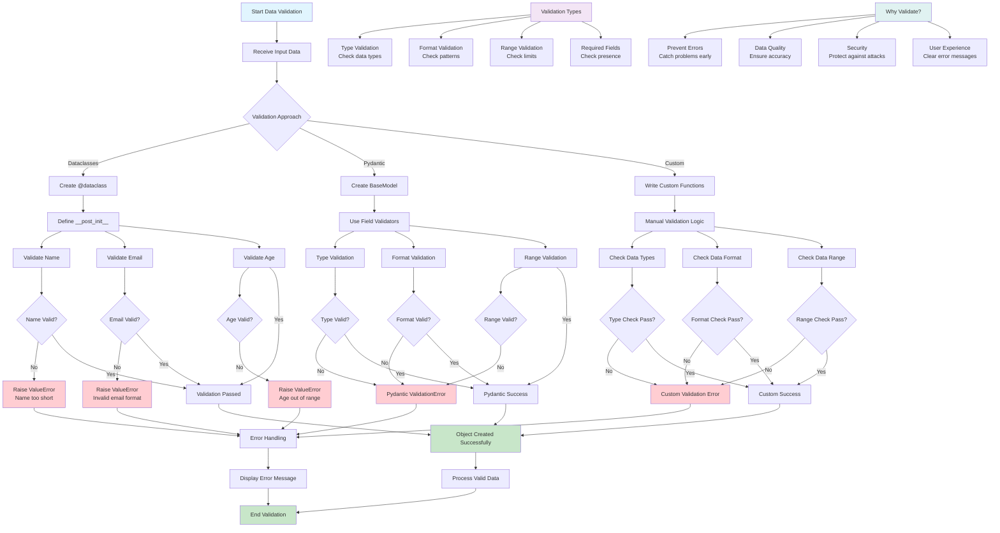
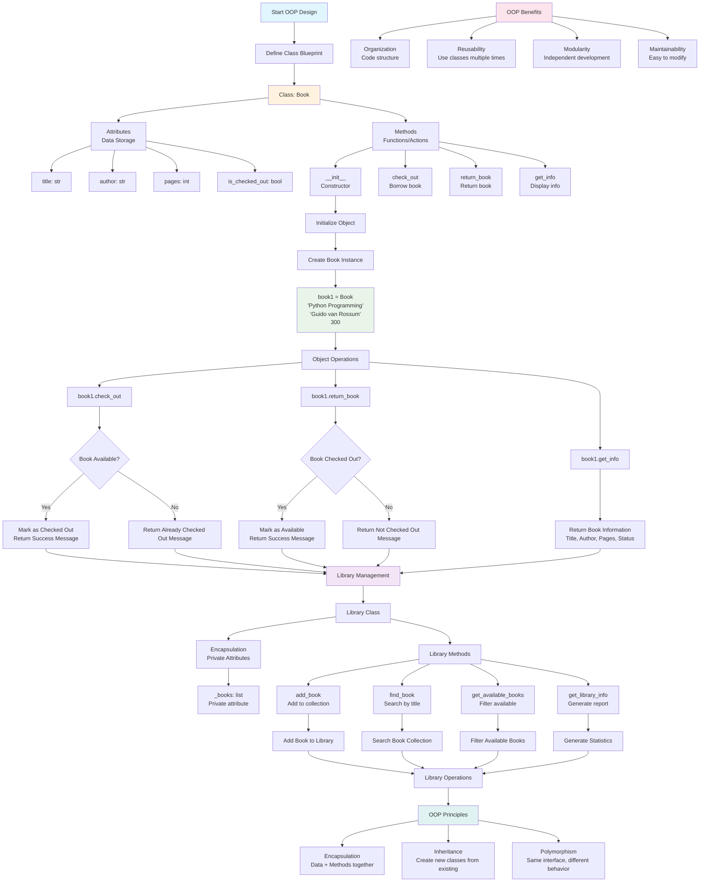

# Chapter 19: Applied Python Concepts - Flow Diagrams Overview

This document contains Mermaid flow diagrams for all 5 topics covered in Chapter 19: Applied Python Concepts.

## 📁 Topic 1: File I/O and Text Processing

```mermaid
flowchart TD
    A[Start File I/O Process] --> B{File Operation Type}
    
    B -->|Read| C[Open File for Reading]
    B -->|Write| D[Open File for Writing]
    B -->|Append| E[Open File for Appending]
    
    C --> F[Use Context Manager<br/>with open()]
    D --> F
    E --> F
    
    F --> G{File Exists?}
    G -->|No| H[Handle File Not Found Error]
    G -->|Yes| I[Perform File Operation]
    
    I --> J{Operation Type}
    J -->|Read All| K[Read Entire File<br/>f.read()]
    J -->|Read Lines| L[Read Line by Line<br/>for line in f]
    J -->|Write Data| M[Write to File<br/>f.write()]
    
    K --> N[Process Text Data]
    L --> N
    M --> O[File Written Successfully]
    
    N --> P[Apply Text Processing]
    P --> Q[String Methods]
    Q --> R[.strip() - Remove whitespace]
    Q --> S[.split() - Split into parts]
    Q --> T[.replace() - Replace text]
    
    R --> U[Data Analysis]
    S --> U
    T --> U
    
    U --> V[Use Counter for Frequency]
    V --> W[Extract Information]
    W --> X[Generate Results]
    
    O --> Y[Close File Automatically]
    X --> Y
    H --> Z[Error Handling]
    
    Y --> AA[End Process]
    Z --> AA
    
    style A fill:#e1f5fe
    style AA fill:#c8e6c9
    style H fill:#ffcdd2
    style F fill:#fff3e0
    style P fill:#f3e5f5
```

## ⚡ Topic 2: Asynchronous Programming



## ✅ Topic 3: Data Validation



## 🏗️ Topic 4: Object-Oriented Programming (OOP)



## 🚀 Topic 5: Performance Optimization and Caching

```mermaid
flowchart TD
    A[Start Performance Analysis] --> B[Identify Performance Bottleneck]
    B --> C{Optimization Strategy}
    
    C -->|Algorithm Optimization| D[Choose Better Algorithm]
    C -->|Caching| E[Implement Caching Strategy]
    C -->|Memory Optimization| F[Reduce Memory Usage]
    C -->|I/O Optimization| G[Reduce File/Network Operations]
    
    D --> H[Algorithm Comparison]
    H --> I[Recursive Fibonacci<br/>O(2^n) - Slow]
    H --> J[Iterative Fibonacci<br/>O(n) - Fast]
    
    I --> K[Test with n=15<br/>Time: 0.001234s]
    J --> L[Test with n=15<br/>Time: 0.000001s]
    
    K --> M[Performance Comparison<br/>Iterative is 1000x faster]
    L --> M
    
    E --> N[Caching Implementation]
    N --> O[Use @functools.lru_cache]
    O --> P[Cache Recursive Function]
    P --> Q[First Call: Cache Miss<br/>Compute and Store Result]
    Q --> R[Second Call: Cache Hit<br/>Return Cached Result]
    
    R --> S[Cache Statistics]
    S --> T[Cache Hits: 1]
    S --> U[Cache Misses: 1]
    S --> V[Cache Size: 1/128]
    
    T --> W[Performance Benefits<br/>Cache is 1000x faster on repeat calls]
    U --> W
    V --> W
    
    X[Cache Types] --> Y[LRU Cache<br/>Least Recently Used]
    X --> Z[Memory Cache<br/>Store in RAM]
    X --> AA[Disk Cache<br/>Store on disk]
    X --> BB[Distributed Cache<br/>Multiple servers]
    
    CC[When to Optimize] --> DD[After Profiling<br/>Measure first]
    CC --> EE[Bottlenecks<br/>Slowest parts]
    CC --> FF[Frequently Called Code<br/>Hot paths]
    CC --> GG[User Experience<br/>When slowness affects users]
    
    HH[Optimization Process] --> II[1. Profile Code<br/>Find slow parts]
    HH --> JJ[2. Identify Bottlenecks<br/>Focus on slowest areas]
    HH --> KK[3. Choose Strategy<br/>Algorithm, cache, memory, I/O]
    HH --> LL[4. Implement Solution<br/>Make changes]
    HH --> MM[5. Measure Results<br/>Verify improvement]
    HH --> NN[6. Iterate<br/>Continue optimizing]
    
    M --> OO[Performance Results]
    W --> OO
    
    OO --> PP[Key Insights]
    PP --> QQ[Recursive: Simple but slow]
    PP --> RR[Iterative: Fast and efficient]
    PP --> SS[Cached: Best of both worlds]
    
    style A fill:#e1f5fe
    style M fill:#c8e6c9
    style W fill:#c8e6c9
    style OO fill:#c8e6c9
    style I fill:#ffcdd2
    style J fill:#c8e6c9
    style Q fill:#fff3e0
    style R fill:#c8e6c9
    style X fill:#f3e5f5
    style CC fill:#e0f2f1
    style HH fill:#fce4ec
```

## 📊 Summary

These flow diagrams provide visual representations of the key concepts and processes for each topic in Chapter 19:

1. **File I/O and Text Processing**: Shows the complete workflow from file operations to data analysis
2. **Asynchronous Programming**: Illustrates the difference between synchronous and asynchronous execution
3. **Data Validation**: Demonstrates various validation approaches and error handling
4. **Object-Oriented Programming**: Visualizes class design, object creation, and OOP principles
5. **Performance Optimization**: Shows the optimization process and caching strategies

Each diagram uses color coding to highlight different types of operations:
- 🔵 **Blue**: Start/Entry points
- 🟢 **Green**: Success states and positive outcomes
- 🔴 **Red**: Error states and negative outcomes
- 🟡 **Yellow**: Processing and intermediate states
- 🟣 **Purple**: Key concepts and principles

These visual representations help understand the flow of operations and decision points in each topic, making the concepts more accessible and easier to follow.
