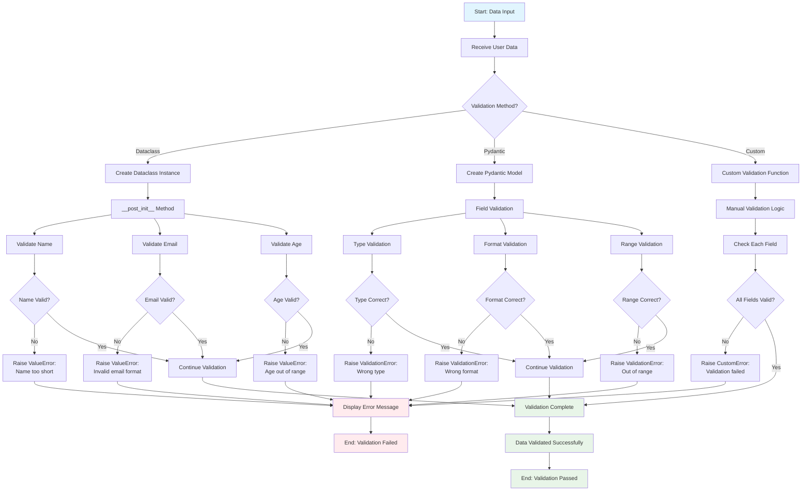

# [Lesson 19: Applied Python Projects](https://colab.research.google.com/drive/your-chapter-19-link)

## 🚀 **Welcome to Real-World Python!**

This chapter transforms you from a Python learner into a **Python practitioner**. You'll build 5 complete projects that solve real problems using the skills you've learned.

### **What You'll Build**
1. **CLI Log Analyzer** - Parse and analyze log files like a pro
2. **Async API Fetcher** - Handle multiple web requests efficiently  
3. **Data Validation Pipeline** - Ensure data quality and safety
4. **Library Management System** - Master OOP with a practical project
5. **Algorithm & Caching Demo** - Optimize performance with smart techniques

### **Skills You'll Master**
- File I/O and text processing
- Asynchronous programming with asyncio
- Data validation and type safety
- Object-oriented design patterns
- Performance optimization and caching

### **Prerequisites**
- Completed Lessons 1-18 (or equivalent Python knowledge)
- Understanding of functions, classes, and basic data structures
- Familiarity with error handling and file operations

### **Learning Approach**
Each project is **self-contained** but builds on previous knowledge. Start with any project that interests you, or follow them in order for a complete learning journey.

> **💡 Pro Tip:** Run each project, modify the code, and experiment. The best learning happens when you break things and fix them!

---

## 📊 **Flow Diagrams**

Visual representations of the key concepts covered in this chapter:

### **1. File I/O and Text Processing Flow**

```mermaid
flowchart TD
    A[Start: File I/O Operation] --> B{File Operation Type?}
    
    B -->|Read| C[Open File for Reading]
    B -->|Write| D[Open File for Writing]
    B -->|Append| E[Open File for Appending]
    
    C --> F[Use Context Manager<br/>with open()]
    D --> F
    E --> F
    
    F --> G{File Exists?}
    G -->|No| H[Handle File Not Found Error]
    G -->|Yes| I[Perform File Operation]
    
    H --> J[Display Error Message]
    J --> K[End]
    
    I --> L{Operation Type?}
    L -->|Read All| M[Read Entire File<br/>f.read()]
    L -->|Read Lines| N[Read Line by Line<br/>for line in f]
    L -->|Write| O[Write Data to File<br/>f.write()]
    
    M --> P[Process Text Data]
    N --> P
    O --> Q[File Written Successfully]
    
    P --> R{Text Processing Needed?}
    R -->|Yes| S[Apply String Methods<br/>.strip(), .split(), .replace()]
    R -->|No| T[Display Results]
    
    S --> U[Extract Information<br/>Parse timestamps, levels, messages]
    U --> V[Analyze Data<br/>Use Counter for frequency]
    V --> T
    
    Q --> T
    T --> W[Close File Automatically<br/>Context Manager handles this]
    W --> K
    
    style A fill:#e1f5fe
    style K fill:#f3e5f5
    style H fill:#ffebee
    style Q fill:#e8f5e8
    style V fill:#fff3e0
```

### **2. Asynchronous Programming Flow**

```mermaid
flowchart TD
    A[Start: Program Execution] --> B{Execution Type?}
    
    B -->|Synchronous| C[Synchronous Execution]
    B -->|Asynchronous| D[Asynchronous Execution]
    
    C --> E[Task 1 Starts]
    E --> F[Task 1 Completes]
    F --> G[Task 2 Starts]
    G --> H[Task 2 Completes]
    H --> I[Task 3 Starts]
    I --> J[Task 3 Completes]
    J --> K[All Tasks Complete<br/>Total Time: 3 seconds]
    
    D --> L[Define async function<br/>async def async_task]
    L --> M[Start Event Loop<br/>asyncio.run()]
    M --> N[Create Tasks Concurrently<br/>asyncio.gather()]
    
    N --> O[Task 1 Starts]
    N --> P[Task 2 Starts]
    N --> Q[Task 3 Starts]
    
    O --> R[Task 1: await asyncio.sleep]
    P --> S[Task 2: await asyncio.sleep]
    Q --> T[Task 3: await asyncio.sleep]
    
    R --> U[Task 1 Completes]
    S --> V[Task 2 Completes]
    T --> W[Task 3 Completes]
    
    U --> X[All Tasks Complete<br/>Total Time: 1 second]
    V --> X
    W --> X
    
    K --> Y[End: Synchronous Result]
    X --> Z[End: Asynchronous Result<br/>3x Faster!]
    
    style A fill:#e1f5fe
    style C fill:#ffebee
    style D fill:#e8f5e8
    style K fill:#ffebee
    style X fill:#e8f5e8
    style Y fill:#f3e5f5
    style Z fill:#e8f5e8
```

### **3. Data Validation Flow**



### **4. Object-Oriented Programming Flow**

```mermaid
flowchart TD
    A[Start: OOP Design] --> B[Define Class Blueprint]
    B --> C[Class: Book]
    
    C --> D[Attributes:<br/>title, author, pages, is_checked_out]
    C --> E[Methods:<br/>check_out, return_book, get_info]
    
    D --> F[Initialize Object<br/>__init__ method]
    E --> G[Define Object Behavior]
    
    F --> H[Create Book Instance<br/>book1 = Book(...)]
    G --> I[Object Methods Available]
    
    H --> J[Object Created Successfully]
    I --> K[Methods Can Be Called]
    
    J --> L[Use Object Methods]
    K --> L
    
    L --> M{Method Called?}
    M -->|check_out| N[Check if already checked out]
    M -->|return_book| O[Check if currently checked out]
    M -->|get_info| P[Return book information]
    
    N --> Q{Already checked out?}
    Q -->|Yes| R[Return: Already checked out]
    Q -->|No| S[Set is_checked_out = True<br/>Return: Successfully checked out]
    
    O --> T{Currently checked out?}
    T -->|No| U[Return: Not checked out]
    T -->|Yes| V[Set is_checked_out = False<br/>Return: Successfully returned]
    
    P --> W[Format book info with status]
    
    R --> X[Display Result]
    S --> X
    U --> X
    V --> X
    W --> X
    
    X --> Y{More Operations?}
    Y -->|Yes| L
    Y -->|No| Z[End: OOP Operations Complete]
    
    style A fill:#e1f5fe
    style C fill:#e8f5e8
    style D fill:#fff3e0
    style E fill:#fff3e0
    style J fill:#e8f5e8
    style S fill:#e8f5e8
    style V fill:#e8f5e8
    style Z fill:#f3e5f5
```

### **5. Performance Optimization and Caching Flow**

```mermaid
flowchart TD
    A[Start: Performance Problem] --> B{What needs optimization?}
    
    B -->|Algorithm| C[Algorithm Optimization]
    B -->|Repeated Calculations| D[Caching Strategy]
    B -->|Memory Usage| E[Memory Optimization]
    B -->|I/O Operations| F[I/O Optimization]
    
    C --> G[Compare Approaches]
    G --> H[Recursive vs Iterative]
    H --> I[Measure Performance<br/>time.time()]
    I --> J{Which is faster?}
    J -->|Iterative| K[Use Iterative Approach]
    J -->|Recursive| L[Use Recursive Approach]
    
    D --> M[Implement Caching]
    M --> N[Use @functools.lru_cache]
    N --> O[Function Call]
    O --> P{Result in cache?}
    P -->|Yes - Cache Hit| Q[Return cached result<br/>Very Fast!]
    P -->|No - Cache Miss| R[Calculate result]
    R --> S[Store in cache]
    S --> T[Return result]
    
    E --> U[Optimize Memory Usage]
    U --> V[Use generators instead of lists]
    V --> W[Process data in chunks]
    
    F --> X[Reduce I/O Operations]
    X --> Y[Batch file operations]
    Y --> Z[Use async I/O]
    
    K --> AA[Performance Improved]
    L --> AA
    Q --> AA
    T --> AA
    W --> AA
    Z --> AA
    
    AA --> BB{More optimization needed?}
    BB -->|Yes| B
    BB -->|No| CC[End: Optimized Solution]
    
    style A fill:#e1f5fe
    style Q fill:#e8f5e8
    style R fill:#fff3e0
    style AA fill:#e8f5e8
    style CC fill:#f3e5f5
```
