# [Lesson 19: Applied Python Projects](https://colab.research.google.com/drive/your-chapter-19-link)

## 🚀 **Welcome to Real-World Python!**

This chapter transforms you from a Python learner into a **Python practitioner**. You'll build 5 complete projects that solve real problems using the skills you've learned.

### **What You'll Build**
1. **CLI Log Analyzer** - Parse and analyze log files like a pro
2. **Async API Fetcher** - Handle multiple web requests efficiently  
3. **Data Validation Pipeline** - Ensure data quality and safety
4. **Library Management System** - Master OOP with a practical project
5. **Algorithm & Caching Demo** - Optimize performance with smart techniques

### **Skills You'll Master**
- File I/O and text processing
- Asynchronous programming with asyncio
- Data validation and type safety
- Object-oriented design patterns
- Performance optimization and caching

### **Prerequisites**
- Completed Lessons 1-18 (or equivalent Python knowledge)
- Understanding of functions, classes, and basic data structures
- Familiarity with error handling and file operations

### **Learning Approach**
Each project is **self-contained** but builds on previous knowledge. Start with any project that interests you, or follow them in order for a complete learning journey.

> **💡 Pro Tip:** Run each project, modify the code, and experiment. The best learning happens when you break things and fix them!

---

## 📊 **Flow Diagrams**

Visual representations of the key concepts covered in this chapter:

### **1. File I/O and Text Processing Flow**

#### **A. Basic File Operations**


#### **B. Safe File Handling**
```mermaid
flowchart TD
    A[Start] --> B[Use with open()]
    B --> C[File Operations]
    C --> D[Auto Close]
    D --> E[End]
    
    style A fill:#e1f5fe
    style B fill:#fff3e0
    style C fill:#e8f5e8
    style D fill:#fff3e0
    style E fill:#f3e5f5
```

#### **C. Text Processing Steps**
```mermaid
flowchart LR
    A[Raw Text] --> B[Clean Text<br/>.strip()]
    B --> C[Split Text<br/>.split()]
    C --> D[Extract Data]
    D --> E[Analyze<br/>Counter]
    
    style A fill:#e1f5fe
    style B fill:#fff3e0
    style C fill:#fff3e0
    style D fill:#e8f5e8
    style E fill:#e8f5e8
```

### **2. Asynchronous Programming Flow**

#### **A. Synchronous vs Asynchronous**

```mermaid
flowchart TD
    A[Synchronous] --> B[Task 1 → Task 2 → Task 3]
    B --> C[Total: 3 seconds]
    
    D[Asynchronous] --> E[Task 1, 2, 3 together]
    E --> F[Total: 1 second]
    
    style A fill:#ffebee
    style C fill:#ffebee
    style D fill:#e8f5e8
    style F fill:#e8f5e8
```


#### **B. Async Function Structure**
```mermaid
flowchart TD
    A[async def function] --> B[await operation]
    B --> C[asyncio.run()]
    C --> D[Concurrent execution]
    
    style A fill:#e1f5fe
    style B fill:#fff3e0
    style C fill:#e8f5e8
    style D fill:#e8f5e8
```

#### **C. Performance Comparison**


### **3. Data Validation Flow**

#### **A. Validation Process**

```mermaid
flowchart TD
    A[Input Data] --> B[Check Format]
    B --> C{Valid?}
    C -->|Yes| D[✅ Success]
    C -->|No| E[❌ Error Message]
    
    style A fill:#e1f5fe
    style D fill:#e8f5e8
    style E fill:#ffebee
```


#### **B. Validation Methods**


#### **C. Common Validations**

```mermaid
flowchart TD
    A[User Input] --> B[Name: 2+ chars]
    A --> C[Email: valid format]
    A --> D[Age: 0-150]
    
    B --> E{All Valid?}
    C --> E
    D --> E
    
    E -->|Yes| F[✅ Create User]
    E -->|No| G[❌ Show Error]
    
    style A fill:#e1f5fe
    style F fill:#e8f5e8
    style G fill:#ffebee
```


### **4. Object-Oriented Programming Flow**

#### **A. Class Structure**


#### **B. Object Creation**
```mermaid
flowchart LR
    A[Class Blueprint] --> B[Create Object]
    B --> C[book1 = Book(...)]
    C --> D[Use Methods]
    
    style A fill:#e1f5fe
    style B fill:#e8f5e8
    style C fill:#e8f5e8
    style D fill:#e8f5e8
```

#### **C. Method Usage**
```mermaid
flowchart TD
    A[book.check_out()] --> B{Already checked out?}
    B -->|No| C[✅ Check out book]
    B -->|Yes| D[❌ Already checked out]
    
    style A fill:#e1f5fe
    style C fill:#e8f5e8
    style D fill:#ffebee
```

### **5. Performance Optimization and Caching Flow**

#### **A. Algorithm Comparison**


#### **B. Caching Process**

```mermaid
flowchart TD
    A[Function Call] --> B{In Cache?}
    B -->|Yes| C[⚡ Return Cached Result]
    B -->|No| D[Calculate Result]
    D --> E[Store in Cache]
    E --> F[Return Result]
    
    style A fill:#e1f5fe
    style C fill:#e8f5e8
    style D fill:#fff3e0
    style E fill:#fff3e0
    style F fill:#e8f5e8
```


#### **C. Performance Improvement**

