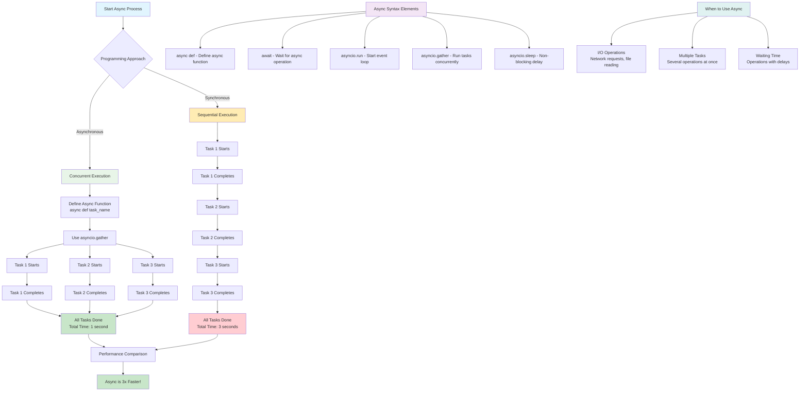

# Topic 2: Asynchronous Programming - Flow Diagram

## Key Concepts Visualized:

1. **Synchronous vs Asynchronous**: Sequential vs concurrent execution
2. **Performance Benefits**: Async can be 3x faster for I/O operations
3. **Async Syntax**: Key elements like `async def`, `await`, `asyncio.gather`
4. **Use Cases**: When to choose async programming
5. **Event Loop**: How asyncio manages concurrent operations
