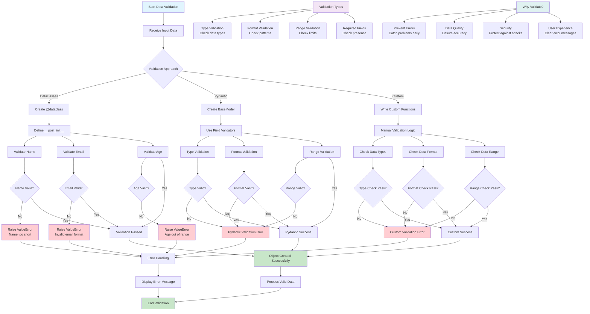

# Topic 3: Data Validation - Flow Diagram

## Key Concepts Visualized:

1. **Validation Approaches**: Dataclasses, Pydantic, and custom validation
2. **Validation Types**: Type, format, range, and required field validation
3. **Error Handling**: Different ways to handle validation failures
4. **Benefits**: Why validation is important for data quality and security
5. **Success Flow**: How valid data proceeds through the system
