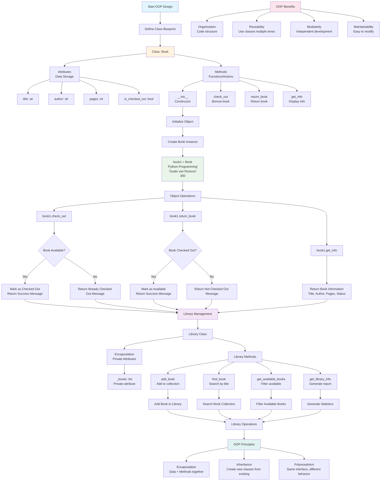

# Topic 4: Object-Oriented Programming (OOP) - Flow Diagram

## Key Concepts Visualized:

1. **Class Definition**: Blueprint for creating objects with attributes and methods
2. **Object Creation**: Instantiating classes to create specific objects
3. **Encapsulation**: Keeping data and methods together, hiding internal details
4. **Object Operations**: Methods that manipulate object state
5. **OOP Principles**: Encapsulation, inheritance, and polymorphism
6. **Benefits**: Organization, reusability, modularity, and maintainability
